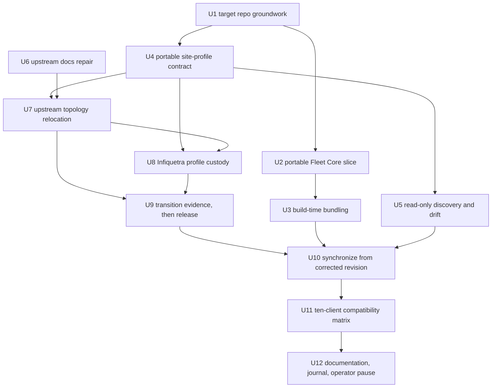

# UniFi and portable Fleet Core portability pilot

## Summary

Port the Claude Code `unifi` plugin into a portable Agent Plugins 1.0 package in this repository, together with a new portable Fleet Core source carrying only the `retry_backoff` module the UniFi clients require. The Claude repository stays authoritative throughout: it is repaired first, released second, and synchronized from third. The pilot ends with a ten-client compatibility matrix and a deliberate operator pause, not with an automatic remediation sweep.

## Problem Frame

Infiquetra maintains overlapping plugin behavior across ten installed coding-agent clients, and the architecture brief proposes authoring vendor-neutral behavior once while keeping genuinely host-specific features in explicit adapters. That proposal has never been tested against a real plugin, so the repository's queued P1 item asks for a first pilot with a chosen plugin, a required client matrix, a source-custody rule, and semantic parity evidence.

The `unifi` plugin was chosen because it is small enough to finish and real enough to matter: two skills with bundled Python clients that must become portable core, plus a slash command and an agent definition that must become explicit Claude adapters. Investigation then found three things the file listing alone could not show, and each of them changes the work.

The plugin is not self-contained. Both clients reach into a second plugin at import time, through discovery paths that only exist under Claude Code. Its documentation describes four Protect capabilities the code removed five months ago, and both API reference documents disagree with the shipped code. And the clients hard-code one operator's controller address as a universal default, which cannot ship in a public portable package.

## Requirements

The reviewer's and the implementer's checklist. Requirements are grouped by concern; identifiers run continuously across groups and are never renumbered.

### Source custody and synchronization

R1. The portable copy is a derived artifact and never a second writable source. A committed synchronization script copies from a named `infiquetra-claude-plugins` commit and writes a provenance manifest recording source repository, source commit, and per-file SHA-256 digest.

R2. Repository validation verifies the portable tree against its own provenance manifest with no network call, so continuous integration stays hermetic.

R3. The authoritative Claude source repair is authored, verified, and released before any synchronization unit runs. The pinned source commit in the provenance manifest is the corrected revision, never 995a475.

R4. Every path in the portable tree is classified as exactly one of three kinds, and the classification is recorded in the provenance manifest: an upstream byte copy, a versioned deterministic transform, or target-owned portable source. A byte copy never diverges from its source; where it would need to, the upstream repair produces the difference first. A transform records its source digest, its output digest, and its transform version. Target-owned source has no upstream counterpart and is never overwritten or removed by synchronization.

### Upstream repair, authored and released before the port

R5. The Protect skill's documentation, the plugin README, the slash command, the changelog, the agent definition, and the Protect API reference are corrected to describe only the six resources the client implements: cameras, liveviews, lights, sensors, chimes, and viewers.

R6. The network API reference is corrected on every endpoint path where it disagrees with the shipped code: traffic routes, static DNS, DHCP leases, alarms, backup, VPN, and the device-locate command body.

R7. The network skill documents its implemented but undocumented capabilities: the `wlans` and `vpn` resource groups, the `devices adopt` and `devices forget` actions, the `backup` group, and the `stats dpi` action.

R8. The hard-coded controller address is removed as a default from both clients. The embedded lab topology is relocated into the operator site profile, never deleted.

R9. The repaired upstream release is not activated until the replacement context path is verified end to end. The existing Claude agent never temporarily loses usable site context.

### Portable site profile

R10. The site profile is optional. The portable plugin is fully usable with no profile present, and no arrangement in it is treated as a universal assumption.

R11. On first setup with no configured profile available, exactly three safe paths are offered: supply an existing profile path; run credential-safe read-only discovery and generate a proposed profile for operator review; or continue in discovery-only mode with explicit limits on unknown operator intent.

R12. The chosen profile path is remembered through normal client configuration so it is not requested on every use. The `UNIFI_SITE_PROFILE` environment variable overrides the configured path.

R13. Without a profile, the plugin and the agent report actual controller state and never infer trust roles, criticality, ownership, or intended policy. Absent intent is reported as absent.

R14. Credentials never live in the profile. Raw discovered inventory and sensitive identifiers are never committed to this public repository.

R15. The portable contract and the Infiquetra custody instance stay separable. This repository's normative documentation never presents the private home-lab plus Ansible arrangement as required.

### Portable Fleet Core

R16. Fleet Core becomes a first-class portable source and package with its own tests, releases, versioning, provenance, and compatibility contract.

R17. Only the `retry_backoff` module and its applicable tests are ported. Every remaining Fleet Core module is inventoried as explicitly unported and deferred, and no document claims full Fleet Core parity.

R18. Generated installable UniFi artifacts bundle the required Fleet Core module at build time. Users never separately install Fleet Core.

R19. The bundled copy is generated and read-only, stamped with the Fleet Core version, content digest, and provenance. Continuous integration rejects a stale bundle or any manual edit to one.

R20. No Agent Plugins dependency field is invented, `FLEET_COMMONS_ROOT` is not required, and no Claude-specific runtime discovery is retained in the portable package.

R21. A later plugin port can add another Fleet Core module to the same authoritative portable source and bundle only the subset it needs, without changing this packaging model.

### Compatibility coverage

R22. All ten installed clients receive the same bounded smoke assessment: package installation or supported placement, discovery, loading, and the safest meaningful credential-free or read-only invocation.

R23. Each client is recorded as exactly one of: works directly; works through an adapter; unsupported; or failed. Every record carries a concrete reason and its evidence.

R24. Coverage is mandatory; passing is not. No single unsupported or failing client blocks completion of the pilot assessment.

R25. The pilot pauses after the matrix for a separate operator decision per failing client. Implementation scope is never automatically expanded to repair a failing client.

### Safety boundaries

R26. Live invocation is limited to read-only operations. No test path ever passes `--confirm`, so the clients' own dry-run gate remains a second line of defence beneath the classification.

R27. Raw read output is default-deny for persistence to any committable path, because neither client filters or redacts controller responses.

### Packaging conformance

R28. The portable manifest lives at the plugin root and carries the two fields Agent Plugins 1.0 requires: the exact canonical `$schema` identifier and `name`. Claude-specific files live under the `com.infiquetra.claude/` client extension directory.

R29. Portable skill frontmatter conforms to the open Agent Skills specification's six permitted fields, and each skill's `name` matches its parent directory name. The frontmatter is corrected upstream before synchronization, so the portable skill files stay byte copies rather than transforms.

### Execution ownership and run topology

R30. Orchestrate, driving Herdr sessions, is the outer controller. Every dispatched unit runs Saga with `backend: inline`, so no unit starts a nested orchestration inside a session that is already one of several parallel sessions.

R31. Each Orchestrate run owns exactly one repository. Cross-repository dependencies are released by a named receipt rather than by ambient access, the controller pauses at every authority boundary, and the target-repository run resumes at U10 once the Claude and home-lab work has landed.

### Fleet Core custody and lifecycle

R32. Custody of `retry_backoff` does not move. The portable Fleet Core copy is derived under the same synchronization rule as UniFi, its initial portable version and provenance are derived from Fleet Core 0.25.0, and a future retry fix lands upstream first and reaches this repository by re-synchronization.

R33. Fleet Core's release surface is named explicitly: its portable manifest, its provenance manifest, its changelog, the ported module, and the ported test. A promise of versioning and provenance that no file carries is not a lifecycle.

### Build declaration and digest domains

R34. The set of modules a consumer bundles is declared in a separate portable build-declaration file with a closed schema, never as an unknown top-level field in the Agent Plugins manifest, which is a closed schema that forbids assigning semantics to unrecognized fields.

R35. Two digest domains exist and fail for different reasons. The source-payload digest covers the Fleet Core module's bytes and detects a stale bundle; the generated-output digest covers the generated file's content excluding its own stamp block and detects a hand edit. A digest is never computed over bytes that contain it.

### Site profile execution contract

R36. The portable profile format is JSON, parsed with the standard library, so a runtime with no third-party parser can read it. An operator may author in another format, but what the portable core reads is JSON.

R37. A named entrypoint owns presenting the three first-setup paths and remembering the chosen one. A contract no component presents is not reachable by a user.

R38. The Claude adapter carries its own profile loader, so the upstream agent can consume the profile contract without depending on a file that lives only in this repository.

R39. A proposed profile contains observed fields plus explicit unknown intent, and never prefills a trust role, ownership, criticality, or intended policy. A test asserts every intent field of a generated proposal is unknown.

### Release activation and rollback

R40. Every release surface is named: the plugin manifest, its marketplace entry, and the changelog, whose versions the upstream repository's tri-lock parity gate requires to be equal. Activation is preceded by a staged load and followed by an installed-version and digest readback.

R41. A fresh client session proves all three profile states after activation: profile present, profile absent, and profile unreadable. Source-tree evidence alone does not satisfy this, because an active client can remain cached.

R42. Rollback names its trigger, its reachable prior version, the marketplace refresh it requires, and repeats the fresh-session proof. An undefined rollback is not a rollback.

### Evidence completeness and sanitization

R43. Each client's matrix row carries four stage results — placement, discovery, load, and invocation — each marked executed, blocked, or not applicable with its command and evidence, followed by exactly one overall status. Ten rows are not ten assessments.

R44. Public evidence records field names, counts, pass or fail comparisons, and source and result digests, with redacted commands and no raw topology or controller responses. Any sensitive receipt stays outside this repository and is linked only by a non-sensitive digest or identifier.

R45. The upstream documentation repair owns named test paths, and every surface named in R5 through R7 maps to an assertion or to an explicitly recorded review gate.

## Key Technical Decisions

The load-bearing choices that constrain implementation. Each is a decision with the rationale that justifies it, including the alternative it rejects.

**KTD1 — The portable copy is derived, verified by digest, never hand-maintained.** A synchronization script plus a per-file SHA-256 provenance manifest makes the derivation checkable by machine, and continuous integration verifies the tree against its own manifest with no network call so the check stays hermetic. Rejected: a hand-port with only a provenance header, because drift then becomes undetectable by machine; and a subtree or submodule of the vendor repository, because it drags an entire coding-agent-vendor repository into a portable catalog and makes the core-versus-adapter split impossible to express in the layout.

**KTD2 — VOID. Preserved for audit only.** A parity baseline of "correct the ported documentation downstream" was recorded in error by the controlling client and was never an operator decision. Nothing downstream of it was ever approved, and downstream-only documentation correction and intentional target divergence are both explicitly unapproved. The entry is preserved rather than erased, and belongs in the archive under this repository's supersession convention.

**KTD2-prime — Repair the authoritative source first; synchronize from the corrected revision.** The Claude repository stays authoritative, so a defect it carries is fixed there and released there before the port consumes it. Rejected: porting the defect verbatim, which would republish known-false capability claims into a second public repository; and an errata overlay beside the wrong text, which leaves the falsehood inside the very document an agent loads first.

**KTD2-double-prime — Extract means relocate, not delete, and the release is gated on the replacement path.** The repair scope covers both the stale documentation and de-site-ification, and the relocated topology is preserved in the operator site profile. The repaired release is not activated until the replacement context path is verified, so the existing Claude agent never temporarily loses usable site context. This creates the plan's one hard sequencing constraint and is why the portable profile contract is a predecessor of the upstream release while the synchronization is its successor.

**KTD3 — Site profile custody is private and versioned; the runtime contract is a path.** The profile is authored in the private `home-lab` repository, which already owns this address space, and is deployed to a documented machine-local runtime path that the portable core reads. The portable core reads a path and has no knowledge of `home-lab`. Rejected: reading directly from a repository checkout, which couples the runtime to one operator's clone layout; and an unversioned local-only file, which leaves a curated topology unreviewed and unbacked-up across several machines.

**KTD4 — Fleet Core becomes a first-class portable source.** It gets its own tests, releases, versioning, provenance, and compatibility contract rather than being folded invisibly into its consumers. Rejected: inlining the retry logic into each client, which reverses the fleet-wide decision that adopted one shared primitive to stop per-plugin drift.

**KTD4-A — Port one vertical slice; bundle it at build time.** Only `retry_backoff` and its tests are ported now, every other module is inventoried as deferred, and the generated installable artifact bundles the module so users never install Fleet Core separately. This dissolves rather than works around the fact that Agent Plugins 1.0 has no dependency mechanism: at install time there is no dependency to declare, because the artifact is already complete. The generated, read-only, digest-stamped discipline is what keeps that from degrading into an unmaintained copy-paste fork. Rejected: inventing a dependency field, requiring `FLEET_COMMONS_ROOT`, and retaining Claude-specific runtime discovery.

**KTD5 — Compatibility coverage is mandatory; passing is not.** All ten installed clients are assessed identically and recorded under one of four statuses with evidence, and no single failure blocks the pilot. The matrix is a deliverable that ends in an operator pause, because deciding whether a given client warrants repair, an adapter, a different distribution path, or explicitly unsupported status is a scope decision that belongs to the operator rather than to the implementer.

**KTD6 — Repository validation stays standard-library-only; ported plugin tests get their own job.** This repository's continuous integration currently runs `python3` with no dependency-install step and no project file, while the UniFi clients need `requests` and `urllib3` and their tests are written for pytest. Keeping `scripts/check_repo.py` and its unittest suite dependency-free preserves a fast hermetic baseline that cannot break on a dependency outage, and a second job installs dependencies and runs the ported plugin tests. Rejected: rewriting 134 existing pytest tests into unittest, which would discard proven upstream coverage for no behavioral gain.

**KTD7 — The portable package targets Python 3.10 or newer.** Neither client carries a `__future__` annotations import, so the bare union annotation on both constructors is evaluated at definition time and requires Python 3.10. This is read off the code rather than chosen, and it is declared in the skills' `compatibility` frontmatter field so a consuming client can see it before running anything.

**KTD8 — Orchestrate through Herdr is the outer controller; `inline` is the inner backend.** These are two layers, not two candidates. Orchestrate dispatches and monitors Herdr sessions, and every dispatched unit runs Saga inline because a dispatched unit is already one of several parallel sessions and nesting a workflow inside one is the orchestration-of-orchestration that Orchestrate exists to avoid. Rejected: reading `backend: inline` as "one agent does everything in the main session," which would discard the outer controller entirely.

**KTD9 — One Orchestrate run per repository, joined by receipts.** Orchestrate resolves a single repository root from its checkout and runs one branch and worktree per unit within it, so a three-repository graph is three runs rather than one run reaching sideways. Each cross-repository edge is released by a named receipt the next run consumes. Rejected: placing an outside-repository unit in the target run, which would either launch it in the wrong worktree or require ambient writes beyond that unit's declared authority.

**KTD10 — Custody of the Fleet Core slice does not move.** The portable copy is derived under the same rule as UniFi, because this repository's standing rule is that existing vendor repositories stay authoritative until a recorded custody decision moves them, and no such decision has been made. First-class portable source means the package gets a real lifecycle — version, provenance, release surface, compatibility contract — not that authorship relocates. Rejected: a bounded custody transfer for one module, which would create two writable sources for `retry_backoff` the first time it needs a fix.

**KTD11 — A stamp is never inside the bytes it hashes.** The source-payload digest covers the upstream module and detects staleness; the generated-output digest covers the generated file excluding its stamp block and detects tampering. Two domains mean stale source and hand-edited output fail as different, deterministic signals rather than as one ambiguous mismatch. Rejected: a single digest over the whole generated file, which is self-referential and cannot be computed.

**KTD12 — The portable profile is JSON.** The portable core parses it with the standard library, so a runtime with no third-party parser can read a profile, which keeps the optional-profile promise true on a minimal host. An operator may author in a friendlier format and render JSON at deployment time, which is what the Infiquetra instance does with its existing Ansible harness. Rejected: making the portable core depend on a YAML parser, which would add a runtime dependency to satisfy an authoring preference.

## High-Level Technical Design

### Execution ownership

Two layers, settled and not open.

Orchestrate is the outer controller and uses Herdr to dispatch, monitor, and land the work. Inside every dispatched unit, Saga runs with `backend: inline`, which is why the plan's frontmatter carries that value. The frontmatter is an instruction to each unit, not a claim that the whole plan runs in one session.

Where the scope boundaries say Saga and Team Execution are untouched, that means their source is not modified by this pilot. It does not mean the approved controller goes unused.

### Run topology across three repositories

Three Orchestrate runs, joined by receipts rather than by ambient access.

| Run | Repository | Units | Releases on completion | Consumed by |
|---|---|---|---|---|
| Run A | `infiquetra-agent-plugins` | U1, U2, U3, U4, U5 | Portable profile contract receipt, naming the schema version and the contract digest | Run B, at U7 |
| Run B | `infiquetra-claude-plugins` | U6, U7, U9 | Corrected-revision receipt, naming the released version and its commit | Run C, at U10 |
| Run C | `home-lab` | U8 | Deployed-profile receipt, naming the runtime path and the deployed digest | Run B, at U9 |
| Run A resumes | `infiquetra-agent-plugins` | U10, U11, U12 | Pilot assessment, ending at the operator pause | The operator |

Run A pauses after U5 and waits. Run B pauses before U9's activation until Run C's deployed-profile receipt exists, which is how the no-capability-gap rule survives being split across repositories. Run A resumes at U10 only once Run B's corrected-revision receipt names a released version.

The controller stops at every authority boundary rather than crossing it. Runs B and C are not authorized by the session that produced this plan.

### Path classification in the portable tree

Every path is one of three kinds, and the provenance manifest records which.

| Kind | Meaning | Examples | Synchronization behavior |
|---|---|---|---|
| Upstream byte copy | Identical to its source at the pinned commit | both skill files, both reference documents, README, CHANGELOG | Overwritten from source; digest must match exactly |
| Deterministic transform | Derived from a source file by a versioned, repeatable rule | the Claude manifest relocated under the client extension directory; both clients, whose import of the dropped shim is rewritten to the generated bundle | Regenerated; records source digest, output digest, and transform version |
| Target-owned portable source | No upstream counterpart; authored here | the profile library, schema, and reference; discovery and drift; the build declaration; the generated bundle | Never overwritten and never removed by synchronization |

The skill frontmatter is deliberately **not** a transform. The disallowed `triggers` and `script` fields are corrected upstream in U6, so the portable skill files remain byte copies. This is what keeps the repair-upstream-first decision and the no-divergence rule consistent with each other.

The two clients were originally planned as byte copies, and that was wrong for a reason worth stating rather than quietly correcting. Both reach the shared retry primitive through `fleet_commons_shim`, which this package drops because its resolution ladder is Claude-specific runtime discovery. A byte copy of a client that imports a module the package does not carry raises `ModuleNotFoundError` at module scope, before parsing a single argument, which left the assembled package with no working entrypoint on any client. Repairing it upstream is not available either: upstream is a Claude package, where the shim is correct. The clients are therefore the second transform, `resolve-bundled-fleet-module`, implemented in `scripts/sync_vendor_source.py` and recorded in [the engineering journal](../engineering-journal/DECISIONS.md).

### Public evidence schema

Evidence proves a comparison happened without republishing what was compared.

A public evidence record carries the field names compared, the count of fields compared, the pass or fail result per field, a digest of the private input and a digest of the result, and the command with its site-identifying arguments redacted. It never carries a raw controller response, a raw topology, an address, a hostname, a hardware address, or a camera name.

The private receipt holding the actual compared values stays outside this repository and is referenced only by its digest. A test validates the public artifact against inert example values, so the schema is enforced rather than remembered.

Three things need shape that prose alone does not carry: which file belongs to which custody, what the portable package looks like when assembled, and why the unit order has one constraint that cannot be reordered.

### File custody — portable core versus Claude adapter

Every one of the thirteen tracked source files is assigned. Nothing is left implicit, and a file does not become portable merely by sitting beside portable files.

| Source file, relative to `plugins/unifi/` in the Claude repository | Custody | Why |
|---|---|---|
| `skills/unifi-network/scripts/unifi_network_client.py` | Portable core | Vendor-neutral Python; the domain client, not a coding-agent integration |
| `skills/unifi-protect/scripts/unifi_protect_client.py` | Portable core | Same |
| `skills/unifi-network/SKILL.md` | Portable core | Procedural instruction, the Agent Skills unit of portability |
| `skills/unifi-protect/SKILL.md` | Portable core | Same |
| `skills/unifi-network/references/udm-api-endpoints.md` | Portable core | Reference material bundled with a skill |
| `skills/unifi-protect/references/protect-api-endpoints.md` | Portable core | Same |
| `README.md` | Portable core | Package documentation, rewritten site-neutral |
| `CHANGELOG.md` | Portable core | Package version history |
| `.claude-plugin/plugin.json` | Claude adapter | Claude Code manifest; its required location conflicts with the portable manifest's |
| `commands/unifi.md` | Claude adapter | Commands are outside Agent Plugins 1.0 by name |
| `agents/unifi-network-ops.md` | Claude adapter | Agent definitions are outside Agent Plugins 1.0 by name |
| `skills/unifi-network/scripts/fleet_commons_shim.py` | Neither — removed | Replaced by the build-time bundle; its discovery is Claude-specific |
| `skills/unifi-protect/scripts/fleet_commons_shim.py` | Neither — removed | Same |

The marketplace entry in the Claude repository's `.claude-plugin/marketplace.json` is also a Claude adapter concern and stays in that repository.

### Behavior-parity inventory

Parity is asserted against the code, and the code is what the repaired upstream release will contain. The counts below are read from the source and are what the parity check must reproduce.

| Surface | Implemented today | Parity obligation |
|---|---|---|
| Network client | 52 actions across 12 resource groups; 27 read-only, 25 mutating | Ported command surface equals the corrected upstream surface exactly |
| Protect client | 21 actions across 6 resource groups; 13 read-only, 8 mutating | Same; the four documented-but-absent capabilities stay absent |
| Network skill | Documents 9 of 12 resource groups | Upstream repair adds the missing four surfaces; portable copy matches |
| Protect skill | Documents 4 capabilities that do not exist | Upstream repair removes them; portable copy matches |
| Claude command | Names one absent Protect capability | Repaired upstream; stays a Claude adapter |
| Claude agent | Names absent capabilities and embeds site topology | Repaired and de-site-ified upstream; stays a Claude adapter |

### Assembled portable package

```text
plugins/unifi/
├── plugin.json                      # Agent Plugins 1.0: $schema + name
├── PROVENANCE.json                  # generated: source repo, commit, per-file sha256
├── README.md
├── CHANGELOG.md
├── skills/
│   ├── unifi-network/
│   │   ├── SKILL.md                 # six permitted frontmatter fields only
│   │   ├── references/udm-api-endpoints.md
│   │   └── scripts/
│   │       ├── unifi_network_client.py
│   │       └── _bundled/retry_backoff.py    # generated, read-only, stamped
│   └── unifi-protect/               # same shape
└── com.infiquetra.claude/           # client extension directory, spec section 8.2
    ├── plugin.json                  # Claude Code manifest
    ├── commands/unifi.md
    └── agents/unifi-network-ops.md

plugins/fleet-core/
├── plugin.json
├── DEFERRED.md                      # every unported module, named
└── scripts/fleet_commons/retry_backoff.py
```

### Unit order and its one hard constraint

The graph below is the dependency order. The constraint that cannot be reordered is that the portable profile contract must exist and be verified before the upstream release is activated, while the synchronization must happen after it. Both edges are real and together they do not form a cycle.



## Implementation Units

Twelve units, dependency-ordered. Units U6 through U9 change the `infiquetra-claude-plugins` repository or the private `home-lab` repository; every other unit changes this repository. No two units that can run concurrently declare the same file.

### U1. Target repository groundwork and validation extension

Prepare this repository to hold a plugin package at all, and extend its validator to enforce the guarantees the rest of the plan depends on.

**Goal:** Close the local-state gap, and teach `scripts/check_repo.py` to verify provenance manifests, reject stale or hand-edited bundles, and check Agent Skills frontmatter conformance.

**Requirements:** R2, R19, R28, R29, R14.

**Dependencies:** none.

**Files:** `.gitignore`, `scripts/check_repo.py`, `tests/test_check_repo.py`, `.github/workflows/ci.yml`.

**Approach:** Add `.claude/` to the ignore list so Saga's machine-local state can never be committed, which the repository's own rule against committing agent runtime state already implies but the ignore file does not yet cover. Extend the validator with three checks that all run without network access: a provenance check that recomputes each listed file's digest and compares it to the manifest, a bundle check that rejects any file under a `_bundled/` directory whose digest does not match its stamp, and a frontmatter check that rejects a portable skill carrying any field outside the open specification's six and any skill whose `name` does not match its parent directory. Keep the existing stricter-than-specification requirement for `version` and `description` but record it as deliberate.

**Patterns to follow:** the existing `check_plugin_manifests` function in `scripts/check_repo.py`, which already returns a list of error strings and is exercised by `tests/test_check_repo.py` against temporary directories rather than the live tree.

**Test scenarios:** A manifest listing a file whose content has changed produces exactly one digest-mismatch error naming that file. A manifest listing a file that does not exist produces a missing-file error rather than raising. A bundled file whose stamped digest matches its content produces no error, and one whose stamp does not match produces a stale-bundle error. A skill whose frontmatter carries `triggers` produces a disallowed-field error naming `triggers`. A skill directory named `unifi-network` whose frontmatter `name` is `unifi_network` produces a name-mismatch error. A repository with no `plugins/` directory still passes, preserving today's behavior.

**Verification:** `python3 scripts/check_repo.py` and `python3 -m unittest discover -s tests -v` both pass on a tree with no plugins, and the new checks fail loudly on each seeded defect above.

### U2. Portable Fleet Core source with the retry_backoff slice

Establish Fleet Core as a portable source carrying exactly one module, and name every module it does not carry.

**Goal:** Create `plugins/fleet-core/` as a conformant Agent Plugins 1.0 package containing `retry_backoff` and its tests, with an explicit inventory of the sixteen modules deliberately left unported.

**Requirements:** R16, R17, R21, R32, R33.

**Dependencies:** U1.

**Files:** `plugins/fleet-core/plugin.json`, `plugins/fleet-core/PROVENANCE.json`, `plugins/fleet-core/CHANGELOG.md`, `plugins/fleet-core/DEFERRED.md`, `plugins/fleet-core/README.md`, `plugins/fleet-core/scripts/fleet_commons/retry_backoff.py`, `tests/test_retry_backoff.py`, `scripts/generate_deferred_inventory.py`, `tests/test_generate_deferred_inventory.py`.

**Approach:** The slice is genuinely self-contained, so this is a copy plus a manifest rather than a refactor: `retry_backoff.py` imports only `random`, `time`, `collections.abc.Callable`, and `typing.Any`, and its single textual mention of the wider package is prose in a docstring. Port its 220-line, 10-test pytest suite alongside it.

Custody does not move. The ported module is an upstream byte copy under the same synchronization rule as UniFi, its provenance manifest pins Fleet Core 0.25.0 and the source commit, and its portable version derives from that upstream version rather than starting a parallel numbering. A future retry fix lands upstream first and arrives here by re-synchronization, which is what stops the module acquiring two writable sources.

`DEFERRED.md` is generated from the pinned source tree rather than typed, because a handwritten count is exactly what drifts. The counting basis is stated in the file: every path under the upstream `fleet_commons` package plus the shim module beside it, split into Python modules and data files, minus what this slice ports.

**Fleet Core release surface:** the portable manifest, the provenance manifest, the changelog, the ported module, and the ported test. Nothing outside that list is part of a Fleet Core release.

**Patterns to follow:** the upstream module and test at `plugins/fleet-core/scripts/fleet_commons/retry_backoff.py` and `tests/test_retry_backoff.py` in the Claude repository.

**Test scenarios:** All ten upstream tests pass unchanged against the ported module. A retryable failure followed by success returns the success value. A non-retryable failure propagates immediately without a second attempt. The attempt cap is honored exactly. Computed jitter stays within its documented bounds. A server-supplied retry hint overrides the computed backoff, and an excessive hint is clamped to the maximum delay. The manifest validates against the published Agent Plugins 1.0 schema. The generated inventory names every upstream item absent from this package, verified by set difference against the pinned tree rather than against a literal number, so adding a module upstream fails the check until the inventory is regenerated. The ported module's digest equals its upstream source digest, proving it is a byte copy and not an edited one.

**Verification:** `plugins/fleet-core/plugin.json` passes the repository validator, the ported test suite passes, the generated inventory matches a fresh derivation from the pinned source tree, and the provenance manifest names Fleet Core 0.25.0 and the pinned commit.

### U3. Build-time bundling, provenance stamping, and staleness rejection

Make the UniFi artifact complete at build time so no user ever installs Fleet Core separately.

**Goal:** A build step that copies the required Fleet Core module into the consuming plugin as a generated, read-only, stamped artifact, and a validation path that rejects a stale or hand-edited bundle.

**Requirements:** R18, R19, R20, R21, R34, R35.

**Dependencies:** U2.

**Files:** `scripts/bundle_fleet_module.py`, `tests/test_bundle_fleet_module.py`, `scripts/check_repo.py`, `plugins/unifi/fleet-bundle.json`, `schemas/fleet-bundle.schema.json`, `tests/test_fleet_bundle_schema.py`.

**Approach:** The declaration lives in its own file, `fleet-bundle.json` at the consuming plugin's root, governed by a closed schema. It cannot live in the Agent Plugins manifest, whose schema is closed and which forbids assigning semantics to unrecognized top-level fields, and inventing a dependency field there is prohibited outright.

The bundler reads that declaration, copies each named module from `plugins/fleet-core/`, and writes it under the consumer's `scripts/_bundled/` with a stamp block carrying the Fleet Core version, the source-payload digest, and the source commit. The version comes from the portable Fleet Core provenance manifest, so there is one version source rather than a second hand-maintained one.

Two digest domains exist because a stamp cannot hash the bytes that contain it. The source-payload digest covers the upstream module's bytes and answers "is this bundle stale?". The generated-output digest covers the generated file with its stamp block excluded and answers "has this bundle been hand-edited?". They fail as separate signals.

Two commands: a generate mode that writes, and a check mode that writes nothing and exits non-zero on either failure, which is what continuous integration runs.

**Patterns to follow:** the provenance-manifest shape introduced in U1, so bundle stamps and sync manifests use one digest convention rather than two.

**Test scenarios:** Bundling a declared module produces a file whose generated-output digest matches its content with the stamp block excluded. Re-running in generate mode with no upstream change is idempotent and rewrites nothing. Changing the Fleet Core source without re-bundling makes check mode report a **stale source**, naming the module, and not a tampering error. Hand-editing a bundled file's body makes check mode report **tampering**, and not a staleness error — the two defects are distinguishable, which is the point of two domains. A declaration naming a module absent from the portable Fleet Core fails loudly rather than producing an empty bundle. A declaration violating the closed schema is rejected naming the offending field. A consumer declaring two modules receives exactly those two and no others. Check mode writes nothing, asserted by comparing the tree before and after.

**Verification:** a fresh clone plus generate mode followed by `python3 scripts/check_repo.py` passes; a seeded stale source and a seeded hand edit each fail with their own distinct signal.

### U4. Portable site-profile contract

Define what an operator site profile is, how it is found, and what the plugin may never infer without one.

**Goal:** A secret-free profile schema, a three-path first-setup contract, a remembered configured path with an environment-variable override, and a hard no-inference rule when no profile is present.

**Requirements:** R10, R11, R12, R13, R14, R15, R36, R37.

**Dependencies:** U1.

**Files:** `plugins/unifi/skills/unifi-network/references/site-profile.md`, `plugins/unifi/schemas/site-profile.schema.json`, `plugins/unifi/scripts/site_profile.py`, `plugins/unifi/scripts/site_profile_setup.py`, `tests/test_site_profile.py`, `tests/test_site_profile_setup.py`.

**Approach:** The profile carries intended meaning the controller cannot report — trust roles, critical hosts, ownership, expected policies, operational constraints — and nothing else; credentials are excluded by schema, not by convention.

The format is JSON, parsed with the standard library, so a host with no third-party parser can still read a profile. That keeps the optional-profile promise true on a minimal runtime; an operator may author in a friendlier format and render JSON at deployment.

Resolution order is the `UNIFI_SITE_PROFILE` environment variable, then the remembered configured path, then no profile at all, which is a valid and fully supported state rather than an error. The configured path is stored in a portable configuration file at `${XDG_CONFIG_HOME:-~/.config}/infiquetra/unifi/config.json`, and the deployed runtime profile default is `${XDG_CONFIG_HOME:-~/.config}/infiquetra/unifi/site-profile.json`.

The setup entrypoint is a named module, not an implied behavior: `site_profile_setup.py` presents exactly the three paths and writes the operator's choice to the configuration file so it is not asked again. A contract nothing presents is not reachable by a user.

The no-inference rule is enforced in code rather than described in prose: with no profile loaded, any request for a trust role, criticality, ownership, or intended policy returns an explicit unknown that callers must render as unknown.

**Patterns to follow:** the environment-variable-then-default resolution already used for `UNIFI_HOST` in both clients, so the profile's precedence chain reads the same way to anyone who knows the existing code.

**Test scenarios:** With no profile anywhere, loading succeeds and reports discovery-only mode rather than raising. With no profile, a trust-role query returns an explicit unknown and never a default or a guess. `UNIFI_SITE_PROFILE` pointing at a valid file overrides a different remembered configured path. `UNIFI_SITE_PROFILE` pointing at a nonexistent path fails loudly and does not silently fall back to the configured path. A profile containing a credential-shaped field is rejected by schema validation naming the offending field. A profile whose schema version is unrecognized is rejected rather than partially applied. Loading a profile requires no third-party import, asserted by running the loader with third-party modules blocked from the import path. Setup offers exactly three paths, asserted by count so a fourth cannot be added silently. Choosing a path writes the configuration file, and a second setup invocation reads it back rather than asking again. A configuration file naming a path that no longer exists reports that clearly rather than silently reverting to discovery-only.

**Verification:** the schema rejects every seeded invalid profile, the three-path count is asserted by test, and a no-profile run reports unknowns rather than inferences.

### U5. Portable read-only discovery and drift reporting

Let the plugin learn actual controller state safely, and compare it to intended state when a profile exists.

**Goal:** A credential-safe, read-only discovery capability covering networks, VLANs, devices, clients, and cameras; a proposed-profile generator for operator review; and a drift report over the merged actual-plus-intended view.

**Requirements:** R11, R13, R26, R27, R39.

**Dependencies:** U4.

**Files:** `plugins/unifi/scripts/discover.py`, `plugins/unifi/scripts/drift.py`, `tests/test_discover.py`, `tests/test_drift.py`.

**Approach:** Discovery composes only operations classified read-only and never passes `--confirm`, so the clients' own dry-run gate remains a second line of defence beneath the classification. Because neither client filters or redacts a controller response, persistence is default-deny: discovery output is held in memory and written only to an operator-named path outside any repository, never to a default location inside one. The proposed profile is a review artifact, not an applied one, and generating it never writes the live profile. It contains observed fields plus explicit unknown intent: discovery can report that a host exists, never that the host is critical, trusted, or owned by anyone. Prefilling an intent field from observation would be exactly the inference the no-inference rule forbids, so the generator emits unknown for every intent field and a test enforces it.

**Patterns to follow:** the read-only rows of the operation classification recorded in this plan's sources, and the existing clients' JSON-on-stdout output discipline.

**Test scenarios:** Discovery against a mocked controller invokes only read-only endpoints, asserted by recording every method and URL and failing on any non-GET. Discovery never passes `--confirm`, asserted on the invocation record. Discovery with no output path given writes no file anywhere. Discovery with an output path inside the repository working tree is refused. A proposed profile is generated without writing the configured profile path. Every intent field of a generated proposal is unknown, asserted field by field across trust role, criticality, ownership, and intended policy, so no observation can leak into an intent value. Drift with no profile present reports discovery-only and asserts no drift findings, because there is no intended state to differ from. Drift with a profile reports a host present on the controller but absent from the profile, and a policy expected by the profile but absent on the controller. A camera snapshot is never invoked by discovery, since it returns imagery rather than topology.

**Verification:** the method-and-URL recorder shows zero non-GET calls across the whole discovery path, and no test run leaves a file inside the working tree.

### U6. Upstream documentation repair, authored and unreleased

Correct the authoritative source's documentation so the port has something true to copy.

**Goal:** In `infiquetra-claude-plugins`, bring every documentation surface into agreement with the shipped code, and stop short of releasing.

**Requirements:** R5, R6, R7, R29, R45.

**Dependencies:** none. Runs in Orchestrate Run B, a different repository from U1 through U5, and shares no file with them.

**Files:** in `infiquetra-claude-plugins`: `plugins/unifi/skills/unifi-protect/SKILL.md`, `plugins/unifi/skills/unifi-protect/references/protect-api-endpoints.md`, `plugins/unifi/skills/unifi-network/SKILL.md`, `plugins/unifi/skills/unifi-network/references/udm-api-endpoints.md`, `plugins/unifi/README.md`, `plugins/unifi/commands/unifi.md`, `plugins/unifi/CHANGELOG.md`, `plugins/unifi/.claude-plugin/plugin.json`, and the test file this unit owns, `tests/test_unifi_docs_match_code.py`.

**Approach:** Remove every reference to the four Protect capabilities the code does not implement, across all six affected files including the plugin manifest's own description. Rewrite the Protect endpoint reference against the integration API the client actually calls rather than the older cookie-authenticated path it currently documents. Correct the network reference on each endpoint where it disagrees with the code, and document the network capabilities that exist but are unmentioned. Re-derive both reference documents from the source rather than editing them in place, because both have drifted far enough that patching risks preserving errors nobody checked.

This unit also removes the two disallowed skill frontmatter fields, `triggers` and `script`, moving their content into each skill's body. Doing it here rather than during synchronization is what keeps the portable skill files byte copies instead of transforms, and it keeps the repair-upstream-first decision consistent with the no-divergence rule.

This unit owns one new upstream test file. Without it the unit's own verification would be impossible inside its declared file boundary, which is the defect this correction closes.

**Patterns to follow:** the shipped client source is the only trustworthy description of current behavior; neither existing reference document may be used as an input.

**Test scenarios:** Every command shown in the Protect skill exists in the Protect client's parser, failing if any documented command is absent; the mirrored assertion covers the network skill. Every endpoint path named in each reference document appears in its client's source. The plugin manifest description names no capability absent from either client. The plugin README names no absent capability, in either the Protect or the network section. The slash command document names no absent capability. The agent definition names no absent capability. The changelog's entries describe no absent capability. Each of the twelve network resource groups and each of the six Protect resource groups appears in its skill, closing the under-documentation gap rather than only the over-documentation one. Neither skill's frontmatter carries a field outside the open specification's six permitted fields.

**Surface-to-assertion map:** every surface named by R5 through R7 is covered above — Protect skill, network skill, both references, plugin manifest, README, slash command, agent definition, and changelog. No surface is left to a review gate, so none can drift silently.

**Verification:** the upstream test suite passes, all assertions above pass, and no release is cut.

### U7. Upstream topology relocation and default removal, authored and unreleased

Remove one operator's addressing from the source without destroying the knowledge it encoded.

**Goal:** In `infiquetra-claude-plugins`, remove the hard-coded controller default from both clients and relocate the agent's embedded lab topology into the site-profile form, preserving every fact.

**Requirements:** R8, R9, R15, R38.

**Dependencies:** U4, U6. Waits on Run A's portable profile contract receipt.

**Files:** in `infiquetra-claude-plugins`: `plugins/unifi/skills/unifi-network/scripts/unifi_network_client.py`, `plugins/unifi/skills/unifi-protect/scripts/unifi_protect_client.py`, `plugins/unifi/agents/unifi-network-ops.md`, `plugins/unifi/skills/unifi-network/scripts/site_profile_loader.py`, `plugins/unifi/CHANGELOG.md`, and the upstream client test suites including `tests/test_unifi_site_profile_loader.py`.

**Approach:** Make the controller host required with no baked-in fallback, failing loudly the way the missing-API-key check already does, rather than substituting a different address that would merely move the problem. Relocate the agent's topology section into the profile shape defined in U4 and have the agent read site context from the resolved profile instead of from its own text. The Claude repository gets its own loader implementing the U4 contract, because the portable loader lives only in the target repository and the upstream agent cannot depend on a file that is not there. The loader is small and reads the same JSON contract, pinned to the schema version named in Run A's receipt. Depends on U4 because there must be a defined place to relocate into before anything is relocated; depends on U6 because both units edit the changelog and the agent definition, and merging beats sequencing on a shared file.

**Patterns to follow:** the existing missing-API-key failure at the top of both constructors, which prints a structured error and exits before any network call.

**Test scenarios:** With no host supplied by flag or environment, the client exits with a structured error naming the host variable and makes no network call. With the host supplied by flag, that value is used and the environment is not consulted. With the host supplied only by environment, that value is used. A present-but-empty host variable fails loudly rather than producing a malformed URL, closing a defect the current code has. The agent definition contains no address literal, asserted by pattern search. Every fact previously embedded in the agent appears in the relocated profile, asserted field by field so relocation cannot silently lose one.

**Verification:** the upstream suite passes, a pattern search finds no controller address literal in the plugin, and the relocated profile is field-complete against the prior agent text. No release is cut.

### U8. Infiquetra site profile custody and deployment

Give the relocated topology a private, versioned home and a path the runtime can read.

**Goal:** Author the Infiquetra profile in the private `home-lab` repository and deploy it to the documented machine-local runtime path.

**Requirements:** R14, R15, R12.

**Dependencies:** U4, U7.

**Files:** in `home-lab`: `knowledge/unifi-site-profile.yaml` and an Ansible deployment task under `ansible/`.

**Approach:** The profile content comes from U7's relocation, so this unit transports rather than invents. It lives in `home-lab` because that repository is private and already owns this address space in its cluster topology document and Ansible inventory. Nothing about this unit appears in the public repository as a requirement; it is the Infiquetra instance of a contract that deliberately does not name it.

**Patterns to follow:** the existing `home-lab` Ansible inventory and `knowledge/` conventions, so this file is maintained the way its neighbors already are.

**Test scenarios:** The authored profile validates against the U4 schema. The deployed file at the runtime path is byte-identical to the authored source. Deployment is idempotent, changing nothing on a second run. The profile contains no credential, asserted by the same schema rule that rejects credential-shaped fields. A test asserts the public repository contains no copy of this file.

**Verification:** schema validation passes, the deployed and authored copies match, and the public repository contains no site-identifying content.

### U9. Transition evidence, then upstream release activation

Prove the replacement context path works before switching anything on.

**Goal:** Demonstrate that the Claude agent reads usable site context from the deployed profile, and only then activate the repaired upstream release.

**Requirements:** R9, R3, R40, R41, R42, R44.

**Dependencies:** U7, U8. Waits on Run C's deployed-profile receipt.

**Files:** in `infiquetra-claude-plugins`, the three release surfaces the upstream tri-lock parity gate requires to agree — `plugins/unifi/.claude-plugin/plugin.json`, that plugin's entry in the root `.claude-plugin/marketplace.json`, and `plugins/unifi/CHANGELOG.md`; in this repository: `docs/evidence/2026-08-22-unifi-transition-evidence.md` and `schemas/public-evidence.schema.json`, with `tests/test_public_evidence_schema.py`.

**Approach:** This unit exists solely to honor the no-capability-gap rule, so its evidence is the deliverable and the release is merely what the evidence unlocks.

The upstream repository enforces a tri-lock: the plugin manifest version, the marketplace entry version, and the changelog's top dated heading must be equal, and the marketplace file is generated from the plugin manifest rather than hand-edited. Naming only "release artifacts" would leave an implementer to discover that gate by failing it, so all three surfaces are named and the version bump is one coordinated change.

Evidence is captured in two stages. Before activation, the agent is loaded from a staged path rather than from the installed release, proving the replacement context path works against the corrected bytes. After activation, an installed-version and digest readback confirms the client is actually running those bytes, and a fresh client session re-proves all three profile states. Source-tree evidence alone cannot establish this, because a running client can hold a cached earlier version.

The public evidence artifact follows the public evidence schema: compared field names, comparison counts, per-field pass or fail, digests of the private input and of the result, and commands with site-identifying arguments redacted. The private receipt carrying actual values stays outside this repository and is referenced only by digest.

**Patterns to follow:** the repository's own rule that a component being deployed is not the same as a behavior being verified end to end.

**Test scenarios:** Pre-activation, loaded from the staged path: with the profile deployed the agent reports site context equivalent to what it previously embedded, compared fact by fact; with the profile absent it reports explicit unknowns and makes no inference; with the profile present but unreadable it fails loudly rather than silently falling back to no-profile mode. Post-activation, in a **fresh** client session: the installed version and digest match the released bytes, and all three profile states re-prove. The tri-lock parity gate passes, with plugin manifest, marketplace entry, and changelog versions equal. The generated marketplace file matches its generator's output. The public evidence artifact validates against the public evidence schema. The public artifact contains no address, hostname, hardware address, or camera name, asserted by pattern search against inert example values.

**Rollback:** the trigger is any post-activation fresh-session failure of the three profile states, or a tri-lock or readback mismatch. The action is releasing the prior version by the same coordinated three-surface bump, refreshing the marketplace, and repeating the fresh-session proof against the restored version. A rollback that is not re-proved has not been verified.

**Verification:** the evidence document records the pre-activation and post-activation outcomes under the public schema, the release is activated only after the pre-activation evidence is written, the fresh-session readback passes, and the corrected revision's commit identifier is captured as Run B's receipt for U10 to pin.

### U10. Synchronize from the corrected revision

Produce the portable package as a derived artifact whose provenance a machine can check.

**Goal:** A synchronization script, a provenance manifest pinned to the corrected upstream revision, the assembled portable tree, and the Claude client extension directory.

**Requirements:** R1, R2, R3, R4, R28, R29, R18, R31.

**Dependencies:** U3, U5, U9. Resumes Run A once Run B's corrected-revision receipt exists.

**Files:** `scripts/sync_vendor_source.py`, `tests/test_sync_vendor_source.py`, `plugins/unifi/plugin.json`, `plugins/unifi/PROVENANCE.json`, `plugins/unifi/skills/**`, `plugins/unifi/com.infiquetra.claude/**`, `plugins/unifi/README.md`, `plugins/unifi/CHANGELOG.md`.

**Approach:** The script takes a local Claude checkout and an explicit commit, copies the files assigned portable custody, places the Claude-custody files under the `com.infiquetra.claude/` client extension directory that the specification's section 8.2 defines, and writes the provenance manifest with each path's classification.

Synchronization is classification-aware. Byte copies are overwritten and must match their source digest exactly. The one transform, the relocated Claude manifest, records source digest, output digest, and transform version. Target-owned paths — the profile library, its schema and setup entrypoint, discovery and drift, the build declaration, and the generated bundle — are never overwritten and never removed, which is what stops a synchronizer from silently deleting the U4 and U5 work.

The skill frontmatter needs no downstream edit, because U6 corrected it upstream. That is deliberate: it keeps the skill files byte copies and leaves the no-divergence rule intact.

Both `fleet_commons_shim.py` copies are dropped rather than copied, because the build-time bundle from U3 replaces them and retaining Claude-specific discovery is prohibited.

**Patterns to follow:** the digest conventions established in U1 and U3, so provenance manifests and bundle stamps remain one mechanism rather than two.

**Test scenarios:** Synchronizing from a fixture checkout produces a tree whose every file digest matches the written manifest, and every path carries exactly one classification. Re-running against the same commit is idempotent and changes nothing. Synchronizing from a dirty checkout is refused, because provenance pinned to a commit that does not describe the bytes is worse than no provenance. Target-owned files created before synchronization still exist, unmodified, afterwards — the regression that would silently destroy the U4 and U5 work. A byte-copy path whose content differs from its source fails rather than being recorded as a transform. Neither `fleet_commons_shim.py` appears anywhere in the output. The portable manifest carries the exact canonical schema identifier and a specification-conformant name. Each portable skill's frontmatter carries only permitted fields, and each skill's name matches its directory. The Claude manifest lands under the client extension directory and not at the plugin root, where it would collide with the portable manifest. A ported client's command surface equals the upstream client's, compared parser-to-parser rather than by reading documentation.

**Verification:** `python3 scripts/check_repo.py` and the full test suite pass on the assembled tree, and the parser-to-parser comparison reports zero differences across all 52 network and 21 Protect actions.

### U11. Ten-client compatibility matrix

Assess every installed client the same way, and record what is true rather than what is hoped.

**Goal:** A completed matrix covering Claude Code, OpenAI Codex, Cursor Agent, Qwen, Grok, OpenCode, Gemini CLI, Muse, Agy, and Hermes, each recorded under one of four statuses with concrete evidence.

**Requirements:** R22, R23, R24, R26, R27, R43, R44.

**Dependencies:** U10.

**Files:** `docs/evidence/2026-08-22-unifi-compatibility-matrix.md`, `schemas/compatibility-matrix.schema.json`, `scripts/check_compatibility_matrix.py`, `tests/test_check_compatibility_matrix.py`.

**Approach:** Every client receives the identical bounded assessment across four named stages: placement, discovery, load, and invocation. Each stage is recorded independently as executed, blocked, or not applicable, with its command and evidence, and only then does the client receive exactly one overall status of works directly, works through an adapter, unsupported, or failed.

Recording per stage is what makes coverage real. A row that stops at the first failure and reports one status can otherwise be counted as covered while proving nothing about whether the package ever loaded, which is precisely the assessment the pilot exists to produce.

Coverage is mandatory and passing is not. A client that cannot load the package is recorded as unsupported or failed with its reason, and the assessment continues to the next client rather than halting. No remediation begins here.

Evidence follows the public evidence schema, so a recorded command carries no site-identifying argument and no raw controller response reaches this public repository.

**Patterns to follow:** the shared `~/.agents/skills` path already present on this machine with eight skills and a lock file, which is the known-working mechanism for clients that discover loose skills.

**Test scenarios:** The matrix validator enforces what prose cannot. A recorded invocation that includes `--confirm` fails the check, and a recorded invocation of any operation classified mutating fails it. All ten named clients are present, asserted by set equality against the client list rather than by count, so a substituted or renamed client cannot pass as covered. Every client carries all four stage results, and a row missing a stage fails even when it carries an overall status — the defect this correction closes. Every stage result is one of executed, blocked, or not applicable, and every non-executed stage carries a reason. Every executed stage carries a command and its evidence. Every client carries exactly one overall status drawn from the four permitted values. Unsupported and failed are accepted outcomes and never fail the check, preserving coverage-not-a-gate. The record validates against the public evidence schema, and a seeded address, hostname, or hardware address in any evidence field fails.

**Verification:** ten clients, forty stage results, ten overall statuses, zero mutating or confirmed invocations, and a clean pass against both the matrix schema and the public evidence schema.

### U12. Documentation, journal, and the operator pause

Record what was decided and learned, then stop deliberately rather than drifting into remediation.

**Goal:** Update this repository's documentation and engineering journal, and present the matrix for the operator's per-client decision without acting on it.

**Requirements:** R25, R15, R17.

**Dependencies:** U11.

**Files:** `README.md`, `docs/README.md`, `llms.txt`, `docs/engineering-journal/DECISIONS.md`, `docs/engineering-journal/LEARNINGS.md`, `docs/engineering-journal/QUEUED.md`, `docs/engineering-journal/ARCHIVE.md`.

**Approach:** Record each key technical decision with its rationale and rejected alternatives, and preserve the void KTD2 in the archive with a link to its replacement rather than deleting it, following this repository's own supersession convention. Close the queued pilot item by moving it to the archive with its outcome. Add the durable learnings the investigation produced, since each was expensive to find and cheap to lose.

**Patterns to follow:** the existing journal entries, which carry author, decision, rejected alternatives, rationale, revisit condition, and references.

**Test scenarios:** No behavioral change. Test expectation: none — documentation and journal only. The repository validator's link check covers every added local link, so a broken reference fails continuous integration.

**Verification:** `python3 scripts/check_repo.py` passes with all new links resolving, the queued pilot item appears in the archive with its outcome, and the void KTD2 is preserved in the archive with its replacement linked.

## Ownership and repository map

Three repositories are touched. Ownership matters because two of them are not this one, and this session has no authority over either.

| Units | Repository | Visibility | Owner | Authority status |
|---|---|---|---|---|
| U1, U2, U3, U4, U5, U10, U11, U12 | `infiquetra-agent-plugins` | Public | Jeff Cox | This plan's target; changes proposed by pull request |
| U6, U7, U9 | `infiquetra-claude-plugins` | Public | Jeff Cox | Authoritative source; not authorized by this session |
| U8 | `home-lab` | Private | Jeff Cox | Custody home; not authorized by this session |
| U9 evidence, U11 matrix | `infiquetra-agent-plugins` (the same repository as the first row) | Public | Jeff Cox | Evidence artifacts, produced under the public evidence schema |

## Validation and continuous integration

The repository's hermetic baseline is preserved and a second job carries the dependency-bearing work.

The existing job keeps running `python3 scripts/check_repo.py`, `python3 -m unittest discover -s tests -v`, and `git diff --check` with no dependency installation, so a dependency outage can never break the repository's own baseline. It gains the provenance, bundle-staleness, and frontmatter checks from U1, all of which are pure local computation.

A second job installs Python 3.10 or newer plus `requests`, `urllib3`, and `pytest`, then runs the ported plugin tests. This job is where the Fleet Core slice tests, the site-profile tests, the discovery tests, and the parser-to-parser parity comparison run.

Neither job ever contacts a UniFi controller. The compatibility matrix is produced by an operator-run assessment, not by continuous integration, because it requires ten installed clients that no hosted runner has.

## Rollback

Every unit is reversible, and the two irreversible-feeling ones are not actually irreversible.

Units in this repository roll back by reverting the pull request; nothing is published, and no consumer depends on this repository yet. The portable package's existence changes nothing for any current user until a client is pointed at it.

The upstream repair rolls back by reverting its own pull request in the Claude repository before release activation. After activation, rollback is a defined procedure rather than an intention: the trigger is any post-activation fresh-session failure of the three profile states, or a tri-lock or readback mismatch; the action is releasing the prior version through the same coordinated bump of plugin manifest, marketplace entry, and changelog; and the marketplace is refreshed and the fresh-session proof repeated against the restored version. A rollback that has not been re-proved has not been verified.

The one change with a real blast radius is U7's removal of the controller default, because it changes behavior for anyone relying on the fallback. Its rollback is that same procedure, and its risk is bounded by U9 proving the replacement context path before activation rather than after.

The site profile in `home-lab` rolls back by reverting that repository and re-running the deployment, which is idempotent.

## Scope Boundaries

### Explicit non-goals

Custody does not move. The Claude repository remains authoritative for `unifi` throughout this pilot, and nothing here transfers that authority.

Full Fleet Core parity is not attempted or claimed. The deferred inventory is derived from the pinned source tree rather than from a handwritten number, and `DEFERRED.md` names every item.

Remediating a failing client is not in scope. The matrix records status; it does not fix anything, and implementation scope is never automatically expanded to make a client pass.

No marketplace publication, no release of the portable package, and no retirement of any existing vendor marketplace.

Saga, Team Execution, and the remaining eleven Claude plugins are untouched. So is the untracked `.serena` directory.

### Deferred to follow-up work

Porting further Fleet Core modules, each bundling only the subset its consumer requires, under the packaging model this pilot establishes.

A custody-transfer decision for `unifi`, which becomes answerable only once this pilot's evidence exists.

The per-client remediation decisions that follow the operator pause in U12.

Generating the Claude marketplace entry from this repository rather than maintaining it upstream.

## Risks and Dependencies

Each risk carries the mitigation actually planned for it, not a general reassurance.

| Risk | Mitigation |
|---|---|
| The upstream repair spans two repositories and two review cycles, so the pilot can stall waiting on work this session cannot perform | U1 through U5 have no dependency on the upstream repair and can complete in parallel with it; only U10 onward blocks |
| Removing the controller default changes behavior for existing users | U9 gates release activation on evidence that the replacement context path works, and the failure mode is a loud error rather than a wrong controller |
| A bundled Fleet Core module silently drifts from its source | The stamp carries version, digest, and provenance, and continuous integration rejects both staleness and hand edits; the bundle is generated and read-only |
| Discovery output contains unredactable operator inventory | Persistence is default-deny, the working tree is refused as an output location, and neither client filters responses so no field allowlist is trusted |
| A client's Agent Plugins 1.0 support is assumed rather than verified | No claim enters the matrix without a recorded command and its output; unverified is not a permitted status, so the four statuses force a determination |
| The specification could move under the port | Agent Plugins 1.0.0 is Published and current; 1.1.0 exists as a Working Draft in the same repository and is explicitly not targeted |
| Two units editing one file lose a write | U6 and U7 share the changelog and agent definition and are therefore sequenced, not parallelized |

## Open Questions

One remains, and it is genuinely deferred rather than undecided.

Whether the portable package should eventually generate the Claude marketplace entry, rather than that entry continuing to be maintained upstream by hand, is out of scope here but becomes answerable once this pilot proves the generation path.

Execution ownership and routing are settled, not open. See [Execution ownership](#execution-ownership).

## Stop Conditions

The pilot stops, and asks, at each of these. None of them is a failure; each is a point where continuing without a decision would exceed granted authority.

Stop before any change to `infiquetra-claude-plugins`. Units U6, U7, and U9 are defined here but not authorized by this session, and they belong to Orchestrate Run B rather than to the target-repository run.

Stop when a cross-repository receipt is missing. Run B waits for Run A's portable profile contract receipt; Run B's activation waits for Run C's deployed-profile receipt; Run A resumes at U10 only on Run B's corrected-revision receipt. A missing receipt is a stop, never an invitation to reach into another repository.

Stop before any change to `home-lab`. Unit U8 is defined here but not authorized.

Stop before activating the repaired upstream release, until U9's transition evidence is written and reviewed.

Stop if the corrected upstream revision cannot be pinned, because synchronizing from an unpinned or dirty source produces provenance that claims more than it can prove.

Stop after the ten-client matrix is complete, for the operator's per-client decision. Do not begin remediating any failing client.

Stop before merging this plan's pull request. Stop before any publication, release, or marketplace change.

Stop if a live invocation would require `--confirm`, a mutating operation, or a credential this plan did not scope.

## Sources and Research

Primary evidence gathered during planning, with the identifiers a later reader needs.

The authoritative source was read at commit 995a475 in `infiquetra-claude-plugins`. The Protect capability removal is commit 8a14ad49, dated 2026-03-17, whose message states that the older path requires cookie-based authentication and returns 401 with an API key.

Agent Plugins 1.0.0 is Published; its required manifest fields are `$schema` and `name`, and section 5.2 states clients must not retrieve the schema while loading a plugin. Client extension directories are defined in section 8.2 as top-level directories named for a reverse-domain namespace, which makes `com.infiquetra.claude/` conformant rather than invented. Sections 6 and the design-decisions appendix confirm that commands, hooks, agents, rules, and Language Server Protocol servers are outside the version 1 format by name.

The Agent Skills specification requires a skill's frontmatter `name` to match its parent directory name and permits six frontmatter fields: `name`, `description`, `license`, `compatibility`, `metadata`, and `allowed-tools`.

This repository's validator already pins the exact canonical schema identifier at `scripts/check_repo.py:44`, and that identifier matches the specification's mandated literal.

Local client baseline, probed directly: Claude Code 2.1.239, Codex 0.149.0, Cursor Agent 2026.08.11-e8db854, Qwen 0.21.15, Grok 1.0.5, OpenCode 1.18.18, Gemini CLI 0.44.1, Muse 0.2.1, plus Agy and Hermes on the executable path. The shared `~/.agents/skills` directory already exists with eight skills and a lock file.
