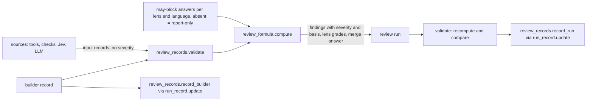

# Review records, validation and the A–F formula (issue #148)

## Summary

Give saga one published schema for the five review records and the per-unit builder record, a validator that refuses a malformed record by field name, and a pure formula in code that computes each input's outcome (blocks, fix later or note), each lens's A–F grade and the change's merge answer. A writer stores a computed review run and each builder record in the issue's run record through `run_record.update`, keeping every field. Nothing calls this code until C10a and C10b.

---

## Problem Frame

This is card C1 of the saga review redesign (parent issue #147). Every later card in that program (the calibration file C2, the tool adapters C4a to C4c, our checks C5 and C5b, the sweep C6, the targeted reviewer C8, the review command C10a and the switch-over C10b) emits or reads these records, so a mistake here grades every later review wrong.

Today, under `plugins/saga/`, two different shapes are both called `review_result.v2` (`scripts/review_consensus.py:868`, `scripts/review_result.py:813`), and the command-line writer drops fields when it rebuilds one (`scripts/review_result.py:1140-1191`). Severity is a P0 to P3 label the reviewer writes (`scripts/review_result.py:120`, `:196`). A lens passes on 0–10 scores against a strictness ladder (`scripts/review_consensus.py:128`, `:2161`), and one lens with no usable result makes the whole review `review_incomplete` (`:2215-2216`).

The design (the program's `plan.md`, Change 1, Change 7 and "Block, fix later and note") replaces all of that with records that every source emits alike and an outcome that code, never the reviewer, decides. The old shapes stay in place until C10b deletes them.

---

## Requirements

Requirements are grouped by concern; R-IDs run continuously.

**Records and validation**

- R1. One schema, `plugins/saga/references/review-records.schema.json`, defines six record kinds: finding, measurement, where-to-look item, lens grade, review run and builder record. Each record names its `kind` and the schema token `review_records.v1`.
- R2. `python3 plugins/saga/scripts/review_records.py validate <file>` exits 0 on a well-formed record of any kind and non-zero on a malformed one, naming each missing or wrong field (AC-1).
- R3. The finding record carries every field the card lists: lens; rule (the question or tool rule behind it); source (tool and version, classifier and model, or LLM and model); location; a one-sentence statement; consequence, trigger and evidence from closed lists; proof; whether this change introduced it; whether it is degraded; severity (computed); the "unconfirmed" mark; and the merge outcome.
- R4. A finding handed in with a severity is refused; no path accepts a reviewer-written one (AC-2).
- R5. A location is a file, lines and function. Only a plan finding (which names a document section) and a whole-project tool result (which may omit the lines) are excused from part of that (AC-6).
- R6. A merge outcome is one of five: fixed; dismissed, which needs a reason; fixed now; filed, which needs an issue number; or left (AC-6).
- R7. A secret-scanner finding carries its location and never the secret, and raw tool output is referenced by a fingerprint of its content, never embedded.
- R8. "Unconfirmed" is consistent: it is set exactly when a reproduced LLM finding has no answer from Jev (TypeSafe Jev, the classifier the fleet uses) for its consequence (AC-3, AC-6).

**Identity**

- R9. Each finding gets an identity computed by code that stays the same when lines shift and in a later round, and that differs for two rules firing on the same line (AC-5).

**Formula**

- R10. Every row of the four lens tables and the judged-findings table in `plan.md` has an identifier in code and a fixed base outcome, and each has a passing test, with and without a builder-recorded reason where the row allows one (AC-2).
- R11. Modifiers apply as the card states: a degraded input whose row would block counts as fix later, marked degraded; a dispute of a builder's "doesn't apply" or "unaffected" is fix later, flagged for merge confirmation; a finding sourced only from Jev never blocks; for a reproduced finding the lower of the LLM's and Jev's consequence picks applies and a disagreement is flagged; when Jev cannot answer, the LLM's pick applies and the finding is marked "unconfirmed" (AC-3).
- R12. An LLM finding that was not reproduced is never worse than fix later (AC-3).
- R13. Per lens: A with no blocking or fix-later items; B with one or two fix-later; C with three or more; D with one blocking item; F with two or more. Notes never move the grade, fix-later items never add up to a block, and merge needs every lens at C or better (AC-2).
- R14. The formula takes, per lens and language, whether the lens may block. With no answer every lens reports only, keeps its computed grade, and merge skips its blocks, except a reproduced "data lost or corrupted" or "a security boundary crossed" finding, which always blocks (AC-4).
- R15. The formula is deterministic: the same input gives byte-identical output.

**Storage and boundaries**

- R16. A writer stores a computed review run and each unit's builder record in the run record through `run_record.update` (`plugins/saga/scripts/run_record.py:599`), under the record's lock, and a read gives back every field, the builder record's every reason kind included (AC-6).
- R17. Only the two new scripts mention `review_records` or `review_formula` among `plugins/saga/scripts/*.py` (AC-7).
- R18. `python3 -m pytest plugins/saga/tests -q --import-mode=importlib` passes, and the new tests make no network call (AC-8).

---

## Key Technical Decisions

Each entry is the decision, then why, naming what was rejected.

- **KTD1. The schema file is the published contract; the validator is hand-written Python that a test holds to it.** Saga scripts use the standard library and PyYAML only, so a JSON Schema library is not available. A drift test reads the schema's `required` lists and `enum` values and compares them with the module's constants, so the two cannot disagree silently. Rejected: vendoring a schema validator (a new dependency for one module), and a schema-less validator (later cards in other languages and Langfuse need a machine-readable contract).
- **KTD2. Severity exists in two forms, input and computed.** A source hands in a finding without `severity` (a handed-in one is refused, R4); the formula returns the stored finding with `severity` and a `severity_basis` (the row identifier and every modifier applied). Validating a stored review run recomputes every finding's severity from the run's own inputs and refuses any mismatch, so an edited file cannot smuggle a severity in either. Rejected: trusting a stored severity (a hand edit would pass), and storing no severity (every reader would have to re-run the formula).
- **KTD3. A review run is self-contained.** It embeds the builder-record snapshots and the per-lens, per-language "may block" answers the formula used, plus the run-level degraded inputs. This is what makes recomputation (KTD2) and the determinism test possible without the calibration file, which C2 builds. Rejected: referencing the unit rows by name (the builder record changes during repair rounds, so a later read would grade against the wrong version).
- **KTD4. Finding identity is a fingerprint of lens, rule, path, scope and anchor, never the line number.** The scope is the function, or for a plan finding the document section, or empty at module level. The anchor is the whitespace-normalised text of the flagged lines for a line-bound finding, the dependency or resource name for a whole-project result, and the section heading for a plan finding. Code computes it as `rf:` plus 32 hex characters of a SHA-256; a handed-in identity that does not match is refused. Rejected: today's path, line and category fingerprint (`scripts/review_result.py:183`), which changes whenever lines move; and an ordinal within the function, which shifts when a new finding is inserted above.
- **KTD5. A location says what it is with `scope`: `lines`, `whole-project` or `section`.** `lines` requires `file`, `lines` and `function` (the key present, `null` at module level or in a non-code file); `whole-project` requires `file` and allows no `lines`; `section` requires `document` and `section` and is allowed only on a plan finding. This answers the card's open question of how a record marks itself whole-project, and C4a's adapters set it.
- **KTD6. Row identifiers are `<lens>.<slug>`, plus `judged.<slug>` for the judged-findings table, held in one registry in `review_formula.py`.** Each row carries its lens, base outcome, the builder reason kind that excuses it (if any), and whether reproduction raises it to blocks. The six pattern checks are rows `correctness.pattern.<name>`, each "blocks unless the builder records a reason", as `plan.md` decided. The full list is in Implementation Unit U2. Rejected: rows named by table position (they would renumber when a row is added).
- **KTD7. A builder reason matches a finding by finding identity and reason kind.** Reasons name the `finding_id` they excuse (the build loop computes the same identity from the same tool output) and a kind from a closed list: `coverage-gap`, `surviving-mutant`, `scanner-false-positive`, `unaffected`, `pattern-check`, `where-to-look-explanation`. A reason excuses a finding only when its kind is the one the finding's row allows; an excused finding becomes a note marked `excused`. Rejected: matching by path and line (breaks on a line shift, the same failure KTD4 avoids).
- **KTD8. Closed lists come from `plan.md`'s judged-findings table.** Consequence: seven harms (data lost or corrupted; money or resources wrongly moved; a security boundary crossed; two holders of one exclusive thing; a wrong result reported as success; required behaviour missing; a break in supported use), two visible kinds (fails loudly and recoverably; misleads a person while the work is right) and two upkeep kinds (costs future work; style). Trigger: normal use; a legitimate condition (retry, interrupt, concurrency, old data, another caller); misuse only. Evidence: reproduced, traced, suspected, and `tool-result` for a tool or check. "Lower" orders the groups harm, visible, upkeep; within harm, the two picks are equal in rank, so a harm-against-harm disagreement keeps the LLM's pick and is still flagged.
- **KTD9. Merge is answered from enforced blocks, which equals "every lens at C or better".** A lens is at D or F exactly when it has a blocking item, so the merge answer is "no enforced blocking item", where a block is enforced when its lens may block for the finding's language or it is a reproduced always-blocking harm. The lens grade itself is always computed from every item (a report-only lens keeps its grade, R14).
- **KTD10. Measurements are recorded with their threshold and condition but never move the grade.** Every lens-table row is per item (each uncovered branch, each surviving mutant is its own finding), so counting a missed coverage threshold as well would count the same gap twice. The measurement records `met` or `missed` for the reader and Langfuse.
- **KTD11. Storage reuses the record's existing keys; no new top-level key.** A review run is appended to `review_cycles` as an entry with `schema: "review_run.v1"` and `loop: "review_run"`, which every current reader skips (they filter on `review_result.v2` or on `loop == "code_review"`). The builder record is a new unit-row key, `builder_record`. Rejected: a new top-level key, because `run_record.TOP_LEVEL_KEYS` is frozen on purpose and mirrored by a Claude mod contract test and an orchestrate fixture, a far larger blast radius than the card needs. The cost is one line outside the card's file list: orchestrate's `DOCUMENTED_FOREIGN_ROW_KEYS` (`plugins/orchestrate/skills/orchestrate/scripts/orchestrate.py:452`) must gain `builder_record`, because its contract test holds that set to the marked unit-row tables in `run-record.md`.
- **KTD12. Every finding from the classifier alone is capped at fix later; the "always blocks" exception applies only to reproduced findings.** Jev never blocks (`plan.md`), and the report-only exception is worded as reproduced data loss or reproduced security exposure. A pattern check whose harm is data loss is not reproduced, so it follows the report-only rule like any other row.

---

## High-Level Technical Design

The data flow, from a source's records to the stored run. Nothing in this card calls it yet; C10a's review command will.



The outcome for one finding is computed in this order, and `severity_basis.modifiers` lists each step that changed it:

1. Base outcome from the row; for a `judged.*` row, from consequence (after the LLM-against-Jev pick), trigger and evidence.
2. Reproduction raises a "blocks when reproduced" row to blocks.
3. A builder reason of the row's allowed kind makes it a note (`excused`).
4. Caps, each lowering blocks to fix later: degraded; a dispute; source is the classifier alone; an LLM finding not reproduced.
5. Enforcement (KTD9): a block on a lens that may not block for that language is recorded but skipped by merge, unless it is a reproduced always-blocking harm.

---

## Implementation Units

Four units: records and validator, the formula, storage and the stored-run check, then documents and the boundary check.

### U1. Record schema, closed lists, identity and validator

Publish the six record kinds and a validator that names every bad field.

**Goal:** A source can hand in any record kind and get either acceptance or a list of field-named refusals, and every finding has a stable identity.

**Requirements:** R1, R2, R3, R4, R5, R6, R7, R8, R9.

**Dependencies:** none.

**Files:** `plugins/saga/references/review-records.schema.json` (create); `plugins/saga/scripts/review_records.py` (create); `plugins/saga/tests/test_review_records.py` (create); `plugins/saga/tests/fixtures/review_records/valid/` and `plugins/saga/tests/fixtures/review_records/invalid/` (create, one valid fixture per kind and one invalid fixture per refusal rule).

**Approach:** `review_records.py` holds the closed lists as module constants (lenses `correctness`, `security`, `testing`, `architecture-maintainability`; languages from `plan.md`'s Languages paragraph; consequence, trigger and evidence from KTD8; merge outcomes; builder reason kinds from KTD7), a `validate(record) -> list[str]` that returns one message per bad field naming its dotted path (`location.lines: required when scope is "lines"`), and `finding_identity(lens, rule, location)` per KTD4.

The validator dispatches on `kind`. Per kind:

- Finding (input form): refuses `severity` and `severity_basis`; requires every R3 field; enforces the location rules (KTD5); refuses `secret`, `matched_text` or an `excerpt` on any finding whose row is `security.secret-in-diff`; requires `proof.test` or `proof.output` when evidence is `reproduced` and `proof.steps` when `traced`; requires `consequence_jev` or `unconfirmed: true` on a reproduced LLM finding, and refuses `unconfirmed: true` when `consequence_jev` is present; merge outcome null or one of the five, with `reason` for dismissed and an integer `issue` for filed; recomputes the identity and refuses a mismatch.
- Measurement: lens, tool and version, metric, value, threshold, direction (`at-least` or `at-most`), the row it relates to; `condition` is computed and refused if handed in.
- Where-to-look item: lens, location, questions each with an identifier and a probability between 0 and 1, classifier and model, degraded flag, and an answer that is either a `finding_id` or `cleared` with a reason.
- Lens grade: lens, counts of blocking, fix-later and note items, grade A–F, degraded inputs, and `may_block` as a mapping from language to boolean.
- Review run: card (issue number), repository, base and head commits, saga version, round (1 or more), tool versions, usage (tokens in and out, cost, seconds), the embedded findings, measurements, where-to-look items, lens grades, builder-record snapshots, `may_block` answers, `degraded_inputs`, the merge answer, and `raw_outputs` each as `{tool, sha256, path}` with a 64-hex fingerprint.
- Builder record: unit, acceptance criteria each with its check names, policy declarations each `{question, applies, proving_test}` (a proving test required when `applies` is true), and reasons each `{kind, finding_id, text}`.

The command line: `validate <file>` prints each refusal on its own line to standard error and exits 1, or exits 0 silently; a file that is not JSON or names no known `kind` exits 2. `--help` needs no credentials (the existing `plugins/saga/tests/test_entrypoints.py` globs every script, so it picks this up unchanged).

**Patterns to follow:** `plugins/saga/scripts/functional_checks.py` for a small standard-library command line with subcommands and exit codes; `plugins/saga/scripts/run_record.py` for frozen constants and `RunRecordError`-style error classes; fixture layout under `plugins/saga/tests/fixtures/`.

**Test scenarios:**

- Happy path: each valid fixture (finding, measurement, where-to-look, lens grade, review run, builder record) through `validate` returns no messages, and the command line exits 0.
- Missing fields: for each kind, drop each required field in turn; expected one refusal naming exactly that field.
- Wrong types and values: a lens outside the four, a consequence outside the closed list, a probability of 1.5, a grade of "E"; each refused by field name.
- Preset severity: a finding carrying `severity: "blocks"` is refused, naming `severity`.
- Secret: a `security.secret-in-diff` finding carrying `matched_text` is refused; the same finding with only a location and a raw-output fingerprint passes.
- Raw output: a `raw_outputs` entry with a 63-character fingerprint is refused.
- Merge outcome: `"merged"` refused; `dismissed` without a reason refused; `filed` without an issue number refused; each of the five well formed accepted.
- Location: a code finding with no `lines` is refused; a `whole-project` tool result with no lines is accepted; a `section` location on a plan finding is accepted and on a code finding refused.
- Unconfirmed: a reproduced LLM finding with neither `consequence_jev` nor `unconfirmed` is refused; one with both is refused.
- Identity: the same finding with its lines moved down by 12 gets the same identity; the same finding in round 2 gets the same identity; two rules on one line get different identities; a handed-in identity that does not match is refused.
- Drift: the schema file's `required` lists and `enum` values equal the module's constants for every kind.
- No network: every test in this file runs with `socket.socket` replaced by one that raises.

**Verification:** each invalid fixture fails with a message naming the field the fixture breaks; each valid fixture passes; the identity tests pass; the drift test passes.

**Functional checks:**

```functional-checks
- name: validate-cli-on-every-fixture
  command: sh -c 'for f in plugins/saga/tests/fixtures/review_records/valid/*.json; do python3 plugins/saga/scripts/review_records.py validate "$f" || exit 1; done; for f in plugins/saga/tests/fixtures/review_records/invalid/*.json; do if python3 plugins/saga/scripts/review_records.py validate "$f" 2>/dev/null; then echo "accepted $f"; exit 1; fi; done'
  proves: [AC-1]
  runs: local
- name: review-records-tests
  command: python3 -m pytest plugins/saga/tests/test_review_records.py -q --import-mode=importlib
  proves: [AC-1, AC-2, AC-5, AC-6]
  runs: local
```

### U2. The formula: rows, modifiers, grades and merge

Compute every outcome, grade and merge answer in one pure function.

**Goal:** Given validated input records, the builder records, the may-block answers and the run's degraded inputs, `review_formula.compute` returns each finding with its severity and basis, each lens grade, and the merge answer, identically every time.

**Requirements:** R4, R10, R11, R12, R13, R14, R15.

**Dependencies:** U1 (the closed lists and record shapes).

**Files:** `plugins/saga/scripts/review_formula.py` (create); `plugins/saga/tests/test_review_formula.py` (create).

**Approach:** A frozen registry `ROWS` maps each row identifier to its lens, base outcome, allowed builder reason kind and whether reproduction raises it to blocks. The rows, taken from `plan.md`'s tables:

| Lens | Row identifiers (base outcome) |
|---|---|
| Testing | `testing.uncovered-branch` (blocks, excused by `coverage-gap`); `testing.surviving-mutant` (blocks, excused by `surviving-mutant`); `testing.test-passes-before-change` (blocks); `testing.test-skipped-in-ci` (blocks); `testing.flaky-order-or-network` (fix later); `testing.fakes-code-under-test` (fix later); `testing.writes-live-system` (fix later, blocks when reproduced) |
| Security | `security.scanner-high` (blocks, excused by `scanner-false-positive`); `security.scanner-medium-low` (fix later); `security.secret-in-diff` (blocks); `security.dependency-high` (blocks, excused by `scanner-false-positive`); `security.workflow-infra-high` (blocks); `security.required-test-missing` (blocks); `security.dispute` (fix later, flagged) |
| Architecture and maintainability | `architecture-maintainability.structural-check-fails` (blocks); `architecture-maintainability.prose-rule-broken` (fix later, blocks when reproduced by a failing check); `architecture-maintainability.relocated-run-fails` (blocks); `architecture-maintainability.machine-specific-value` (fix later); `architecture-maintainability.undocumented-departure` (note); `architecture-maintainability.duplicate` (note); `architecture-maintainability.complexity-dead-code-naming` (note) |
| Correctness | `correctness.criterion-without-check` (blocks); `correctness.type-error` (blocks); `correctness.pattern.release-shares-cleanup`, `.swallowed-error`, `.silent-skip`, `.naive-time-comparison`, `.write-skips-shared-update`, `.money-as-float` (each blocks, excused by `pattern-check`); `correctness.declared-question-untested` (blocks); `correctness.unupdated-mention` (blocks, excused by `unaffected`); `correctness.unupdated-mention-in-document` (fix later); `correctness.workflow-dead-end` (blocks); `correctness.ci-matrix-fails` (blocks); `correctness.dispute` (fix later, flagged) |
| Judged findings, any lens | `judged.harm-reproduced` (blocks); `judged.harm-traced` (fix later); `judged.harm-misuse` (fix later); `judged.visible` (fix later); `judged.upkeep` (note) |

An LLM finding names its lens and the `judged` row is chosen by code from consequence, trigger and evidence, never by the source. Testing and architecture also accept a `<lens>.dispute` row, since the card's dispute modifier is not limited to two lenses. The outcome order, grade table and merge rule follow the High-Level Technical Design, KTD9 and KTD12. Output is plain dicts with sorted keys and findings sorted by identity, with no clock or randomness. A `compute <inputs-file>` subcommand prints the result as JSON for C10a and for debugging.

**Patterns to follow:** frozen module-level tables as in `plugins/saga/scripts/run_record.py` (`TOP_LEVEL_KEYS`); the parametrised table tests in `plugins/saga/tests/test_functional_checks.py`.

**Test scenarios:**

- Every row: one named, parametrised case per row identifier above, asserting its base outcome; for each row with an allowed reason kind, a second case with that reason recorded (expected note, marked `excused`) and a third with a reason of the wrong kind (expected the base outcome); for each "blocks when reproduced" row, a reproduced case (expected blocks).
- Registry completeness: the set of row identifiers in `ROWS` equals the set the test parametrises over, so a row added without a test fails.
- Judged table: harm under normal use reproduced, blocks; harm under a legitimate condition traced, fix later; harm suspected, fix later; harm under misuse reproduced, fix later; visible reproduced, fix later; upkeep, note.
- Unreproduced LLM: every consequence, trigger and evidence combination other than reproduced gives fix later or note, never blocks (AC-3).
- Grade boundaries: 0 items gives A; 1 and 2 fix-later give B; 3 and 10 fix-later give C; 1 blocking gives D; 2 blocking give F; 1 blocking plus 5 fix-later gives D; 4 notes give A.
- Merge: every lens at C or better merges; one lens at D does not; one enforced block on any lens stops merge.
- Degraded: a degraded `testing.surviving-mutant` finding is fix later and marked degraded; the lens grade lists it under degraded inputs.
- Dispute: a `correctness.dispute` finding is fix later and flagged for merge confirmation.
- Jev only: a finding whose source is the classifier on a blocking row is fix later.
- LLM against Jev: LLM picks a harm and Jev picks visible on a reproduced finding; expected fix later, disagreement flagged. Both pick the same harm; expected blocks, no flag.
- Jev cannot answer: a reproduced finding marked unconfirmed takes the LLM's harm pick, blocks, and stays marked unconfirmed (AC-3).
- Report-only: with no may-block answers, a reproduced `money or resources wrongly moved` finding leaves the lens at D and merge allowed; a reproduced `data lost or corrupted` finding and a reproduced `a security boundary crossed` finding each stop merge; with `may_block` true for that lens and language, the money finding stops merge too (AC-4).
- Determinism: computing the same input twice gives byte-identical JSON; shuffling the input order gives the same output.
- Worked examples from `plan.md`: the retry that charges twice, reproduced, gives correctness D; the staff report (one medium scanner finding, one traced tenant harm, one stale README mention) gives security B and correctness B; the Swift change without Muter (one degraded mutation answer, a missing dependency-audit tool in the degraded inputs) gives testing B degraded and security A degraded.
- Refusal: `compute` on an input finding carrying a severity raises, naming `severity`.
- No network: as in U1.

**Verification:** every row, modifier, boundary and worked example has a passing named test, and the registry-completeness test passes.

**Functional checks:**

```functional-checks
- name: review-formula-tests
  command: python3 -m pytest plugins/saga/tests/test_review_formula.py -q --import-mode=importlib
  proves: [AC-2, AC-3, AC-4]
  runs: local
```

### U3. Writer, storage and the stored-run check

Store computed runs and builder records in the run record, round-tripping every field.

**Goal:** `review_records.py` can record a computed review run and a builder record into an issue's run record under its lock, read them back whole, and refuse a stored run whose severities do not match a recomputation.

**Requirements:** R2, R4, R6, R16.

**Dependencies:** U1, U2.

**Files:** `plugins/saga/scripts/review_records.py` (modify); `plugins/saga/references/run-record.md` (modify: a marked unit-row table for `builder_record`, the `review_run.v1` entry in `review_cycles`, and the two writers in the writers table); `plugins/orchestrate/skills/orchestrate/scripts/orchestrate.py` (modify: add `builder_record` to `DOCUMENTED_FOREIGN_ROW_KEYS`, per KTD11); `plugins/saga/tests/test_review_records.py` (modify).

**Approach:** Add `record_run(store_root, issue, inputs)`, which validates the inputs, calls `review_formula.compute`, validates the resulting run (including the recompute check of KTD2) and appends it to `review_cycles` through `run_record.update`; and `record_builder(store_root, issue, unit, builder_record)`, which validates it and sets that unit row's `builder_record` through `run_record.update`, creating a minimal `{"id": unit}` row when none exists and carrying every other row key forward. Readers `runs_for(record)` and `builder_record_for(record, unit)` return the stored dicts. The command line gains `record-run --issue N <inputs-file>` and `record-builder --issue N --unit U <file>`, resolving the store the way `run_record.py`'s own command line does. Validation of a stored review run recomputes each finding's severity from the embedded inputs and refuses a mismatch by finding identity.

**Patterns to follow:** `run_record.set_next_step` and `usage add` in `plugins/saga/scripts/run_record.py` (a small change function passed to `update`); the round-trip rule in `plugins/saga/references/run-record.md` ("`units` — the keys a unit row carries").

**Test scenarios:**

- Round trip: record a review run, load the record, and compare the stored run with the computed one field by field; expected equal, every field present.
- Builder record round trip: a builder record carrying one reason of each of the six kinds, a declaration that applies with its proving test and one that does not, and two acceptance criteria with checks; record, read, expected equal (AC-6).
- Repair update: record a builder record, then record a changed one for the same unit; expected the second replaces the first and the row's other keys (`usage`, `build_loop`) are untouched.
- Lock: record a usage entry through `run_record.py usage add` between loading and writing (simulated by a change function that triggers a concurrent `update`); expected the usage entry survives the review-run write.
- Stored severity check: edit one stored finding's severity from fix later to note and validate the run; expected refusal naming that finding's identity.
- Other readers ignore it: a record holding a `review_run.v1` entry gives the same results as one without it from `release_step._code_review_cycles`, `cost_report._code_review_history`, `run_status`'s latest-entry reader and `review_result.history_for`.
- Orchestrate contract: `plugins/orchestrate/tests/test_orchestrate_record.py` passes with the new marked table and the updated set.
- Refusal: `record-run` on an input carrying a severity exits non-zero and writes nothing.

**Verification:** the round-trip, lock, stored-severity and other-readers tests pass, and the orchestrate record tests pass unchanged.

**Functional checks:**

```functional-checks
- name: writer-round-trip-and-lock
  command: python3 -m pytest plugins/saga/tests/test_review_records.py -q --import-mode=importlib -k "round_trip or builder or lock or stored or readers"
  proves: [AC-2, AC-6]
  runs: local
- name: orchestrate-row-key-contract
  command: python3 -m pytest plugins/orchestrate/tests/test_orchestrate_record.py -q --import-mode=importlib
  proves: [AC-6]
  runs: local
```

### U4. Reference document, changelog, decision record and the boundary check

Write the human reference and record the decision, then prove nothing else imports the new modules.

**Goal:** A reader can learn every field, closed list and row identifier from one document, the decision is in the engineering journal, and the new modules stay unused outside themselves.

**Requirements:** R1, R17, R18.

**Dependencies:** U1, U2, U3.

**Files:** `plugins/saga/references/review-records.md` (create); `plugins/saga/CHANGELOG.md` (modify, Unreleased, Added); `docs/engineering-journal/DECISIONS.md` (modify, newest first).

**Approach:** `review-records.md` explains each record kind with one example, the closed lists, the location scopes, the identity method, the row table with identifiers, the outcome order, the grade table, the report-only rule, and where the records are stored; it links the schema file and says the old `review_result.v2` shapes remain until C10b. The decision entry records KTD2, KTD4 and KTD11 with their rejected alternatives and a "revisit when" condition (when C10b deletes the old shapes, reconsider moving review runs out of `review_cycles`). The changelog entry names issue 148.

**Patterns to follow:** the entry format in `docs/engineering-journal/DECISIONS.md` (Author, Decision, Rejected alternatives, Rationale, Revisit when, Refs); the Unreleased entries in `plugins/saga/CHANGELOG.md`.

**Test scenarios:** Test expectation: none -- documentation only; the boundary check below and the repository checks cover it.

**Verification:** `python3 scripts/check_repo.py`, `python3 -m unittest discover -s tests -v` and `git diff --check` pass; the grep lists only the two new scripts.

**Functional checks:**

```functional-checks
- name: only-new-scripts-name-the-modules
  command: sh -c 'test "$(grep -lE "review_records|review_formula" plugins/saga/scripts/*.py | sort | tr "\n" " ")" = "plugins/saga/scripts/review_formula.py plugins/saga/scripts/review_records.py "'
  proves: [AC-7]
  runs: local
```

---

## Scope Boundaries

What this card does not do, and what is left to named later cards.

Non-goals, from the card: the calibration file (C2); capturing the builder record and checking it is complete (C11); adding it to the lifecycle's implementation-result contract (X1a); turning tool output, our checks, the sweep or the LLM's answer into records (C4a to C4c, C5, C5b, C6, C8); the review command (C10a); deleting the old shapes, rounds and the merge flow (C10b); recording merge outcomes, showing "unconfirmed" picks and disputes at merge, filing issues (the security guard's too) and the pull request checklist (C13); Langfuse (C15, C16).

Later (noted here, never a unit of this plan):

- The generic tool rows `plan.md` decided while the cards were drafted (a linter's error level blocks, warnings are fix later, style is a note, broken links fix later, a dependency vulnerability with no score counts as high). C4a adds them to the `ROWS` registry when its adapters need them.
- The language list's extension when C3's setup step detects a language outside `plan.md`'s list.
- Moving review runs out of `review_cycles` once C10b has deleted the old entries (the revisit condition in the decision record).

---

## Risks & Dependencies

| Risk | Mitigation |
|---|---|
| A current reader of `review_cycles` treats a `review_run.v1` entry as a code-review cycle and miscounts rounds or picks the wrong revision. | `loop: "review_run"` excludes it from `release_step`'s default; U3 tests every current reader against a record holding one. |
| The schema file and the validator drift apart. | The U1 drift test compares them on every run. |
| A row's outcome is mis-transcribed from `plan.md`. | One named test per row, written from the table text, plus the three worked examples as end-to-end checks. |
| The orchestrate edit lands outside the card's file list. | It is one constant forced by an existing contract test (KTD11); the reviewer sees it named here. |

Depends on no other card.

---

## Scenario Smoke

The whole saga suite on the combined branch, with the new tests' network guard in place.

```scenario-smoke
- name: saga-suite-green-no-network
  command: python3 -m pytest plugins/saga/tests -q --import-mode=importlib
  proves: [AC-8]
  runs: environment
```

---

## Sources / Research

- Design: `docs/brainstorms/2026-10-05-saga-review-redesign/plan.md`, Change 1 (records), Change 7 (formula), Change 8 ("While a lens only reports"), Change 9 (secrets and fingerprints), "Lens by lens" and "Block, fix later and note".
- `plugins/saga/scripts/run_record.py:78-91` (frozen top-level keys), `:397-416` (`RunRecord`), `:599-621` (`update`).
- `plugins/saga/references/run-record.md`, "`units` — the keys a unit row carries" and "Writing: atomic replace, under the record's lock".
- `plugins/orchestrate/skills/orchestrate/scripts/orchestrate.py:452` (`DOCUMENTED_FOREIGN_ROW_KEYS`) and `plugins/orchestrate/tests/test_orchestrate_record.py:588` (the test holding it to the marked tables).
- Current `review_cycles` readers: `plugins/saga/scripts/release_step.py:517`, `cost_report.py:233`, `run_status.py:392`, `review_result.py:866-885`.
- Today's identity: `plugins/saga/scripts/review_result.py:183`.
- `plugins/saga/tests/test_entrypoints.py` (every script answers `--help` without credentials).
