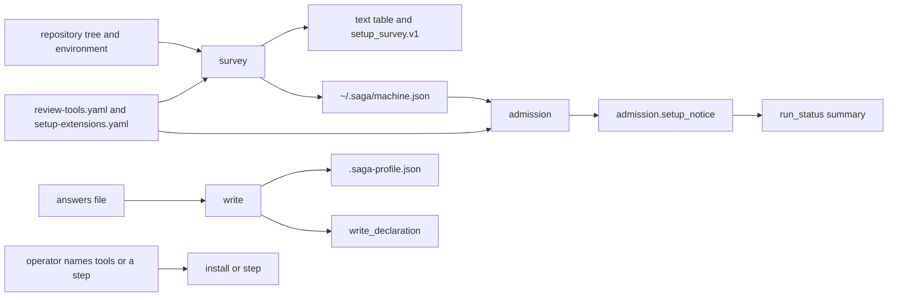

# saga setup checks the machine and the repository (issue #150)

## Summary

Add `/saga:setup`, one vendor-neutral script any harness can call. It surveys the tools saga needs, checks the reproduction sandbox, installs and runs optional steps only when the operator names them, and records the machine under the home directory and the repository in `.saga-profile.json`. A run asks no setup question. It records one notice naming what is missing, and admission suggests setup once per machine.

---

## Problem Frame

Issue #150 is card C3 of the saga review redesign (parent issue #147). It implements Change 2 of the program design, "A saga setup step for tools", except the Claude Code screens, which are card C14.

Saga has no setup command. The command surface is 14 command files and 13 skill directories (`plugins/saga/tests/test_command_surface.py`). The repository profile holds no languages, no visibility, and no tool pins (`plugins/saga/references/repository-profile.md`). Admission never prompts. It prints the questions still open and reads an answers file (`plugins/saga/scripts/admission.py`). A run has nowhere to record that a tool or the sandbox is missing.

C4a has landed. The default tool list is `plugins/saga/references/review-tools.yaml`, and the profile block it reads is `review_tools.pins`, keyed by binary name. C6 has added the Universal Ctags row. C8 has landed the only reproduction sandbox, Claude's command sandbox, probed by `reviewer_probe` in agent-launcher. The lifecycle repository already classifies `/setup` as excluded (infiquetra-sdlc issue #177): the adapter resolves it, and the command touches no issue and no Stage. This card does not edit that repository.

---

## Requirements

Requirements are grouped by concern. R-IDs run continuously. AC-n is the nth checkbox under the issue's Acceptance criteria.

**Command and survey**

- R1. `ls plugins/saga/com.infiquetra.claude/commands | wc -l` prints 15, and `python3 -m pytest plugins/saga/tests/test_command_surface.py -q --import-mode=importlib` passes. The new command is `setup`. The new skill directory is `setup`. The documents that state the counts say 15 files and 14 commands (AC-1, AC-11).
- R2. `python3 plugins/saga/scripts/saga_setup.py --help` exits 0. The entrypoint test strips `SAGA_LANGFUSE_` the way it already strips `TYPESAFE_` (AC-2).
- R3. The survey lists every saga-owned tool and every review-tool row for the detected languages, each with its status, the lens it serves, and its pinned version, as a text table and as one JSON document (AC-3).
- R4. The survey reports `TYPESAFE_API_KEY`, `SAGA_LANGFUSE_PUBLIC_KEY`, `SAGA_LANGFUSE_SECRET_KEY`, and `SAGA_LANGFUSE_HOST` only as present or absent. A sentinel value never reaches standard output, standard error, or the machine record (AC-4).

**Sandbox, install, machine record**

- R5. The survey reports whether the reproduction sandbox is available. When it is not, the run notice names it and reproduction is unavailable (AC-5).
- R6. The survey runs no install command and no optional step. An install runs exactly the named rows' install commands. An optional step reports done or not done, and its run command runs only when the operator names it (AC-6).
- R7. The machine record is a file under the home directory, outside every repository. It holds the survey, that setup ran, and whether setup has been offered (AC-7).

**Repository profile**

- R8. Setup writes detected languages, visibility, and version-only pins into `.saga-profile.json`, writes the functional-test answer through `write_declaration`, and writes a `qa` block that `qa_strategies.load_profile` accepts. Every other key keeps its value and its place. The write is atomic. `repository-profile.md` describes the new keys and names setup as a writer. This card does not edit the committed `.saga-profile.json` (AC-8).

**During a run**

- R9. A run asks no setup question. Admission records one notice on the run record. `run_status.py summary` carries that notice once per run, inside `run_status.v1` (AC-9).
- R10. Admission asks nothing the profile already answers, and it reads the other profile facts as it does today. When setup has never run and has never been offered, the first admission prints one suggestion line and records the offer. A later admission does not print it (AC-10).
- R11. `python3 scripts/check_repo.py` passes, including the frontmatter check of the new skill (AC-12).
- R12. The changelog and `docs/engineering-journal/DECISIONS.md` record the decisions below.

---

## Key Technical Decisions

Each entry is the decision, then why, including the rejected alternative.

- **KTD1. The machine record is `~/.saga/machine.json`, schema `machine_record.v1`, and the contract lives in `plugins/saga/references/machine-record.md`.** The parent directory is the one C4a already uses (`review_tools._saga`, mode `0700`). The file is mode `0600`. `--home` overrides the parent for tests. The record holds `ran`, `offered`, and `survey`. `survey` stores tool status and version, credential state as present or absent, the sandbox result, and which optional steps are done. It never stores a credential value. `record_offer(home)` sets `offered` and preserves `survey` and `ran`, which is the write C14 uses as well as its own store. A path inside `.claude/saga/runs` was rejected because that store is per checkout (`run_record.STORE_SUBPATH`). Putting the bytes in the repository was rejected because the record is a fact about the machine.

- **KTD2. Saga-owned tools are rows in `review-tools.yaml` with `catalogue: false` and `lens: saga`.** The rows are `saga-git`, `saga-gh`, `saga-python`, `saga-uv`, and `saga-pyyaml`. `review_adapters_all_languages.py` builds adapters only for ids it has an invoker for, so these rows are never executed as review tools. `build_loop.check_map` skips `catalogue: false`, so the dry run does not list git as a review tool the baseline failed to name. `lens: saga` is not one of `review_formula.LENSES`, so `review_calibration.differing_tool` does not treat a saga row as a lens pin. A separate yaml file was rejected because the card says this card adds rows to the default tool list. Giving the rows a review lens was rejected because a later pin on git would force that lens to report only.

- **KTD3. Version status has four values, and `not-recorded` is not a mismatch.** `installed` means the version command printed a version and it satisfies the pin. `missing` means the binary is not on `PATH`. `wrong-version` means the pin is a real version and the probed text differs. `needs-sign-in` is only for `gh`: the binary is acceptable and `gh auth status` exits non-zero. `gh` stdout and stderr are discarded. They can name an account. Python uses `version_mode: minimum` and `minimum_version: "3.12"`, the floor `tests/test_python_floor.py` declares (`python>=3.12`). Git, `gh`, uv, and PyYAML use `version_mode: any`: any parsed version is installed. Review rows stay exact. A yaml `default_version` of `not-recorded` counts as installed when a version is parsed, because that string means the catalog has not pinned one yet. Requiring the context library's 3.13 floor was rejected. That standard is for infrastructure repositories. This catalog's floor is 3.12. Pinning an exact git version was rejected. The catalog does not declare one.

- **KTD4. The survey selects rows by detected language, and detection is a closed suffix list.** Languages, in `review_formula.LANGUAGES` order, are python (`*.py`), typescript (`*.ts`, `*.tsx`, `*.js`, `*.jsx`), dart (`*.dart`), rust (`*.rs` or `Cargo.toml`), swift (`*.swift`), markdown (`*.md`), shell (`*.sh`, plus an extensionless file whose first line is a `sh`, `bash`, or `zsh` shebang), and github-workflows (a `.yml` or `.yaml` file under `.github/workflows/`). CDK stays python. A TypeScript CDK tree is typescript unless it also has a `.py` file. `cloudformation` is not detected. The walk skips directories named `.git`, `node_modules`, `.venv`, `venv`, `dist`, `build`, `__pycache__`, and `.saga`. A selected row has `languages: ["*"]` or a language in the detected set, or it is saga-owned, which is always selected. Universal Ctags is already a row. It is selected when a detected language is in its list, and this card does not add a parser row. A content classifier was rejected. The card's language list is the suffix list C4a already uses for findings.

- **KTD5. Pins written into `review_tools.pins` are version-only, and an existing recorded version is left alone.** The key is the row's `tool` string. Empty `tool` (coverage, the relocated run) writes no pin. Saga-owned rows write no pin. When the profile already has a non-empty version other than `not-recorded`, that version stays, including any `rules` list beside it. Otherwise the written version is the yaml default when that default is a real version, and the probed version when the yaml default is `not-recorded` and a version was parsed. A missing binary writes no pin. `rules` is omitted on a pin this card creates, because two semgrep rows share one binary and a profile `rules` list replaces the yaml rules for every row of that binary. A version-only pin keeps each row's own rules, which `repository-profile.md` already states. Copying one row's rules onto the binary was rejected. Refreshing a recorded pin from the machine on every setup was rejected. Changing a pin is a review change. The C2 consequence is accepted and recorded: a written version other than the yaml `default_version` makes `may-block` report-only for the lenses that binary serves, until a reviewed edit updates the yaml default. This card does not edit `review-calibration.json`. `corpus_run` is `no-run`, so the fingerprint is not compared.

- **KTD6. The profile keys are top-level `languages` (an array) and `visibility` (`public` or `private`).** `review_tools.languages` stays the per-language test-command map C4a defined. Setup does not invent test commands. Visibility is `gh repo view --json visibility` with cwd the repository. `PUBLIC` is `public`. `PRIVATE` and `INTERNAL` are `private`. Any other result leaves visibility unknown and emits a question. The answer is only `public` or `private`. `gh` stderr is discarded. Languages are detected, not asked. A guess of `public` when `gh` fails was rejected. Card C15 treats a private repository differently, and a guess would be the wrong one.

- **KTD7. The sandbox probe is C8's `reviewer_probe` for vendor `claude`, and a run does not start it.** `probe_reproduction_sandbox(session)` calls agent-launcher's `reviewer_probe`. The import is inside the function, so `--help` does not import agent-launcher. Tests pass `session` and never start Claude. The survey runs the live probe only with `--probe-sandbox live`. Without the flag, the survey reports the stored probe when the machine record has one and `claude` still resolves on `PATH`. Otherwise reproduction is unavailable and the reason is `not-probed`. The setup skill passes `--probe-sandbox live`. Admission does not. It re-runs version commands, then reads the stored probe and checks that `claude` still resolves. A missing binary flips the stored success to unavailable. Starting `reviewer_probe` from admission was rejected. Change 2 says setup is never part of a run, and the card rules that out. Building a second sandbox was rejected. C10a's card still lists the re-run mechanism as a planning note, so the only landed probe is C8's. One function is the call site C10a can replace.

- **KTD8. Install commands are argument vectors on the row, and this card's production rows have none.** The field is `install_argv`, a list of strings, `shell` false. The existing `install` string stays the human sentence. Naming a row with no `install_argv` exits 2, prints the sentence, and runs nothing. Naming an unknown id exits 2 before any command. Each named row's vector runs once, in order, and its output streams with the row id as a prefix. A non-zero exit stops the rest and the process exits 1. There is no cross-platform install command for git, `gh`, Python, uv, or PyYAML. The context library says project installs go through `uv sync`, not bare pip. Encoding `brew` or `curl` was rejected. The tests prove the mechanism with a fixture tool list that has vectors. `gh auth login` is never a vector. It is interactive and can print a token. The operator signs in outside this script. The survey's `needs-sign-in` status is how the operator learns they should.

- **KTD9. Optional steps and later repository questions are rows in `plugins/saga/references/setup-extensions.yaml`, schema `setup_extensions.v1`.** This card commits the file with empty `steps` and empty `questions`. A step has `name`, `summary`, `done` (an argument vector, exit 0 means done), and `run` (an argument vector). A question has `key`, `prompt`, and `profile_key`. The survey may run `done`. It runs `run` only when the operator names that step (`--step`). An unknown step exits 2 and runs nothing. C16 appends its schedule step. C5 appends its shared-update-path question. Neither edits `saga_setup.py`. A question is asked only when the profile has no value at `profile_key`. The answer is written as JSON at that top-level key. Reserved keys are refused and nothing is written: `schema`, `languages`, `visibility`, `review_tools`, `qa`, `functional_test_environment`, `functional_test_waiver`. A Python registry inside the script was rejected. A later card would have to edit the flow the card says stays stable.

- **KTD10. Profile writes go through one atomic replace, and the functional-test answer then goes through `write_declaration`.** The writer loads the object or starts `{"schema": "repository_profile.v1"}`, updates keys in place so existing keys keep their order, and replaces the file the way `functional_environment.write_declaration` does (a temporary file in the same directory, then `os.replace`). New keys append. `qa` is validated before any write, using the checks `qa_strategies.load_profile` already enforces: schema `qa_profile.v1`, a ceiling with both numbers, a non-empty strategies object, and at least one `required: true`. A bad answer writes nothing. After the atomic write, an answered functional-test declaration or waiver is passed to `write_declaration`, which keeps every other key. A failed declaration leaves the question outstanding. Survey does not write. `write` with an outstanding question and no answer for it exits 2 and leaves the file untouched. This card does not run `write` on the worktree. Issue #114 already committed `.saga-profile.json`, and the live profile tests in `test_admission.py` run because that file exists. Editing it here would change a reviewed repository fact and is a later commit the operator makes by running setup.

- **KTD11. The run notice is `admission.setup_notice`, not a new top-level key.** `run_record.TOP_LEVEL_KEYS` is twelve names, and `test_run_record.py` asserts the reference table between the `TOP-LEVEL KEYS` comments matches that tuple. The notice is `{text, missing_tools, sandbox_unavailable}`. Admission replaces it on every pass, so a run has one notice, not a list. `text` names each missing row id, names the sandbox when it is unavailable, and names `/saga:setup`. When nothing is missing the text is empty and the object is still stored. `run_status.summary` copies it onto each run row. The summary object's existing keys stay. No question is added to `admission.QUESTIONS`, and `pending_questions` does not gain a setup key. The suggestion line, printed only when `ran` is not true and `offered` is not true, is `Run /saga:setup to check the tools on this machine and the repository.` Admission then calls `record_offer`. The line is not a question. A new top-level key was rejected. It would force the orchestrate fixture and the twelve-key test to move for a field that belongs to admission.

- **KTD12. The script's subprocess boundary is one injected runner.** Tests pass the runner, the environment, and `--home`. The runner is `subprocess.run` with `shell` false in production. Tests record the argument vectors and return canned output. They open no socket and install nothing. Version probes, `gh auth status`, `gh repo view`, install vectors, step vectors, and the sandbox session all go through that boundary or through the injected session. A test that calls the real `gh` was rejected. It needs a network and a signed-in account, and its output can name the account.

---

## High-Level Technical Design

The script is a library plus four commands. `survey` is read-only. `write` updates the profile. `install` and `step` run only what was named. Admission calls the library during a run and does not call `write`, `install`, `step`, or the live probe.



`setup_survey.v1` is one JSON object. `tools` is a list of `{id, tool, lens, pinned_version, status, version, auth}`. `auth` is `signed-in`, `needs-sign-in`, or `not-applicable`. `credentials` is a list of `{name, state}` with `state` `present` or `absent`, in the order R4 names. `sandbox` is `{available, reproduction, reason}`. `reproduction` is `available` or `unavailable`. `steps` is `{name, summary, done}`. `languages` is the detected list. `visibility` is `public`, `private`, or null. `questions` is `{key, prompt}` for what `write` still needs. The text format prints the same facts as a table, then the questions numbered from 1. Neither format contains an environment value.

The machine record's `survey` is that object without `questions`. `updated_at` is UTC, second resolution, `Z` suffix.

---

## Implementation Units

Six units. U1 lands first. U2, U3, and U4 follow U1 and can land in any order among themselves. U5 follows U1 and U2. U6 follows U1.

### U1. Survey and the saga-owned tool rows

The read-only survey reports each selected tool, the four credential names, and the detected languages.

**Goal:** `saga_setup.py survey` prints the table and, with `--format json`, prints `setup_survey.v1`. `--help` exits 0 with credential prefixes stripped.

**Requirements:** R2, R3, R4.

**Dependencies:** none.

**Files:** `plugins/saga/scripts/saga_setup.py` (create); `plugins/saga/references/review-tools.yaml` (modify); `plugins/saga/scripts/build_loop.py` (modify, `check_map` only); `plugins/saga/tests/test_saga_setup.py` (create); `plugins/saga/tests/test_build_loop.py` (modify, one assertion); `plugins/saga/tests/test_entrypoints.py` (modify).

**Approach:** Add the five saga rows from KTD2 and KTD3. Each row has `id`, `tool`, `languages: ["*"]`, `lens: saga`, `catalogue: false`, `purpose`, `install` as a sentence, `install_argv: null`, `default_version`, `version_args`, `version_mode`, and `minimum_version` only on the Python row. `check_map` drops rows with `catalogue: false` before it computes uncovered ids. `survey` loads the tool list through `review_tools.load_tool_list`, detects languages per KTD4, selects rows per KTD4, and probes versions through the injected runner. Credential state is whether the name is set to a non-empty string. The value is never copied. Default format is the table. `--format json` is the document. `--repo` defaults to the working directory. `--env` is not a flag. Tests pass the environment into the library function the command uses.

**Patterns to follow:** `plugins/saga/scripts/review_tools.py` `load_tool_list` and `_read_version` for an argument-vector probe. `plugins/saga/tests/test_entrypoints.py` for the credential prefix list. `plugins/saga/tests/test_review_formula.py` for the socket guard. `plugins/saga/scripts/build_loop.py` `check_map`.

**Test scenarios:**

- Happy path: a fixture repository with one `.py`, one `.ts`, and one `.sh`, and a fixture tool list that has a `*` row, a python row, a typescript row, a shell row, and a dart-only row. The runner returns a matching version, a missing binary, and a different version for three of the selected rows. The table and the JSON list those three statuses, the lens, and the pinned version, and neither output contains the dart row id.
- Languages only: the same tree does not report dart, rust, or swift. A tree with only `cdk.json` and a `.ts` file reports typescript and does not report python.
- Credentials: the environment sets the four names to distinct sentinels. Both formats say `present` for each name. The sentinels are absent from stdout and stderr. Unset names say `absent`. A `LANGFUSE_PUBLIC_KEY` sentinel is not reported and is not required.
- `not-recorded`: a review row whose `default_version` is `not-recorded` and whose probe prints `1.2.3` is `installed`, not `wrong-version`.
- `gh`: a present binary and a non-zero `gh auth status` is `needs-sign-in`. The runner's stdout for that call is a sentinel, and the sentinel is absent from both formats. A missing `gh` is `missing`.
- Python: `3.11.0` is `wrong-version`. `3.12.0` is `installed`. A missing `python3` is `missing`.
- Catalogue: `build_loop.check_map` on the real tool list does not include `saga-git` in `uncovered`. `semgrep-security` is still uncovered when no baseline command names it.
- Help: `test_entrypoints.py` discovers `saga_setup.py`. With `SAGA_LANGFUSE_` in `CREDENTIAL_PREFIXES`, `--help` exits 0 and the stripped environment's help text contains no credential prefix plus `API_KEY` or `TOKEN`.
- No network: the module's tests use the socket guard. The survey issues no install vector.

**Verification:** the fixture survey matches the selected rows and never echoes a sentinel. `check_map` omits `saga-git`.

**Functional checks:**

```functional-checks
- name: setup-script-help
  command: python3 -m pytest plugins/saga/tests/test_entrypoints.py -q --import-mode=importlib -k saga_setup
  proves: [AC-2]
  runs: local
- name: survey-detected-languages
  command: python3 -m pytest plugins/saga/tests/test_saga_setup.py -q --import-mode=importlib -k survey
  proves: [AC-3]
  runs: local
- name: credentials-present-or-absent
  command: python3 -m pytest plugins/saga/tests/test_saga_setup.py -q --import-mode=importlib -k credential
  proves: [AC-4]
  runs: local
```

### U2. Machine record and the sandbox probe

The survey result is stored on the machine, and the sandbox probe is C8's probe behind one function.

**Goal:** The record lands under the injected home, and a failing probe marks reproduction unavailable.

**Requirements:** R5, R7.

**Dependencies:** U1.

**Files:** `plugins/saga/scripts/saga_setup.py` (modify); `plugins/saga/references/machine-record.md` (create); `plugins/saga/tests/test_saga_setup.py` (modify).

**Approach:** `record_survey(home, survey)` writes `machine_record.v1` per KTD1 and sets `ran` true without clearing `offered`. `record_offer(home)` sets `offered` true and preserves a survey already stored. `probe_reproduction_sandbox` follows KTD7. `survey` calls `record_survey` after it builds the document. The reference states the path, the mode, the schema, the fields, and that C14 and admission both call `record_offer`. It states the file is not under `.claude/saga/runs`.

**Patterns to follow:** `plugins/saga/scripts/review_tools.py` `_saga` for the directory mode. `plugins/agent-launcher/skills/agent-launcher/scripts/launcher.py` `reviewer_probe` for the session signature. Tests inject `session`.

**Test scenarios:**

- Happy path: a survey with `--home` set to a temporary directory writes `<home>/.saga/machine.json`. The path is not inside the fixture repository. The file contains the survey statuses, `ran: true`, and `offered` unchanged from its previous value. Modes are `0700` on the directory and `0600` on the file.
- Offer: `record_offer` on a missing file creates `offered: true` and `ran` not true. A second call after `record_survey` keeps the survey and leaves `offered` true.
- Sandbox failure: the injected session returns a failed probe. Both output forms say reproduction is unavailable and `available` is false. No credential sentinel appears.
- Sandbox success: the injected session returns a held probe. `reproduction` is `available`.
- Flag off: with no `--probe-sandbox live` and no stored probe, the session is not called, and the reason is `not-probed`.
- No network: the socket guard stays in force. The live session is not the default in tests.

**Verification:** the record path, modes, and fields match the reference. A failed probe cannot be reported as available.

**Functional checks:**

```functional-checks
- name: sandbox-probe-failure
  command: python3 -m pytest plugins/saga/tests/test_saga_setup.py -q --import-mode=importlib -k sandbox
  proves: [AC-5]
  runs: local
- name: machine-record-under-home
  command: python3 -m pytest plugins/saga/tests/test_saga_setup.py -q --import-mode=importlib -k machine_record
  proves: [AC-7]
  runs: local
```

### U3. Install and the extension registry

Nothing is installed, and no optional step runs, unless the operator names it.

**Goal:** `install` runs only the named vectors, and a fixture step runs only when named.

**Requirements:** R6.

**Dependencies:** U1.

**Files:** `plugins/saga/scripts/saga_setup.py` (modify); `plugins/saga/references/setup-extensions.yaml` (create); `plugins/saga/tests/test_saga_setup.py` (modify).

**Approach:** Commit the empty registry from KTD9. `survey` lists steps from `--extensions`, defaulting to that file, and may run each `done` vector. It never runs `run`. `install --tools id,id` resolves ids against the tool list in play. `step --name` resolves against the registry. Production saga rows have `install_argv: null`, so naming `saga-git` on the real list exits 2 and the runner is not called. Tests that count install calls use a fixture list.

**Patterns to follow:** KTD8 and KTD9. The runner double from U1.

**Test scenarios:**

- Survey is quiet: a fixture step is listed `done: false` or `done: true` from its `done` vector. The `run` vector is absent from the runner's calls. No `install_argv` is present in the calls.
- Install exact: naming two ids calls those two vectors once each, in order, and no third row's vector. The runner streams a line the test set as stdout, and that line appears on the process output with the row id.
- Stop: the first named command exits 1. The second vector is not called. The process exits 1.
- Refusal: an unknown id, and a real saga row with a null vector, each exit 2 with no runner call that is an install.
- Step: `--step` of the fixture name calls `run` once. A second survey then reports `done` from the `done` vector. An unknown step name exits 2 and calls nothing.
- Reserved question: a fixture question whose `profile_key` is `schema` is refused at load, so a later card cannot overwrite the schema token by accident. An ordinary fixture key is asked when the profile lacks it. Writing that key is U4's writer. This unit asserts the question appears in `questions` and is absent when the key is already set.

**Verification:** the runner log for a survey contains no install vector and no step `run` vector. A named install log equals the named vectors.

**Functional checks:**

```functional-checks
- name: install-only-named-tools
  command: python3 -m pytest plugins/saga/tests/test_saga_setup.py -q --import-mode=importlib -k "install or extension_step"
  proves: [AC-6]
  runs: local
```

### U4. Repository profile write

Setup records languages, visibility, pins, the functional-test environment, and the qa block without disturbing the rest of the file.

**Goal:** `write` updates a temporary profile atomically and leaves every unrelated key in place.

**Requirements:** R8.

**Dependencies:** U1.

**Files:** `plugins/saga/scripts/saga_setup.py` (modify); `plugins/saga/references/repository-profile.md` (modify); `plugins/saga/tests/test_saga_setup.py` (modify).

**Approach:** Implement KTD5, KTD6, and KTD10. Questions emitted when unanswered are the functional-test environment (or its waiver), the qa block, visibility when `gh` did not answer, and registry questions whose keys are absent. `write --answers` refuses an unknown key and a reserved key. The functional-test answer is the same JSON admission already accepts, and the call is `functional_environment.write_declaration`. The qa answer is checked before the replace. The reference gains a short section for `languages` and `visibility`, says setup writes version-only `review_tools.pins`, and names setup next to admission as a writer. It keeps the sentence that this repository's committed profile does not carry `review_tools` yet. Do not change `.saga-profile.json`.

**Patterns to follow:** `plugins/saga/scripts/functional_environment.py` `write_declaration`. `plugins/saga/scripts/qa_strategies.py` `load_profile`. `plugins/saga/scripts/admission.py` answers file.

**Test scenarios:**

- Order: a profile `{"schema": "repository_profile.v1", "repo": "example", "zebra": 1}` is written with languages and visibility. The keys stay in that order, `zebra` stays `1`, and the new keys follow `zebra`.
- Absent file: `write` creates `{"schema": "repository_profile.v1", ...}` and no other schema token.
- Atomic: `os.replace` raises after the temporary file is created. The original bytes are unchanged, and the temporary file is gone.
- Pins: a probed semgrep version is written as a version-only pin when the yaml default is `not-recorded`. A second write, with a different probed version, keeps the first pin. A row with an empty `tool` writes no pin. `saga-git` writes no pin. Two semgrep rows do not produce a `rules` key.
- Visibility: the runner's `gh repo view` JSON `{"visibility":"PUBLIC"}` stores `public` and asks no visibility question. A non-zero exit asks the question. The answer `private` stores `private`. The answer `secret` exits 2 and writes nothing.
- Functional test: the answers file carries a local declaration. A spy records the `write_declaration` call. A test with the real function leaves a block `load_profile` does not have to read, and admission's resolver accepts it. The functional-test question is not asked when the profile already has the block.
- qa: a block with schema `qa_profile.v1`, a ceiling, and one required strategy is accepted by `qa_strategies.load_profile` on the temporary repository. A block whose strategies are all optional exits 2 and the file is unchanged.
- Registry: a fixture question key is written from the answer. An answer key that was not asked exits 2 and the file is unchanged.
- No network: the runner is the double. The committed `.saga-profile.json` is not opened for write. The test asserts its bytes are unchanged.

**Verification:** key order, the spy, and `load_profile` all pass on the temporary repository. The worktree profile is byte-identical.

**Functional checks:**

```functional-checks
- name: profile-write-preserves-keys
  command: python3 -m pytest plugins/saga/tests/test_saga_setup.py -q --import-mode=importlib -k profile_write
  proves: [AC-8]
  runs: local
- name: profile-reference-names-setup
  command: python3 -m pytest plugins/saga/tests/test_saga_setup.py -q --import-mode=importlib -k profile_reference
  proves: [AC-8]
  runs: local
```

### U5. Admission notice and the one suggestion

A run checks tools and the stored sandbox once, asks nothing, and suggests setup once per machine.

**Goal:** The notice is one object on the run record and one field on the status row. The suggestion prints once.

**Requirements:** R5, R9, R10.

**Dependencies:** U1, U2.

**Files:** `plugins/saga/scripts/admission.py` (modify); `plugins/saga/scripts/run_status.py` (modify); `plugins/saga/references/run-record.md` (modify); `plugins/saga/tests/test_admission.py` (modify); `plugins/saga/tests/test_run_status.py` (modify); `plugins/saga/tests/test_saga_setup.py` (modify, the notice text only if admission calls into `saga_setup`).

**Approach:** At the end of an admission pass, call the survey library with the injected runner and without the live probe. Write `admission.setup_notice` per KTD11. Do not add a top-level key, and do not add a row inside the `TOP-LEVEL KEYS` comment block. Document the field in the admission field table. `run_status.run_view` copies the object onto the row. When the record has no notice, the row's value is null, and the other row keys are unchanged. The suggestion uses `--home` the same way tests do, defaulting to `Path.home()` from the command only. Library callers pass home explicitly so tests never touch the operator's real home. Profile facts stay on `PROFILE_PARAMETERS` and `PROFILE_ADMISSION_ANSWERS`. A profile produced by U4's writer still drops the functional-test question and still fills concurrency, destination, the baseline, preflight, and `main_consumed_directly`.

**Patterns to follow:** `plugins/saga/scripts/admission.py` profile fill around the `PROFILE_PARAMETERS` loop. `plugins/saga/scripts/run_status.py` `run_view` and `summary`. The existing admission tests that pass an explicit store and repository root.

**Test scenarios:**

- Notice once: a runner that reports one tool missing and a sandbox unavailable. The saved record has one `admission.setup_notice`. `text` contains that tool id, the word sandbox, and `/saga:setup`. A second admission replaces the object. `review_cycles` does not grow a notice entry. `pending_questions` has no setup key. The outstanding questions are the same set as before the notice existed, minus anything the profile already answered.
- Empty: nothing missing and a stored available sandbox. `text` is empty, `missing_tools` is empty, and `sandbox_unavailable` is false. The key is present.
- Status: `run_status.summary` JSON is still `run_status.v1` and still has `repo_root` and `runs`. The run row has `setup_notice` equal to the record's object. A record without the field yields null and keeps `issue`, `phase`, and `next_step`.
- Suggestion: home has no machine record. The first admission prints the suggestion sentence once and the record then has `offered: true` and `ran` not true. The second admission does not print the sentence. A home where `ran` is true does not print it. A home where `offered` is true and `ran` is not true does not print it.
- Profile facts: a temporary profile written with the keys the live profile has, plus `languages` and `visibility`, leaves no functional-test question. `concurrency_allocation` and `main_consumed_directly` still come from the profile. The live `.saga-profile.json` is not modified.
- No question during survey of a run: admission's rendered questions do not include a setup prompt. The suggestion line is not in the question list.
- No network: admission tests keep their injected validator and staffing, and the tool runner is a double.

**Verification:** one notice object, one status field, one suggestion line per machine, and the previous profile facts still read back.

**Functional checks:**

```functional-checks
- name: run-notice-once
  command: python3 -m pytest plugins/saga/tests/test_run_status.py plugins/saga/tests/test_admission.py -q --import-mode=importlib -k "setup_notice or suggestion"
  proves: [AC-5, AC-9]
  runs: local
- name: admission-no-setup-question
  command: python3 -m pytest plugins/saga/tests/test_admission.py -q --import-mode=importlib -k "setup_notice or suggestion or profile_written_by_setup"
  proves: [AC-9, AC-10]
  runs: local
```

### U6. Command surface, documents, and the decision

The pinned counts move, the skill is valid frontmatter, and the decision is recorded.

**Goal:** The command directory has 15 files, the docs say so, and `check_repo.py` accepts the skill.

**Requirements:** R1, R11, R12.

**Dependencies:** U1.

**Files:** `plugins/saga/com.infiquetra.claude/commands/setup.md` (create); `plugins/saga/skills/setup/SKILL.md` (create); `plugins/saga/docs/commands.md` (modify); `plugins/saga/README.md` (modify); `plugins/saga/docs/README.md` (modify); `plugins/saga/docs/boundaries.md` (modify); `README.md` (modify, the saga skill count); `plugins/saga/CHANGELOG.md` (modify); `docs/engineering-journal/DECISIONS.md` (modify); `plugins/saga/tests/test_command_surface.py` (modify); `plugins/saga/tests/test_saga_setup.py` (modify, the doc assertions if they are not in the surface test).

**Approach:** Frontmatter of the skill is `name: setup` and a one-sentence `description`. No other field. `name` matches the directory. The command file tells the harness to load the skill and run the script. The skill says: run `survey --probe-sandbox live`, print the table, ask the numbered questions, then `write` with the answers file. Run `install` or `step` only for ids the operator names. Do not invent an answer. Do not print an environment value. Add `setup` to `SURVIVING_COMMANDS` in sorted order. The removed-command list stays, including `fleet-doctor`. The commands document gets a card in the same shape as `/office-hours`, and its opening count becomes 15 files and 14 commands. The same count update goes to the other three saga documents that state it, and the root README's saga row says 14 skills. The changelog entry is under Unreleased, Added, and names issue 150. The decision entry records KTD1, KTD5's report-only consequence, KTD7, KTD8, and KTD9, with the rejected alternatives. It does not rewrite older entries. Do not edit the brainstorm card, the cards index, or historical changelog paragraphs.

**Patterns to follow:** `plugins/saga/com.infiquetra.claude/commands/plan.md` for the command file. `plugins/saga/skills/plan/SKILL.md` frontmatter for the two fields. `plugins/saga/docs/commands.md` for the card table. `docs/engineering-journal/DECISIONS.md` for the decision shape.

**Test scenarios:**

- Surface: the command directory length is 15, `setup` is in the surviving tuple, `fleet-doctor` is still removed, skill directories are the surviving commands minus `ceo-review`, and `skills/setup/SKILL.md` exists.
- Docs: `plugins/saga/docs/commands.md` contains a `/saga:setup` heading and the words for 15 files and 14 commands. `plugins/saga/README.md` states the same counts. The test reads the files. It does not count by eye.
- Frontmatter: the skill's `name` is `setup`, and the only keys are `name` and `description`.
- No behavioral change to removed commands: `fleet-doctor` is still in `REMOVED_COMMANDS`.

**Verification:** the surface test passes, the doc test finds the card and the counts, and `check_repo.py` exits 0.

**Functional checks:**

```functional-checks
- name: command-surface-count
  command: python3 -m pytest plugins/saga/tests/test_command_surface.py -q --import-mode=importlib
  proves: [AC-1]
  runs: local
- name: command-files-fifteen
  command: bash -c 'test "$(ls plugins/saga/com.infiquetra.claude/commands | wc -l | tr -d " ")" = 15'
  proves: [AC-1]
  runs: local
- name: commands-readme-card
  command: python3 -m pytest plugins/saga/tests/test_command_surface.py plugins/saga/tests/test_saga_setup.py -q --import-mode=importlib -k "command_surface or setup_card"
  proves: [AC-11]
  runs: local
- name: check-repo
  command: python3 scripts/check_repo.py
  proves: [AC-12]
  runs: local
```

---

## Scope Boundaries

What this card does not do.

Non-goals, from the issue: the Claude Code setup pane, the mod's first-session offer, and the status-line entry (C14). Running review tools and turning their output into records (C4a, C4b, C4c). Which lenses may block when a pin differs (C2). The notice in the review summary and the pull request comment (C13). Choosing the sweep parser (C6) and creating Langfuse keys or posting by visibility (C15). The outcome job and its schedule (C16). The sandbox implementation and running reproduction tests in it (C8, C10a). The shared-update-path question itself (C5). Removing admission's lens and round questions (C10b). Pinned tools as a CI check (X2). Editing this repository's committed `.saga-profile.json` (issue #114 already added it). Running setup inside a run or the build loop.

Later, not a unit of this plan:

- C4b and C4c add their language rows and, when they have a real command, an `install_argv`.
- C5 appends one question to `setup-extensions.yaml`.
- C14 reads `setup_survey.v1` and calls `record_offer`.
- C15 reads `visibility` and the four variable names.
- C16 appends one step to `setup-extensions.yaml`.
- C10a may replace `probe_reproduction_sandbox` when it picks the re-run executor.
- C13 reads `admission.setup_notice` for the summary and the pull request comment.
- An operator who wants this repository's profile to carry languages and pins runs setup and reviews that commit separately.

---

## System-Wide Impact

Admission's saved record gains `admission.setup_notice`. Existing readers that ignore unknown admission fields keep working. `run_status.summary` adds `setup_notice` on each run row and does not remove a key. The first admission on a machine with no record prints one extra line and writes `~/.saga/machine.json`. A later admission does not print it.

`build_loop.check_map` stops treating `catalogue: false` rows as uncovered review tools. Rows without that field, including Universal Ctags, stay as they are. The runner does not execute the new rows.

`may-block` changes only for a repository whose profile then holds a pin other than the yaml default. This card does not write that profile in the worktree, so this catalog's answer stays where issue #149 left it.

The command count is a pinned test. Documents that state the old count move in the same change. Historical changelog lines and the brainstorm card stay as history.

---

## Risks & Dependencies

| Risk | What keeps it small |
|---|---|
| A live probe starts a Claude session | The live probe runs only with `--probe-sandbox live`. Tests inject the session. Admission never passes the flag |
| A surveyed version written as a pin makes a lens report-only | KTD5 records that as C2's rule. The decision entry says so. This card does not commit a profile that contains those pins |
| New yaml rows show up as uncovered baseline tools | `catalogue: false`, and U1 asserts `saga-git` is absent from `uncovered` |
| A notice becomes a thirteenth top-level key | KTD11 nests it under `admission`. The twelve-key test stays |
| `gh` output names an account or a token | Status and visibility are parsed. Stdout and stderr of those two commands are discarded |
| An answers file overwrites `schema` | Unknown keys and the reserved list exit 2 before the replace |
| An install command is a shell string | `install_argv` is a list. `shell` is false. Production rows ship no vector |
| The committed profile's live tests start failing | No unit opens that file for write. U4 asserts the bytes |
| The yaml edit is a C2 fingerprint component | `corpus_run` is `no-run`, so the bytes are not compared. Do not edit `review-calibration.json` |

Depends on C4a, which has landed, and on X1a, which has landed as the excluded classification of `/setup`. C6's ctags row is already in the list and is surveyed like any other row. C8's probe is the sandbox check. C2 is not modified. C5, C14, C15, and C16 consume the registry, the record, and the profile keys later.

---

## Alternatives Considered

One script with four commands, rather than a survey script and a separate installer. The card asks for one script any harness can call. Splitting the install path into another file would give C14 two entry points.

Version-only pins, rather than copying rule sets into the profile. A shared binary cannot carry two rule lists in C4a's pin block. Leaving the yaml rules in force is the block's own version-only rule.

A stored sandbox result, rather than a live Claude probe on every admission. The probe is a session. Change 2 forbids setup work inside a run. The version commands are cheap and do run on each admission.

Empty production `install_argv`, rather than `brew` and `apt` tables. The mechanism is what C16 and the operator need. A command that exists on one operating system and not another would install the wrong thing, or fail closed after already refusing the other rows.

---

## Scenario Smoke

The saga suite, the repository check, and the command count, on the combined branch. The new tests refuse sockets.

```scenario-smoke
- name: saga-suite
  command: python3 -m pytest plugins/saga/tests -q --import-mode=importlib
  proves: [AC-1, AC-3, AC-4, AC-5, AC-6, AC-7, AC-8, AC-9, AC-10, AC-11]
  runs: environment
- name: setup-help-no-credentials
  command: python3 -m pytest plugins/saga/tests/test_entrypoints.py -q --import-mode=importlib -k saga_setup
  proves: [AC-2]
  runs: environment
- name: repository-checker
  command: python3 scripts/check_repo.py
  proves: [AC-12]
  runs: environment
```

The issue's verification block also runs `python3 -m unittest discover -s tests -v` and `git diff --check`. Those are the repository's mechanical baseline. They are not a separate acceptance criterion. The build loop runs them from the profile.

---

## Sources / Research

- Design: `docs/brainstorms/2026-10-05-saga-review-redesign/plan.md`, Change 2, including "Default tools", "When it runs", and "No setup questions".
- Card: `docs/brainstorms/2026-10-05-saga-review-redesign/cards/C3-saga-setup.md`. The five planning notes are KTD1, KTD7, KTD9, KTD6, and the decision not to edit the committed profile.
- Tool list and pins: `plugins/saga/references/review-tools.yaml`, `plugins/saga/scripts/review_tools.py` (`load_tool_list`, `_pinned_version`, `_rules_for`, `_saga`), `plugins/saga/references/repository-profile.md` section `review_tools`.
- Adapter filter: `plugins/saga/scripts/review_adapters_all_languages.py` skips an id with no invoker. `plugins/saga/scripts/build_loop.py` `check_map`.
- Calibration interaction: `plugins/saga/scripts/review_calibration.py` `differing_tool` and `_pin_differs`. `plugins/saga/references/review-calibration.json` has `corpus_run` `no-run`.
- Admission and the record: `plugins/saga/scripts/admission.py` `QUESTIONS`, `PROFILE_PARAMETERS`, `PROFILE_ADMISSION_ANSWERS`. `plugins/saga/scripts/functional_environment.py` `write_declaration`. `plugins/saga/scripts/run_record.py` `TOP_LEVEL_KEYS` and `STORE_SUBPATH`. `plugins/saga/scripts/run_status.py` `summary`. `plugins/saga/scripts/qa_strategies.py` `load_profile`.
- Sandbox: `plugins/agent-launcher/skills/agent-launcher/scripts/launcher.py` `reviewer_probe`. C10a's card still lists the re-run mechanism as a planning note (`docs/brainstorms/2026-10-05-saga-review-redesign/cards/C10a-review-command.md`).
- Command surface: `plugins/saga/tests/test_command_surface.py`, `plugins/saga/docs/commands.md`, `plugins/saga/README.md`.
- Credential name: `plugins/fleet-core/scripts/fleet_commons/typesafe_client.py` `KEY_ENV`. Python floor: `tests/test_python_floor.py` `PYTHON_FLOOR`.
- Context library, read so this plan would not contradict them: `docs/repositories/python-toolchain.md` (toolchain pins, and `requires-python` `>=3.13` for infrastructure, which this catalog does not use), `docs/security/data-and-secrets.md` (do not commit tokens or print them), `docs/testing/quality-gates.md`, and `docs/delivery/ci-cd-standards.md`. Making those standards require the pinned review tools is X2.
- Lifecycle classification: infiquetra-sdlc issue #177 places `/setup` in `command_classification.excluded`. The adapter resolves that disposition. This card does not change it.
