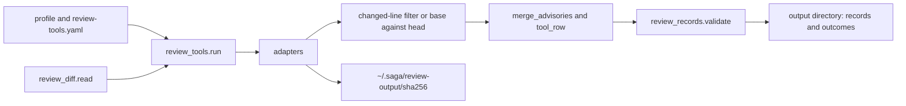

# Build-loop tool framework reporting only what a change introduces (issue #151)

## Summary

Add one runner that executes the pinned review tools for a change and emits C1's finding and measurement records for what that change introduces. It reads the diff through one reader, keeps line findings only on added or modified lines, and keeps a whole-project result only when it is new at the head commit. The every-language tools (Semgrep, gitleaks, osv-scanner, jscpd, lizard), changed-line coverage, and one relocated test run ship here. Language adapters plug into the same interface later.

---

## Problem Frame

Issue #151 is card C4a of the saga review redesign (parent issue #147). It implements Change 3 of the program design and the "How the tools run" rules of Change 2, plus the tool-outcome rules the operator added on 5 October 2026.

C1 has landed on this branch (issue #148). `plugins/saga/scripts/review_formula.py` already holds a row for every lens-table entry, and `plugins/saga/scripts/review_records.py` refuses a finding handed in with a severity. C2's calibration file (`plugins/saga/scripts/review_calibration.py`) is not in the tree. C3 has not written pins into `.saga-profile.json`. This card must run without a run record, so the build loop (C11), the review command (C10a) and the corpus harness can all call it.

Today the build loop runs each mechanical-baseline command as an argument vector (`plugins/saga/scripts/build_loop.py:448-461`) and classifies it with a hardcoded copy of the lifecycle repository's `mechanical_checks` map (`build_loop.py:136-162`, `plugins/saga/references/mechanical-baseline.md:9-11`). It does not read tool findings, filter them to the change, or measure coverage. Every check runs from the repository root (`mechanical-baseline.md:481-485`).

---

---

## Requirements

Requirements are grouped by concern. R-IDs run continuously. AC-n is the nth checkbox under the issue's Acceptance criteria.

**Runner**

- R1. `python3 plugins/saga/scripts/review_tools.py --help` exits 0. `run --repo --base --head --profile --output` writes records and does not read a run record (AC-1).
- R2. Line findings on unchanged lines are dropped. A whole-project result present at base and head is dropped. A result new at head is kept. A type checker is always whole-project, so a type error the change causes in a file the diff did not touch is kept and its computed severity is blocks (AC-2).
- R3. One diff reader produces the change. The changed-line filter and the coverage adapter both consume it and neither parses a diff. `review-tools.md` names that reader as the one C6's sweep uses (AC-3).
- R4. A missing program, a timeout, an unsupported platform, a version other than the pin, the mutation cap, and a known gap each produce a degraded input naming the tool, the lens-table row, and the reason. An off-pin tool still runs and its findings are kept with `degraded: true` (AC-9). A degraded finding cannot block on its own, which C1's formula already enforces.
- R5. Raw tool output is stored under the user's home directory, mode 0600, inside a directory of mode 0700, named by the SHA-256 of its bytes. Records cite that hash and do not embed the bytes (AC-10).
- R6. Every tool is an argument vector. A timeout is per tool. A missing program, a timeout, or an unparseable command is never a pass and never a fail.
- R7. The profile's pin overrides the tool list's default version. A malformed pin block is refused before any tool runs. Until C3 writes pins, an absent block selects the list's defaults.
- R8. A record the validator refuses aborts the run. Nothing is dropped silently.
- R9. Mutation adapters share one 15-minute cap per run. Unfinished work is a degraded input on `testing.surviving-mutant`. This card ships no mutation adapter; the cap is the seam C4b and C4c draw on.

**Formula rules for findings no lens-table row names**

- R10. `test_review_formula.py` shows the item-6 rules. An error-level finding blocks, a warning is fix later, and a style or information finding is a note. A finding from a tool with no severity is fix later unless its rule id is on the curated list, in which case it blocks. A dependency vulnerability with no score blocks unless a builder reason of kind `scanner-false-positive` is recorded. Medium and low vulnerabilities, and medium and low workflow and infrastructure findings, are fix later. The same advisory from two tools becomes one finding that takes the scoring tool's severity (AC-4).

**Coverage, the relocated run, and the every-language tools**

- R11. One coverage adapter reads LCOV (the Linux Test Project coverage format), Cobertura XML, and coverage.py JSON. The same diff against three fixtures yields the same uncovered changed branches (AC-5).
- R12. The relocated test run executes once per `run`. A non-zero exit is a finding on `architecture-maintainability.relocated-run-fails`, whose computed severity is blocks (AC-6).
- R13. Semgrep, gitleaks, osv-scanner, jscpd, and lizard map to the rows and outcomes in the issue's table. Coverage and the relocated run do too. Every emitted finding and measurement passes `review_records.py` validation (AC-8).
- R14. Semgrep is invoked with `--metrics=off` and a config path inside the local rule cache only (AC-11).

**The build loop's check map, documents, fingerprint**

- R15. `build_loop.py` classifies baseline commands from `plugins/saga/references/review-tools.yaml`. No file under `plugins/saga/scripts` or `plugins/saga/skills` reads the lifecycle repository's `mechanical_checks` map (AC-7). The profile's `mechanical_tool_baseline` commands still run and still decide whether the iteration is green. C11, not this card, invokes the runner from the loop.
- R16. `review-tools.md` documents the adapter interface, the diff reader, both filtering rules, the item-6 rules, each every-language adapter's level mapping, and the outcome table. `repository-profile.md` documents the `review_tools` pin block. The yaml holds the every-language rows (AC-12).
- R17. A component tuple names this card's paths. If C2's `review_calibration.py` exists when this card is implemented, that file includes the tuple. If it does not, the tuple is what C2 will include (AC-13).
- R18. `python3 -m pytest plugins/saga/tests -q --import-mode=importlib` passes, and the new tests make no network call (AC-14).
- R19. The changelog and `docs/engineering-journal/DECISIONS.md` record the decision.

---

---

## Key Technical Decisions

Each entry is the decision, then why, including the rejected alternative.

- **KTD1. The yaml replaces the catalogue map, and it does not replace the profile's commands.** `build_loop.check_map` loads `review-tools.yaml` and matches a baseline command by tool token. `CATALOGUE_CHECKS` and `NAMED_SCANNERS` (`build_loop.py:140-162`) are deleted. The iteration record keeps the key `catalogue_check`; its value becomes the yaml tool id, or null when no row matches. Ruff, mypy, and pytest stay repository-specific until C4b adds their rows, and they still run, because green is still the profile's `mechanical_tool_baseline`. Rejected: having this card invoke Semgrep from the loop. The issue leaves invocation to C11, and swapping the green bar for the review tools would make every current repository fail the loop.
- **KTD2. Item 6 enters the formula as row ids. The adapter records a level; the formula picks the row; nothing hands in a severity.** `review_formula.tool_row(lens, level, rule_id, curated)` returns `<lens>.tool-error` (blocks), `<lens>.tool-warning` (fix later), `<lens>.tool-style` (note; information uses this row), `<lens>.tool-curated` (blocks, no builder excuse), or `<lens>.tool-unscoped` (fix later). The four lenses in `review_formula.LENSES` each get those five rows, because the validator requires the row's lens to match the finding. Two further rows, `security.dependency-medium-low` and `security.workflow-infra-medium-low`, are fix later. No-score dependencies cite the existing `security.dependency-high`, which a `scanner-false-positive` reason excuses. `review_formula.merge_advisories` runs on raw hits, each carrying `advisory_ids`, and returns the hits that become findings. Two hits whose id or alias sets intersect become one hit. The kept hit uses the scored tool's row, and the finding's `rule.ref` is that advisory id. The validated finding gains no extra field. Rejected: a new `rule.level` field, or an `advisory_ids` field, on the finding. Either would change C1's schema, and the validator already refuses a handed-in severity.
- **KTD3. One diff reader, and both consumers take its result.** `review_diff.read(repo, base, head)` runs `git diff` as an argument vector and returns changed files, hunks, and the added or modified line numbers in the new file. A pure rename contributes no lines. A binary file contributes no lines. The filter and the coverage adapter accept that value and do not invoke git. Rejected: each adapter calling `git diff` itself. C6's sweep is specified to cut pieces with this same reader.
- **KTD4. Line findings use the changed-line filter. Whole-project findings use base against head, matched by C1's identity.** Identity is `review_records.finding_identity` (`review_records.py:184`), which ignores line numbers, so a shifted line still matches. A type checker is forced to whole-project even if an adapter says otherwise, which is how an error in an untouched file is kept. A type error that already existed at base is dropped, including one that sits on a changed line. Rejected: also line-filtering type checkers. That would drop the untouched-file error the issue requires.
- **KTD5. The relocated run changes directory and home. It does not copy the checkout.** Relative tokens in the test command are resolved against the repository so the suite can still be collected. The process cwd is a fresh empty directory, and `HOME` is a different fresh empty directory. The command runs once per `run`. A fixture that opens a path relative to cwd, or writes under `Path.home()`, passes a normal invocation and fails this one. Rejected: copying the tree to another path. The issue's proof is cwd and home, and a full copy on every unit iteration buys a check the machine-specific-value search (C5b) already owns.
- **KTD6. Semgrep rule packs are pinned by name and content hash, and the bytes stay out of the repository.** The Semgrep Rules License v1.0 grants internal use and does not allow distributing the rules (https://semgrep.dev/legal/rules-license/). The yaml names pack `p/security-audit` and the SHA-256 of the cached pack. The cache lives at `~/.saga/semgrep-rules/`, owner-only. The runner passes `--config` only at that cache and never a registry URL. A missing cache or a hash mismatch is a degraded input with reason `rule-cache-missing`; the runner does not download. The implementer records the hash of a pack fetched once on the implementation machine. Tests build a synthetic cache and do not use that hash. Saga's own rules (C5) are a second yaml row whose path is `plugins/saga/references/semgrep-rules`. While that directory is missing, the row is a known gap, one degraded input per `correctness.pattern.*` row, and the security pack still runs. Rejected: committing the pack so the fingerprint has a path. The license forbids distribution, and C2's card already allows a content hash kept with the pin.
- **KTD7. Semgrep ERROR is the only security level that blocks.** ERROR cites `security.scanner-high`. WARNING and INFO cite `security.scanner-medium-low`. The mapping is data in the yaml, repeated in `review-tools.md`, and held in step by a test. It is the draft the security sitting (C7) reviews. Rejected: treating WARNING as high. The issue asks for a draft of "high or critical" against "medium or low", and the lens table already parks medium and low at fix later.
- **KTD8. osv-scanner is invoked on an explicit lockfile list, and npm's lockfile is left out.** The argument vector is `osv-scanner scan source --format json` plus one `--lockfile` per file the scanner supports, excluding `package-lock.json` and `npm-shrinkwrap.json`. Included names are `pnpm-lock.yaml`, `yarn.lock`, `pubspec.lock`, `mix.lock`, `go.mod`, `composer.lock`, `Pipfile.lock`, `poetry.lock`, `pdm.lock`, `requirements.txt` (passed in the scanner's `requirements.txt:` prefixed form), `renv.lock`, `Gemfile.lock`, `Cargo.lock`, `conan.lock`, `gradle.lockfile`, and `buildscript-gradle.lockfile`. A tree whose only JavaScript lockfile is npm's records a known gap for `security.dependency-high` and does not scan that file. A numeric CVSS (Common Vulnerability Scoring System) score uses the v3 bands: 9.0 and above critical, 7.0 to 8.9 high, 4.0 to 6.9 medium, 0.1 to 3.9 low, 0.0 none. Critical and high cite `security.dependency-high`. Medium, low, and a score of zero cite `security.dependency-medium-low`. A vector with no numeric score uses `database_specific.severity` when it is one of those words. Otherwise the vulnerability has no score and cites `security.dependency-high`. There is no CVSS vector calculator. The same bands, on the workflow and infrastructure words, choose `security.workflow-infra-high` or `security.workflow-infra-medium-low` for a later adapter. Rejected: letting osv-scanner walk the tree, because that walk opens `package-lock.json`, which the issue assigns to npm audit (C4c).
- **KTD9. jscpd and lizard ship numeric thresholds the architecture sitting can move.** jscpd reports a duplicate at 5 lines or 50 tokens and cites `architecture-maintainability.duplicate` (note). lizard reports a function at cyclomatic complexity 15 or above, on a changed line, and cites `architecture-maintainability.complexity-dead-code-naming` (note). Lizard covers complexity only. Dead code and naming stay with the language adapters. Both numbers live in the yaml and in `review-tools.md`. Rejected: leaving the thresholds to each adapter's default, which the issue says must be stated for the sitting.
- **KTD10. Coverage prefers branches and degrades to lines.** A report with branch data produces one finding per uncovered changed branch on `testing.uncovered-branch`, and one measurement, metric `changed-line branch coverage`, threshold 1.0, direction `at-least`. A report with no branch data uses uncovered changed lines, sets `degraded: true` on those findings, and adds a degraded input with reason `no-branch-data`. Degraded findings cannot block. Zero changed lines yields a measurement of 1.0 and no findings. The parsers are `json` and `xml.etree`; no new package. The profile names `review_tools.languages.<language>.coverage_report`. When it does not, the runner reads a report the test command left behind and refuses, exit 2, if two reports disagree on the uncovered set. Rejected: a third-party coverage library. Saga scripts take PyYAML and the standard library.
- **KTD11. Raw output sits beside the directory C3 will use for its machine record.** The parent is `~/.saga/`, created mode 0700 when this card creates it, and left alone when it already exists. Raw bytes go to `~/.saga/review-output/<sha256>` mode 0600. The Semgrep cache is `~/.saga/semgrep-rules/`. Base-run cache is `~/.saga/review-cache/`. `--home` overrides the parent for tests. A gitleaks finding's statement, anchor, and proof do not contain the match. Its anchor is the rule id plus the file path, because the line text is the secret and C1's identity stores the anchor. The validator already refuses `secret`, `matched_text`, `excerpt`, and `proof.output` on `security.secret-in-diff` (`review_records.py:436-441`). Fixtures use the inert token `EXAMPLE_NOT_A_SECRET`. Rejected: putting raw output in the repository or in the output directory the caller passes. Change 9 keeps raw output on the machine, and the caller's output directory holds records only.
- **KTD12. A degraded tool is a successful run that says so.** Exit 0 when the records are written, degraded inputs included. Exit 2 when the pin block is malformed, a record fails validation, coverage reports disagree, or base or head is not a commit. Exit 1 is an unexpected internal error. The runner never exits non-zero merely because a tool is missing. Rejected: the build loop's `could-not-execute` status. That status belongs to baseline commands. This script's contract is records, and C11 decides how a degraded input affects the loop.
- **KTD13. This card publishes the component list because C2 has not landed.** `review_tools.FINGERPRINT_COMPONENTS` is the five repo-relative paths: `plugins/saga/scripts/review_tools.py`, `plugins/saga/scripts/review_diff.py`, `plugins/saga/scripts/coverage_lines.py`, `plugins/saga/scripts/review_adapters_all_languages.py`, and `plugins/saga/references/review-tools.yaml`. The Semgrep cache is covered by the sha256 inside the yaml, which is the offline reach C2's card allows. `review-tools.md` says C2 includes this tuple and does not add a second copy. A test fails if `review_calibration.py` exists and does not include the tuple. Rejected: creating `review_calibration.py` here. That file is C2's.
- **KTD14. A base worktree reuses the caller's installed environment only when the lockfile is the same.** The runner adds a detached git worktree for base and for head, then removes both. When the working tree's HEAD is the requested head and every lockfile the adapter names has the same blob at base and head, the base worktree gains symlinks to the working tree's environment directories (`env_dirs` on the adapter: `.venv`, `node_modules`, and the like). Otherwise the tool still runs. A non-zero exit with no parseable findings is a degraded input, reason `base-deps-missing`, not a type error. Parsed base results are cached under `~/.saga/review-cache/<tool>/<version>/<base sha>/<rules sha256>.json`. Rejected: installing dependencies at base. Installation is C3, and it needs a network the tests are not allowed to use.
- **KTD15. The test command and the coverage report live in a `review_tools` block this card defines and does not write into this repository's profile.** C3 writes the block. When it is absent, the relocated run uses `functional_test_environment.test_command` once, with language `none`. When that is absent too, the relocated run is a known gap on `architecture-maintainability.relocated-run-fails`. A present but malformed block is the refusal in KTD12. Rejected: inventing per-language commands by splitting today's unlabelled `mechanical_tool_baseline` list (`repository-profile.md:36-41`). That list is the green bar, not the relocated run.

---

---

## High-Level Technical Design

The runner is a library plus a command. Callers pass a repository, two commits, a profile path, and an output directory. They do not pass a run record.



An adapter is a frozen object. The every-language adapters are loaded inside `run`, not at import, so `build_loop` can load the yaml without starting a tool.

| Field | Meaning |
|---|---|
| `tool` | Binary name, or empty when the adapter reads a report or runs the profile's test command |
| `languages` | A list of `review_formula.LANGUAGES`, or `["*"]` |
| `rows` | The lens-table row ids this adapter can cite |
| `comparison` | `lines` or `base-head` |
| `type_checker` | When true, forces `base-head` and whole-project |
| `mutation` | When true, draws on the shared 15-minute cap |
| `mode` | `report` or `fix`. A `fix` adapter writes no review record. No formatter ships in this card |
| `timeout_seconds` | Per invocation |
| `platforms` | Empty means every platform. Otherwise `sys.platform` must match |
| `env_dirs` | Dependency directories KTD14 may symlink |
| `lockfiles` | The paths whose blobs KTD14 compares |
| `invoke` | Builds an argument vector. It does not run it |
| `parse` | Turns machine-readable output into raw hits: rule id, level or none, location or whole-project, advisory ids |

A raw hit becomes an input finding. Required shape, matching `review_records.REQUIRED["finding"]`: `kind`, `schema` `review_records.v1`, `id` from `finding_identity`, `subject` `code`, `lens`, `rule` `{row, ref}`, `source` `{kind: tool, name, version}`, `location`, `language`, one-line `statement`, `consequence` null, `trigger` null, `evidence` `tool-result`, `proof` `{raw_output: <64 hex>}`, `introduced` true, `degraded` true or false, `consequence_jev` null, `unconfirmed` false, `merge_outcome` null. No `severity`. A line location has `scope` `lines`, `file`, `lines` `{start, end}`, `function` (null at module level), and `anchor` (the line text, except a secret finding uses KTD11). A whole-project location has `scope` `whole-project`, `file`, no `lines`, `function` null, and an `anchor` that is the advisory id, the duplicate's hash, or the diagnostic text.

Language comes from the file suffix: `.py` python; `.ts`, `.tsx`, `.js`, `.jsx` typescript; `.dart` dart; `.rs` rust; `.swift` swift; `.md` markdown; `.sh` shell; a file under `.github/workflows/` is `github-workflows`. A lockfile uses the ecosystem (pnpm and yarn are typescript, Python lockfiles are python, `Cargo.lock` is rust, `pubspec.lock` is dart) and `none` when the ecosystem is not in `LANGUAGES`. Go is `none`.

The output directory receives four JSON files, written only after every record validates: `findings.json` and `measurements.json` in input form, `degraded.json`, and `outcomes.json` from `review_formula.compute` with an empty `may_block`. Empty `may_block` means the formula reports only, so a severity of blocks is not yet an enforced merge block. That enforcement is C2's answer. Tests that say "blocks" assert `severity`, not `merge.allowed`.

Degraded-input objects are `{lens, language, input, tool, reason}`. `input` is the row id. `reason` is one of `missing`, `timeout`, `unparseable`, `unsupported-platform`, `version-mismatch`, `version-unreadable`, `cap`, `known-gap`, `rule-cache-missing`, `no-branch-data`, `no-report`, `base-deps-missing`.

---

---

## Implementation Units

Seven units. U1 and U2 can land in either order. The rest follow their dependencies.

### U1. Diff reader

One reader turns two commits into the changed lines every later filter uses.

**Goal:** `review_diff.read` reports the added and modified lines `git diff` reports, and a pure rename reports none.

**Requirements:** R3.

**Dependencies:** none.

**Files:** `plugins/saga/scripts/review_diff.py` (create); `plugins/saga/tests/test_review_diff.py` (create).

**Approach:** Run `git diff --raw -z --find-renames <base> <head>` and `git diff -U0 --no-color <base> <head>` with `shell=False` and cwd the repository. Parse the raw lines for added, modified, deleted, renamed, and binary files, and the unified diff for new-file line numbers. A rename with status `R100` and no hunk is a rename with an empty line set. Deletions are recorded so a caller can see them, and they are not added or modified lines. The public value is a frozen structure other modules import. The module does not import the runner or the coverage adapter.

**Patterns to follow:** `plugins/saga/scripts/build_loop.py:448-461` for an argument-vector subprocess, and the temporary git repositories in `plugins/saga/tests/test_build_loop.py`.

**Test scenarios:**

- Happy path: a temp repo with an added file, a modified file, and a deleted file. `read` returns the new-file line numbers `git diff -U0` prints for the add and the modification, and the deletion has an empty added-line set.
- Rename: `git mv` of a file with no content change returns that path with no changed lines. A rename plus an edit returns only the edited lines.
- Binary: adding a binary file returns the path with no lines.
- Error: base or head that is not a commit raises, and the caller in U4 maps that to exit 2.
- No network: the module's tests use the socket guard from `plugins/saga/tests/test_review_formula.py:40-48`.

**Verification:** the temp-repo tests match `git diff` line for line on the fixture commits.

**Functional checks:**

```functional-checks
- name: diff-reader-reports-git-lines
  command: python3 -m pytest plugins/saga/tests/test_review_diff.py -q --import-mode=importlib
  proves: [AC-3]
  runs: local
```

### U2. Formula rows for tool findings no lens table names

The outcome rules in item 6 of the issue become rows and two pure functions.

**Goal:** Given a level or an advisory, the formula returns the row id, and `outcome` then computes blocks, fix later, or note.

**Requirements:** R10.

**Dependencies:** none.

**Files:** `plugins/saga/scripts/review_formula.py` (modify); `plugins/saga/tests/test_review_formula.py` (modify).

**Approach:** Add the twenty per-lens rows and the two security rows from KTD2 to `ROWS`. Add `tool_row` and `merge_advisories`. `merge_advisories` takes raw hits, not validated findings. Each hit has `advisory_ids`, a tool name, and a score or none. Intersecting id or alias sets collapse to one hit. The kept hit's row is the scored tool's row, and its canonical id is the scored advisory, or the lexicographically first id when neither hit has a score. The runner then builds one finding whose `rule.ref` is that id. Extend `EXPECTED_ROWS` (`test_review_formula.py:52`) with one transcribed entry per new row. Do not generate those entries from `ROWS`. `tool_finding` splits the row id on the first dot to guess the lens, which is wrong for `architecture-maintainability`. New tests pass `lens=` explicitly.

The transcribed outcomes are: `tool-error` blocks, `tool-warning` fix later, `tool-style` note, `tool-curated` blocks with no excuse kind, `tool-unscoped` fix later, `security.dependency-medium-low` fix later, `security.workflow-infra-medium-low` fix later.

**Patterns to follow:** the row table and `test_registry_holds_exactly_the_tested_rows` in `plugins/saga/tests/test_review_formula.py:160`.

**Test scenarios:**

- Error, warning, style, and information: `tool_row("correctness", "error", "E1", ())` is `correctness.tool-error` and its severity is blocks; warning is fix later; style and `info` are both the style row and a note. One case per lens checks that the row's lens matches.
- No severity: rule id absent from the curated list is `tool-unscoped` and fix later. The same id present in the list is `tool-curated` and blocks. A builder reason does not excuse the curated row.
- Dependency: no score selects `security.dependency-high` and blocks; a `scanner-false-positive` reason for that finding's id makes it a note. A medium score selects `security.dependency-medium-low` and is fix later. A low score does the same.
- Workflow: a medium word and a low word select `security.workflow-infra-medium-low`.
- Two tools: one unscored osv-scanner hit and one medium pip-audit hit for advisory `GHSA-EXAMPLE` and alias `CVE-2026-0000` merge into one finding whose severity is fix later. Two unscored hits merge into one whose severity is blocks.
- Registry: `set(ROWS)` still equals the transcribed set plus the judged rows.
- No network: the existing socket guard covers the new tests.

**Verification:** the new cases pass, and the registry equality fails if a row is added without a transcribed outcome.

**Functional checks:**

```functional-checks
- name: formula-item-6-rules
  command: python3 -m pytest plugins/saga/tests/test_review_formula.py -q --import-mode=importlib
  proves: [AC-4]
  runs: local
```

### U3. Coverage adapter

One parser for the three report formats, matched against the diff reader's change.

**Goal:** The same added lines are uncovered in an LCOV fixture, a Cobertura fixture, and a coverage.py JSON fixture, and a report without branches degrades to lines.

**Requirements:** R11.

**Dependencies:** U1.

**Files:** `plugins/saga/scripts/coverage_lines.py` (create); `plugins/saga/tests/test_coverage_lines.py` (create); `plugins/saga/tests/fixtures/review_tools/sample.lcov`, `sample-cobertura.xml`, and `sample-coverage.json` (create).

**Approach:** Each parser returns uncovered branch lines, or uncovered lines plus a `no-branch-data` flag. `uncovered_changed(report, change)` intersects that set with `change`'s added or modified lines. The module takes a `Change` from `review_diff` and does not call git. LCOV uses `BRDA` when any exist, else `DA`. Cobertura uses `xml.etree` and treats a line with branch data as a branch. coverage.py JSON uses `missing_branches` when the key is present, else `missing_lines`. A measurement is built by the runner in U4; this unit returns the numbers (covered, total, degraded flag, uncovered line list) so U4 can fill the record.

**Patterns to follow:** fixture files under `plugins/saga/tests/fixtures/review_records/`.

**Test scenarios:**

- Happy path: one `Change` with added lines 2, 4, and 10. Each of the three fixtures marks line 4's branch uncovered and lines 2 and 10 covered. All three return `{4}`.
- Fallback: a coverage.py fixture with `missing_lines` and no `missing_branches` key returns the uncovered changed lines and the degraded flag. An empty `missing_branches` list is branch data, not a fallback.
- Empty change: no added lines returns an empty uncovered set.
- Disagreement is not this unit's job. U4 refuses when two on-disk reports disagree.
- No network: socket guard, as in U1.

**Verification:** the three fixtures agree on the uncovered set, and the branchless fixture sets the degraded flag.

**Functional checks:**

```functional-checks
- name: coverage-three-formats-agree
  command: python3 -m pytest plugins/saga/tests/test_coverage_lines.py -q --import-mode=importlib
  proves: [AC-5]
  runs: local
```

### U4. Runner, filters, degraded inputs, raw output, and the relocated run

The command that later adapters plug into. This unit's tests use stub adapters.

**Goal:** A caller with a repository, two commits, a profile, and an output directory gets validated records for what the change introduces, and a missing tool does not fail the process.

**Requirements:** R1, R2, R3, R4, R5, R6, R7, R8, R9, R12.

**Dependencies:** U1, U2, U3.

**Files:** `plugins/saga/scripts/review_tools.py` (create); `plugins/saga/tests/test_review_tools.py` (create).

**Approach:** Command `run` with the flags in R1, plus optional `--home` and `--builder`. `load_tool_list(path)` is a pure yaml read and does not import adapters. `run` accepts an adapter list so tests inject stubs; the default list is empty until U5 fills it. Filtering and comparison follow KTD4. The relocated run follows KTD5 and KTD15. Raw output follows KTD11. Exit codes follow KTD12. Base worktrees follow KTD14, exercised with a stub type checker that does not need dependencies, plus a separate test that the symlink is created only when the lockfile blobs match. The shared mutation cap is a deadline passed into mutation adapters; a stub that returns `unfinished` produces the degraded input and keeps partial findings with `degraded: true`. Every finding and measurement goes through `review_records.validate` before the output files are written. `outcomes.json` is the formula result and is where tests read `severity`. The optional builder file is a C1 builder record; when it is absent, no reason excuses a finding. `plugins/saga/tests/test_entrypoints.py:75` discovers `--help` on its own once the script exists.

The changed-line filter lives in this module and takes a `Change`. A test reads `coverage_lines.py` and `review_tools.py` and asserts neither invokes `git diff`, while `review_diff.py` does. That is the "one reader" half of R3. The documentation half is U7. Name the test `test_changed_line_filter_and_coverage_share_the_diff_reader`.

**Patterns to follow:** `build_loop.subprocess_runner` and `build_loop.run_check` for timeout and `FileNotFoundError`; `review_records.validate` for the refusal path.

**Test scenarios:**

- Help and invocation: `--help` exits 0. `run` on a temp git repo with a stub adapter, a fixture profile, and an output directory writes the four JSON files and never reads a path named like a run record.
- Line filter: a stub hit on an added line is kept; a hit on an unchanged line is dropped; a pure rename keeps nothing.
- Base and head: a whole-project stub hit present in both checkouts is dropped; one present only at head is kept. A type-checker stub that reports `correctness.type-error` in a file the diff did not touch is kept, and `outcomes.json` gives it severity blocks.
- Degraded: a stub whose binary raises `FileNotFoundError` writes a degraded input `missing` and exit 0. A timeout, a platform list that excludes the current platform, and a yaml row with `gap` do the same with reasons `timeout`, `unsupported-platform`, and `known-gap`. An installed version other than the pin still parses findings, marks them `degraded: true`, and adds reason `version-mismatch`. A mutation stub that reports unfinished adds reason `cap` on `testing.surviving-mutant`.
- Pins: a profile version overrides the yaml default. A pin whose `sha256` is not 64 hex characters exits 2 and runs no tool.
- Raw output: with `--home` pointed at a temp directory, the file is under that home, its mode is 0600, its parent directory's mode is 0700, and the finding's `proof.raw_output` equals the file's SHA-256.
- Relocated run: a fixture script that reads `marker.txt` from cwd or writes `Path.home() / "marker"` exits 0 when invoked with cwd the repo and a prepared home, and the runner's single relocated invocation exits non-zero and cites `architecture-maintainability.relocated-run-fails` with severity blocks. A counter on the runner shows one invocation.
- Validator: a stub that emits a finding with `severity` set causes exit 2 and leaves the output directory without the four files.
- Shell: the stub records the argument vector it received, and the test asserts it is a list. No test passes a string to a shell.
- No network: socket guard.

**Verification:** the temp-repo tests pass, `--help` exits 0, and a malformed pin exits 2.

**Functional checks:**

```functional-checks
- name: runner-help
  command: python3 plugins/saga/scripts/review_tools.py --help
  proves: [AC-1]
  runs: local
- name: runner-on-a-temporary-repository
  command: python3 -m pytest plugins/saga/tests/test_review_tools.py -q --import-mode=importlib
  proves: [AC-1, AC-2, AC-3, AC-6, AC-9, AC-10]
  runs: local
```

### U5. Every-language adapters and the default tool list

The five tools, plus the coverage row and the relocated-run row, become real adapters over recorded output.

**Goal:** Recorded Semgrep, gitleaks, osv-scanner, jscpd, and lizard output becomes the rows in the issue's table, and the Semgrep vector points only at the local cache with metrics off.

**Requirements:** R13, R14.

**Dependencies:** U4.

**Files:** `plugins/saga/scripts/review_adapters_all_languages.py` (create); `plugins/saga/references/review-tools.yaml` (create); `plugins/saga/tests/test_review_adapters_all_languages.py` (create); `plugins/saga/tests/fixtures/review_tools/` for one recorded output per tool (create).

**Approach:** The yaml is `schema: review_tools.v1` and one row per tool id: `semgrep-security`, `semgrep-saga`, `gitleaks`, `osv-scanner`, `jscpd`, `lizard`, `coverage`, `relocated-test`. Each row carries the KTD6–KTD10 fields, a `default_version` the implementer copies from the binary they actually ran (tests do not execute that binary), `version_args`, a `timeout_seconds`, and the level map or thresholds. `semgrep-security` uses pack `p/security-audit` and the recorded sha256. `semgrep-saga` uses `gap_until_present` on `plugins/saga/references/semgrep-rules`.

Parsers read the fixtures, not a live tool. Semgrep JSON `results[].extra.severity` uses KTD7. gitleaks uses `File`, `StartLine`, `EndLine`, and `RuleID`, and drops `Match` and `Secret`. osv-scanner uses KTD8. jscpd reads the `duplicates` array. lizard reads per-function complexity and line numbers. Each adapter's `invoke` is asserted as a list. Semgrep's list contains `--metrics=off`, contains `--config` pointed at the cache directory, and contains no `http` URL. osv-scanner's list, given a tree with `pnpm-lock.yaml`, `yarn.lock`, and `package-lock.json`, contains the first two and not the third. An unscored osv-scanner vulnerability cites `security.dependency-high`, and `outcomes.json` severity is blocks unless the builder file records `scanner-false-positive`. Every produced record passes `review_records.validate`. The gitleaks record's JSON text does not contain `EXAMPLE_NOT_A_SECRET`.

`run`'s default adapter list becomes these adapters. U4's stub tests pass an explicit list and do not start these binaries.

**Patterns to follow:** the inert fixtures already under `plugins/saga/tests/fixtures/review_records/`.

**Test scenarios:**

- Each tool's fixture maps to the row in the issue table: Semgrep ERROR to `security.scanner-high`, WARNING and INFO to `security.scanner-medium-low`, gitleaks to `security.secret-in-diff`, a high osv-scanner score to `security.dependency-high`, a medium score to `security.dependency-medium-low`, jscpd to `architecture-maintainability.duplicate`, lizard above the threshold to `architecture-maintainability.complexity-dead-code-naming`.
- gitleaks text contains no secret token. Semgrep's argv has metrics off and a local config path. osv-scanner's argv skips `package-lock.json`.
- Saga rules path missing: a degraded input per pattern row, reason `known-gap`, and the security adapter is still invoked.
- A temp rules directory with one result whose metadata names `correctness.pattern.swallowed-error` produces that row.
- Validator accepts every record from the fixtures and rejects none.
- No network: socket guard. The suite does not invoke the real binaries.

**Verification:** the fixture mapping tests pass, and `review_records.py validate` accepts the emitted findings.

**Functional checks:**

```functional-checks
- name: adapters-map-rows-and-validate
  command: python3 -m pytest plugins/saga/tests/test_review_adapters_all_languages.py -q --import-mode=importlib
  proves: [AC-8, AC-11]
  runs: local
```

### U6. The build loop reads the tool list

The loop stops carrying its own copy of the lifecycle catalogue.

**Goal:** A baseline command is classified from `review-tools.yaml`, the profile's commands still run, and no saga script reads `mechanical_checks`.

**Requirements:** R15.

**Dependencies:** U5.

**Files:** `plugins/saga/scripts/build_loop.py` (modify); `plugins/saga/tests/test_build_loop.py` (modify); `plugins/saga/references/mechanical-baseline.md` (modify).

**Approach:** Delete `CATALOGUE_CHECKS`, `NAMED_SCANNERS`, and the dry-run section "Named scanners not configured". `check_map` calls `review_tools.load_tool_list` on `plugins/saga/references/review-tools.yaml`. A command whose tokens include a row's `tool` answers that tool id. Other commands stay repository-specific and still run. The uncovered list is yaml rows whose tool no baseline command names. Rewrite the prose sections "The check map" and "The named scanners" in `mechanical-baseline.md` so the source of the map is the yaml, and so the file says the lifecycle `mechanical_checks` map is not read. Keep the marked tables (`BUILD-LOOP BLOCK`, `ITERATION KEYS`, `STATUSES`, `EXIT CODES`, and the combined-branch tables). The key `catalogue_check` stays in the iteration record.

Update `test_the_python_baseline_runs_and_records_each_result_with_its_catalogue_check` so ruff, mypy, and pytest record `catalogue_check` null until C4b adds those rows, and so the four commands still reach the runner. Update `test_the_dry_run_prints_the_checks` and `test_the_dry_run_names_every_uncovered_catalogue_check_and_unconfigured_scanner` to the new sentences. Add `test_the_check_map_comes_from_the_default_tool_list`: a command `semgrep scan` answers `semgrep`. Add `test_saga_scripts_do_not_read_mechanical_checks`: no file under `plugins/saga/scripts` or `plugins/saga/skills` contains the text `mechanical_checks`. Leave the unit-row fixture key in `plugins/saga/tests/test_run_record.py:79` alone. It is a status string, not the catalogue.

Importing `build_loop` must not import the adapters. It imports `load_tool_list` only.

**Patterns to follow:** the existing dry-run tests in `plugins/saga/tests/test_build_loop.py`.

**Test scenarios:**

- Happy path: the four profile commands still run and the iteration can be green. `semgrep scan` maps to the semgrep tool id from the yaml.
- Repository-specific: `make house-check` still records a null check id and still counts as a pass when the command passes.
- Dry run: the uncovered list names the yaml tools the baseline does not mention, and it does not name bandit as a catalogue check.
- Absence: the grep test finds no `mechanical_checks` under scripts or skills.
- No network: these tests use the runner fake already in `test_build_loop.py` and do not call a tool.

**Verification:** `test_build_loop.py` passes, including the marked-table comparisons against `mechanical-baseline.md`.

**Functional checks:**

```functional-checks
- name: build-loop-reads-tool-list
  command: python3 -m pytest plugins/saga/tests/test_build_loop.py -q --import-mode=importlib
  proves: [AC-7]
  runs: local
```

### U7. Documents, fingerprint list, changelog, and the decision

Write down the contract the later cards plug into, and name the paths C2 will fingerprint.

**Goal:** A reader of `review-tools.md` can implement C4b without re-reading this plan, and the component tuple names exactly this card's paths.

**Requirements:** R3, R16, R17, R18, R19.

**Dependencies:** U5, U6.

**Files:** `plugins/saga/references/review-tools.md` (create); `plugins/saga/references/repository-profile.md` (modify, add the `review_tools` block); `plugins/saga/CHANGELOG.md` (modify, Unreleased, Added); `docs/engineering-journal/DECISIONS.md` (modify, newest first). The tuple itself is added to `plugins/saga/scripts/review_tools.py`, which U4 created. The assertion is `plugins/saga/tests/test_review_tools.py` (modify).

**Approach:** `review-tools.md` covers the adapter table from the High-Level Technical Design, `review_diff.read` as the reader C6's sweep uses, the changed-line rule and the base-against-head rule, the item-6 rows, KTD7's Semgrep mapping, KTD8's lockfile list and CVSS bands, KTD9's thresholds, the outcome table from the issue, the `review_tools` profile block, the raw-output path, and `FINGERPRINT_COMPONENTS` with the instruction that C2 includes that tuple. `repository-profile.md` documents the block's keys and says an absent block is valid. The decision entry records KTD1, KTD2, KTD5, KTD6, and KTD13, each with its rejected alternative and a revisit condition: revisit the Semgrep cache when the rules license allows redistribution, and revisit the component tuple when C2's file exists. The changelog names issue 151.

Name the tests `test_docs_cover_the_framework` and `test_fingerprint_names_these_paths`. The fingerprint test asserts the tuple equals the five paths in KTD13. If `plugins/saga/scripts/review_calibration.py` exists, the test also asserts each path occurs in that file. The doc test reads `review-tools.md` and fails unless it contains `review_diff`, `C6`, both filtering rules by name, the item-6 row suffixes, the Semgrep level words, and the outcome table's tool names. It reads the yaml and fails unless the eight tool ids are present. It reads `repository-profile.md` and fails unless `review_tools` is documented.

**Patterns to follow:** the Unreleased entries in `plugins/saga/CHANGELOG.md` and the 2026-10-06 entries in `docs/engineering-journal/DECISIONS.md`.

**Test scenarios:**

- The fingerprint tuple equals the five paths, and a calibration file that omits one of them fails the test. With no calibration file the test passes.
- The doc test fails when any required phrase is removed. That is the in-step check between the yaml and the prose.
- No network: socket guard on the test module.

**Verification:** the doc and fingerprint tests pass, `python3 scripts/check_repo.py` passes, and `git diff --check` passes.

**Functional checks:**

```functional-checks
- name: docs-cover-the-framework
  command: python3 -m pytest plugins/saga/tests/test_review_tools.py::test_docs_cover_the_framework -q --import-mode=importlib
  proves: [AC-3, AC-12]
  runs: local
- name: fingerprint-names-these-paths
  command: python3 -m pytest plugins/saga/tests/test_review_tools.py::test_fingerprint_names_these_paths -q --import-mode=importlib
  proves: [AC-13]
  runs: local
```

---

---

## Scope Boundaries

What this card does not do.

Non-goals, from the issue: invoking the runner from the build loop (C11); Python, shell, workflow, Markdown, and CloudFormation adapters, including mypy, ruff, bandit, and pip-audit (C4b); TypeScript, Dart, Rust, and Swift adapters, including npm audit (C4c); saga's own Semgrep rule bodies (C5); the scripted checks (C5b); the sweep that cuts pieces with the diff reader (C6); writing pins and the machine record (C3); the operator's review of level maps and thresholds (C7); running these tools in CI (X2); deleting the lifecycle catalogue itself (X1b). This card stops reading the catalogue. It does not edit the lifecycle repository.

Later, not a unit of this plan:

- C4b and C4c add rows to the same yaml and adapters that implement the same object. They draw on the mutation cap and on `tool_row`.
- C2 includes `FINGERPRINT_COMPONENTS` when it lands, if this card landed first.
- C3 writes `review_tools` into `.saga-profile.json` and may place its machine record under `~/.saga/`.
- C5 fills `plugins/saga/references/semgrep-rules`, which clears the known gap.
- C11 calls `run` from each unit and from the combined branch, and passes the builder record it captured.
- The security sitting may move WARNING from `security.scanner-medium-low` to `security.scanner-high`. The architecture sitting may move the jscpd and lizard numbers. Both are data edits, not code changes.

---

---

## System-Wide Impact

Every repository's build-loop dry run changes. Commands that used to answer `ruff`, `mypy`, `bandit`, or `pytest-coverage` answer "repository-specific" until C4b adds those tools to the yaml. The commands still run, and an iteration is still green when they pass. The uncovered list names the every-language tools instead of the four catalogue checks. The iteration key `catalogue_check` stays, so existing records still load.

The runner is inert until C11 calls it. Importing `build_loop` does not execute a review tool.

---

---

## Risks & Dependencies

| Risk | Mitigation |
|---|---|
| The check-map change makes a current repository's loop unable to go green | Profile commands still run and still decide green. U6's test runs the four commands through the fake runner and expects a green iteration |
| A type error in an untouched file is dropped by the line filter | Type checkers are forced to base-against-head. U4's stub reports an error in a file the diff does not touch |
| Semgrep pack bytes land in this public repository | KTD6 forbids committing them. The pin is a hash. The license test is the absence of a pack directory in the diff |
| gitleaks output puts a secret in a record | The parser drops `Match` and `Secret`. The anchor is the rule id and the path. The fixture token must be absent from the record JSON |
| Base worktrees without installed dependencies look like new type errors | A base exit with no parseable findings is `base-deps-missing`, not a finding. The symlink happens only when the lockfile blob matches |
| Adding rows breaks `test_registry_holds_exactly_the_tested_rows` | U2 extends `EXPECTED_ROWS` in the same change |
| C2 lands while this card is in review and grows its own path list | The fingerprint test fails unless that file contains the tuple |
| Two coverage reports in one tree disagree | The runner exits 2 instead of picking one |

Depends on C1, which has landed. Does not depend on C2 or C3.

---

---

## Scenario Smoke

The whole saga suite on the combined branch. The new tests refuse sockets, so a network call fails the run.

```scenario-smoke
- name: saga-suite-no-network
  command: python3 -m pytest plugins/saga/tests -q --import-mode=importlib
  proves: [AC-14]
  runs: environment
```

---

---

## Sources / Research

- Design: `docs/brainstorms/2026-10-05-saga-review-redesign/plan.md`, Change 2 ("How the tools run"), Change 3, Change 9 (raw output stays on the machine), the four lens tables, and "A missing tool degrades the review".
- Card: `docs/brainstorms/2026-10-05-saga-review-redesign/cards/C4a-tool-framework.md`.
- C2's expectation that the Semgrep cache is either in the repository or a content hash beside the pin: `docs/brainstorms/2026-10-05-saga-review-redesign/cards/C2-calibration-file.md`, the fingerprint paragraph.
- Records and identity: `plugins/saga/scripts/review_records.py:62-82`, `:184-202`, `:333-335`, `:436-441`.
- Rows today: `plugins/saga/scripts/review_formula.py:140-193`. The registry test: `plugins/saga/tests/test_review_formula.py:52-161`.
- The catalogue copy this card removes: `plugins/saga/scripts/build_loop.py:136-162`, `:400-434`, `:767-804`. Dry-run tests: `plugins/saga/tests/test_build_loop.py:152-180` and `:592-601`.
- Baseline contract: `plugins/saga/references/mechanical-baseline.md:9-11` and `:481-485`. Profile list: `plugins/saga/references/repository-profile.md:36-41`.
- Help discovery: `plugins/saga/tests/test_entrypoints.py:75`.
- Semgrep Rules License v1.0, which allows internal use and not distribution: https://semgrep.dev/legal/rules-license/.
- osv-scanner lockfile list and `--lockfile`: https://google.github.io/osv-scanner/usage/scan-source. Supported names: https://google.github.io/osv-scanner-v1/supported-languages-and-lockfiles/.
- Context library, read so this plan would not contradict them: `docs/security/dependency-policy.md` (check license before adding redistributable material to a public repo; it sets no CVSS bands, so the bands are the CVSS v3 scale the issue asks for), `docs/security/data-and-secrets.md` (do not commit secrets), `docs/testing/quality-gates.md`, and `docs/delivery/ci-cd-standards.md`. CI for these tools is X2, not this card.
