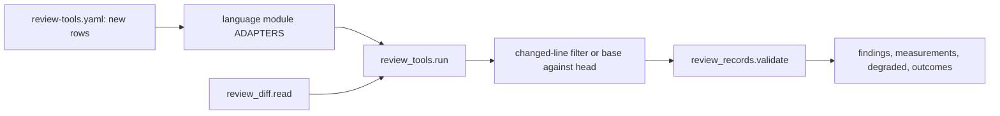

# Review tools for TypeScript, Dart, Rust and Swift (issue #153)

## Summary

Add one review adapter per tool for TypeScript, Dart, Rust and Swift on C4a's runner, each emitting C1 finding records for what a change introduces. Type checkers compare base against head over the whole project, linters take their outcome from their own level, dependency audits compare lockfiles, shuffle adapters run suites in random order, mutation adapters share the 15-minute cap, and the six known gaps run degraded, never as a pass.

---

## Problem Frame

Issue #153 is card C4c of the saga review redesign (parent issue #147). It implements the TypeScript, Dart, Rust and Swift rows of the program design's "Default tools" table and its known gaps, mapped onto the four lens tables, with the outcomes the operator decided on 5 October 2026 for findings those tables never named.

C4a has landed on this branch (issue #151). `plugins/saga/scripts/review_tools.py` already runs pinned tools, filters line findings to the change, compares whole-project results base against head, shares one 900-second mutation cap, and records degraded inputs. `plugins/saga/scripts/review_formula.py` already holds `tool_row`, `dependency_row` and `merge_advisories` for findings no lens-table row names. C4a's osv-scanner adapter already reads `pnpm-lock.yaml`, `yarn.lock` and `pubspec.lock`, and its coverage adapter already reads LCOV, Cobertura and coverage.py JSON with a degraded line fallback. This card plugs language adapters into that interface and adds nothing to the runner's filtering, coverage reading, cap, or record building. C2's calibration file (`plugins/saga/scripts/review_calibration.py`) is not in the tree. C3 has not written pins.

Today saga runs no tool for these four languages. The build loop classifies baseline commands from `plugins/saga/references/review-tools.yaml` (`plugins/saga/scripts/build_loop.py:388-400`), and every check runs from the repository root. The every-language rows are the only rows in the yaml.

The commit under review is untrusted (#191). Adapters scan the head worktree, take settings only from the base commit and the plugin, and never read a tool's settings file from the reviewed tree.

---

## Requirements

Requirements are grouped by concern. R-IDs run continuously. AC-n is the nth checkbox under the issue's Acceptance criteria.

**Adapter interface and wiring**

- R1. Four adapter modules (`review_adapters_typescript.py`, `review_adapters_dart.py`, `review_adapters_rust.py`, `review_adapters_swift.py`) implement C4a's `Adapter` object, are built from `review-tools.yaml` rows, and join the runner's default adapter list. Every `invoke` builds an argument vector and never a shell string. Tests inject the runner and make no network call (AC-1).
- R2. An adapter whose language markers are absent from the scanned tree returns an empty argument vector: a clean no-op with no findings and no degraded input. Gap inputs are raised only when the language is present.

**Type checkers**

- R3. `tsc`, `dart analyze`, `cargo check` and the Swift compiler are type checkers: whole-project, base against head. A type error the change causes in a file the diff did not touch is kept, and its computed severity is blocks. Swift strict-concurrency diagnostics cite `correctness.type-error` whatever level the compiler reports (AC-2).

**Lint levels**

- R4. ESLint, `dart analyze`, clippy and SwiftLint findings take their outcome from their own level through `tool_row`: error blocks, warning is fix later, style and information are notes. Clippy runs without turning warnings into errors, so its warnings are fix later (AC-3).

**Dependency audits**

- R5. npm audit reads npm's lockfiles (`package-lock.json`, `npm-shrinkwrap.json`) only, base against head. C4a's osv-scanner adapter, unchanged, covers pnpm's, Yarn's and Dart's lockfiles. A dependency vulnerability with no score counts as high, a cargo-deny advisory included. npm's `moderate` maps where the rows say medium and its `info` maps below low; cargo-deny takes the rating from the advisory's own score (AC-4).

**Random order and mutation**

- R6. Vitest, Jest and `dart test` run through their own shuffle options, and a failure there cites `testing.flaky-order-or-network` (fix later). The seed is recorded so the failure can be re-run (AC-5).
- R7. StrykerJS, mutate4dart, cargo-mutants and Muter share the review's 900-second cap. Unfinished work is a degraded input with reason `cap` on `testing.surviving-mutant`. All four rely on C4a's changed-line filter (AC-7).

**Gaps, formatters, architecture rows**

- R8. Each of the six known gaps (Swift dependency audit, Flutter branch coverage, Rust branch coverage on a stable toolchain, Muter on Linux, random order in Rust and Swift, no network blocking outside Python) appears as a degraded input naming the tool, the row and the reason, and never as a pass or a fail (AC-6).
- R9. Prettier, `dart format`, rustfmt and swift-format ship as `fix` adapters and leave no review record. nextest is the runner the Rust test tools call and leaves no record of its own.
- R10. knip cites `architecture-maintainability.complexity-dead-code-naming` (note), dependency-cruiser cites `architecture-maintainability.structural-check-fails` (blocks, base against head), and cargo-machete cites the complexity row (note, base against head).

**Documents, fingerprint, suite**

- R11. `review-tools.md` carries the outcome table, the gap list and each adapter's level mapping, as the draft the operator reviews lens by lens in C7's sittings. Each level mapping is data in the yaml and prose in the markdown, held in step by a test (AC-8).
- R12. `FINGERPRINT_COMPONENTS` names the four new adapter modules. If `review_calibration.py` exists when this card is implemented, it includes those paths; if it does not, the tuple is what C2 will include (AC-9).
- R13. Settings come only from the base commit and the plugin. No adapter reads a settings file from the scanned tree. Tests plant hostile head configs and prove they are ignored.
- R14. `python3 -m pytest plugins/saga/tests -q --import-mode=importlib` passes with no network access (AC-10). Fixtures use inert values. A live check per local tool runs on a tiny fixture project when the tool is installed at its pinned version and skips otherwise; npm audit and cargo-deny's advisory download get recorded-output tests only. The changelog names issue 153.

---

## Key Technical Decisions

Each entry is the decision, then why, including the rejected alternative.

- **KTD1. One module per language, built from the yaml, wired into the default list in the last unit.** Each new module mirrors `plugins/saga/scripts/review_adapters_all_languages.py`: a `_ROWS` table, one `invoke` and one `parse` per adapter id, and a `_build` that reads `review-tools.yaml` and skips ids it does not own. Each language unit adds its yaml rows with its module, so the module builds standalone and its tests inject adapters directly. U5 extends `default_adapters` (`review_tools.py:202-206`) to import the four modules, so the runner's default list serves the new rows. Rejected: one module for all four languages. The card names four files, and per-language modules keep each unit's blast radius inside its own tests.
- **KTD2. A language gate, not a language filter in the runner.** The runner runs every adapter (a missing binary is the `missing` degraded input, by C4a's design). Each adapter's `invoke` first looks for its language markers in the scanned root: `package.json` or `tsconfig.json` for TypeScript, `pubspec.yaml` for Dart, `Cargo.toml` for Rust, `Package.swift` for Swift. When they are absent it returns `[]`, which `_capture` (`review_tools.py:604-606`) turns into a clean no-op: no findings, no degraded input. Gap adapters raise only when the markers are present. Rejected: teaching the runner to skip adapters by change language. That edits C4a's run loop for what an empty vector already expresses.
- **KTD3. The four type checkers are `type_checker: true`, which forces whole-project base against head.** Identity is `review_records.finding_identity` (`review_records.py:184`), which ignores line numbers, so a shifted diagnostic still matches. `tsc` is invoked with an explicit file list plus `--strict --noEmit`, which makes it ignore any `tsconfig.json`; target and module come from the base commit's `tsconfig.json` when present, else the pinned default recorded in `review-tools.md`. `cargo check` uses `--message-format=json` and keeps errors only. `dart analyze` keeps all three severities in one adapter (KTD5). The Swift compiler keeps errors, strict-concurrency diagnostics (KTD6) and other warnings in one adapter. A pre-existing error at base is dropped even on a changed line; a new error in an untouched file is kept on `correctness.type-error`. Rejected: line-filtering type checkers. That would drop the untouched-file error the card requires.
- **KTD4. Head settings are neutralized per tool, never read.** CLI flags that override file configs are preferred: `tsc`'s explicit file list ignores `tsconfig.json`; ESLint, dependency-cruiser and SwiftLint get an explicit `--config` resolved from the base commit or the plugin, with auto-discovery disabled at the pinned version (the implementer confirms the flag and records it); clippy gets explicit `-- -W/-D` lint levels, which take precedence over the manifest's `[lints]` table. Where a tool offers no override, the adapter stages the base file: the Dart adapter copies the base commit's `analysis_options.yaml` (or the plugin's recommended default when base has none) over the scanned tree's copy before invoking, in the detached worktree only. Where suppression is the only risk, the config is ignored outright: cargo-deny runs as if `deny.toml` were absent and reports every advisory, because base-against-head comparison drops advisories already present at base anyway. Each language test plants a hostile head config (a `strict: false` tsconfig excluding everything, an eslint config disabling the fired rule, a deny.toml ignoring the advisory) and proves the finding survives. Rejected: extending the runner's strip list and running tools configless. Stripping without a staged replacement would lose the recommended lint sets the card requires.
- **KTD5. Lint levels normalize to C4a's five words, and two rows are set directly.** ESLint severity 2 becomes `error` and 1 becomes `warning`; clippy and SwiftLint pass their `error` and `warning` through; `dart analyze` INFO becomes `information`. The yaml `level_map` on each lint adapter maps those words to `correctness.tool-error`, `correctness.tool-warning` and `correctness.tool-style`, and a test holds the yaml and `review-tools.md` in step, mirroring C4a's Semgrep mapping test. Two diagnostics skip the map and set their row in `parse`: `dart analyze` ERROR cites `correctness.type-error`, and Swift strict-concurrency diagnostics cite `correctness.type-error` (KTD6). Clippy keeps clippy-coded lints and rustc warnings and drops rustc errors, which `cargo check` owns; without that split the same error would arrive twice. Clippy runs with no deny-warnings flag. Rejected: one adapter per severity. The runner already routes by row, and splitting would run each tool twice.
- **KTD6. Swift concurrency is complete checking plus a documented family list, in an isolated build dir.** The adapter builds with `-Xswiftc -strict-concurrency=complete`. A diagnostic in the concurrency family (references to concurrently-executing code, actor isolation, `Sendable` and sending) cites `correctness.type-error` at any reported level; other compiler warnings cite `correctness.tool-warning`. The family list is data in `review-tools.md` for the correctness sitting, seeded from the pinned toolchain's output and refined there, not invented exhaustively here. Base and head build under separate `--build-path` directories keyed by commit sha; they share nothing, because a shared cache cannot tell which commit produced it. Rejected: deciding the family by diffing diagnostics with and without the flag. Two builds per commit doubles the slowest adapter for a distinction a phrase list makes.
- **KTD7. Dependency audits split by lockfile, and ratings come from the advisory.** npm audit runs only when `package-lock.json` or `npm-shrinkwrap.json` is present, base against head, parsing the `vulnerabilities` map (npm 7 and later, fixed by the pin): `critical` and `high` cite `security.dependency-high`, `moderate`, `low` and `info` cite `security.dependency-medium-low`, and an entry with no severity cites the high row. pnpm, Yarn and `pubspec.lock` stay with C4a's osv-scanner adapter, which already scans those names; this card adds no osv code. cargo-deny runs `check advisories` as JSON, base against head, and takes the rating from each advisory's own CVSS score or severity word through `dependency_row` (`review_formula.py:239`), because the tool reports every advisory as an error whatever its score. Advisories that are not vulnerabilities (unmaintained, unsound, yanked) cite `security.dependency-medium-low` as the draft for the security sitting. An advisory both cargo-deny and osv-scanner report collapses through C4a's `merge_advisories`, scored hit wins. Rejected: trusting cargo-deny's level. Every advisory would block, including low-rated ones the lens table parks at fix later.
- **KTD8. Coverage runs through C4a's adapter; no language adds a coverage adapter.** Vitest, Jest, `package:coverage`, cargo-llvm-cov and llvm-cov all emit LCOV, which the profile's `coverage_report` already names and C4a's adapter already matches to the one `Change`. Branch against line is decided by report content (BRDA records present or not), never by probing the toolchain: a Flutter report and a stable-toolchain Rust report carry no branch data, so the existing `no-branch-data` line fallback applies and marks them degraded. The `nextest` subcommand for llvm-cov is profile test-command guidance documented in `review-tools.md`, written by C3, not an adapter. Rejected: per-language coverage adapters. They would re-read the same LCOV the one adapter reads.
- **KTD9. Shuffle adapters run the suite once with an explicit seed and emit whole-project hits.** Vitest gets `--sequence.shuffle` with a generated `--sequence.seed`, Jest gets `--randomize` (jest-circus runner) with its seed flag at the pinned version, and `dart test` gets `--test-randomize-ordering-seed=random` with the reported seed parsed from its output. The seed is recorded in the finding's statement so the failure can be re-run. Any failure cites `testing.flaky-order-or-network` (fix later) as `whole_project` hits under `comparison: lines`: head-only, kept without line filtering and without a base run, because a shuffled failure is a property of the run, not of a line. Rust and Swift have no stable shuffle, so `rust-shuffle` and `swift-shuffle` are gap adapters (KTD11). Rejected: comparing a shuffled run against an unshuffled one. That doubles every suite run to separate always-failing tests, which the normal suite run already catches.
- **KTD10. All four mutation adapters use `comparison: lines` and rely on the changed-line filter.** None of StrykerJS, mutate4dart, cargo-mutants or Muter scopes itself to changed lines reliably at its pinned version, so each reports its mutants and C4a's filter drops survivors outside the change. Each sets `mutation: true` and shares the 900-second deadline (`review_tools.py:45`); a run the cap cuts short returns `unfinished`, which the runner turns into reason `cap` on `testing.surviving-mutant` and keeps partial findings degraded. Surviving mutants cite `testing.surviving-mutant` (blocks unless the builder records `surviving-mutant`). cargo-mutants passes its nextest test-tool flag when `nextest` is on PATH and the default runner otherwise, silently either way: nextest is a runner dependency, not a scanned tool, so its absence is never a degraded input. Rejected: StrykerJS `--mutate` file scoping. Files are not lines, and the filter already does the precise cut; scoping stays a later optimization.
- **KTD11. Gaps with no tool are adapters whose `invoke` raises `ToolGap("known-gap", row)` when the language is present.** `swift-dependency-audit`, `rust-shuffle`, `swift-shuffle` and the four `no-network` adapters (one per language, on `testing.flaky-order-or-network`) each name their language's main binary as `tool` so the version probe behaves, return `[]` when the markers are absent, and raise otherwise. Muter needs no such adapter: it declares `platforms: [darwin]`, so Linux yields the runner's `unsupported-platform` degraded input on `testing.surviving-mutant`, which the gap list documents as the Muter gap. Flutter and stable-Rust branch coverage need none either: they arrive through the coverage fallback in KTD8. Rejected: `gap_until_present` sentinels. That mechanism has no language gate, so a Python-only change would collect Swift gaps.
- **KTD12. Formatters are `fix` rows, and nextest gets no row at all.** Prettier, `dart format`, rustfmt and swift-format each get a yaml row with `mode: fix`, which the run loop skips (`review_tools.py:362-363`), and an `invoke` building the in-place fix vector for C11's build-loop call. Their `parse` returns empty, and tests assert a run with a formatter adapter writes no finding. nextest gets neither a row nor an adapter: it is invoked by cargo-mutants (KTD10) and named in the llvm-cov test-command guidance (KTD8). Rejected: `report` rows for formatters. Formatting is fixed in the loop, so review must never see it.
- **KTD13. Architecture tools split by location kind.** knip reports unused files and exports at file locations: line hits under `comparison: lines` on the complexity row (note). dependency-cruiser and cargo-machete report project properties (import-rule violations, unused dependencies): `whole_project` hits under `comparison: base-head`, so a violation already at base is dropped. dependency-cruiser reads its config from the base commit only (KTD4). Rejected: line-filtering dependency-cruiser. An import-rule violation sits on no single added line, and filtering would drop what the change introduces through untouched files.
- **KTD14. Recorded output is the proof; live runs are a bonus that skips.** Every parser test feeds a fixture through the adapter and C4a's runner with an injected process and the socket guard, and asserts row, outcome and validator acceptance. A live test per local tool runs the real binary on a tiny fixture project only when `--version` equals the pin, and skips otherwise. npm audit and cargo-deny's advisory fetch touch the network, so they get recorded-output tests only. Fixtures carry inert values (`EXAMPLE_*` tokens, `GHSA-EXAMPLE` and `CVE-2026-0000` style identifiers), mirroring C4a's fixture discipline. Rejected: live-only coverage. The suite must pass with no network and no toolchain installed.
- **KTD15. The fingerprint tuple grows by four paths, and the calibration test is conditional.** U5 appends the four adapter modules to `FINGERPRINT_COMPONENTS` (`review_tools.py:46-52`); the yaml is already listed, so new rows ride its hash. The test asserts the tuple equals the nine paths, and, only if `plugins/saga/scripts/review_calibration.py` exists, asserts each new path occurs in that file. `review_tools.py` is outside the card's file list; the commit message names the tuple and the `default_adapters` wiring as the reason, the same way C4a's plan named its schema edit. Rejected: creating `review_calibration.py` here. That file is C2's.

---

## High-Level Technical Design

Each language module feeds C4a's runner the same way the every-language adapters do. The runner supplies the process, the timeout, `shell=False`, the filters, the mutation deadline and the degraded inputs; the adapter supplies the argument vector and the parser.



The adapter table. Comparison `lines` means the changed-line filter on a head-only run; `base-head` means whole-project comparison by finding identity. `type_checker` forces the latter.

| Adapter id | Comparison | Rows | Outcome |
|---|---|---|---|
| `npm-audit` | base-head | `security.dependency-high`, `security.dependency-medium-low` | blocks unless excused; fix later |
| `tsc` | base-head, type checker | `correctness.type-error` | blocks |
| `eslint` | lines | `correctness.tool-error`, `correctness.tool-warning` | blocks; fix later |
| `stryker` | lines, mutation | `testing.surviving-mutant` | blocks unless excused |
| `vitest-shuffle`, `jest-shuffle` | lines, whole-project hits | `testing.flaky-order-or-network` | fix later |
| `knip` | lines | `architecture-maintainability.complexity-dead-code-naming` | note |
| `dependency-cruiser` | base-head | `architecture-maintainability.structural-check-fails` | blocks |
| `prettier` | fix | none | no record |
| `typescript-no-network` | lines, gap | `testing.flaky-order-or-network` | degraded |
| `dart-analyze` | base-head, type checker | `correctness.type-error`, `correctness.tool-warning`, `correctness.tool-style` | blocks; fix later; note |
| `mutate4dart` | lines, mutation | `testing.surviving-mutant` | blocks unless excused |
| `dart-shuffle` | lines, whole-project hits | `testing.flaky-order-or-network` | fix later |
| `dart-format` | fix | none | no record |
| `dart-no-network` | lines, gap | `testing.flaky-order-or-network` | degraded |
| `cargo-deny` | base-head | `security.dependency-high`, `security.dependency-medium-low` | blocks unless excused; fix later |
| `cargo-check` | base-head, type checker | `correctness.type-error` | blocks |
| `clippy` | lines | `correctness.tool-error`, `correctness.tool-warning` | blocks; fix later |
| `cargo-mutants` | lines, mutation | `testing.surviving-mutant` | blocks unless excused |
| `cargo-machete` | base-head | `architecture-maintainability.complexity-dead-code-naming` | note |
| `rustfmt` | fix | none | no record |
| `rust-shuffle`, `rust-no-network` | lines, gap | `testing.flaky-order-or-network` | degraded |
| `swift-compiler` | base-head, type checker | `correctness.type-error`, `correctness.tool-warning` | blocks; fix later |
| `swiftlint` | lines | `correctness.tool-error`, `correctness.tool-warning` | blocks; fix later |
| `muter` | lines, mutation, darwin only | `testing.surviving-mutant` | blocks unless excused |
| `swift-format` | fix | none | no record |
| `swift-dependency-audit` | lines, gap | `security.dependency-high` | degraded |
| `swift-shuffle`, `swift-no-network` | lines, gap | `testing.flaky-order-or-network` | degraded |

Hits carry the same shape C4a's adapters produce: rule id, path, statement, anchor, level or set row, line range or whole-project, advisory ids and score for advisories. Findings validate through `review_records.validate` before the four files are written, and `outcomes.json` (computed with an empty `may_block`) is where tests read severity. Coverage for all four languages flows through C4a's `coverage` row; pnpm, Yarn and `pubspec.lock` advisories flow through C4a's `osv-scanner` row. Neither gains an adapter here.

---

## Implementation Units

Five units. U1 to U4 are independent of each other and build only on C4a, which has landed. U5 wires and documents them.

### U1. TypeScript adapters

Nine adapters plus one gap adapter turn TypeScript tool output into lens rows.

**Goal:** Recorded npm audit, tsc, ESLint, StrykerJS, Vitest, Jest, knip and dependency-cruiser output becomes the rows in the card's table, and Prettier leaves no record.

**Requirements:** R1, R2, R3, R4, R6, R7, R8, R9, R10, R13.

**Dependencies:** none.

**Files:** `plugins/saga/scripts/review_adapters_typescript.py` (create); `plugins/saga/references/review-tools.yaml` (modify, add the ten TypeScript rows); `plugins/saga/tests/test_review_adapters_typescript.py` (create); `plugins/saga/tests/fixtures/review_tools/` (add one recorded output per tool, inert values).

**Approach:** Build the module on KTD1 with adapter ids `npm-audit`, `tsc`, `eslint`, `stryker`, `vitest-shuffle`, `jest-shuffle`, `knip`, `dependency-cruiser`, `prettier` and `typescript-no-network`, comparisons and rows per the design table. npm audit's `invoke` returns `[]` when neither npm lockfile is present. tsc follows KTD3. ESLint parses `--format json` severity 2 and 1. StrykerJS parses its mutation report JSON for survived mutants. Shuffle adapters follow KTD9: Vitest's config marker selects `vitest-shuffle`, Jest's selects `jest-shuffle`, and each returns `[]` when its marker is absent. knip parses its JSON reporter. dependency-cruiser passes an explicit `--config` from the base commit (KTD4). Prettier is `mode: fix`. The gap adapter follows KTD11. Each yaml row carries `default_version` from the implementation machine, or `not-recorded` when the binary is absent, plus its `level_map`, `rules` preset, timeout and markers. Tests inject the runner with the temp-repo harness from `test_review_adapters_all_languages.py`.

**Patterns to follow:** `plugins/saga/scripts/review_adapters_all_languages.py` for module shape; `plugins/saga/tests/test_review_adapters_all_languages.py` for the temp-repo, injected-runner and socket-guard harness.

**Test scenarios:**

- Happy path: each fixture maps to its row with the design table's outcome, every record passes `review_records.validate`, and `outcomes.json` severity matches (npm high blocks, ESLint error blocks, knip is a note, dependency-cruiser blocks, shuffled failure is fix later, surviving mutant blocks).
- Line filter: an ESLint warning and a knip hit on unchanged lines are dropped; the same hits on added lines are kept.
- Base against head: an npm advisory and a dependency-cruiser violation present at base and head are dropped; a new one at head is kept. A pnpm-only tree makes npm audit return no findings (osv owns it).
- Untouched file: a tsc error in a file the diff did not touch is kept and blocks. A tsc error already at base is dropped.
- Levels: ESLint severity 2 blocks and severity 1 is fix later. npm `critical` and `high` block unless a `scanner-false-positive` reason is recorded; `moderate`, `low` and `info` are fix later; an entry with no severity blocks.
- Shuffle: a failing shuffled Vitest run and a failing shuffled Jest run each cite `testing.flaky-order-or-network`, and the statement carries the seed.
- Cap: a StrykerJS run returning `unfinished` produces reason `cap` on `testing.surviving-mutant` and keeps partial findings degraded.
- No record: a run with the Prettier adapter writes no finding for it.
- Gap: a TypeScript tree yields `known-gap` on `testing.flaky-order-or-network` from `typescript-no-network`; a tree without TypeScript markers yields nothing from any TypeScript adapter.
- Hostile config: a head `tsconfig.json` with `strict: false` excluding everything, and a head eslint config disabling the fired rule, do not suppress the findings.
- Error: unparseable tool output on a head run is `unparseable`, never a finding.
- Live: each local tool runs on a tiny fixture project when installed at its pin and skips otherwise; npm audit gets recorded-output tests only.
- No network: the socket guard fails any test that dials out.

**Verification:** The TypeScript suite passes, every emitted record validates, and the hostile-config tests prove head settings are ignored.

**Functional checks:**

```functional-checks
- name: typescript-adapters
  command: python3 -m pytest plugins/saga/tests/test_review_adapters_typescript.py -q --import-mode=importlib
  proves: [AC-1, AC-2, AC-3, AC-4, AC-5, AC-6, AC-7]
  runs: local
```

### U2. Dart adapters

Four adapters plus one gap adapter turn Dart tool output into lens rows.

**Goal:** Recorded `dart analyze`, mutate4dart and `dart test` output becomes the rows in the card's table, and `dart format` leaves no record.

**Requirements:** R1, R2, R3, R6, R7, R8, R9, R13.

**Dependencies:** none.

**Files:** `plugins/saga/scripts/review_adapters_dart.py` (create); `plugins/saga/references/review-tools.yaml` (modify, add the five Dart rows); `plugins/saga/tests/test_review_adapters_dart.py` (create); `plugins/saga/tests/fixtures/review_tools/` (add Dart fixtures, inert values).

**Approach:** Adapter ids `dart-analyze`, `mutate4dart`, `dart-shuffle`, `dart-format` and `dart-no-network`, comparisons and rows per the design table. `dart-analyze` is `type_checker: true`: ERROR sets `correctness.type-error` directly, WARNING maps to `correctness.tool-warning`, INFO (most lints) maps to `correctness.tool-style`, all compared base against head. The adapter stages the base commit's `analysis_options.yaml` over the scanned tree's copy before invoking (KTD4). mutate4dart follows KTD10. `dart-shuffle` follows KTD9 and parses the reported seed. `dart-format` is `mode: fix`. The gap adapter follows KTD11. `pubspec.lock` advisories stay with C4a's osv-scanner adapter; a test asserts a Dart tree's osv findings still flow and this card adds no osv code. Coverage flows through C4a's adapter; a Flutter LCOV fixture without branch data proves the degraded line fallback.

**Patterns to follow:** `plugins/saga/scripts/review_adapters_all_languages.py` for module shape; `plugins/saga/tests/test_review_adapters_all_languages.py` for the harness.

**Test scenarios:**

- Happy path: each fixture maps to its row with the design table's outcome, and every record passes `review_records.validate`.
- Untouched file: a `dart analyze` error in a file the diff did not touch is kept and blocks; a pre-existing error is dropped.
- Levels: ERROR blocks, WARNING is fix later, INFO (a lint) is a note.
- osv untouched: a `pubspec.lock` advisory fixture through C4a's osv adapter still cites the dependency rows; no Dart adapter claims it.
- Shuffle: a failing shuffled `dart test` run cites `testing.flaky-order-or-network` and carries the seed.
- Cap: a mutate4dart run returning `unfinished` produces reason `cap` and keeps partial findings degraded.
- Coverage fallback: a Flutter LCOV fixture without branch data yields degraded line findings with reason `no-branch-data` on `testing.uncovered-branch`.
- No record: a run with the `dart-format` adapter writes no finding for it.
- Gap: a Dart tree yields `known-gap` from `dart-no-network`; a tree without Dart markers yields nothing.
- Hostile config: a head `analysis_options.yaml` disabling the fired lint does not suppress the finding.
- Error: unparseable output on a head run is `unparseable`.
- Live: each local tool runs on a tiny fixture project when installed at its pin and skips otherwise.
- No network: the socket guard fails any test that dials out.

**Verification:** The Dart suite passes, the Flutter fixture degrades through C4a's fallback, and the hostile-config test proves head settings are ignored.

**Functional checks:**

```functional-checks
- name: dart-adapters
  command: python3 -m pytest plugins/saga/tests/test_review_adapters_dart.py -q --import-mode=importlib
  proves: [AC-1, AC-2, AC-3, AC-5, AC-6, AC-7]
  runs: local
```

### U3. Rust adapters

Six adapters plus two gap adapters turn Rust tool output into lens rows.

**Goal:** Recorded cargo-deny, cargo check, clippy, cargo-mutants and cargo-machete output becomes the rows in the card's table, and rustfmt and nextest leave no record.

**Requirements:** R1, R2, R3, R4, R7, R8, R9, R10, R13.

**Dependencies:** none.

**Files:** `plugins/saga/scripts/review_adapters_rust.py` (create); `plugins/saga/references/review-tools.yaml` (modify, add the eight Rust rows); `plugins/saga/tests/test_review_adapters_rust.py` (create); `plugins/saga/tests/fixtures/review_tools/` (add Rust fixtures, inert values).

**Approach:** Adapter ids `cargo-deny`, `cargo-check`, `clippy`, `cargo-mutants`, `cargo-machete`, `rustfmt`, `rust-shuffle` and `rust-no-network`, comparisons and rows per the design table. cargo-deny follows KTD7 and runs as if `deny.toml` were absent. `cargo-check` keeps errors only. clippy follows KTD5 with explicit lint levels and no deny-warnings flag. cargo-mutants follows KTD10 with silent nextest detection. cargo-machete emits `whole_project` hits, base against head. `rustfmt` is `mode: fix`. The two gap adapters follow KTD11. Coverage flows through C4a's adapter; a stable-toolchain LCOV fixture without branch data proves the degraded line fallback. There is no nextest adapter and no nextest row (KTD12).

**Patterns to follow:** `plugins/saga/scripts/review_adapters_all_languages.py` for module shape; `plugins/saga/tests/test_review_adapters_all_languages.py` for the harness.

**Test scenarios:**

- Happy path: each fixture maps to its row with the design table's outcome, and every record passes `review_records.validate`.
- Untouched file: a compiler error in a file the diff did not touch is kept and blocks; a pre-existing error is dropped.
- Levels: clippy `error` blocks and clippy `warning` is fix later. A rustc error appears once, from `cargo-check`, not from clippy.
- Dependencies: a scored high cargo-deny advisory blocks unless a `scanner-false-positive` reason is recorded; a medium advisory is fix later; an advisory with no score blocks; unmaintained, unsound and yanked advisories are fix later. An advisory present at base is dropped. The same advisory from cargo-deny and osv-scanner fixtures merges into one finding with the scored severity.
- Cap: a cargo-mutants run returning `unfinished` produces reason `cap` and keeps partial findings degraded. A run with nextest on PATH passes the nextest test-tool flag; without it the default runner is used and no degraded input names nextest.
- Coverage fallback: a stable-toolchain LCOV fixture without branch data yields degraded line findings with reason `no-branch-data`.
- Architecture: a new cargo-machete unused dependency is a note; one already at base is dropped.
- No record: runs with the `rustfmt` adapter write no finding for it, and no adapter id mentions nextest.
- Gaps: a Rust tree yields `known-gap` from `rust-shuffle` and `rust-no-network`; a tree without Rust markers yields nothing.
- Hostile config: a head `deny.toml` ignoring the advisory, and a head manifest `[lints]` table allowing the fired clippy lint, do not suppress the findings.
- Error: unparseable output on a head run is `unparseable`.
- Live: each local tool runs on a tiny fixture project when installed at its pin and skips otherwise; cargo-deny's advisory fetch gets recorded-output tests only.
- No network: the socket guard fails any test that dials out.

**Verification:** The Rust suite passes, the advisory merge keeps one finding with the scored severity, and the hostile-config tests prove head settings are ignored.

**Functional checks:**

```functional-checks
- name: rust-adapters
  command: python3 -m pytest plugins/saga/tests/test_review_adapters_rust.py -q --import-mode=importlib
  proves: [AC-1, AC-2, AC-3, AC-4, AC-6, AC-7]
  runs: local
```

### U4. Swift adapters

Four adapters plus three gap adapters turn Swift tool output into lens rows.

**Goal:** Recorded Swift compiler, SwiftLint and Muter output becomes the rows in the card's table, swift-format leaves no record, and the Swift gaps degrade.

**Requirements:** R1, R2, R3, R7, R8, R9, R13.

**Dependencies:** none.

**Files:** `plugins/saga/scripts/review_adapters_swift.py` (create); `plugins/saga/references/review-tools.yaml` (modify, add the seven Swift rows); `plugins/saga/tests/test_review_adapters_swift.py` (create); `plugins/saga/tests/fixtures/review_tools/` (add Swift fixtures, inert values).

**Approach:** Adapter ids `swift-compiler`, `swiftlint`, `muter`, `swift-format`, `swift-dependency-audit`, `swift-shuffle` and `swift-no-network`, comparisons and rows per the design table. `swift-compiler` is `type_checker: true` and follows KTD6: errors and concurrency-family diagnostics set `correctness.type-error`, other warnings map to `correctness.tool-warning`, all compared base against head, with per-commit `--build-path` directories. SwiftLint parses `--reporter json` error and warning with an explicit base `--config` (KTD4). Muter follows KTD10 with `platforms: [darwin]`. `swift-format` is `mode: fix`. The three gap adapters follow KTD11. Coverage flows through C4a's adapter from llvm-cov LCOV.

**Patterns to follow:** `plugins/saga/scripts/review_adapters_all_languages.py` for module shape; `plugins/saga/tests/test_review_adapters_all_languages.py` for the harness.

**Test scenarios:**

- Happy path: each fixture maps to its row with the design table's outcome, and every record passes `review_records.validate`.
- Untouched file: a compiler error in a file the diff did not touch is kept and blocks; a pre-existing error is dropped.
- Concurrency: a strict-concurrency diagnostic the compiler reports as a warning cites `correctness.type-error` and blocks; an ordinary compiler warning is fix later.
- Levels: SwiftLint `error` blocks and `warning` is fix later.
- Cap: a Muter run returning `unfinished` produces reason `cap` and keeps partial findings degraded. Muter on a reported Linux platform yields `unsupported-platform` on `testing.surviving-mutant`, never a pass or a fail.
- Gaps: a Swift tree yields `known-gap` from `swift-dependency-audit` on `security.dependency-high` and from `swift-shuffle` and `swift-no-network` on `testing.flaky-order-or-network`; a tree without Swift markers yields nothing.
- No record: a run with the `swift-format` adapter writes no finding for it.
- Hostile config: a head SwiftLint config disabling the fired rule does not suppress the finding.
- Error: unparseable output on a head run is `unparseable`.
- Live: each local tool runs on a tiny fixture project when installed at its pin and skips otherwise.
- No network: the socket guard fails any test that dials out.

**Verification:** The Swift suite passes, the concurrency warning blocks, and the Linux-platform test proves Muter degrades off macOS.

**Functional checks:**

```functional-checks
- name: swift-adapters
  command: python3 -m pytest plugins/saga/tests/test_review_adapters_swift.py -q --import-mode=importlib
  proves: [AC-1, AC-2, AC-3, AC-6, AC-7]
  runs: local
```

### U5. Default-list wiring, documents, fingerprint and changelog

The four language units become one runnable tool list with the documents C7 sits over.

**Goal:** A reader of `review-tools.md` can review every level mapping without re-reading this plan, the default list serves the new adapters, and the fingerprint names the new paths.

**Requirements:** R11, R12, R14.

**Dependencies:** U1, U2, U3, U4.

**Files:** `plugins/saga/scripts/review_tools.py` (modify, `default_adapters` wiring and `FINGERPRINT_COMPONENTS` only); `plugins/saga/references/review-tools.md` (modify); `plugins/saga/tests/test_review_tools.py` (modify, add the docs and fingerprint tests); `plugins/saga/CHANGELOG.md` (modify, Unreleased, Added).

**Approach:** Extend `default_adapters` to import the four language modules alongside the every-language adapters. Append the four adapter paths to `FINGERPRINT_COMPONENTS` (KTD15). Extend `review-tools.md` with one section per language holding its outcome rows, its level mappings, its yaml row ids, the six gaps with tool, row and reason, the Swift concurrency family list, the llvm-cov nextest test-command guidance for C3, and the updated fingerprint list. Name the tests `test_docs_carry_c4c_outcome_table_and_gaps` and `test_fingerprint_names_c4c_paths`. The docs test reads `review-tools.md` for every new adapter id, the six gap reasons, and the level-map values, then parses the same level maps and the npm and cargo-deny rating maps out of the yaml and fails when the values differ; keyword presence is not that comparison. It also fails unless every new yaml row id is served by exactly one adapter in the default list. The fingerprint test asserts the tuple equals the nine paths and conditionally asserts the calibration file. The changelog entry names issue 153. The commit message names the two `review_tools.py` edits and the `test_review_tools.py` addition as outside the card's file list, with this reason.

**Patterns to follow:** the Unreleased entries in `plugins/saga/CHANGELOG.md`; the C4a docs and fingerprint tests in `plugins/saga/tests/test_review_tools.py`.

**Test scenarios:**

- Wiring: every new yaml row id is served by exactly one default adapter, and each adapter's comparison matches the design table.
- Docs: removing any adapter id, gap reason or level-map value from `review-tools.md` fails the docs test; changing a level map in the yaml without changing the prose fails it too.
- Fingerprint: the tuple equals the nine paths. With a fixture `review_calibration.py` omitting a new path, the test fails; without the file, it passes.
- Combined: the four language suites pass in one invocation.
- No network: the socket guard covers the new tests.

**Verification:** The docs and fingerprint tests pass, the combined four-file run is green, and `python3 scripts/check_repo.py` and `git diff --check` pass.

**Functional checks:**

```functional-checks
- name: adapters-combined-four-languages
  command: python3 -m pytest plugins/saga/tests/test_review_adapters_typescript.py plugins/saga/tests/test_review_adapters_dart.py plugins/saga/tests/test_review_adapters_rust.py plugins/saga/tests/test_review_adapters_swift.py -q --import-mode=importlib
  proves: [AC-1]
  runs: local
- name: docs-carry-c4c-tables
  command: python3 -m pytest plugins/saga/tests/test_review_tools.py::test_docs_carry_c4c_outcome_table_and_gaps -q --import-mode=importlib
  proves: [AC-8]
  runs: local
- name: fingerprint-names-c4c-paths
  command: python3 -m pytest plugins/saga/tests/test_review_tools.py::test_fingerprint_names_c4c_paths -q --import-mode=importlib
  proves: [AC-9]
  runs: local
```

---

## Scope Boundaries

What this card does not do.

Non-goals, from the issue: the runner, both filtering rules, the coverage reader, the mutation cap, record building, the rules for findings no lens-table row names and the osv-scanner adapter (C4a); Python, CDK, shell, workflow and Markdown adapters (C4b); saga's own Semgrep rules (C5); installing tools and writing pins (C3); calling the tools from the build loop (C11); the LLM's degraded answers (C8) and the review command (C10a); which lens may block in which language (C2); reviewing the level mappings, which the operator does in C7's sittings; building a network-blocking tool, a Swift dependency audit or a stable shuffle for Rust or Swift.

Later, not a unit of this plan:

- C3 installs these tools, pins their versions and rule sets in the profile, and writes the per-language test commands (including the llvm-cov nextest guidance U5 documents).
- C11 calls the runner from each unit's build loop and the combined-branch pass, runs the `fix` adapters, and passes the builder record that excuses covered gaps and mutants.
- C7's sittings may move any level mapping, rating map, threshold or the Swift concurrency family list. Those are data edits, not code changes.
- C2 includes the extended fingerprint tuple when it lands, if this card landed first.
- StrykerJS `--mutate` file scoping as a mutation-speed optimization, once the changed-line filter proves the semantics.
- The Swift concurrency family list gains precision as the pinned toolchain's output is sampled.

---

## System-Wide Impact

Every repository's build-loop dry run changes. `check_map` (`build_loop.py:388`) lists yaml rows with a binary that no baseline command names, so the thirty new rows put their binaries (`tsc`, `eslint`, `cargo`, `dart`, `swift` and the rest) on that uncovered list until each repository's baseline names them. The commands still run, and an iteration is still green when the profile's `mechanical_tool_baseline` passes; the map never decides green.

The runner stays inert until C11 calls it. Importing `build_loop` still loads only `load_tool_list`, never the adapters. The fingerprint tuple grows, but no corpus run exists yet, so no check compares it.

---

## Risks & Dependencies

| Risk | Mitigation |
|---|---|
| A head config suppresses a finding (tsconfig, eslint, SwiftLint, deny.toml, manifest lints, analysis options) | KTD4 neutralizes each one by flag, staged base file or outright ignore; every language unit plants a hostile head config and proves the finding survives |
| tsc's explicit file list drops the project's target and module, causing spurious errors | Target and module come from the base tsconfig when present, else the pinned default in `review-tools.md`; the fixture proves a clean file stays clean |
| The Swift concurrency phrase list misses a diagnostic family or catches an ordinary warning | The list is data for the correctness sitting, seeded from the pinned toolchain; misses degrade to fix later, never to a pass |
| The same Rust error arrives from both `cargo-check` and clippy | Clippy drops rustc errors (KTD5); U3 asserts the error appears once |
| Muter's 2023 release no longer runs on the implementation machine | Parsers prove against recorded output; the live test skips without the binary; Linux degrades by platform |
| cargo-mutants nextest detection picks the wrong runner | Detection is `shutil.which("nextest")` only; U3 tests both branches and asserts no degraded input names nextest either way |
| Fixture output drifts from the pinned tool's real output | Each live test that can run does run; recorded fixtures are re-cut from the pinned version when a live run disagrees |
| A new yaml row id collides with a C4b row id while both cards are in flight | Row ids carry the tool name (`eslint`, `cargo-deny`); C4b owns Python, CDK, shell, workflow and Markdown tools, so the sets are disjoint |
| C2 lands while this card is in review and grows its own path list | The fingerprint test fails unless the calibration file contains the tuple |

Depends on C4a, which has landed. Does not depend on C2 or C3.

---

## Scenario Smoke

The whole saga suite on the combined branch. The new tests refuse sockets, so a network call fails the run.

```scenario-smoke
- name: saga-suite-no-network
  command: python3 -m pytest plugins/saga/tests -q --import-mode=importlib
  proves: [AC-10]
  runs: environment
```

---

## Sources / Research

- Design: `docs/brainstorms/2026-10-05-saga-review-redesign/plan.md`, Change 2 ("Default tools", "How the tools run"), the four lens tables, "Tool findings the lens tables do not name", and "The change under review is untrusted".
- Card: `docs/brainstorms/2026-10-05-saga-review-redesign/cards/C4c-tools-typescript-dart-rust-swift.md`, including its Notes, which fix the shuffle flags, the cargo-llvm-cov nightly branch option, the cargo-deny error level, the npm `moderate` and `info` ratings, and the ESLint severity numbers.
- C4a's interface: `plugins/saga/scripts/review_tools.py:45-52` (cap and fingerprint tuple), `:97-103` (`ToolGap`), `:159-188` (`Adapter`), `:202-206` (`default_adapters`), `:362-366` (fix and empty-tool skip), `:400-426` (platform, gap path, version, cap), `:604-606` (empty vector is a clean no-op).
- C4a's module pattern: `plugins/saga/scripts/review_adapters_all_languages.py`, and its osv lockfile list, which already covers `pnpm-lock.yaml`, `yarn.lock` and `pubspec.lock`.
- Formula: `plugins/saga/scripts/review_formula.py:140-206` (rows), `:221-237` (`tool_row`), `:239-245` (`dependency_row`), `:258-303` (`merge_advisories`).
- Identity: `plugins/saga/scripts/review_records.py:184` (`finding_identity`).
- Check map: `plugins/saga/scripts/build_loop.py:388-400`.
- C2's expectation that a card adding review components adds their paths in the same change: `docs/brainstorms/2026-10-05-saga-review-redesign/cards/C2-calibration-file.md`.
- Baseline contract: `plugins/saga/references/mechanical-baseline.md:9-15` and `:106-112`.
- Context library, read so this plan would not contradict them: `docs/delivery/ci-cd-standards.md` ("Flutter Repos": `dart format`, `flutter analyze`, `flutter test`), `docs/testing/quality-gates.md`, and `docs/security/dependency-policy.md`. Running these tools in CI is X2, not this card.
- Each tool's own documentation for invocation flags and machine-readable output, confirmed against the pinned version at implementation and captured in fixtures: tsc, ESLint, npm, StrykerJS, Vitest, Jest, knip, dependency-cruiser, Prettier, the Dart SDK, mutate4dart, cargo-deny, clippy, cargo-mutants, cargo-machete, rustfmt, nextest, the Swift toolchain, SwiftLint, Muter and swift-format.
