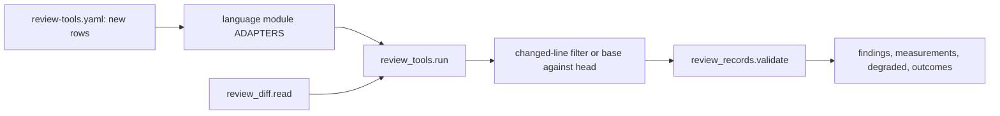

# Review tools for TypeScript, Dart, Rust and Swift (issue #153)

## Summary

Add one review adapter per tool for TypeScript, Dart, Rust and Swift on C4a's runner, each emitting C1 finding records for what a change introduces. Type checkers compare base against head over the whole project, linters take their outcome from their own level, dependency audits compare lockfiles, shuffle adapters run suites in random order, mutation adapters share the 15-minute cap, and the six known gaps run degraded, never as a pass.

---

## Problem Frame

Issue #153 is card C4c of the saga review redesign (parent issue #147). It implements the TypeScript, Dart, Rust and Swift rows of the program design's "Default tools" table and its known gaps, mapped onto the four lens tables, with the outcomes the operator decided on 5 October 2026 for findings those tables never named.

C4a has landed on this branch (issue #151). `plugins/saga/scripts/review_tools.py` already runs pinned tools, filters line findings to the change, compares whole-project results base against head, shares one 900-second mutation cap, and records degraded inputs. `plugins/saga/scripts/review_formula.py` already holds `tool_row`, `dependency_row` and `merge_advisories` for findings no lens-table row names. C4a's osv-scanner adapter already reads `pnpm-lock.yaml`, `yarn.lock` and `pubspec.lock`, and its coverage adapter already reads LCOV, Cobertura and coverage.py JSON with a degraded line fallback. This card plugs language adapters into that interface, extends the runner where the plan review proved the interface cannot express the need (each extension gated so no C4a adapter changes behavior), and adds nothing to the filtering rules, coverage reading, cap, or record building. C2's calibration file (`plugins/saga/scripts/review_calibration.py`) is not in the tree. C3 has not written pins.

Today saga runs no tool for these four languages. The build loop classifies baseline commands from `plugins/saga/references/review-tools.yaml` (`plugins/saga/scripts/build_loop.py:388-400`), and every check runs from the repository root. The every-language rows are the only rows in the yaml.

The commit under review is untrusted (#191). Adapters scan the head worktree, take settings only from the base commit and the plugin, and never read a tool's settings file from the reviewed tree. Tool invocations and machine-readable output shapes in this plan were verified against the real tools at the pinned versions during planning, and each fixture is cut from real output with inert values.

---

## Requirements

Requirements are grouped by concern. R-IDs run continuously. AC-n is the nth checkbox under the issue's Acceptance criteria.

**Adapter interface and wiring**

- R1. Four adapter modules (`review_adapters_typescript.py`, `review_adapters_dart.py`, `review_adapters_rust.py`, `review_adapters_swift.py`) implement C4a's `Adapter` object, are built from `review-tools.yaml` rows, and join the runner's default adapter list in their own unit. Every `invoke` builds an argument vector and never a shell string. Tests inject the runner and make no network call (AC-1).
- R2. An adapter whose language markers are absent from the scanned tree returns an empty argument vector: a clean no-op with no findings and no degraded input. Gap inputs are raised only when the language is present. When a language's markers exist at base and are gone at head, each of its adapters records `language-markers-removed` degraded instead of passing silently.

**Type checkers**

- R3. `tsc`, `dart analyze`, `cargo check` and the Swift compiler are type checkers: whole-project, base against head, matched by finding identity. A type error the change causes in a file the diff did not touch is kept, and its computed severity is blocks. Swift strict-concurrency diagnostics cite `correctness.type-error` whatever level the compiler reports (AC-2). Anchors carry file, rule and message text only, never line numbers, so a moved diagnostic still matches.

**Lint levels**

- R4. ESLint, `dart analyze`, clippy and SwiftLint findings take their outcome from their own level through `tool_row`: error blocks, warning is fix later, style and information are notes. Clippy runs without turning warnings into errors, so its warnings are fix later (AC-3).

**Dependency audits**

- R5. npm audit reads npm's lockfiles (`package-lock.json`, `npm-shrinkwrap.json`) only, base against head. C4a's osv-scanner adapter, unchanged except for the npm-only gap condition, covers pnpm's, Yarn's and Dart's lockfiles. A dependency vulnerability with no score counts as high, a cargo-deny advisory included. npm's `moderate` maps where the rows say medium and its `info` maps below low; cargo-deny takes the rating from the advisory's own CVSS vector through a base-score calculator (AC-4).

**Random order and mutation**

- R6. Vitest, Jest and `dart test` run through their own shuffle options with the flags asserted on the invoked argv, and a failure there cites `testing.flaky-order-or-network` (fix later). The seed is recorded so the failure can be re-run. A run where zero tests execute is a degraded input, not a finding (AC-5).
- R7. StrykerJS, mutate4dart, cargo-mutants and Muter set `mutation: true` and share the review's 900-second cap across its three paths: a past-deadline skip records `cap` with no findings, an `unfinished` parse records `cap` with partial findings kept degraded, and a mid-run kill records `timeout` degraded. All four rely on C4a's changed-line filter (AC-7).

**Gaps, formatters, architecture rows**

- R8. Each of the six known gaps (Swift dependency audit, Flutter branch coverage, Rust branch coverage on a stable toolchain, Muter on Linux, random order in Rust and Swift, no network blocking outside Python) appears as a degraded input naming the tool, the row and the reason, and never as a pass or a fail (AC-6).
- R9. Prettier, `dart format`, rustfmt and swift-format ship as `fix` adapters and leave no review record. nextest is the runner the Rust test tools call and leaves no record of its own.
- R10. knip cites `architecture-maintainability.complexity-dead-code-naming` (note, base against head), dependency-cruiser cites `architecture-maintainability.structural-check-fails` (blocks, base against head), and cargo-machete cites the complexity row (note, base against head). A structural tool with no base configuration records `not-configured` degraded; the review never invents structural rules.

**Documents, fingerprint, suite**

- R11. `review-tools.md` carries the outcome table, the gap list, the coverage invocation templates, and each adapter's level mapping, as the draft the operator reviews lens by lens in C7's sittings. Each level mapping is data in the yaml and prose in the markdown, held in step by a test (AC-8).
- R12. `FINGERPRINT_COMPONENTS` names the four new adapter modules. If `review_calibration.py` exists when this card is implemented, it includes those paths; if it does not, the tuple is what C2 will include (AC-9).
- R13. Settings come only from the base commit and the plugin: every auto-loaded tool config is stripped in both scan trees and the base copy is staged over it where one exists; explicit flags pin the rest. Adapter processes run under an allow-listed environment with a fresh HOME and default registries. Tests plant hostile head configs, inline suppressions and registry redirects, and prove findings survive.
- R14. `python3 -m pytest plugins/saga/tests -q --import-mode=importlib` passes with no network access, enforced by an autouse socket guard in the saga `conftest.py` (AC-10). Fixtures use inert values. A live check per local tool runs on a tiny fixture project when the tool is installed at its pinned version and skips otherwise; npm audit and cargo-deny's advisory download get recorded-output tests only. The changelog names issue 153.

---

## Key Technical Decisions

Each entry is the decision, then why, including the rejected alternative.

- **KTD1. One module per language, built from the yaml, each wired in its own unit.** Each new module mirrors `plugins/saga/scripts/review_adapters_all_languages.py`: a `_ROWS` table, one `invoke` and one `parse` per adapter id, and a `_build` that reads `review-tools.yaml` and skips ids it does not own. Each language unit adds its yaml rows, wires its module into `default_adapters` (`review_tools.py:202-206`), and appends its path to `FINGERPRINT_COMPONENTS`, so every unit is independently runnable and there is no row-without-wiring window. Rejected: one module for all four languages, and wiring everything in the last unit. The card names four files, and deferred wiring would leave the osv gap disabled while npm audit is not yet served.
- **KTD2. A recursive language gate, plus a removal gap.** The runner runs every adapter (a missing binary is the `missing` degraded input, by C4a's design). Each adapter's `invoke` first looks for its language markers anywhere in the scanned tree (pruning `.git`, caches and linked env dirs): `package.json`, `tsconfig*.json` or a JS lockfile for TypeScript, `pubspec.yaml` for Dart, `Cargo.toml` for Rust, `Package.swift` for Swift. When they are absent it returns `[]`, which `_capture` (`review_tools.py:604-606`) turns into a clean no-op. Separately the runner compares marker basenames between base and head with `git ls-tree`, and when a language's markers vanish it records `language-markers-removed` degraded on each of that language's adapters: deleting `package.json` can no longer switch the checks off silently. Rejected: root-level markers only (monorepos keep manifests in subdirectories) and teaching the runner to skip adapters by change language (an empty vector already expresses the gate; the removal gap covers the abuse).
- **KTD3. The four type checkers are `type_checker: true`, read base options through a staged config, and anchor without lines.** Identity is `review_records.finding_identity` (`review_records.py:184`), which ignores line numbers but includes the anchor, so every parser builds anchors from file, rule code and normalized message text only: tsc strips its `(line,col)` prefix, rustc uses `code: message`, dart uses `code: message`, Swift uses the stripped diagnostic plus its `[#id]` where present. `tsc` runs `tsc -p tsconfig.saga.json`, a file the adapter stages into the scan root that extends the absolute base `tsconfig.json`, pins `files` to the scan's `.ts`/`.tsx` files, clears `include`/`exclude`, forces `strict`, `noEmit` and `composite:false`, and rebases relative `baseUrl`/`typeRoots` onto the scan root; the head `tsconfig.json` is never read, and JSX, path aliases, `lib` and module resolution follow the base config (verified with an alias plus `.tsx` fixture on tsc 5.9.3). `cargo check` uses `--message-format=json` and keeps errors only. `dart analyze` keeps all three severities in one adapter (KTD5). The Swift compiler keeps errors, strict-concurrency diagnostics (KTD6) and other warnings in one adapter. A pre-existing error at base is dropped even on a changed line; a new error in an untouched file is kept on `correctness.type-error`. Rejected: explicit tsc file lists with two copied options (loses JSX and aliases) and line-filtering type checkers (drops the untouched-file error the card requires).
- **KTD4. Every auto-loaded tool config is stripped in both trees and the base copy staged over it.** The runner's strip list gains the C4c config names (eslint configs, tsconfig is bypassed not stripped, analysis_options, clippy.toml, rust-toolchain files, deny.toml, `.npmrc`, `.cargo/config.toml`, stryker/vitest/vite/jest/babel/muter/knip configs, SwiftLint configs); the base worktree strips the new names only, so C4a's base behavior is unchanged. A new `base_files` mechanism materializes `git show base:path` content into temp files on `ScanContext`, and each adapter stages the base config over the stripped name in both scan trees (missing at base means tool defaults, or the plugin default: a generated recommended `analysis_options.yaml`, a shipped `eslint-recommended.mjs`). Explicit flags pin what files cannot: clippy gets `-- -W/-D` levels, verified to beat the manifest's `[lints]` table on this machine. Suppressions that live inline are recorded, not rewritten, extending C4a's changed-lines needles: `eslint-disable`, `ts-ignore`, `ts-nocheck`, `swiftlint:disable`, Dart `// ignore:`, Rust `#[allow(`/`#![allow(`, and `cargo-machete` (machete offers no flag to ignore its Cargo.toml ignore list, verified 0.9.2). Each language test plants hostile head configs, an inline disable and a registry redirect (`.npmrc`, `.cargo/config.toml`) and proves the findings survive. Rejected: flag-only neutralization (several tools offer no override flag) and configless runs (they would lose the recommended lint sets the card requires).
- **KTD5. Lint levels normalize to C4a's five words, and two rows are set directly.** ESLint severity 2 becomes `error` and 1 becomes `warning` (verified `--format json` shape, 9.39.5); clippy and SwiftLint pass their `error`/`warning` through (verified SwiftLint `--reporter json` severities `Error`/`Warning`, 0.65.1); `dart analyze` parses its human grammar `level - file:line:col - message - code` (verified: no `--format` flag exists) with INFO becoming `information`. The yaml `level_map` on each lint adapter maps those words to `correctness.tool-error`, `correctness.tool-warning` and `correctness.tool-style`, and a test holds the yaml and `review-tools.md` in step, mirroring C4a's Semgrep mapping test. Two diagnostics skip the map and set their row in `parse`: `dart analyze` ERROR cites `correctness.type-error`, and Swift strict-concurrency diagnostics cite `correctness.type-error` (KTD6). Clippy keeps clippy-coded lints and rustc warnings and drops rustc errors, which `cargo check` owns; without that split the same error would arrive twice. Clippy runs with no deny-warnings flag. Rejected: one adapter per severity. The runner already routes by row, and splitting would run each tool twice.
- **KTD6. Swift builds on stderr with complete concurrency, matched by diagnostic id.** The adapter runs `swift build -Xswiftc -strict-concurrency=complete --build-path <per-commit dir>` and parses the standard-error stream (verified: diagnostics go to stderr, clean builds leave it empty). The parser strips ANSI and OSC-8 sequences and matches `path:line:col: error|warning: message`; notes never become hits. A diagnostic in the concurrency family cites `correctness.type-error` at any reported level; the family is matched on the bracketed diagnostic id (`SendingClosureRisksDataRace`, `RegionIsolation` and kin, verified Swift 6.4) with the message-phrase list as fallback for older toolchains. Other compiler warnings cite `correctness.tool-warning`. Base and head build under separate `--build-path` directories keyed by commit sha; they share nothing, because a shared cache cannot tell which commit produced it. Rejected: deciding the family by diffing diagnostics with and without the flag. Two builds per commit doubles the slowest adapter for a distinction the compiler's own ids make.
- **KTD7. Dependency audits split by lockfile, and cargo-deny ratings come from a CVSS calculator.** npm audit runs only when `package-lock.json` or `npm-shrinkwrap.json` is present, base against head, parsing the `vulnerabilities` map (verified shape, npm 12.0.2): `critical` and `high` cite `security.dependency-high`, `moderate`, `low` and `info` cite `security.dependency-medium-low`, an entry with no severity cites the high row, and advisory identity comes from the `via` urls for the osv merge. pnpm, Yarn and `pubspec.lock` stay with C4a's osv-scanner adapter, whose npm-only `known-gap` now fires only when no `npm-audit` row exists in the tool list; this card adds no other osv code. cargo-deny runs `cargo-deny --format json --config <staged base or empty> check advisories` with `stream: stderr` (verified: JSON diagnostics go to stderr, 0.20.2; the standalone binary takes the flags directly, no `cargo` prefix) and computes each advisory's rating from its CVSS vector with a CVSS 3.1 base-score function, because the report carries no numeric score; vectors it cannot score count as no score, hence high. Advisories that are not vulnerabilities (unmaintained, unsound, yanked) cite `security.dependency-medium-low` as the draft for the security sitting. An advisory both cargo-deny and osv-scanner report collapses through C4a's `merge_advisories`, scored hit wins. Rejected: trusting cargo-deny's level (every advisory would block) and reaching for a third-party CVSS package (saga scripts take PyYAML and the standard library).
- **KTD8. Coverage tools get data rows; their invocations run inside the test command.** Five rows (vitest-coverage, jest-coverage, dart-coverage, rust-coverage, swift-coverage) carry `tool: ""`, default version, install text and the pinned invocation template in `purpose`, for C3's installer, pins and the fingerprint. No adapter runs them: the framework reader consumes only the relocated directories (`_report_paths`, `review_tools.py:1328-1358`), which do not exist when adapters run, so an adapter physically cannot write them, and a second coverage run would duplicate the framework's findings. C3 wires each template into the profile `test_command` (including cargo-llvm-cov `--branch` on nightly, detected once at setup, and the nextest variant); this card documents the templates in `review-tools.md`. Branch against line is decided by report content (BRDA records present or not): a Flutter report and a stable-toolchain Rust report carry no branch data, so the existing `no-branch-data` line fallback applies and marks them degraded. Rejected: coverage-runner adapters. They cannot reach the relocated report and would double-report.
- **KTD9. Shuffle adapters run the suite once with an explicit seed and emit whole-project hits.** Vitest runs its default reporter with `--sequence.shuffle --sequence.seed=<generated>`: the seed prints on standard output (`Running tests with seed "N"`) while failures print on standard error, so the adapter reads both streams (verified 4.1.11: `--reporter=json` prints no seed anywhere, so JSON cannot satisfy the recorded-seed requirement, and the build probes re-verified this). Jest runs its default reporter with `--randomize --seed=<generated> --showSeed` on the default jest-circus runner: everything, including the `Seed: N` line, goes to standard error (verified 30.5.2), so the adapter reads the error stream. `dart test` gets `--test-randomize-ordering-seed=random` with the expanded reporter, whose `Shuffling test order with --test-randomize-ordering-seed=N` line carries the seed (verified: the JSON reporter never prints it) and whose `[E]` lines plus `Some tests failed.` mark failure. The seed is recorded in the finding's statement so the failure can be re-run, and tests assert the flags and seed on the invoked argv. Any failure cites `testing.flaky-order-or-network` (fix later) as `whole_project` hits under `comparison: lines`: head-only, kept without line filtering and without a base run, because a shuffled failure is a property of the run, not of a line. A run where zero tests execute records a parse-time gap instead of a finding (harness broken, not order failure). Rust and Swift have no stable shuffle, so `rust-shuffle` and `swift-shuffle` are gap adapters (KTD11). Rejected: comparing a shuffled run against an unshuffled one. That doubles every suite run to separate always-failing tests, which the normal suite run already catches.
- **KTD10. Mutation adapters read tool reports and draw on the shared deadline three ways.** StrykerJS (`reports/mutation/mutation.json`, `status: Survived`, verified 10.0.0) and cargo-mutants (`mutants.out/outcomes.json`, `summary: MissedMutant`, verified 27.1.0) use the runner's new `report_file`, read after the run; the fake runner writes the fixture there and the tests pass only when the file is read. Muter (`run --format json`, survivors are `testSuiteOutcome: passed`, verified against the Muter repository's help and regression snapshots, plus `--skip-update-check` so runs never phone home) and mutate4dart (`--format json --no-coverage`, `status: survived`, verified 0.12.2) parse stdout. All four set `mutation: true` (asserted on the adapter object), use `comparison: lines` with C4a's changed-line filter, and cite `testing.surviving-mutant`. The cap behaves three ways and tests lock each: past the deadline the adapter is skipped with `cap` and no findings; an `unfinished` parse keeps partial findings degraded with `cap`; a mid-run kill records `timeout` degraded with output dropped, per C4a. cargo-mutants passes `--test-tool nextest` (verified flag) when `nextest` is on PATH and the default runner otherwise, silently either way. Rejected: StrykerJS `--mutate` file scoping (files are not lines; scoping stays a later optimization) and changing C4a's kill semantics (both `cap` and `timeout` satisfy "recorded as degraded").
- **KTD11. Gaps with no tool short-circuit before the version probe.** Adapters declaring `gap_first` return `[]` when their language markers are absent and record `known-gap` when present, before the platforms check and version probe run: `swift-dependency-audit`, `rust-shuffle`, `swift-shuffle` and the four `no-network` adapters (one per language, on `testing.flaky-order-or-network`). Each names its language's main binary as `tool` so the degraded input names it, but the probe never runs, so a missing binary still records the gap reason. Muter needs no gap adapter: with no `platforms` declared, its `invoke` returns `[]` without Swift markers, raises `unsupported-platform` with markers on Linux, and runs on macOS. Flutter and stable-Rust branch coverage need none either: they arrive through the coverage fallback in KTD8. Rejected: `gap_until_present` sentinels (no language gate) and platform-first gaps (they would fire on trees without the language).
- **KTD12. Formatters are `fix` rows, and nextest gets no row at all.** Prettier (`--write`), `dart format`, `cargo fmt --all` and `swift-format` each get a yaml row with `mode: fix`, which the run loop skips, and an `invoke` building the in-place fix vector for C11's build-loop call. Their `parse` returns empty, and tests assert a run with a formatter adapter writes no finding. nextest gets neither a row nor an adapter: it is invoked by cargo-mutants (KTD10) and named in the llvm-cov test-command guidance (KTD8). Rejected: `report` rows for formatters. Formatting is fixed in the loop, so review must never see it.
- **KTD13. Project-property tools compare base against head.** knip (file-level entries without reliable lines, verified 6.40.0), dependency-cruiser (verified `summary.violations[]` shape, 18.5.0) and cargo-machete (verified section grammar, 0.9.2) emit `whole_project` hits under `comparison: base-head`: newly-unused code in untouched files is exactly what the comparison keeps, and pre-existing entries drop. knip cites the complexity row (note), dependency-cruiser the structural row (blocks) with an explicit `--config` from the base commit, machete the complexity row (note). dependency-cruiser and Muter with no base configuration record `not-configured` degraded: a structural rule can block only if it exists as a check, so the review never invents one. Rejected: line-filtering these tools. A violation sits on no single added line, and filtering would drop what the change introduces through untouched files.
- **KTD14. Recorded output is the proof; live runs are a bonus that skips.** Every parser test feeds a fixture cut from real tool output through the adapter and C4a's runner with an injected process, and asserts row, outcome and validator acceptance. The saga `conftest.py` refuses sockets for the whole suite, so every test, live or injected, is hermetic. A live test per local tool runs the real binary on a tiny fixture project only when `--version` equals the pin, and skips otherwise; npm audit and cargo-deny's advisory fetch touch the network, so they get recorded-output tests only. Fixtures carry inert values (`EXAMPLE_*` tokens, `GHSA-EXAMPLE` and `CVE-2026-0000` style identifiers), mirroring C4a's fixture discipline. Rejected: live-only coverage. The suite must pass with no network and no toolchain installed.
- **KTD15. The fingerprint tuple grows by four paths, and the calibration test is conditional.** Each language unit appends its adapter module to `FINGERPRINT_COMPONENTS` (`review_tools.py:46-52`); the yaml is already listed, so new rows ride its hash. The U5 test asserts the tuple equals the nine paths, and, only if `plugins/saga/scripts/review_calibration.py` exists, asserts each new path occurs in that file. `review_tools.py` is outside the card's file list; the commit messages name the tuple, the wiring and the runner extensions with reasons, the same way C4a's plan named its schema edit. Rejected: creating `review_calibration.py` here. That file is C2's.
- **KTD16. Tool processes run allow-listed with default registries and locked resolution.** Adapter processes and version probes share one env built like `_relocated_env`: PATH, locale and TZ pass through, HOME and TMPDIR are fresh per run, and `CARGO_HOME` points at a persistent credentials-free cache under `.saga` so public crates resolve without operator credentials. Stripped registry configs (KTD4) force default registries, and cargo invocations pass `--locked` so resolution cannot drift silently. No `--offline` flag: it would permanently degrade unvendored repositories, while tools may reach public registries by C4a precedent (npm audit and osv-scanner require the network) and private registries fail degraded with no credentials present. The fake runner captures env and tests assert the allow-list. Rejected: inheriting the operator env (tokens visible, registries redirectable) and `--offline` (dead-on-arrival typechecking without vendoring).
- **KTD17. Dependencies resolve from the linked tree or the run degrades honestly.** JS tools resolve `node_modules/.bin` under the scan root for probe and execution (new `local_bins` field); the env linking keeps this trusted. When declared dependencies have no installed tree (`node_modules` absent with deps in base `package.json`, `.dart_tool` absent with deps in base `pubspec.yaml`), typecheckers raise `deps-missing` instead of emitting false cannot-resolve findings. `_link_env` compares the working tree against each scan target and skips lockfiles absent from the target (multi-lockfile rows would otherwise never link), so dependency-update changes keep typechecking; dirty lockfiles decline to link. Rejected: running resolvers against empty trees (false blocking findings) and keeping C4a's base-against-head link condition (lockfile-changing heads would always degrade).
- **KTD18. The runner normalizes three adapter blind spots.** Absolute hit paths relativize against the scan root per scan (verified: eslint `filePath`, SwiftLint `file` and Swift diagnostics are absolute; relative hits are untouched, so no C4a adapter changes). `silent_ok` (default false) parses empty stdout plus exit 0 as zero hits with no degraded input, for checkers silent on success (verified: tsc prints 0 bytes, Swift stderr is empty on clean); shuffle, mutation file reports and npm audit stay strict. `ParseResult` gains an optional `gap` (reason, row) so a parse-time condition the argument vector cannot see (a shuffle run with zero tests executed) records a degraded input instead of a finding or a crash. Rejected: per-adapter path fixups (every absolute-path tool would repeat them) and treating empty output as success for runners (empty test output means a broken harness).

---

## High-Level Technical Design

Each language module feeds C4a's runner the same way the every-language adapters do. The runner supplies the process, the timeout, `shell=False`, the filters, the mutation deadline and the degraded inputs; the adapter supplies the argument vector and the parser. Runner extensions (`stream`, `report_file`, `silent_ok`, `gap_first`, `base_files`, `local_bins`, marker removal, restricted env, path relativization, `ParseResult.gap`) are all gated by new fields and names, so no C4a adapter changes behavior.



The adapter table. Comparison `lines` means the changed-line filter on a head-only run; `base-head` means whole-project comparison by finding identity. `type_checker` forces the latter. Stream `err` means the parser reads standard error, `both` means standard output plus standard error; `file` means it reads `report_file`.

| Adapter id | Comparison | Stream | Rows | Outcome |
|---|---|---|---|---|
| `npm-audit` | base-head | out | `security.dependency-high`, `security.dependency-medium-low` | blocks unless excused; fix later |
| `tsc` | base-head, type checker | out, silent-ok | `correctness.type-error` | blocks |
| `eslint` | lines | out, silent-ok | `correctness.tool-error`, `correctness.tool-warning` | blocks; fix later |
| `stryker` | lines, mutation | file | `testing.surviving-mutant` | blocks unless excused |
| `vitest-shuffle` | lines, whole-project hits | both | `testing.flaky-order-or-network` | fix later |
| `jest-shuffle` | lines, whole-project hits | err | `testing.flaky-order-or-network` | fix later |
| `knip` | base-head | out, silent-ok | `architecture-maintainability.complexity-dead-code-naming` | note |
| `dependency-cruiser` | base-head | out, silent-ok | `architecture-maintainability.structural-check-fails` | blocks |
| `prettier` | fix | none | none | no record |
| `typescript-no-network` | lines, gap-first | none | `testing.flaky-order-or-network` | degraded |
| `dart-analyze` | base-head, type checker | out, silent-ok | `correctness.type-error`, `correctness.tool-warning`, `correctness.tool-style` | blocks; fix later; note |
| `mutate4dart` | lines, mutation | out | `testing.surviving-mutant` | blocks unless excused |
| `dart-shuffle` | lines, whole-project hits | out | `testing.flaky-order-or-network` | fix later |
| `dart-format` | fix | none | none | no record |
| `dart-no-network` | lines, gap-first | none | `testing.flaky-order-or-network` | degraded |
| `cargo-deny` | base-head | err, silent-ok | `security.dependency-high`, `security.dependency-medium-low` | blocks unless excused; fix later |
| `cargo-check` | base-head, type checker | out, silent-ok | `correctness.type-error` | blocks |
| `clippy` | lines | out, silent-ok | `correctness.tool-error`, `correctness.tool-warning` | blocks; fix later |
| `cargo-mutants` | lines, mutation | file | `testing.surviving-mutant` | blocks unless excused |
| `cargo-machete` | base-head | out, silent-ok | `architecture-maintainability.complexity-dead-code-naming` | note |
| `rustfmt` | fix | none | none | no record |
| `rust-shuffle`, `rust-no-network` | lines, gap-first | none | `testing.flaky-order-or-network` | degraded |
| `swift-compiler` | base-head, type checker | err, silent-ok | `correctness.type-error`, `correctness.tool-warning` | blocks; fix later |
| `swiftlint` | lines | out, silent-ok | `correctness.tool-error`, `correctness.tool-warning` | blocks; fix later |
| `muter` | lines, mutation | out | `testing.surviving-mutant` | blocks unless excused |
| `swift-format` | fix | none | none | no record |
| `swift-dependency-audit` | lines, gap-first | none | `security.dependency-high` | degraded |
| `swift-shuffle`, `swift-no-network` | lines, gap-first | none | `testing.flaky-order-or-network` | degraded |

Five coverage data rows (vitest-coverage, jest-coverage, dart-coverage, rust-coverage, swift-coverage) carry no adapter: `tool: ""`, default version, install text and the pinned invocation template. Coverage for all four languages flows through C4a's `coverage` row; pnpm, Yarn and `pubspec.lock` advisories flow through C4a's `osv-scanner` row.

Hits carry the same shape C4a's adapters produce: rule id, path, statement, anchor without line numbers, level or set row, line range or whole-project, advisory ids and score for advisories. Findings validate through `review_records.validate` before the four files are written, and `outcomes.json` (computed with an empty `may_block`) is where tests read severity.

---

## Implementation Units

Five units. U1 to U4 are independent of each other and build only on C4a, which has landed; each wires its own module. U5 documents and fingerprints them.

### U1. TypeScript adapters

Nine adapters, one gap adapter and two coverage data rows turn TypeScript tool output into lens rows.

**Goal:** Recorded npm audit, tsc, ESLint, StrykerJS, Vitest, Jest, knip and dependency-cruiser output becomes the rows in the card's table, and Prettier leaves no record.

**Requirements:** R1, R2, R3, R4, R6, R7, R8, R9, R10, R13.

**Dependencies:** none.

**Files:** `plugins/saga/scripts/review_adapters_typescript.py` (create); `plugins/saga/references/review-tools.yaml` (modify, add the ten TypeScript rows and two coverage rows); `plugins/saga/scripts/review_tools.py` (modify, wire the module, tuple path, and the runner extensions this unit needs); `plugins/saga/references/eslint-recommended.mjs` (create, plugin default config); `plugins/saga/tests/test_review_adapters_typescript.py` (create); `plugins/saga/tests/fixtures/review_tools/` (add one recorded output per tool, inert values); `plugins/saga/scripts/review_adapters_all_languages.py` (modify, osv npm-gap condition); `plugins/saga/tests/test_review_adapters_all_languages.py` (modify, synthetic tool lists for the gap tests).

**Approach:** Build the module on KTD1 with adapter ids `npm-audit`, `tsc`, `eslint`, `stryker`, `vitest-shuffle`, `jest-shuffle`, `knip`, `dependency-cruiser`, `prettier` and `typescript-no-network`, comparisons, streams and rows per the design table. npm audit's `invoke` returns `[]` when neither npm lockfile is present. tsc stages `tsconfig.saga.json` (KTD3). ESLint parses `--format json` with an explicit `--config` staged from base or the plugin default. StrykerJS uses `report_file` with `--testRunner` chosen from the base `package.json` and `--reporters json`, and falls back to a broad `--mutate` with test ignore patterns when base has no config. Shuffle adapters follow KTD9 with generated seeds. knip and dependency-cruiser emit `whole_project` hits, base against head; dependency-cruiser without a base config records `not-configured`. Prettier is `mode: fix`. The gap adapter sets `gap_first`. Each yaml row carries `default_version` from the implementation machine, or `not-recorded` when the binary is absent, plus its `level_map`, `rules` preset, timeout and markers. Implement the runner extensions these adapters need (`stream`, `report_file`, `silent_ok`, `gap_first`, marker removal, `base_files`, restricted env, new strip names and needles, path relativization, `ParseResult.gap`, `local_bins`, `_link_env`) with the C4a behavior unchanged when the new fields are unset. The osv npm-only gap fires only when no `npm-audit` row exists. Tests inject the runner with the temp-repo harness from `test_review_adapters_all_languages.py`.

**Patterns to follow:** `plugins/saga/scripts/review_adapters_all_languages.py` for module shape; `plugins/saga/tests/test_review_adapters_all_languages.py` for the temp-repo, injected-runner and socket-guard harness.

**Test scenarios:**

- Happy path: each fixture maps to its row with the design table's outcome, every record passes `review_records.validate`, and `outcomes.json` severity matches (npm high blocks, ESLint error blocks, knip is a note, dependency-cruiser blocks, shuffled failure is fix later, surviving mutant blocks).
- Adapter shape: `stryker` sets `mutation: true`; `tsc` sets `type_checker`; `typescript-no-network` sets `gap_first`; comparisons match the design table.
- Line filter: an ESLint warning on unchanged lines is dropped; the same hit on added lines is kept.
- Base against head: an npm advisory, a knip entry and a dependency-cruiser violation present at base and head are dropped; a new one at head is kept. A pnpm-only tree makes npm audit return no findings (osv owns it) and raises no osv npm gap.
- Untouched and moved: a tsc error in a file the diff did not touch is kept and blocks. The same diagnostic moved to another line between base and head matches and drops. A tsc error already at base is dropped.
- Clean: a clean tsc run writes no finding and no degraded input.
- JSX and aliases: a `.tsx` plus path-alias fixture typechecks clean under a staged base config carrying `jsx` and `paths`.
- Levels: ESLint severity 2 blocks and severity 1 is fix later. npm `critical` and `high` block unless a `scanner-false-positive` reason is recorded; `moderate`, `low` and `info` are fix later; an entry with no severity blocks.
- Shuffle argv: the Vitest vector carries `--sequence.shuffle --sequence.seed=<n>` with the default reporter and the Jest vector `--randomize --seed=<n> --showSeed`; failing runs cite `testing.flaky-order-or-network` and the statement carries the seed. A run with zero tests executed records a gap, not a finding.
- Cap: a past-deadline StrykerJS run records `cap` with no findings; a killed run records `timeout`; an `unfinished` parse records `cap` with partial findings degraded.
- Report file: StrykerJS passes only when the fake runner's file holds the report; stdout prose alone yields nothing.
- No record: a run with the Prettier adapter writes no finding for it.
- Gaps: a TypeScript tree yields `known-gap` from `typescript-no-network` even when the language binary is absent; a tree without TypeScript markers yields nothing. Markers present at base and gone at head yield `language-markers-removed`.
- Deps: declared dependencies with no installed tree yield `deps-missing` instead of cannot-resolve findings.
- Hostile config: a head `tsconfig.json` with `strict: false` excluding everything, a head eslint config disabling the fired rule, a head `.npmrc` naming another registry, and an `eslint-disable` plus a `ts-nocheck` on changed lines do not suppress the findings (inline suppressions add degraded notes).
- Env: the captured process env holds allow-list names plus fresh HOME/TMPDIR only.
- Error: unparseable tool output on a head run is `unparseable`, never a finding.
- Live: each local tool runs on a tiny fixture project when installed at its pin and skips otherwise; npm audit gets recorded-output tests only.
- No network: the suite guard fails any test that dials out.

**Verification:** The TypeScript suite passes, every emitted record validates, the osv gap tests pass on synthetic tool lists, and the hostile-config tests prove head settings are ignored.

**Functional checks:**

```functional-checks
- name: typescript-adapters
  command: python3 -m pytest plugins/saga/tests/test_review_adapters_typescript.py -q --import-mode=importlib
  proves: [AC-1, AC-2, AC-3, AC-4, AC-5, AC-6, AC-7]
  runs: local
```

### U2. Dart adapters

Four adapters, one gap adapter and one coverage data row turn Dart tool output into lens rows.

**Goal:** Recorded `dart analyze`, mutate4dart and `dart test` output becomes the rows in the card's table, and `dart format` leaves no record.

**Requirements:** R1, R2, R3, R6, R7, R8, R9, R13.

**Dependencies:** none.

**Files:** `plugins/saga/scripts/review_adapters_dart.py` (create); `plugins/saga/references/review-tools.yaml` (modify, add the five Dart rows and one coverage row); `plugins/saga/scripts/review_tools.py` (modify, wire the module and tuple path); `plugins/saga/tests/test_review_adapters_dart.py` (create); `plugins/saga/tests/fixtures/review_tools/` (add Dart fixtures, inert values).

**Approach:** Adapter ids `dart-analyze`, `mutate4dart`, `dart-shuffle`, `dart-format` and `dart-no-network`, comparisons, streams and rows per the design table. `dart-analyze` is `type_checker: true` and parses the human grammar: ERROR sets `correctness.type-error` directly, WARNING maps to `correctness.tool-warning`, INFO (most lints) maps to `correctness.tool-style`, all compared base against head. The adapter stages the base commit's `analysis_options.yaml` over the scanned tree's copy before invoking, or a generated recommended default when base has none (KTD4). mutate4dart runs `--format json --no-coverage` on stdout (KTD10). `dart-shuffle` uses the expanded reporter and parses the reported seed (KTD9). `dart-format` is `mode: fix`. The gap adapter sets `gap_first`. `pubspec.lock` advisories stay with C4a's osv-scanner adapter; a test asserts a Dart tree's osv findings still flow and this card adds no osv code. Coverage flows through C4a's adapter; a Flutter LCOV fixture without branch data proves the degraded line fallback.

**Patterns to follow:** `plugins/saga/scripts/review_adapters_all_languages.py` for module shape; `plugins/saga/tests/test_review_adapters_all_languages.py` for the harness.

**Test scenarios:**

- Happy path: each fixture maps to its row with the design table's outcome, and every record passes `review_records.validate`.
- Adapter shape: `mutate4dart` sets `mutation: true`; `dart-analyze` sets `type_checker`; comparisons match the design table.
- Untouched and moved: a `dart analyze` error in a file the diff did not touch is kept and blocks; the same diagnostic moved lines drops.
- Clean: a clean analysis writes no finding and no degraded input.
- Levels: ERROR blocks, WARNING is fix later, INFO (a lint) is a note.
- osv untouched: a `pubspec.lock` advisory fixture through C4a's osv adapter still cites the dependency rows; no Dart adapter claims it.
- Shuffle argv: the vector carries `--test-randomize-ordering-seed=random` with the expanded reporter; a failing run cites `testing.flaky-order-or-network` and carries the parsed seed. Zero tests executed records a gap.
- Cap: past-deadline, killed and `unfinished` mutate4dart runs record `cap`, `timeout` and `cap`-with-partials as in U1.
- Coverage fallback: a Flutter LCOV fixture without branch data yields degraded line findings with reason `no-branch-data` on `testing.uncovered-branch`; a branch LCOV yields non-degraded branch findings.
- No record: a run with the `dart-format` adapter writes no finding for it.
- Gaps: a Dart tree yields `known-gap` from `dart-no-network` even with the binary absent; a tree without Dart markers yields nothing; removed markers yield `language-markers-removed`.
- Deps: declared dependencies with no `.dart_tool` yield `deps-missing`.
- Hostile config: a head `analysis_options.yaml` disabling the fired lint does not suppress the finding; a `// ignore:` on a changed line adds a degraded note.
- Error: unparseable output on a head run is `unparseable`.
- Live: each local tool runs on a tiny fixture project when installed at its pin and skips otherwise.
- No network: the suite guard fails any test that dials out.

**Verification:** The Dart suite passes, the Flutter fixture degrades through C4a's fallback, and the hostile-config test proves head settings are ignored.

**Functional checks:**

```functional-checks
- name: dart-adapters
  command: python3 -m pytest plugins/saga/tests/test_review_adapters_dart.py -q --import-mode=importlib
  proves: [AC-1, AC-2, AC-3, AC-5, AC-6, AC-7]
  runs: local
```

### U3. Rust adapters

Six adapters, two gap adapters and one coverage data row turn Rust tool output into lens rows.

**Goal:** Recorded cargo-deny, cargo check, clippy, cargo-mutants and cargo-machete output becomes the rows in the card's table, and rustfmt and nextest leave no record.

**Requirements:** R1, R2, R3, R4, R7, R8, R9, R10, R13.

**Dependencies:** none.

**Files:** `plugins/saga/scripts/review_adapters_rust.py` (create, including the CVSS 3.1 base-score function); `plugins/saga/references/review-tools.yaml` (modify, add the eight Rust rows and one coverage row); `plugins/saga/scripts/review_tools.py` (modify, wire the module and tuple path); `plugins/saga/tests/test_review_adapters_rust.py` (create); `plugins/saga/tests/fixtures/review_tools/` (add Rust fixtures, inert values).

**Approach:** Adapter ids `cargo-deny`, `cargo-check`, `clippy`, `cargo-mutants`, `cargo-machete`, `rustfmt`, `rust-shuffle` and `rust-no-network`, comparisons, streams and rows per the design table. cargo-deny follows KTD7 with an explicit `--config` (staged base or generated empty) and `stream: stderr`. `cargo-check` keeps errors only. clippy follows KTD5 with explicit lint levels and no deny-warnings flag. cargo-mutants uses `report_file` with silent nextest detection (KTD10). cargo-machete emits `whole_project` hits, base against head. `cargo fmt --all` is `mode: fix`. The two gap adapters set `gap_first`. Coverage flows through C4a's adapter; a stable-toolchain LCOV fixture without branch data proves the degraded line fallback. There is no nextest adapter and no nextest row (KTD12).

**Patterns to follow:** `plugins/saga/scripts/review_adapters_all_languages.py` for module shape; `plugins/saga/tests/test_review_adapters_all_languages.py` for the harness.

**Test scenarios:**

- Happy path: each fixture maps to its row with the design table's outcome, and every record passes `review_records.validate`.
- Adapter shape: `cargo-mutants` sets `mutation: true`; `cargo-check` sets `type_checker`; `cargo-deny` uses the error stream; comparisons match the design table.
- Untouched and moved: a compiler error in a file the diff did not touch is kept and blocks; the same diagnostic moved lines drops.
- Clean: a clean check writes no finding and no degraded input.
- Levels: clippy `error` blocks and clippy `warning` is fix later. A rustc error appears once, from `cargo-check`, not from clippy.
- Dependencies: a scored high cargo-deny advisory blocks unless a `scanner-false-positive` reason is recorded; a medium advisory is fix later; an advisory with no score blocks; unmaintained, unsound and yanked advisories are fix later. An advisory present at base is dropped. The same advisory from cargo-deny and osv-scanner fixtures merges into one finding with the scored severity. Known CVSS vectors score to their published bands.
- Cap: past-deadline, killed and `unfinished` cargo-mutants runs record `cap`, `timeout` and `cap`-with-partials. A run with nextest on PATH passes `--test-tool nextest`; without it the default runner is used and no degraded input names nextest.
- Report file: cargo-mutants passes only when the fake runner's file holds `outcomes.json`.
- Coverage fallback: a stable-toolchain LCOV fixture without branch data yields degraded line findings with reason `no-branch-data`; a branch LCOV yields non-degraded branch findings.
- Architecture: a new cargo-machete unused dependency is a note; one already at base is dropped.
- No record: runs with the `rustfmt` adapter write no finding for it, and no adapter id mentions nextest.
- Gaps: a Rust tree yields `known-gap` from `rust-shuffle` and `rust-no-network` even with the binary absent; a tree without Rust markers yields nothing; removed markers yield `language-markers-removed`.
- Hostile config: a head `deny.toml` ignoring the advisory, a head manifest `[lints]` table allowing the fired clippy lint, a head `.cargo/config.toml` naming another registry, and an `#[allow]` on a changed line do not suppress the findings.
- Error: unparseable output on a head run is `unparseable`.
- Live: each local tool runs on a tiny fixture project when installed at its pin and skips otherwise; cargo-deny's advisory fetch gets recorded-output tests only.
- No network: the suite guard fails any test that dials out.

**Verification:** The Rust suite passes, the advisory merge keeps one finding with the scored severity, and the hostile-config tests prove head settings are ignored.

**Functional checks:**

```functional-checks
- name: rust-adapters
  command: python3 -m pytest plugins/saga/tests/test_review_adapters_rust.py -q --import-mode=importlib
  proves: [AC-1, AC-2, AC-3, AC-4, AC-6, AC-7]
  runs: local
```

### U4. Swift adapters

Four adapters, three gap adapters and one coverage data row turn Swift tool output into lens rows.

**Goal:** Recorded Swift compiler, SwiftLint and Muter output becomes the rows in the card's table, swift-format leaves no record, and the Swift gaps degrade.

**Requirements:** R1, R2, R3, R7, R8, R9, R13.

**Dependencies:** none.

**Files:** `plugins/saga/scripts/review_adapters_swift.py` (create); `plugins/saga/references/review-tools.yaml` (modify, add the seven Swift rows and one coverage row); `plugins/saga/scripts/review_tools.py` (modify, wire the module and tuple path); `plugins/saga/tests/test_review_adapters_swift.py` (create); `plugins/saga/tests/fixtures/review_tools/` (add Swift fixtures, inert values).

**Approach:** Adapter ids `swift-compiler`, `swiftlint`, `muter`, `swift-format`, `swift-dependency-audit`, `swift-shuffle` and `swift-no-network`, comparisons, streams and rows per the design table. `swift-compiler` is `type_checker: true` and follows KTD6 with `stream: stderr`. SwiftLint parses `--reporter json` with an explicit base `--config` (KTD4). Muter runs `run --format json --skip-update-check` with `--configuration` staged from base, or records `not-configured` without one; its platform gate lives in `invoke` (KTD11). `swift-format` is `mode: fix`. The three gap adapters set `gap_first`. Coverage flows through C4a's adapter from llvm-cov LCOV.

**Patterns to follow:** `plugins/saga/scripts/review_adapters_all_languages.py` for module shape; `plugins/saga/tests/test_review_adapters_all_languages.py` for the harness.

**Test scenarios:**

- Happy path: each fixture maps to its row with the design table's outcome, and every record passes `review_records.validate`.
- Adapter shape: `muter` sets `mutation: true` with no `platforms`; `swift-compiler` sets `type_checker` with the error stream; comparisons match the design table.
- Untouched and moved: a compiler error in a file the diff did not touch is kept and blocks; the same diagnostic moved lines drops.
- Clean: a clean build writes no finding and no degraded input.
- Concurrency: a strict-concurrency diagnostic the compiler reports as a warning cites `correctness.type-error` and blocks; an ordinary compiler warning is fix later.
- Levels: SwiftLint `error` blocks and `warning` is fix later.
- Cap: past-deadline, killed and `unfinished` Muter runs record `cap`, `timeout` and `cap`-with-partials. Muter on a reported Linux platform with Swift markers yields `unsupported-platform` on `testing.surviving-mutant`, and silence without markers; never a pass or a fail.
- Gaps: a Swift tree yields `known-gap` from `swift-dependency-audit` on `security.dependency-high` and from `swift-shuffle` and `swift-no-network` on `testing.flaky-order-or-network`, even with the binary absent; a tree without Swift markers yields nothing; removed markers yield `language-markers-removed`.
- No record: a run with the `swift-format` adapter writes no finding for it.
- Hostile config: a head SwiftLint config disabling the fired rule does not suppress the finding; a `swiftlint:disable` on a changed line adds a degraded note.
- Error: unparseable output on a head run is `unparseable`.
- Live: each local tool runs on a tiny fixture project when installed at its pin and skips otherwise.
- No network: the suite guard fails any test that dials out.

**Verification:** The Swift suite passes, the concurrency warning blocks, and the Linux-platform test proves Muter degrades off macOS.

**Functional checks:**

```functional-checks
- name: swift-adapters
  command: python3 -m pytest plugins/saga/tests/test_review_adapters_swift.py -q --import-mode=importlib
  proves: [AC-1, AC-2, AC-3, AC-6, AC-7]
  runs: local
```

### U5. Documents, fingerprint, suite guard, changelog and journal

The four language units become one documented tool list with the documents C7 sits over.

**Goal:** A reader of `review-tools.md` can review every level mapping without re-reading this plan, the fingerprint names the new paths, and the suite refuses the network.

**Requirements:** R11, R12, R14.

**Dependencies:** U1, U2, U3, U4.

**Files:** `plugins/saga/references/review-tools.md` (modify); `plugins/saga/tests/test_review_tools.py` (modify, add the docs and fingerprint tests); `plugins/saga/tests/conftest.py` (modify, autouse socket guard); `plugins/saga/CHANGELOG.md` (modify, Unreleased, Added); `docs/engineering-journal/DECISIONS.md` (modify, newest first).

**Approach:** Extend `review-tools.md` with one section per language holding its outcome rows, its level mappings, its yaml row ids, the coverage invocation templates for C3, the six gaps with tool, row and reason, the Swift concurrency family list, and the updated fingerprint list. Name the tests `test_docs_carry_c4c_outcome_table_and_gaps` and `test_fingerprint_names_c4c_paths`. The docs test reads `review-tools.md` for every new adapter id, the six gap reasons, and the level-map values, then parses the same level maps and the npm and cargo-deny rating maps out of the yaml and fails when the values differ; keyword presence is not that comparison. It also fails unless every new yaml row id with a binary is served by exactly one adapter in the default list. The fingerprint test asserts the tuple equals the nine paths and conditionally asserts the calibration file. The socket guard mirrors the adapter modules' guard. The changelog entry and the journal entry (settings/strip-stage decision with rejected alternatives and revisit conditions) name issue 153. The commit message names `test_review_tools.py`, `conftest.py` and the journal as outside the card's file list, with this reason.

**Patterns to follow:** the Unreleased entries in `plugins/saga/CHANGELOG.md`; the C4a docs and fingerprint tests in `plugins/saga/tests/test_review_tools.py`; the 2026-10-06 entries in `docs/engineering-journal/DECISIONS.md`.

**Test scenarios:**

- Wiring: every new yaml row id with a binary is served by exactly one default adapter, and each adapter's comparison matches the design table.
- Docs: removing any adapter id, gap reason or level-map value from `review-tools.md` fails the docs test; changing a level map in the yaml without changing the prose fails it too.
- Fingerprint: the tuple equals the nine paths. With a fixture `review_calibration.py` omitting a new path, the test fails; without the file, it passes.
- Guard: a test that opens a socket fails under the saga suite.
- Combined: the four language suites pass in one invocation.
- No network: the socket guard covers the new tests.

**Verification:** The docs and fingerprint tests pass, the combined four-file run is green, and `python3 scripts/check_repo.py` and `git diff --check` pass.

**Functional checks:**

```functional-checks
- name: adapters-combined-four-languages
  command: python3 -m pytest plugins/saga/tests/test_review_adapters_typescript.py plugins/saga/tests/test_review_adapters_dart.py plugins/saga/tests/test_review_adapters_rust.py plugins/saga/tests/test_review_adapters_swift.py -q --import-mode=importlib
  proves: [AC-1]
  runs: local
- name: docs-carry-c4c-tables
  command: python3 -m pytest plugins/saga/tests/test_review_tools.py::test_docs_carry_c4c_outcome_table_and_gaps -q --import-mode=importlib
  proves: [AC-8]
  runs: local
- name: fingerprint-names-c4c-paths
  command: python3 -m pytest plugins/saga/tests/test_review_tools.py::test_fingerprint_names_c4c_paths -q --import-mode=importlib
  proves: [AC-9]
  runs: local
```

---

## Scope Boundaries

What this card does not do.

Non-goals, from the issue: the filtering rules, the coverage reader, the mutation cap, record building, the rules for findings no lens-table row names and the osv-scanner adapter (C4a, except the npm-only gap condition, which this card must move); Python, CDK, shell, workflow and Markdown adapters (C4b); saga's own Semgrep rules (C5); installing tools, writing pins and validating toolchains under the restricted env (C3); calling the tools from the build loop (C11); the LLM's degraded answers (C8) and the review command (C10a); which lens may block in which language (C2); reviewing the level mappings, which the operator does in C7's sittings; building a network-blocking tool, a Swift dependency audit or a stable shuffle for Rust or Swift.

Later, not a unit of this plan:

- C3 installs these tools, pins their versions and rule sets in the profile, writes the per-language test commands from the documented templates (detecting the Rust nightly toolchain for `--branch` and nextest for the llvm-cov subcommand), and validates that every toolchain resolves under the restricted env.
- C11 calls the runner from each unit's build loop and the combined-branch pass, runs the `fix` adapters, and passes the builder record that excuses covered gaps and mutants.
- C7's sittings may move any level mapping, rating map, threshold or the Swift concurrency family list. Those are data edits, not code changes.
- C2 includes the extended fingerprint tuple when it lands, if this card landed first.
- StrykerJS `--mutate` file scoping and mutate4dart `--diff-base` scoping as speed optimizations, once the changed-line filter proves the semantics.
- Sandboxing build-script and manifest execution during typechecks, if the operator wants more than restricted env plus default registries.

---

## System-Wide Impact

Every repository's build-loop dry run changes. `check_map` (`build_loop.py:388`) lists yaml rows with a binary that no baseline command names, so the new rows put their binaries (`tsc`, `eslint`, `cargo`, `dart`, `swift` and the rest) on that uncovered list until each repository's baseline names them. The commands still run, and an iteration is still green when the profile's `mechanical_tool_baseline` passes; the map never decides green.

The runner stays inert until C11 calls it. Importing `build_loop` still loads only `load_tool_list`, never the adapters. The fingerprint tuple grows, but no corpus run exists yet, so no check compares it. The saga suite refuses sockets suite-wide; any future test needing the network must opt out explicitly and justify it.

---

## Risks & Dependencies

| Risk | Mitigation |
|---|---|
| A head config suppresses a finding | KTD4 strips every auto-loaded config in both trees and stages the base copy; hostile tests plant tsconfig, eslint, SwiftLint, deny.toml, manifest lints, analysis options, registries and inline disables |
| A language's markers are deleted to silence its checks | `language-markers-removed` degraded per adapter; tests delete `package.json` between base and head |
| tsc's staged config misses a project option | JSX, aliases, `lib` and resolution verified with a real fixture; the base file is extended, not copied by hand |
| The Swift concurrency list misclassifies on another toolchain | Compiler diagnostic ids first, phrases as fallback; misses land fix later, never pass |
| The same Rust error arrives from both `cargo-check` and clippy | Clippy drops rustc errors (KTD5); U3 asserts the error appears once |
| A CVSS 4.0 vector arrives that the calculator does not score | Counts as no score, hence high: safe direction, documented for the security sitting |
| Muter's flags drift from the verified snapshots | Invocation pinned to the repository's help text; the live test re-cuts the fixture when Muter is present |
| Typecheckers execute build code (`build.rs`, `Package.swift`) | Restricted env, fresh HOME, no credentials, default registries; network sandboxing stays a later item |
| A toolchain resolves only through a version manager | Restricted env keeps PATH plus RUSTUP-free defaults; C3 validates each toolchain there and installs real binaries where needed |
| Fixture output drifts from the pinned tool's real output | Each live test that can run does run; recorded fixtures are re-cut from the pinned version when a live run disagrees |
| A new yaml row id collides with a C4b row id while both cards are in flight | Row ids carry the tool name; C4b owns Python, CDK, shell, workflow and Markdown tools, so the sets are disjoint |
| C2 lands while this card is in review and grows its own path list | The fingerprint test fails unless the calibration file contains the tuple |

Depends on C4a, which has landed. Does not depend on C2 or C3.

---

## Scenario Smoke

The whole saga suite on the combined branch. The suite guard refuses sockets, so a network call fails the run.

```scenario-smoke
- name: saga-suite-no-network
  command: python3 -m pytest plugins/saga/tests -q --import-mode=importlib
  proves: [AC-10]
  runs: environment
```

---

## Sources / Research

- Design: `docs/brainstorms/2026-10-05-saga-review-redesign/plan.md`, Change 2 ("Default tools", "How the tools run"), the four lens tables, "Tool findings the lens tables do not name", and "The change under review is untrusted".
- Card: `docs/brainstorms/2026-10-05-saga-review-redesign/cards/C4c-tools-typescript-dart-rust-swift.md`, including its Notes, which fix the shuffle flags, the cargo-llvm-cov nightly branch option, the cargo-deny error level, the npm `moderate` and `info` ratings, and the ESLint severity numbers.
- C4a's interface: `plugins/saga/scripts/review_tools.py:45-52` (cap and fingerprint tuple), `:97-103` (`ToolGap`), `:159-188` (`Adapter`), `:202-206` (`default_adapters`), `:362-366` (fix and empty-tool skip), `:400-426` (platform, gap path, version, cap), `:604-606` (empty vector is a clean no-op), `:1217-1230` (relocated allow-list env), `:1328-1358` (relocated-only report discovery).
- C4a's module pattern: `plugins/saga/scripts/review_adapters_all_languages.py`, and its osv lockfile list, which already covers `pnpm-lock.yaml`, `yarn.lock` and `pubspec.lock`.
- Formula: `plugins/saga/scripts/review_formula.py:140-206` (rows), `:221-237` (`tool_row`), `:239-245` (`dependency_row`), `:258-303` (`merge_advisories`).
- Identity: `plugins/saga/scripts/review_records.py:184` (`finding_identity`).
- Check map: `plugins/saga/scripts/build_loop.py:388-400`.
- C2's expectation that a card adding review components adds their paths in the same change: `docs/brainstorms/2026-10-05-saga-review-redesign/cards/C2-calibration-file.md`.
- Baseline contract: `plugins/saga/references/mechanical-baseline.md:9-15` and `:106-112`.
- Context library, read so this plan would not contradict them: `docs/delivery/ci-cd-standards.md` ("Flutter Repos": `dart format`, `flutter analyze`, `flutter test`), `docs/testing/quality-gates.md`, and `docs/security/dependency-policy.md`. Running these tools in CI is X2, not this card.
- Verified tool behavior at the pinned versions (probed during planning, fixtures cut from real output): tsc 5.9.3 (explicit files ignore tsconfig, silent on clean, staged `-p` with extends plus `files`), ESLint 9.39.5 (`--format json`, severities 2/1), npm audit (`vulnerabilities` map with `via` urls and numeric cvss), Stryker 10.0.0 (`reports/mutation/mutation.json`, `Survived`), Vitest 4.1.11 (default reporter: seed on stdout, failures on stderr; `--reporter=json` hides the seed), Jest 30.5.2 (default reporter on stderr with a `Seed: N` line; `--randomize --seed --showSeed`), knip 6.40.0 (file-level JSON entries), dependency-cruiser 18.5.0 (`summary.violations[]`), Dart 3.13.2 (human analyze grammar, expanded shuffle reporter with seed line), mutate4dart 0.12.2 (`--format json`, `survived`), cargo-deny 0.20.2 (JSON to stderr, CVSS vectors, `--config`), cargo/clippy 1.98.1 (JSON message stream, CLI beats manifest lints), cargo-mutants 27.1.0 (`mutants.out/outcomes.json`, `MissedMutant`, `--test-tool`), cargo-machete 0.9.2 (section grammar, stdout), Swift 6.4 (stderr diagnostics, diagnostic ids, `--build-path`, clean stderr empty), SwiftLint 0.65.1 (`--reporter json`, `Error`/`Warning`), Muter (help snapshot and regression JSON: `run --format json`, `testSuiteOutcome: passed` survives).
