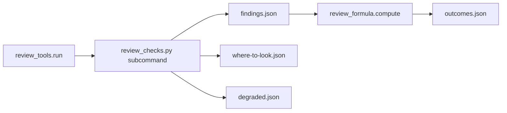

# Scripted review checks for the rows no tool provides (issue #155)

## Summary

Add five scripted checks to saga's review-tools runner, in one new script, for the lens-table rows no installed tool answers. Each check reports only what the change introduces, cites an existing formula row, and passes the review-record validator.

---

## Problem Frame

Issue #155 is card C5b of the saga review redesign (parent issue #147). It depends on issue #148 (card C1, the records and the formula) and issue #151 (card C4a, the runner). Both have landed. Issue #149 (card C2, the calibration fingerprint) has also landed, in commit `47cbb96`, so this card adds the new script to that fingerprint. Issue #191 is already on this branch: the commit under review is untrusted, and nothing in it configures its own review.

What is true on this branch today:

- The runner in `plugins/saga/scripts/review_tools.py` starts an adapter only when `adapter.tool` is non-empty (`review_tools.py` around the adapter loop in `_run`). An adapter whose tool name is empty is skipped. Coverage and the relocated test run are framework work, outside that loop.
- A non-empty tool is version-probed. `version_argv`, when set, is the probe. Otherwise the probe is `[tool, *version_args]`. The probe's version is the first dotted number (`\d+\.\d+(?:\.\d+)?`). It has to equal `default_version`, or every hit from that adapter is degraded. A degraded finding whose row would block becomes fix-later.
- The two testing rows this card fills, `testing.test-passes-before-change` and `testing.test-skipped-in-ci`, block and have `excused_by` unset (`review_formula.py`). A builder reason cannot clear them. The formula excuses a finding only when the row's `excused_by` equals the reason's kind and the reason names that finding's id.
- The changed-name rows and the workflow row already exist. `correctness.unupdated-mention` blocks and is excused by `unaffected`. `correctness.unupdated-mention-in-document` is fix-later and has no excuse kind. `correctness.workflow-dead-end` blocks and has no excuse kind. `architecture-maintainability.machine-specific-value` is fix-later. `architecture-maintainability.relocated-run-fails` already blocks when the relocated command exits non-zero.
- The runner writes `findings.json`, `measurements.json`, `degraded.json`, and `outcomes.json`. Tests assert those four names exist. They do not assert that the directory contains only those four.
- `review_calibration.COMPONENTS` is the fingerprinted list. `review_tools.FINGERPRINT_COMPONENTS` is the nine paths from card C4a, pinned exactly by `test_fingerprint_names_these_paths`. The calibration file's `corpus_run` is `no-run`, so the stored hashes are not compared.
- This repository's continuous-integration workflow runs pytest in quiet mode (`.github/workflows/ci.yml`). That log names no test. This card does not change that workflow, or any other repository's workflow.

The design rows are in `docs/brainstorms/2026-10-05-saga-review-redesign/plan.md` under "Lens by lens". The testing lens says every gap blocks unless the builder records a reason. The correctness lens says documents and agent instructions are included, and a stale document is fix-later at most.

---

## Requirements

Requirements follow the card. R-IDs run continuously. AC-n is the nth checkbox under the issue's Acceptance criteria.

**The script and the runner**

- R1. `python3 plugins/saga/scripts/review_checks.py --help` exits 0 and names the five checks: `two-runs`, `ci-skips`, `machine-values`, `changed-names`, and `workflow-graph`. `--version` prints `1.0.0` and exits 0 (AC-1).
- R2. Each check is an adapter on `default_adapters` and runs through `python3 plugins/saga/scripts/review_tools.py run` given a repository, a base, a head, a profile, and an output directory. The command takes no run record. `--builder` is optional (AC-2).
- R3. Each finding cites the row in the card's table. The formula computes that row's outcome. Every finding passes `review_records.validate` as written. A where-to-look item passes that validator after a test attaches an answer of kind `finding` or `cleared` (AC-3).

**The two testing rows**

- R4. `testing.test-passes-before-change` is excused by a builder reason of kind `test-passes-before-change`. `testing.test-skipped-in-ci` is excused by kind `test-skipped-in-ci`. The reason names the finding id. The outcome severity becomes `note` and the modifier is `excused`. A reason of the other kind does not excuse the row (AC-4, AC-5).
- R5. A new test, present at head and absent at base, that passes at head and passes on the base tree with the head's test file in place, is a blocking finding on `testing.test-passes-before-change`. A new test that fails at base, including a test that cannot import there, yields nothing. A new test that fails at head yields nothing. Passing the previous round's head as base reports a regression test that passes before the repair. A command the check cannot list or select is one degraded input, reason `no-test-list`, and yields no finding for that language. A missing program or a timeout is a degraded input and does not block on its own (AC-4).
- R6. A new test the finished continuous-integration run shows as skipped with no reason, or never shows, is a blocking finding on `testing.test-skipped-in-ci`. A skip reason in the log or in a JUnit report yields nothing. The builder reason in R4 clears the finding. No finished run for the head commit is reason `no-finished-run`. A finished log that names no test is reason `log-names-no-test`. Both are degraded and do not block (AC-5).

**Machine-specific values, names, and workflows**

- R7. Each machine-specific value on a line the change adds is one where-to-look item, with no answer, for the reviewer to confirm or clear. The same values on an unchanged line, and the inert placeholders, yield nothing. A finding that cites `architecture-maintainability.machine-specific-value` is fix-later. When the relocated test command fails, the same outcome file also contains `architecture-maintainability.relocated-run-fails` at blocks. The machine-specific finding's own severity stays fix-later (AC-6).
- R8. A mention of a renamed or removed name, on a line the change did not edit, blocks on `correctness.unupdated-mention` unless the builder reason is `unaffected`. A mention in an agent-instruction file uses that same blocking row. A mention in any other Markdown document is `correctness.unupdated-mention-in-document`, which is fix-later at most. A mention on a line the change edited yields nothing. Where the language cannot be parsed, the check compares removed and added lines as text and marks those hits degraded, so a block becomes fix-later (AC-7).
- R9. A state the change adds, in a workflow stored as data, from which no end state can be reached, blocks on `correctness.workflow-dead-end`. End states are not reported. A dead end already present at base yields nothing (AC-8).

**The suite and the documents**

- R10. `python3 -m pytest plugins/saga/tests -q --import-mode=importlib` passes, and the new test modules make no network call. `plugins/saga/references/review-tools.md` documents the five checks, their rows, and their outcomes. `review_calibration.COMPONENTS` names `plugins/saga/scripts/review_checks.py` (AC-9, AC-10).

---

## Key Technical Decisions

Each entry is the decision, then why, including the rejected alternative.

- **KTD1. The adapter tool name is the non-empty string `review-checks`, the version probe is this plugin's script, and `review-tools.yaml` gains no row.** `default_adapters` imports `review_checks` inside the function, not at module import. Each adapter's `invoke` returns `[sys.executable, <plugin script>, <subcommand>, ...]`. The script path is `plugin_root() / "scripts" / "review_checks.py"`, the plugin copy, never a copy in the tree under review. `version_argv` is `[sys.executable, <plugin script>, "--version"]`. `--version` prints `1.0.0`. `default_version` is `1.0.0`. Timeout stays 120 seconds. `invoke` only builds the argument vector. The runner starts the process with `shell=False`. Rejected: `tool=""`. The runner skips that adapter, so the check would never run. Rejected: `tool="python3"` with `default_version` `not-recorded`. The probe would read Python's version, fail the equality, and degrade every hit, which turns a block into fix-later and fails AC-4. Rejected: a `review-tools.yaml` row whose `tool` is non-empty. `build_loop.py` treats every such row as a baseline check a profile command must answer. Rejected: doing the work inside `invoke`. The adapter interface says `invoke` does not run the command.
- **KTD2. Four checks use comparison `lines`. The workflow check uses `base-head`. Mentions and test findings are whole-project hits, and the script itself drops a mention on an edited line.** `two-runs`, `ci-skips`, `machine-values`, and `changed-names` set `comparison` to `lines`. The two testing checks and the changed-name check set `whole_project=True` on each hit, with scope `whole-project`, so a line shift does not drop them. The finding anchor is the test node id or the old name, and the identity does not include the line number, so a later builder reason still matches. Machine-specific hits set `whole_project=False` and set `start` and `end` to the added line, so the runner's changed-line filter keeps them. Changed-name mentions sit on unchanged lines, which is why they are whole-project. The script drops a mention whose line is in `Change.lines_for` for that path, because a whole-project hit would otherwise survive the filter. The workflow check sets `comparison` to `base-head`. The runner keeps a hit only when its identity is absent from the base scan. Identity is the file plus the state id, stored as the anchor. `narrow_env` is true only for `two-runs`, so that test command sees the relocated allow-list (`PATH`, `LANG`, `LC_ALL`, `LC_CTYPE`, `TZ`, a fresh `HOME`, and a fresh temp directory). The continuous-integration check does not set `narrow_env`, because `gh` needs the operator's existing authentication. It runs `gh` with a fresh empty working directory and does not read a `gh` config from the worktree. Rejected: `base-head` for the two test runs. That mode scans each tree and drops a hit whose identity already exists at base, which is a different question from running the new tests on the old code. Rejected: `base-head` for changed names. The stale mention is usually already at base, so the identity diff would drop the finding the card wants.
- **KTD3. The two testing rows gain two excuse kinds, one each.** Add `test-passes-before-change` and `test-skipped-in-ci` to `REASON_KINDS`, in that order, after the existing six. Set `excused_by` on the matching row. Extend the builder-reason enum in `plugins/saga/references/review-records.schema.json` to the same list, and the excused-by cell in `plugins/saga/references/review-records.md`. Update `EXPECTED_ROWS` in `plugins/saga/tests/test_review_formula.py`. `plugins/saga/tests/test_review_records.py` already asserts that the schema enum equals `list(REASON_KINDS)`, and it builds one reason per kind, so those tests follow the tuple once the schema matches. The formula and the schema are already on the fingerprint list. Changing them does not add a path. Rejected: one shared kind such as `testing-gap`. A continuous-integration reason would then excuse a test that passes before the change. Rejected: leaving `excused_by` unset. The card says the finding blocks unless the builder records a reason, and the formula cannot excuse a row whose `excused_by` is unset.
- **KTD4. A confirmed machine-specific hit stays fix-later. The block, when the relocated run fails, is the existing relocated-run row in the same outcome file.** The search emits no finding. It emits where-to-look items. A test that stands in for the reviewer builds a finding citing `architecture-maintainability.machine-specific-value` and reads the formula severity, which is fix-later. The same runner call with `framework=True` and a relocated command that exits non-zero also writes `architecture-maintainability.relocated-run-fails` at blocks. The plan in the design says "Fix later, unless the relocated test run fails." Card C1 did not encode a modifier on the machine-specific row, and the relocated row already blocks. This card does not add that modifier. Rejected: a new formula modifier that raises the machine-specific finding's own severity when a relocated failure is present. That is a later item, recorded under Scope Boundaries, so a reviewer can disagree in the open.
- **KTD5. The workflow check reads one JSON shape, the run model, and no second format.** A file counts when it parses as JSON with a top-level `steps` array, a top-level `nodes` array, or both, and a top-level `transitions` array. A step has `id`. A node has `id` and `kind`. A transition has `from` and `to`. Kind `entry` is a start. Kinds `terminal` and `undefined_route` are end states, the stopping kinds in the lifecycle repository's run-model checker. A step is an ordinary state. The check reports a state when no end state is reachable from it, including a cycle that never exits. It does not report an end state. A file that is not this shape, including a GitHub Actions workflow, is ignored and is not a degraded input. GitHub Actions workflows are already linted by card C4b. This repository has no file of this shape. Fixtures under `plugins/saga/tests/fixtures/review_checks/` use the shape with inert values. They do not copy a lifecycle file. Rejected: Amazon States Language, and rejected treating a GitHub Actions file as a state graph. One format is the shape our repositories store as data. A second format would be an invention.
- **KTD6. The new script is appended to `review_calibration.COMPONENTS` and to the fenced list in `review-calibration.md`. It is not appended to `FINGERPRINT_COMPONENTS`, and `review-calibration.json` is not rewritten.** `test_components_match_the_landed_cards` asserts the concatenation that ends with `sweep_pieces.SWEEP_COMPONENTS`. The new path is the last element, after that spread. The prose sentence that says the checks are not on the list yet is updated so the question banks, the policy questions, and the review command stay off the list, and this script is on it. `corpus_run` is `no-run`, so the stored hashes are not compared. Rejected: appending the script to `FINGERPRINT_COMPONENTS`. That tuple is pinned to the nine C4a paths. Rejected: rewriting `review-calibration.json`. Nothing compares those hashes while the corpus run is `no-run`.
- **KTD7. The check learns the test commands, the user name, and the host name from the runner process, on the argument vector. It does not read them from the tree under review.** `ScanContext` gains `commands: tuple[tuple[str, str], ...] = ()`, filled in `_run_adapter` from the profile object the runner already loaded. That profile came from the base commit, or from an external `--profile` when the base commit has no profile blob. The pairs are every pair `_relocated_commands` returns. When the functional command is a non-empty string and is not already in that list, the runner appends `("none", <command>)`. `invoke` passes them as one JSON argument. The machine-specific adapter calls `getpass.getuser` and `socket.gethostname` in the runner process and passes `--user` and `--host`. Tests monkeypatch those two calls. The script does not read `.saga-profile.json`, a user name, or a host name from the worktree. The head commit is untrusted. The script's base checkout uses the same git rules as the runner: `git -c core.hooksPath=<empty directory> worktree add --detach`, and `GIT_LFS_SKIP_SMUDGE=1` on that git process. Rejected: reading the profile out of the head worktree. That is the file the change can replace.
- **KTD8. Machine-specific hits are written to `where-to-look.json` with no answer. The runner does not validate that file as a stored record.** `ParseResult` gains `items` and `gaps`, both defaulting to empty, so existing parsers stay valid. `_once` and the head call of `_scan_root` append `items` to a list the run owns. The base scan does not contribute items. `_emit` writes `where-to-look.json` on every successful run, an empty list when there are none, and still writes the four existing files. `_emit` validates findings and measurements as it does today. It does not validate the where-to-look items, because a stored where-to-look record requires `answer`, and card C8 adds the answer. The sweep already emits items without an answer. A gap is a pair `(reason, row)`. The runner records it with `_degraded` and still keeps hits from a language that did run. The check process exits 0 whenever it prints a JSON document, including a document whose only content is gaps. Standard output is never empty on success. `{"hits":[]}` is a clean run. The unfinished-mutant rebuild of `ParseResult` passes `items` and `gaps` through. `run`'s docstring and the `run` subcommand help stop saying the runner writes only four files. Rejected: raising `ToolGap` for one language that cannot list. `ToolGap` drops every hit from that process, including hits from a language that listed cleanly. Rejected: writing a placeholder answer into the file. The item would look answered before the reviewer sees it.

---

## High-Level Technical Design

The runner stays the process supervisor. The new script is five subcommands behind one version probe.

| Check | Subcommand and adapter id | Comparison | Row |
|---|---|---|---|
| Two test runs | `two-runs` | lines, whole-project hit | `testing.test-passes-before-change` |
| Tests the continuous-integration run skipped | `ci-skips` | lines, whole-project hit | `testing.test-skipped-in-ci` |
| Machine-specific values | `machine-values` | lines, on the added line | where-to-look item, lens `architecture-maintainability`. A confirmed finding cites `architecture-maintainability.machine-specific-value` |
| Changed names | `changed-names` | lines, whole-project hit, script drops edited lines | `correctness.unupdated-mention`, or `correctness.unupdated-mention-in-document` for a document |
| Workflow graph | `workflow-graph` | base against head | `correctness.workflow-dead-end` |

The script prints one JSON document. `hits` become findings. `where_to_look` becomes `where-to-look.json`. `gaps` become degraded inputs. A hit the formula would block, with `degraded` true, becomes fix-later. That is the existing rule, and it is how an unparsed language stays from blocking on its own.



---

## Implementation Units

Seven units. U1 and U2 have no dependency on each other. U3 and U4 depend on both. U5 and U6 depend on U2. U7 is last.

### U1. Excuse kinds for the two testing rows

A builder reason can clear each testing finding, and a reason for one row does not clear the other.

**Goal:** The formula, the schema, the row table, and `EXPECTED_ROWS` agree on the two new reason kinds.

**Requirements:** R4.

**Dependencies:** none.

**Files:** `plugins/saga/scripts/review_formula.py` (modify); `plugins/saga/references/review-records.schema.json` (modify); `plugins/saga/references/review-records.md` (modify); `plugins/saga/tests/test_review_formula.py` (modify).

**Approach:** Add the two kinds to `REASON_KINDS` after `where-to-look-explanation`. Set `excused_by="test-passes-before-change"` on `testing.test-passes-before-change` and `excused_by="test-skipped-in-ci"` on `testing.test-skipped-in-ci`. Put the same two strings, in the same order, on the builder-reason `kind` enum. In the row table, fill the excused-by cell for those two rows and leave every other cell as it is. In `EXPECTED_ROWS`, change the two tuples from `("blocks", None, False)` to `("blocks", "test-passes-before-change", False)` and `("blocks", "test-skipped-in-ci", False)`. Do not edit `plugins/saga/tests/test_review_records.py`. Its schema assertion and its full builder record follow `REASON_KINDS`.

**Patterns to follow:** The existing `excused_by="coverage-gap"` row in `review_formula.py`, the enum in `review-records.schema.json` under `builder_record.reasons`, and `test_row_with_the_builder_reason_it_allows_is_a_note` in `test_review_formula.py`.

**Test scenarios:**

- Happy path: `test_reason_excuses_only_its_own_testing_row`. A tool finding for `testing.test-passes-before-change` has severity `blocks` with no builder record. The same finding with a builder reason of kind `test-passes-before-change` naming that finding id has severity `note` and modifier `excused`. The same pair for `testing.test-skipped-in-ci` and kind `test-skipped-in-ci`.
- Edge: the pre-change finding is not excused by kind `test-skipped-in-ci`, and the skipped-test finding is not excused by kind `test-passes-before-change`. The existing parametrized test still excuses only the kind `EXPECTED_ROWS` names.
- Error: a reason whose `finding_id` is a different id leaves the severity at `blocks`. That is the existing other-kind test, pointed at these two rows by the `EXPECTED_ROWS` edit.
- Integration: `test_schema_file_matches_the_validator` passes because the schema enum list equals `REASON_KINDS`.
- No network: the socket refusal already on `test_review_formula.py` stays.

**Verification:** A matching reason turns each row into a note. The other new kind does not. The schema enum and the tuple are the same list.

**Functional checks:**

```functional-checks
- name: reason-excuses
  command: python3 -m pytest plugins/saga/tests/test_review_formula.py plugins/saga/tests/test_review_records.py -q --import-mode=importlib -k "reason_excuses or schema_file_matches_the_validator"
  proves: [AC-4, AC-5]
  runs: local
```

### U2. The script, the five adapters, and the fifth output file

The runner can start each check, the help command names them, and the fingerprint lists the script.

**Goal:** `review_checks.py` answers `--help` and `--version`, five adapters are on `default_adapters`, and a run writes `where-to-look.json` beside the four existing files.

**Requirements:** R1, R2, R10.

**Dependencies:** none.

**Files:** `plugins/saga/scripts/review_checks.py` (create); `plugins/saga/scripts/review_tools.py` (modify); `plugins/saga/references/review-tools.md` (modify); `plugins/saga/scripts/review_calibration.py` (modify); `plugins/saga/references/review-calibration.md` (modify); `plugins/saga/tests/test_review_calibration.py` (modify); `plugins/saga/tests/test_review_checks_runner.py` (create).

**Approach:** Create the script with `argparse`. Subcommands are the five names in R1. `--help` and `--version` exit 0. `--version` prints `1.0.0` and nothing else. The five command handlers may return an empty JSON document in this unit (`{"hits":[],"where_to_look":[],"gaps":[]}`). U3 through U7 fill them. `parse` maps that document onto `ParseResult`. A hit object carries the fields `Hit` needs, including `row`, `whole_project`, and `degraded`. Export one adapter tuple, ids equal to the subcommand names, built as KTD1 and KTD2 describe. `default_adapters` imports that tuple inside the function and appends it. Add `commands` to `ScanContext` as KTD7 describes, and set it in the `ScanContext(...)` call in `_run_adapter`. Add `items` and `gaps` to `ParseResult`. Thread items and gaps as KTD8 describes. Update the `ParseResult` rebuild in the unfinished-mutant branch so it passes both new fields. Do not add a row to `review-tools.yaml`. Append `plugins/saga/scripts/review_checks.py` as the last element of `COMPONENTS`, and as the last line of the fenced path list in `review-calibration.md`. Update the "Not on the list yet" sentence so the question banks, the policy questions, and the review command remain off the list. Update `test_components_match_the_landed_cards` to expect the extra path after `*sweep_pieces.SWEEP_COMPONENTS`. In `review-tools.md`, add a "Scripted checks" section after the adapter outcome table and before the first yaml fence. Use a Markdown table with the columns adapter id, comparison, row, and computed severity. Do not insert a yaml fence ahead of the Semgrep map. The section states that the script is the plugin copy, that the commit under review does not configure these checks, and that `where-to-look.json` carries unanswered machine-specific items. `test_review_checks_runner.py` refuses sockets the way `test_review_formula.py` does, with an autouse fixture.

**Patterns to follow:** An existing adapter constructor in `plugins/saga/scripts/review_adapters_python.py` for the `Adapter` fields. `plugin_root` and `default_adapters` in `review_tools.py`. The fenced path list and `_component_list` in `test_review_calibration.py`. `test_docs_cover_the_framework` for the rule that the first yaml fence stays the Semgrep map.

**Test scenarios:**

- Happy path: `test_checks_help_names_the_five_checks` runs `python3 plugins/saga/scripts/review_checks.py --help`, asserts exit 0, and asserts the five names appear. The same file's version test asserts `--version` prints `1.0.0` and exits 0. `plugins/saga/tests/test_entrypoints.py` discovers the script because it uses `argparse`, and its existing help test still passes.
- Edge: `test_checks_runner_invokes_each_check_without_a_run_record`. A temporary git repository has two commits and one inert text file that does not change. The profile is a JSON file outside that repository, with a functional test command of `python3 -m pytest -q` and no `review_tools` block. The test puts a directory of stub executables on `PATH` for every tool name the other adapters probe, each stub exiting 0 with a version line the pin will not equal, and does not include those tools' real binaries. `python3` on that `PATH` is the real interpreter. The test runs `python3 plugins/saga/scripts/review_tools.py run --repo <repo> --base <base> --head <head> --profile <profile> --output <output> --home <home>` and does not pass `--builder`. Exit is 0. The four record files and `where-to-look.json` exist. `where-to-look.json` is a JSON list. No output file is named `review_run.json`. The command line has no run-record flag. `degraded.json` has no row whose tool is `review-checks` and whose reason is `missing`. Each of the five subcommands was executed, which the test observes by wrapping the plugin script's invocation: the real script still runs, and the wrapper records the subcommand. The wrapper is the test's own `python3` shim only when the argument vector's second element is the plugin script. Other `python3` calls go to the real interpreter.
- Error: a profile that pins `review-checks` to a version other than `1.0.0` is not used in this test. The test profile has no pins. A missing inner program is U3 and U4's case, not this one.
- Integration: `test_checks_fingerprint_names_the_script` asserts `COMPONENTS[-1]` is `plugins/saga/scripts/review_checks.py`, asserts `_component_list` of `review-calibration.md` equals `list(COMPONENTS)`, and asserts `review-tools.md` contains the five adapter ids and the five row ids. `test_default_adapters_include_the_issue_table` still passes because it checks a subset. `test_fingerprint_names_these_paths` still expects the nine C4a paths and no more.
- No network: the new module's socket refusal is on. The runner test does not call `gh` or a scanner.

**Verification:** Help exits 0 and names the five checks. The runner command writes five files and does not take a run record. The fingerprint list and the guide name the script and the checks.

**Functional checks:**

```functional-checks
- name: checks-help
  command: python3 -m pytest plugins/saga/tests/test_review_checks_runner.py -q --import-mode=importlib -k checks_help
  proves: [AC-1]
  runs: local
- name: checks-runner
  command: python3 -m pytest plugins/saga/tests/test_review_checks_runner.py -q --import-mode=importlib -k checks_runner
  proves: [AC-2]
  runs: local
- name: checks-fingerprint
  command: python3 -m pytest plugins/saga/tests/test_review_calibration.py plugins/saga/tests/test_review_checks_runner.py -q --import-mode=importlib -k "components_match_the_landed_cards or checks_fingerprint"
  proves: [AC-10]
  runs: local
```

### U3. Two test runs

A new test that passes on the code before the change blocks, until the builder records the matching reason.

**Goal:** `two-runs` lists tests, runs the new ones at head and on a base checkout that has the head's test files, and emits a finding only when both runs pass.

**Requirements:** R3, R5.

**Dependencies:** U1, U2.

**Files:** `plugins/saga/scripts/review_checks.py` (modify); `plugins/saga/tests/test_review_check_two_runs.py` (create).

**Approach:** Recognize the command with `shlex.split`. It is pytest when a token is `pytest` or a pair is `-m` then `pytest`. It is cargo when the first token's basename is `cargo` and `test` is a token. It is swift when the first token's basename is `swift` and `test` is a token. Anything else, for that language, is one gap `("no-test-list", "testing.test-passes-before-change")` and no finding. Languages that list still produce findings. List pytest by appending `--collect-only` and `-q`. Node ids are the lines that contain `::`. List cargo by replacing the tokens after `--` with `--list`, and take lines of the form `<name>: test`. List swift with `swift test list`. New tests are the ids at head minus the ids at base. Run the selected ids with the same command: pytest takes the node ids as further arguments, cargo uses `cargo test <name> -- --exact`, and swift uses `swift test --filter <name>`. The base run is a detached worktree of `ScanContext.base`, created as KTD7 describes, removed when the check returns. For pytest, copy the node id's file from the head worktree onto that base worktree. For cargo and swift, copy every added or modified file whose path contains `test`, `tests`, or `spec`. A non-zero exit at base, including an import or compile error, is a failure at base and yields nothing. Pass at head and pass at base yields one hit: row `testing.test-passes-before-change`, `whole_project=True`, path the test file, anchor the node id, statement that the new test passes on the code before the change. Fail at head yields nothing. Each inner command has its own timeout. On expiry the document contains gap reason `timeout` and no hit for that language. A missing binary is gap reason `missing`. The adapter sets `narrow_env=True`. The test module refuses sockets. Every finding is passed through `review_records.validate`. The outcome severity is read from `outcomes.json`. With no calibration answer, `enforced` stays false. The assertion is the severity, which is `blocks` before the reason and `note` after it.

**Patterns to follow:** `_worktree` in `review_tools.py` for the git flags. The socket fixture in `test_review_formula.py`. A builder record's required fields in `review-records.schema.json`: `kind`, `schema`, `unit`, `acceptance_criteria`, `declarations`, and `reasons`. Empty arrays are valid for the three lists. A reason needs `kind`, `finding_id`, and `text`.

**Test scenarios:**

- Happy path: a new pytest test that fails at base and passes at head yields no finding. A new pytest test that passes at base and passes at head yields one finding. `review_records.validate` returns no problems. The outcome severity is `blocks` and the row is `testing.test-passes-before-change`.
- Edge: the second run passes `--builder` with a record whose reason kind is `test-passes-before-change` and whose `finding_id` is the id from the first run. The outcome severity is `note` and the modifiers include `excused`. Three commits: a parent, a middle commit that still has the bug, and a head that adds a regression test and the repair. The runner's base is the middle commit. The copied test passes on the middle commit. The finding is present.
- Error: a functional command of `echo ok` yields one degraded input, reason `no-test-list`, row `testing.test-passes-before-change`, and no finding. A command of `pytest` when no `pytest` binary is on `PATH` yields reason `missing` and no finding. The outcome file has no blocking finding from this row in either case.
- Integration: the check runs through `review_tools.run` on a temporary repository, with `adapters` set to the one adapter and `framework=False`, and also through the `run` subcommand as U2's runner test does. The profile file is outside the repository.
- No network: the module's socket refusal is on. The tests use the local interpreter only.

**Verification:** A test that passes before the change blocks. A test that fails at base does not. The matching builder reason turns the block into a note. A command that cannot list is degraded and does not block.

**Functional checks:**

```functional-checks
- name: two-runs
  command: python3 -m pytest plugins/saga/tests/test_review_check_two_runs.py -q --import-mode=importlib
  proves: [AC-3, AC-4]
  runs: local
```

### U4. Tests the continuous-integration run skipped

A new test the finished run skipped, or never named, blocks unless a reason is in the log or in the builder record.

**Goal:** `ci-skips` reads a finished run for the head commit through a faked `gh`, and degrades when that run is missing or silent.

**Requirements:** R3, R6.

**Dependencies:** U1, U2.

**Files:** `plugins/saga/scripts/review_checks.py` (modify); `plugins/saga/tests/test_review_check_ci_skips.py` (create); `plugins/saga/tests/fixtures/review_checks/ci-quiet.log` (create); `plugins/saga/tests/fixtures/review_checks/ci-skipped.log` (create); `plugins/saga/tests/fixtures/review_checks/ci-named.log` (create); `plugins/saga/tests/fixtures/review_checks/junit-skipped.xml` (create).

**Approach:** Reuse the listing from U3 so "new test" means the same thing. The head commit is `git rev-parse HEAD` in the worktree. The `gh` argument vectors, with a fresh empty working directory, are `gh run list --commit <head> --json databaseId,conclusion,status,headSha`, then `gh run view <id> --json artifacts`, then either `gh run download <id> --name <artifact> --dir <fresh directory>` when an artifact name contains `junit`, or `gh run view <id> --log`. A completed run is one whose status is `completed`. Prefer a JUnit artifact when one is present. Otherwise parse the log. JUnit: a `testcase` skipped child with a non-empty `message` is a reason. A skipped child with no message is a block. Log: a line that contains the node id and `SKIPPED` or `skipped` is a skip. Text after that word on the same line is the reason. No such text is no reason. A node id absent from the log and from the JUnit report is never shown, and it blocks. No completed run is gap `("no-finished-run", "testing.test-skipped-in-ci")`. A completed log and report that contain no node id are gap `("log-names-no-test", "testing.test-skipped-in-ci")`. A missing `gh` is gap reason `missing`. The adapter does not set `narrow_env`. Hits use the same shape as U3, with row `testing.test-skipped-in-ci`. Fixtures use inert names (`test_sample`, `tests/test_sample.py`). `ci-quiet.log` is quiet pytest output, a summary line and no node id. `ci-skipped.log` has one skipped node id with a reason and one without. `ci-named.log` names a node id as passed. `junit-skipped.xml` has one skipped case with a message and one without. The test puts a fake `gh` first on `PATH`. The fake reads the fixture. It does not open a socket. The test module refuses sockets. Do not special-case this repository's workflow, and do not edit `.github/workflows/ci.yml`.

**Patterns to follow:** U3's listing and hit shape. The builder-record shape from U3 for the clearing run. `subprocess` with an argument vector and `shell=False`.

**Test scenarios:**

- Happy path: a new test skipped with no reason yields one blocking finding. A new test the log never shows yields one blocking finding. Both pass `review_records.validate`. The row is `testing.test-skipped-in-ci`.
- Edge: a skip whose log line includes a reason yields nothing. The same skip with the reason only in `junit-skipped.xml` yields nothing. A second run with builder reason kind `test-skipped-in-ci` naming the finding id has severity `note` and modifier `excused`.
- Error: `gh run list` prints `[]`. The degraded reason is `no-finished-run` and there is no finding. The list names a completed run whose log is `ci-quiet.log`. The degraded reason is `log-names-no-test` and there is no finding. `gh` absent from `PATH` is reason `missing`.
- Integration: the fake `gh` is invoked with the pinned argument vector and with a working directory that is not the repository. The test asserts that working directory is empty of repository files.
- No network: the socket refusal is on. The fake `gh` is a local script.

**Verification:** An unexplained skip blocks. A reason in the log or in the builder record clears it. A missing run and a silent log are degraded and do not block.

**Functional checks:**

```functional-checks
- name: ci-skips
  command: python3 -m pytest plugins/saga/tests/test_review_check_ci_skips.py -q --import-mode=importlib
  proves: [AC-3, AC-5]
  runs: local
```

### U5. Machine-specific values

Each added machine-specific value reaches the reviewer as an unanswered where-to-look item. A confirmed hit is fix-later, and a failed relocated run blocks on its own row.

**Goal:** `machine-values` searches added lines, writes one item per hit, and leaves confirmation to the reviewer.

**Requirements:** R3, R7.

**Dependencies:** U2.

**Files:** `plugins/saga/scripts/review_checks.py` (modify); `plugins/saga/tests/test_review_check_machine_values.py` (create).

**Approach:** Read the diff with `review_diff.read` on the worktree, base from the argument vector, head `HEAD`. Search only lines in `lines_for` for that path. Do not limit the search to this repository's scan directories. Kinds, and the inert set: a Unix absolute path of two or more segments; a Windows drive path and a UNC path; a home directory under `/Users/` or `/home/` whose user name is not in `INERT_HOME_DIRECTORY_USERS` from `scripts/check_repo.py` (`operator`, `example`, `op`, `test`); a `http` or `https` URL whose host is not `example.com`, `example.org`, `example.net`, or `localhost`; an account id of exactly twelve digits, not part of a longer digit run; the injected user name and the injected host name as a whole word, and only when that string is at least three characters and is not in the inert set. The public fixture the card names, infiquetra-sdlc `config/lens-fixtures/architecture-maintainability/hardcoded_environment_path.py`, uses the home user `build-agent`. Treat `build-agent` as a non-inert example. Tests inject `fixture-user` and `fixture-host` by monkeypatching `getpass.getuser` and `socket.gethostname` before `invoke`. They do not call the real ones. Each hit is one where-to-look object and not a finding: `kind` `where_to_look`, `schema` `review_records.v1`, lens `architecture-maintainability`, language from `language_for`, `degraded` false, `questions` one entry with id `machine-specific-value` and probability `1`, `classifier` name `machine-specific-value` and model `review-checks 1.0.0`. Location scope is `lines`, with `file`, `lines.start`, `lines.end`, `function` set to null when the line is not inside a function, and a non-empty `anchor`. No `answer` key. The test copies the item, sets `answer` to `{kind: finding, finding_id: <id>}` or `{kind: cleared, reason: <text>}` the way `reviewer_answer.to_records` copies an item and adds `answer`, then asserts `review_records.validate` is empty. The confirmed finding is built in the test, cites `architecture-maintainability.machine-specific-value`, and is handed to `review_formula.outcome`. Its severity is `fix-later`. A second runner call uses `framework=True` and a functional command that exits non-zero. `outcomes.json` contains `architecture-maintainability.relocated-run-fails` with severity `blocks`. The machine-specific finding's severity in that same computation stays `fix-later`. The test module refuses sockets. Machine-specific lines are written by the test into the temporary repository. There is no fixture file of real paths.

**Patterns to follow:** `MACHINE_SPECIFIC_PATH` and `INERT_HOME_DIRECTORY_USERS` in `scripts/check_repo.py`. `_items` in `plugins/saga/scripts/_bundled/jev_sweep.py` for an item without `answer`. The answer copy in `reviewer_answer.to_records`. `_one_relocated` for how a non-zero command becomes `architecture-maintainability.relocated-run-fails`.

**Test scenarios:**

- Happy path: an added line for each kind yields one where-to-look item. The file is a JSON list. The item has no `answer`. After the test adds an answer, `review_records.validate` is empty.
- Edge: the same values on a line the change did not edit yield nothing. Inert values yield nothing: home user `operator`, host `example.com`, and a thirteen-digit number. A user name shorter than three characters yields nothing.
- Error: the confirmed finding's formula severity is `fix-later`. With the relocated command exiting 1, the relocated row's severity is `blocks` and the machine-specific severity is still `fix-later`.
- Integration: the run is `review_tools.run` with the one adapter. The item is in `where-to-look.json` and the four other files still exist. `findings.json` from the check itself has no machine-specific finding.
- No network: the socket refusal is on. The test does not resolve a host.

**Verification:** Each kind on an added line produces one unanswered item. Unchanged lines and inert placeholders produce none. A confirmed finding is fix-later. A failed relocated command blocks on the relocated row.

**Functional checks:**

```functional-checks
- name: machine-values
  command: python3 -m pytest plugins/saga/tests/test_review_check_machine_values.py -q --import-mode=importlib
  proves: [AC-3, AC-6]
  runs: local
```

### U6. Changed-name search

A reader of a renamed or removed name, outside the lines the change edited, blocks unless the builder marks it unaffected. A document mention is fix-later at most.

**Goal:** `changed-names` finds removed names and reports mentions the change left in place.

**Requirements:** R3, R8.

**Dependencies:** U2.

**Files:** `plugins/saga/scripts/review_checks.py` (modify); `plugins/saga/tests/test_review_check_changed_names.py` (create).

**Approach:** Removed names start from the stale-reader kinds. Python, through the standard-library `ast` module: a function, an async function, or a class whose name is in the base file's tree and absent from the head file's tree. A deleted or renamed path whose stem matches `[A-Za-z_][A-Za-z0-9_]*`. A `--flag` token, or a string passed to `add_argument`, removed and not added. JSON object keys through `json`, and TOML keys through `tomllib`, removed and not still present. A name that still exists anywhere at head is a move, not a removal, and is not searched. Outside Python, when `language_for` is in `sweep_pieces.CTAGS_LANGUAGES`, call `sweep_pieces.read_ctags_spans`. Names are the `function`, `method`, and `member` spans present in the base text and absent in the head text. When that call returns `None`, or when the language is not in that set, compare identifier tokens on removed lines with tokens on added lines. Every hit from that text comparison has `degraded=True`. YAML keys use that degraded text comparison. There is no tree-sitter. The runner does not execute the `universal-ctags` row. The script calls `read_ctags_spans`, which runs `ctags` when it can. Search the head tree, skipping `.git` and not following a symlink out of the tree, for the old name as a whole identifier on lines `Change.lines_for` does not cover. A mention on a covered line yields nothing. Code, tests, and agent instructions use row `correctness.unupdated-mention`. Agent instructions are a file named `AGENTS.md`, `CLAUDE.md`, or `GEMINI.md`, and a Markdown file under a directory named `skills`, `commands`, `agents`, or `roles`. Any other Markdown file uses row `correctness.unupdated-mention-in-document`. Hits are whole-project. The anchor is the old name. The path is the file that still mentions it. The builder reason kind `unaffected` clears the blocking row through the existing formula. The document row has no excuse kind. Its severity is fix-later. The test module refuses sockets. A degraded code hit becomes fix-later with modifier `degraded`.

**Patterns to follow:** `read_ctags_spans` and `CTAGS_LANGUAGES` in `plugins/saga/scripts/sweep_pieces.py`. `review_diff.Change.lines_for`. The `unaffected` row in `review_formula.py`.

**Test scenarios:**

- Happy path: a renamed Python function, with the caller left in a file the diff does not touch, yields one blocking finding on `correctness.unupdated-mention`. `review_records.validate` is empty. A second run with builder reason kind `unaffected` naming that finding id has severity `note` and modifier `excused`.
- Edge: a mention in a Markdown file that is not an agent instruction is fix-later on `correctness.unupdated-mention-in-document`. A mention in `AGENTS.md`, and a mention in a Markdown file under `skills`, each block on `correctness.unupdated-mention`. A mention on a line the change edited yields nothing. A name that moved to another file and is still defined at head yields nothing.
- Error: a renamed function in a language `read_ctags_spans` cannot parse yields a hit with `degraded` true. The outcome severity is `fix-later` and the modifier is `degraded`. The test forces `read_ctags_spans` to return `None`. It does not require `ctags` to be installed.
- Integration: the run goes through `review_tools.run` with the one adapter. A mention that already existed at base is still reported, because the comparison is `lines` with a whole-project hit, not base against head.
- No network: the socket refusal is on.

**Verification:** An untouched caller blocks. `unaffected` clears it. A document mention is fix-later. An agent-instruction mention blocks. An edited line and an unparsed language do not block on their own.

**Functional checks:**

```functional-checks
- name: changed-names
  command: python3 -m pytest plugins/saga/tests/test_review_check_changed_names.py -q --import-mode=importlib
  proves: [AC-3, AC-7]
  runs: local
```

### U7. Workflow graph, the changelog, and the journal

A workflow state the change adds, with no path to an end state, blocks. The documents record the checks and the two decisions.

**Goal:** `workflow-graph` reports new dead ends, and the changelog and the engineering journal name this card.

**Requirements:** R3, R9, R10.

**Dependencies:** U1, U2, U3, U4, U5, U6.

**Files:** `plugins/saga/scripts/review_checks.py` (modify); `plugins/saga/tests/test_review_check_workflow_graph.py` (create); `plugins/saga/tests/fixtures/review_checks/workflow-dead-end.json` (create); `plugins/saga/tests/fixtures/review_checks/workflow-loop.json` (create); `plugins/saga/tests/fixtures/review_checks/workflow-base-dead-end.json` (create); `plugins/saga/CHANGELOG.md` (modify); `docs/engineering-journal/DECISIONS.md` (modify); `docs/engineering-journal/LEARNINGS.md` (modify).

**Approach:** On each tree the runner scans, walk JSON files and keep those that match KTD5. Build the graph. End states are kind `terminal` and kind `undefined_route`. Report every other state from which no end state is reachable. Do not report an end state. The hit's path is the file, the anchor is the state id, `function` is null, and the row is `correctness.workflow-dead-end`. The runner's base-against-head comparison drops an identity that exists at base. A file that is not the shape is ignored. Fixtures are inert: state ids such as `start`, `work`, and `done`, and transitions between them. `workflow-dead-end.json` has one ordinary state with no outgoing transition. `workflow-loop.json` has two states that point at each other and no transition to an end. `workflow-base-dead-end.json` is the same dead end at base and at head. The test module refuses sockets and validates every finding. Under `[Unreleased]` `### Added` in the changelog, add one paragraph that starts `Issue 155:` and names the five checks, the two excuse kinds, and `where-to-look.json`. At the top of `## 2026-10-07` in `DECISIONS.md`, or under a new dated heading if the implementation lands on a later day, add one entry with Decision, Rationale, Rejected alternatives, and Revisit when. The decision covers the two excuse kinds and the rule that the checks run from the plugin script, with commands taken from the base profile. The rejected alternatives are the shared testing-gap kind and reading the head profile. At the top of the same day's section in `LEARNINGS.md`, add one entry with Evidence, Mechanism, and a one-line Generalizable rule. The evidence names issue #155 and the two testing rows. The mechanism is that those rows shipped with `excused_by` unset, so a builder reason could not clear them until this card set the kinds. The rule is that a row which blocks unless a reason is recorded needs `excused_by` set to that reason's kind.

**Patterns to follow:** The reachability rule in KTD5. The `[Unreleased]` `### Added` paragraphs in `plugins/saga/CHANGELOG.md`. The `## 2026-10-07` entries at the top of both journal files. The socket fixture from U3.

**Test scenarios:**

- Happy path: a head commit that adds `workflow-dead-end.json`, with base holding no such file, yields one blocking finding. The anchor is the dead-end state id. `review_records.validate` is empty. The outcome severity is `blocks`.
- Edge: `workflow-loop.json` yields one finding per state in the cycle, and no finding for an end state that is also in the file. A file that is a GitHub Actions workflow yields nothing and adds no degraded input.
- Error: base and head both contain `workflow-base-dead-end.json` with the same state id. The run yields no finding. An end state with no outgoing transition yields no finding.
- Integration: the run uses comparison `base-head` through `review_tools.run`. The test asserts the base scan and the head scan both invoke the subcommand.
- No network: the socket refusal is on. The fixtures are local JSON.

**Verification:** An added dead end and an added loop block. End states are absent from the findings. A dead end that already existed at base is absent. The changelog and both journal entries are present.

**Functional checks:**

```functional-checks
- name: workflow-graph
  command: python3 -m pytest plugins/saga/tests/test_review_check_workflow_graph.py -q --import-mode=importlib
  proves: [AC-3, AC-8]
  runs: local
```

---

## Scope Boundaries

What this card does not do.

Non-goals, from the issue. The runner's changed-line filter, the base and head comparison, the relocated test run, and the degraded-input machinery stay as card C4a shipped them. Judging a machine-specific hit, disputing an `unaffected` mark, and answering a degraded row stay with card C8. Putting the items into the review packet stays with card C10a. Redesigning the builder-record schema, capturing reasons during the build loop, and invoking this runner from the build loop stay with card C11. This card only adds the two excuse kinds the formula needs so a recorded reason can clear the two testing rows. Semgrep pattern rules stay with card C5. The sweep stays with card C6. Seeded corpus cases stay with cards K1 and K2. This card does not change any repository's continuous-integration log. It does not add a sandbox beyond the allow-list issue #191 already applies to a `narrow_env` command.

Later, not a unit of this plan:

- A formula modifier that raises `architecture-maintainability.machine-specific-value` itself when `architecture-maintainability.relocated-run-fails` is in the same inputs. KTD4 keeps the block on the relocated row.
- A workflow identity that survives a rename of the file. The identity is the path plus the state id. A pure rename of a file that already had a dead end looks new. The card's test uses the same path at base and at head.
- YAML configuration keys parsed as a tree. They use the degraded text comparison.
- Test listing for a runner other than pytest, cargo, and swift. Any other command is reason `no-test-list`.
- This repository's quiet pytest log. The row stays degraded here until that log names each test. The workflow file is not edited.

---

## Risks & Dependencies

| Risk | Mitigation |
|---|---|
| A version mismatch on `review-checks` degrades every hit and turns a block into fix-later | KTD1 pins `1.0.0` through `version_argv` and `default_version`. Tests do not pin a different version in the profile |
| The two testing rows stay impossible to excuse | U1 sets a distinct `excused_by` on each row and the schema enum to the same list. The cross-excuse test fails if one kind clears the other row |
| `gh` reads a config from the worktree, or the test calls the network | The continuous-integration check uses a fresh empty working directory. Tests put a fake `gh` on `PATH` and refuse sockets |
| A whole-project mention on an edited line survives the changed-line filter | The script drops lines `Change.lines_for` covers before it emits the hit. U6 tests that case |
| An unparsed language blocks on a text comparison | Those hits set `degraded=True`. The formula turns a degraded block into fix-later |
| `where-to-look.json` fails validation because `answer` is absent | The runner writes the unanswered item and does not validate it. The test validates a copy after it adds the answer |
| Adding the fifth file breaks a test that expects only the four names | Those tests assert each of the four names exists. U2 keeps all four. A test that required an exclusive directory listing would be updated in U2, and none of the current assertions do |

Depends on issue #148 and issue #151, which are on this branch, and on issue #149, which landed the fingerprint this card extends. Uses the untrusted-head behavior from issue #191, already on this branch. Does not depend on card C5, card C8, card C10a, or card C11.

---

## Scenario Smoke

The saga test suite, on the combined branch, against this repository's declared functional-test environment. The new modules refuse sockets themselves. The suite command is the one the card names.

```scenario-smoke
- name: saga-suite
  command: python3 -m pytest plugins/saga/tests -q --import-mode=importlib
  proves: [AC-3, AC-9, AC-10]
  runs: environment
```

---

## Sources / Research

- `docs/brainstorms/2026-10-05-saga-review-redesign/cards/C5b-scripted-checks.md`, the card.
- `docs/brainstorms/2026-10-05-saga-review-redesign/plan.md`, the "Lens by lens" tables. The testing sentence is "Every gap blocks unless the builder records a reason." The machine-specific outcome is "Fix later, unless the relocated test run fails." The correctness note says a stale document is fix-later at most.
- `plugins/saga/scripts/review_tools.py`, the adapter loop that skips an empty tool name, `_read_version`, `ScanContext`, `ParseResult`, `default_adapters`, `_emit`, and `_python_test_command`.
- `plugins/saga/scripts/review_formula.py`, `REASON_KINDS`, the two testing rows, and `outcome`.
- `plugins/saga/scripts/review_calibration.py`, `COMPONENTS`, and `plugins/saga/references/review-calibration.md`, the fenced list and the "Not on the list yet" sentence.
- `plugins/saga/scripts/sweep_pieces.py`, `read_ctags_spans` and `CTAGS_LANGUAGES`. The `universal-ctags` row in `plugins/saga/references/review-tools.yaml` says the review runner does not execute it.
- `scripts/check_repo.py`, `MACHINE_SPECIFIC_PATH` and `INERT_HOME_DIRECTORY_USERS`.
- `plugins/saga/scripts/build_loop.py`, the baseline classification that treats a non-empty `tool` in `review-tools.yaml` as a check a profile command must answer.
- infiquetra-sdlc `config/lens-fixtures/architecture-maintainability/hardcoded_environment_path.py`, the public fixture the card names, for the non-inert home user `build-agent`.
- infiquetra-sdlc `config/run-model.json` and `tools/docs/check_run_model.py`, the one workflow shape. Stopping kinds are `terminal` and `undefined_route`.
