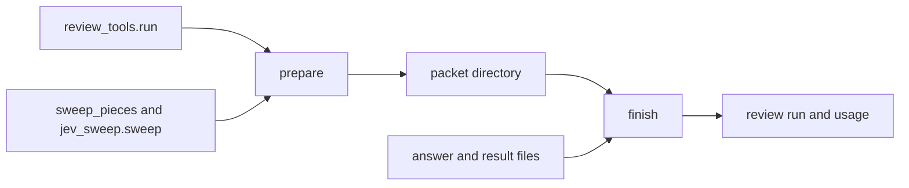

# One review command from change to records (issue #160)

## Summary

Add `plugins/saga/scripts/review_command.py`, two subcommands and no reviewer session. `prepare` runs the tool runner and the where-to-look sweep, and writes the packet. `finish` checks one or two answers, re-runs reproduction commands in a sandbox, merges findings, applies the grade formula, and writes the review records and the reviewers' usage.

---

## Problem Frame

Issue #160 is card C10a of the saga review redesign (parent issue #147). The design's Change 8 and the section "One review command" call for one script that `/code-review` (after card C10b) and the corpus harness can both call. Saga does not start the reviewer. Orchestrate and agent-launcher do, which `plugins/saga/skills/code-review/SKILL.md` already states at the reviewer-session transport (lines 77-90). Nothing in this card edits that skill.

On this branch the pieces exist and nothing joins them. `plugins/saga/scripts/review_tools.py` `run` writes findings, measurements and degraded inputs for one change. `plugins/saga/scripts/sweep_pieces.py` and fleet-core's `jev sweep` produce where-to-look items with no answer. `plugins/saga/scripts/reviewer_answer.py` `check` and `to_records` accept an answer. `plugins/saga/scripts/review_formula.py` `compute` grades those records. `plugins/saga/scripts/review_records.py` `record_run` appends a review run. `plugins/saga/scripts/review_calibration.py` `may_block` says whether a lens may block. No script calls them in that order.

The card's planning notes are decided below. The acceptance criteria name the script, the two subcommands and the flags those criteria quote. Those names are the contract. Optional flags added here are named in Key Technical Decisions.

The context-library quality gates (`docs/testing/quality-gates.md`, status proposed) put a plugin change through package and script tests. This card adds no continuous-integration workflow. The verification block on the issue is the bar.

---

## Requirements

Requirements are grouped by concern. R-IDs run continuously. AC-n is the nth checkbox under the issue's Acceptance criteria.

**Prepare**

- R1. `python3 plugins/saga/scripts/review_command.py prepare --repo <path> --base <commit> --head <commit> --profile <file> --builder-record <file> --out <folder>` writes the packet and the deterministic records. Findings, measurements and the builder record pass `review_records.validate`. Where-to-look items are written without an answer, which is the shape `reviewer_answer.check` already accepts. The same inputs write byte-identical `grades.json` on a second run (AC-1).

**Finish**

- R2. `finish --packet <folder> --answer <file> --result <file>` writes one review run that holds all five record kinds (finding, measurement, where-to-look, lens grade, review run) and the grades `review_formula.compute` produces. A second `--answer` and `--result` are allowed. An answer `reviewer_answer.check` refuses exits 1, names the reason, and writes nothing (AC-2).
- R3. An answer that skips a where-to-look item is refused. Two accepted answers become one set. A finding both report, by `review_records.finding_identity`, appears once and keeps a reproduction either side recorded, once the re-run has confirmed it (AC-3).

**Reproduction**

- R4. A finding counts as reproduced only when this command re-runs that finding's command in the sandbox and the re-run fails with the recorded output. A re-run that exits 0, or that fails with different output, is stored as traced. The sandbox denies writes outside the scratch copy, the network, and credentials. With `--final`, every blocking finding that carries a command is re-run against the current head. When setup's reproduction sandbox is not available, nothing counts as reproduced and the run is degraded (AC-4).

**Usage and configuration**

- R5. With `--issue`, each reviewer session is written once onto the unit row through the same entry shape as `run_record.py usage add`, with its role, vendor, model and effort. A session id the usage-capture mod already stored, including a `<session>/<agent>` id, is skipped. A second `finish` of the same result adds nothing. Without `--issue`, no run-record file is created or modified (AC-5).
- R6. The review run records each reviewer's vendor, model, prompt fingerprint and configuration fingerprint. A configuration fingerprint other than the calibration file's is a note on that reviewer. The run still completes (AC-6).

**Degraded tools, processes, documents**

- R7. A missing tool, and a known gap, becomes a where-to-look question marked degraded. The review exits 0. A finding that answers that question is degraded and does not block (AC-7).
- R8. No process this command starts is a reviewer session. The test records every argument vector (AC-8).
- R9. `plugins/saga/references/review-command.md` documents the inputs, the outputs, the exit codes and both callers: `/code-review` after C10b, and the corpus harness. The changelog, the run-record note, and the engineering journal ship in the same change (AC-9).
- R10. `python3 -m pytest plugins/saga/tests -q --import-mode=importlib` passes. The new tests open no socket (AC-10).
- R11. `review_calibration.COMPONENTS` gains `plugins/saga/scripts/review_command.py` in this change. The calibration reference's component fence matches that tuple. No other fingerprint path is added.

---

## Key Technical Decisions

Each entry is the decision, then why, including the rejected alternative.

- **KTD1. The acceptance criteria own the script name, the two subcommands, and the flags they quote.** `prepare` takes `--repo`, `--base`, `--head`, `--profile`, `--builder-record` and `--out`. `finish` takes `--packet`, repeatable `--answer` and repeatable `--result` (one or two pairs). Optional flags, all defaulted, are `--issue`, `--card`, `--round` (default 1), `--unit`, `--final`, `--bank`, `--calibration`, `--store-root` and `--home`. Exit 0 writes the output, including an all-degraded review. Exit 1 is a refused answer and writes nothing new. Exit 2 is a bad invocation, an unreadable file, an unknown commit, a record that does not validate, more than two answers, a mismatched answer and result count, or `--issue` when the unit row cannot be resolved. This card adds no Claude command and does not edit `plugin.json`. The changelog records the script under Unreleased. Rejected: a third subcommand for the deterministic grades. `prepare` already runs the formula over the tool records.
- **KTD2. `prepare` calls `review_tools.run` and does not grow a second scanner.** Adapters are `review_tools.default_adapters()` unless the caller passes a list. That list is the injection tests use. C4c, C5 and C5b appear only when those modules are already on the default list. The call passes `framework=False`. The relocated test and the coverage report are the profile's own test command, which the build loop already runs. With the flag left on, a profile that has no test command would add a known-gap question to every packet. The tool adapters still run. The profile path is handed to the runner, which already prefers the base commit's `.saga-profile.json` blob. `prepare` also resolves both names to full SHAs with `git rev-parse` and stores the SHAs. The builder record is the `--builder-record` file, validated with `review_records.validate` before the runner starts. This command never reads a builder record off a unit row. C11 and a corpus case both pass the file. With `--issue`, the run record must already exist or `prepare` exits 2 and writes nothing. The deterministic run's `builder_records` is that one file, not the rows on the record. Rejected: looking up the row when the flag is omitted. The acceptance criteria require the flag, and a silent lookup would hide a corpus case that forgot its file.
- **KTD3. The packet is one directory of JSON files plus the patch. Unanswered where-to-look items stay out of the stored review run.** `prepare` writes, under `--out`, the files in the High-Level Technical Design table. `where-to-look.json` is a JSON array. Sweep items have no `answer`. `review_records.validate` on one of them returns `answer: required`, which is the fixture contract in `plugins/saga/tests/test_reviewer_answer.py`. Findings, measurements and the builder record are validated and written only when validation returns an empty list. `grades.json` is `review_formula.compute` over the tool findings, the measurements, the builder record, the degraded inputs and the may-block map. `compute` does not take where-to-look items. The stored deterministic run still passes `where_to_look` as `[]`, because an unanswered item does not validate. JSON is `indent=2`, `sort_keys=True`, and a trailing newline. No clock and no timestamp. A second `prepare` of the same commits produces the same `grades.json` bytes. With `--issue`, `prepare` then calls `review_records.record_run` for that deterministic run (`card` defaults to the issue number, `usage` is all zeros, `round` is `--round`). Without `--issue`, the run record is not opened. Rejected: storing the unanswered items inside the review run. The validator refuses them, and `finish` is what adds the answer.
- **KTD4. A missing tool and a known gap become degraded where-to-look items. Any other degraded reason stays a degraded input.** For each degraded object whose `reason` is `missing` or `known-gap`, `prepare` appends one item: `kind` `where_to_look`, `schema` `review_records.v1`, `lens` and `language` from the degraded object, `location` `{scope: whole-project, file: ".", anchor: <tool>}`, `questions` one entry `{id: <row or tool>, probability: 1}`, `classifier` `{name: missing-tool, model: none}`, `degraded` true, and no `answer`. The same objects are also listed in `missing-tools.json` as `{tool, lens, language, reason, question}` with the question text `The tool <tool> did not run (<reason>). Answer the check it would have run.` `finish` marks `degraded: true` on a finding whose origin is one of these items, so `review_formula.outcome` drops a block to fix-later. The review exits 0. Rejected: stopping `prepare` when a binary is absent. Change 2 of the design says a missing tool degrades the review.
- **KTD5. The sweep is an in-process call with an injected classifier. It never starts a session.** `prepare` loads a question bank from `--bank` or, by default, `plugins/saga/references/question-bank.json`. This card does not author that file. When the file is absent, the sweep is skipped and one degraded input is recorded (`lens` `correctness`, `language` `none`, `input` `question-bank`, `tool` `jev`, `reason` `no-bank`). Sweep items are then empty. Missing-tool and known-gap items from KTD4 are still appended, so `where-to-look.json` is empty only when there is no such gap. When the file is present, `sweep_pieces.pieces` cuts the diff and `jev_sweep.sweep` classifies. `pieces` receives `calibration=` set to the same file KTD6 uses, the plugin file or `--calibration`. The rate is the five `usd_per_million` numbers on the `jev-latest` alias in `plugins/saga/references/model-prices.yaml`. A missing rate row is one degraded input (`lens` `correctness`, `language` `none`, `input` `model-prices`, `tool` `jev`, `reason` `no-rate`) and does not call the classifier. `ask` defaults to the sweep's own client and tests pass a fake. Each sweep degraded object is `{reason, piece, question}`, and a failed call may carry only `reason`. `prepare` maps every one to the record shape before it is stored: `lens` is the bank question's lens when that question is known, otherwise `correctness`; `language` is the piece's language when that piece is known, otherwise `none`; `input` is the question id, or `sweep` when the entry has none; `tool` is `jev`; `reason` is the sweep's reason string. A sweep that returns `failed: true`, or raises `SweepInputError` or `SweepPiecesError`, records that mapped entry and continues with whatever items came back (often none). The review still exits 0. Cache and verdict-log directories are under `--home` (default the real home) at `.saga/review-sweep/<head sha>/`. Rejected: storing the sweep object unchanged. `build_run` would refuse it, and `finish` could not write the run. Rejected: shelling out to `jev.py`. The CLI would load the key and the tests could not pass a fake classifier. Rejected: writing a question bank in this card. The design says the operator reviews each lens's questions before they are used.
- **KTD6. May-block is read from the installed saga, and the profile is the base commit's.** For every lens and every language that appears on a finding or a measurement, plus `none`, `prepare` calls `review_calibration.may_block(lens, language, root=package_dir(), calibration=<plugin file or --calibration>, profile=<profile below>)`. The bool is true only when the returned line starts with `yes`. The reason string is stored in `may-block.json` and is not stored in the review run's `may_block` object, which the formula requires to be bools. The profile file is the base commit's `.saga-profile.json` blob when that blob exists, written to a temporary file. When it does not, `--profile` is used only if its resolved path is outside `--repo`. Otherwise the profile is an empty object. A `CalibrationError` is exit 2 and runs no further step. Rejected: passing `--repo` as `root`. A head commit could then make its own fingerprint look stale and force every lens to report-only.
- **KTD7. `finish` checks, re-runs, merges, grades, then writes. A refusal writes nothing.** Read the packet. `open-search-cap.json` is absent or an object whose `cap` is a non-negative integer. Absent uses `reviewer_answer.OPEN_SEARCH_CAP`, which is 5. A present file with any other cap exits 2 and writes nothing. Parse one or two answer files and the matching result files. Call `reviewer_answer.check` on each, with the packet's where-to-look array and that result, and with that cap. Any problem: exit 1, one `<field>: <why>` line per problem on standard error, and do not create `review-run.json`, do not append `review_cycles`, and do not call usage. On success, `reviewer_answer.to_records(..., use_jev=True)` builds findings. Tests pass `ask` so Jev is not contacted, including the production path. The re-run in KTD8 and KTD9 runs before the merge. Merge by `finding_identity`: one record per identity. When exactly one side is `reproduced` after its own re-run, keep that side's statement, consequence, trigger, source, location, rule and proof. When both are reproduced, or neither is, keep the first answer's record. `degraded` is true if either side is degraded. A downgrade from reproduced to traced sets `unconfirmed` false. `unconfirmed` stays true only on the kept record when it is still reproduced and Jev gave no consequence. The run's `where_to_look` is the first answer's answered list. When the first answer cleared an item and the second named a finding, the run keeps the second answer's finding link so the reproduction is not dropped. Two cleared answers keep the first reason. Tool findings are included. An answer finding that shares an identity with a tool finding uses the same reproduced-wins rule, and the first answer wins a tie. Then `review_formula.compute` and `review_records.build_run`. With `--final`, KTD9 runs and the formula runs a second time. With `--issue`, the run record must already exist and the unit row must resolve, or `finish` exits 2 and writes nothing, before any review-run file. One `run_record.update` then appends the review run and the usage entries together. `<packet>/review-run.json` is written only after that update returns. Without `--issue` the file is written immediately and the store is not opened. `tool_versions` is the sorted map of tool name to version taken from the tool findings. `raw_outputs` is an empty list. `saga_version` is the `version` string in `plugins/saga/plugin.json`, or `not-recorded` when that field is absent. `repo` is the `--repo` path as the packet stored it. `base` and `head` are the full SHAs from the packet. `card` is `--card`, otherwise the issue number, otherwise `1`. Rejected: writing the review run before the answer check. A refused answer would leave a partial file, and the acceptance criteria say nothing is written. Rejected: `use_jev=False` in tests. That marks every reproduced finding unconfirmed, and a later downgrade to traced then fails validation.
- **KTD8. The reproduction sandbox is this command's own process confinement, gated by setup's machine record.** `finish` reads `saga_setup.load_machine(<--home>)`. Reproduction is available only when `survey.sandbox.reproduction` is `available` and a platform helper exists, or the test passes a confinement callable in place of the helper. The helper on macOS is `/usr/bin/sandbox-exec` with a generated seatbelt profile. The helper on Linux is `bwrap` on `PATH`, with `--unshare-net` and a write bind only for the scratch directory. Anywhere else, or when the helper is missing, the result is the same as an unavailable record. The source directory is `result.scratch.path`. It must exist, must be a directory, and its resolved path must not be the real home or the reviewed repository and must not sit inside the reviewed repository. The command's own scratch is a new directory. Into it `finish` copies each added or modified path in `result.scratch.changes` that `reviewer_answer.looks_like_a_test` accepts, and each `proof.test` file of a reproduced finding, from that source. A missing source file for one finding traces that finding and adds one degraded input, reason `missing-test-file`, input the path. The other findings still re-run. The child environment is a new dictionary: `PATH`, `LANG`, `LC_ALL`, `LC_CTYPE` and `TZ` copied when set, plus `HOME` set to the scratch directory and `TMPDIR` set to a fresh directory inside it. Nothing else is passed, so a credential variable in the parent is not in the child. The seatbelt denies network, denies writes outside the scratch, denies reads of the real home, and allows reads of the scratch plus the toolchain prefixes (`/usr`, `/bin`, `/opt/homebrew`, `/Library`, `/System`, and the directory of the command's interpreter). `bwrap` uses the same split. The command is an argument vector from `shlex.split` of `proof.command`, never `shell=True`. The first token is banned when its basename, after resolving a path, is `sh`, `bash`, `zsh`, `dash` or `env`. The working directory is the scratch directory. The re-run's wall clock limit is 120 seconds. A timeout traces the finding and adds reason `re-run-timeout`. A bad source path, a command that is not an argument vector, or a helper that cannot start the command does not count as reproduced: the finding becomes traced, `unconfirmed` is set false, and the run gains one degraded input, reason `bad-scratch`, `re-run-not-argv` or `re-run-could-not-start`. When the machine record is not available, no command is run, every reproduced finding becomes traced with `unconfirmed` false, and one degraded input uses reason `no-sandbox`. Rejected: starting Claude to re-run the test. That is a reviewer session, which this command must not start. Rejected: an environment allow-list alone. It does not stop a write outside the scratch or a network call. Rejected: banning only the bare names `sh` and `bash`. A path such as `/bin/sh` would skip the ban, and the basename check closes that hole. The sandbox remains the control for every other interpreter.
- **KTD9. A re-run matches the recorded output, and `--final` is how a round is known to be the last.** The recorded line is the first non-empty line of `proof.output`, stripped and cut at 200 characters. The re-run counts as reproduced only when the exit code is non-zero and that line is a substring of the combined standard output and standard error, cut at 8000 characters. Otherwise `evidence` becomes `traced`, `unconfirmed` becomes false, and `proof` becomes `{steps: ["<file>:<start> re-run did not reproduce the recorded failure"]}`. `consequence_jev` is left as Jev returned it. `--final` is off unless the flag is set. This card does not decide that round 3 is the limit. C10b passes the flag. When it is set, after the first grade, every finding whose computed severity is `blocks` and whose proof still has `command` is re-run on a fresh detached worktree of the packet's head SHA (empty `core.hooksPath`, `GIT_LFS_SKIP_SMUDGE=1`). The test files copied in are the same set as KTD8, taken from `result.scratch.path`. The same command, the same 120 second limit and the same match rule run there. A pass, or a failure that does not match the recorded line, downgrades the finding to traced with `unconfirmed` false and the formula runs again. A worktree that cannot be created traces those findings and adds reason `final-worktree`. A tool finding with no `command` is left as the tool recorded it. The worktree is removed in a `finally`. Rejected: treating every non-zero exit as the reviewer's failure. A missing interpreter would then block the merge. Rejected: leaving `unconfirmed` true after the downgrade. The validator allows that flag only on a reproduced LLM finding Jev could not answer, so a traced finding with it set makes `build_run` refuse the run. Rejected: inferring the final round by counting `review_cycles`. The round limit belongs to C10b.
- **KTD10. Usage is written under the run-record lock, and only when the session is not already there.** The session id is `result.session_id` or else `result.usage.session_id`. The agent id is `result.agent_id` or else `result.usage.agent_id`. Counts map `input_tokens` to `uncached_input`, `cache_read_input_tokens` to `cache_read`, `cache_creation_input_tokens` to `cache_write_1h`, `output_tokens` to `output`, and `cache_write_5m` to 0. A count that is not a non-negative integer is 0. A Boolean is not a count. The role is `result.role` when that string matches `run_record.ROLE_PATTERN`, otherwise `targeted-reviewer` for the first pair and `external-reviewer` for the second (card C9). Vendor, model and effort come from the result and must match `run_record.IDENTIFIER_PATTERN`. The model string is `model.resolved[0]` when that list is non-empty, else `model.requested`, else `model` when it is a string. An absent or invalid vendor, model or effort does not write that usage entry. The review still exits 0, and one degraded input uses reason `usage-unreadable`. The session id must match `run_record.SESSION_ID_PATTERN`. The unit is `--unit` when that row exists. Otherwise the record must have exactly one unit row, and that row's id must equal the builder record's `unit`. Zero rows, several rows and no `--unit`, or a row that does not match, is exit 2 and writes nothing. A missing run record on `prepare` or on `finish` is the same exit 2 and writes nothing. The check happens before the packet is written on `prepare`, and before `review-run.json` is written on `finish`. With `--issue`, one `run_record.update` callback appends the review run and then the usage entries. It skips when any entry's `session_id` equals the session id, equals `<session>/<agent>`, or starts with `<session>/`. Otherwise it calls `add_usage` for that new identity, so the patterns and the entry shape are the ones `add_usage` enforces, and a repeat cannot sum. The review run's own `usage` sums the results: `tokens_in` is input plus cache read plus cache creation, `tokens_out` is output, `cost_usd` and `seconds` are the sums of the result numbers, missing treated as 0. Without `--issue` the callback is not used and the store is not opened. A result with no session id still completes: the review run keeps the totals, usage is not written, and one degraded input uses reason `no-session-id`. Rejected: appending a usage object by hand. A forged vendor or model would land in the cost report. Rejected: calling `usage add` and relying on its sum. A repeat would count the same tokens twice, which is the bug the card names at `run_record.py` lines 829-830 and `usage-capture.ts` lines 116-119.
- **KTD11. Reviewer configuration is an optional `reviewers` array on the review run.** Each object holds `vendor`, `model`, `role`, `prompt_sha256`, `configuration_sha256` and `note`, and no other key is required. `vendor` and `model` match `run_record.IDENTIFIER_PATTERN`. An absent or invalid one is stored as `unknown`. `role` matches `run_record.ROLE_PATTERN`. `prompt_sha256` and `configuration_sha256` are 64 lowercase hex characters or null. A missing `result.prompt_sha256`, a missing `result.configuration.fingerprint`, or a value that is not 64 hex is stored as null. `note` is null when the configuration fingerprint equals the calibration file's `reviewer_configuration` and that stored value is 64 hex. When the calibration value is null, the fingerprint is missing, or the two differ, `note` is `reviewer-configuration` and the review still exits 0. The field is optional on the schema and on `review_records.REQUIRED`, so a review run written by earlier tests still validates. When the array is present, `review_records` checks each object. `RUN_FIELDS` includes `reviewers` so `build_run` copies it. The round-trip helper skips a `RUN_FIELDS` name the fixture omits, so the existing fixture stays valid. `review-records.md` names the array in the review-run sentence. Rejected: putting the fingerprints in `tool_versions`. Those values are tool pins, and a reader would treat a prompt hash as a version.
- **KTD12. The fingerprinted path is the script alone, appended after the current last component.** `review_calibration.COMPONENTS` gains `plugins/saga/scripts/review_command.py` at the end. `review-calibration.md`'s fence gains the same line, and the sentence that lists what is not on the list yet drops "the review command". `test_components_match_the_landed_cards` appends the same path after `sweep_pieces.SWEEP_COMPONENTS`. `review_tools.FINGERPRINT_COMPONENTS` is unchanged. `review-command.md`, `reviewer_answer.py` and the question bank are not added. The committed calibration file stays `corpus_run: no-run`, so `check_repo.py` does not compare bytes. Rejected: fingerprinting the markdown. `review-tools.md` is not a component, and the reference says a card adds the paths of the review component, which is the script.

---

## High-Level Technical Design

`prepare` writes the packet. A reviewer session, which this command does not start, reads it and writes an answer and a result. `finish` reads those files.



Packet files under `--out`:

| File | Contents |
|---|---|
| `change.json` | `repo`, full `base` and `head` SHAs, and `files` as `{path, status}` from `review_diff.read` |
| `diff.patch` | `git diff --find-renames <base> <head>` |
| `findings.json` | Tool findings, validated |
| `measurements.json` | Measurements, validated |
| `degraded.json` | Degraded inputs from the runner, the profile comparison, and the sweep |
| `builder-record.json` | The builder record file, validated |
| `where-to-look.json` | Sweep items plus one item per missing tool or known gap, no `answer` |
| `missing-tools.json` | The question text for each of those gaps |
| `may-block.json` | Per lens and language, `{blocks, reason}` |
| `open-search-cap.json` | `{"cap": 5}` |
| `grades.json` | `review_formula.compute` of the tool records, no reviewer |

`finish` adds `review-run.json` in that directory.

The five record kinds inside the review run are the finding, the measurement, the where-to-look item (now with an answer), the lens grade and the review run itself. The builder record is an input copied onto the run.

Exit codes for both subcommands:

| Code | When |
|---|---|
| 0 | The packet or the review run was written, including when every tool was missing |
| 1 | `finish` refused an answer. No new file and no run-record write |
| 2 | Bad invocation, unreadable input, unknown commit, invalid record, or `--issue` with no resolvable unit row |

---

## Implementation Units

Six units, in order. Each edits `plugins/saga/scripts/review_command.py` and `plugins/saga/tests/test_review_command.py` after U1 creates them. Later units extend those files. They do not rename them.

### U1. Prepare the tool records

`prepare` resolves the commits, runs the tool runner, and writes findings, measurements, grades and the builder record.

**Goal:** The `prepare` command writes validated tool records and a byte-stable `grades.json` for a throwaway repository.

**Requirements:** R1, R8.

**Dependencies:** none.

**Files:** `plugins/saga/scripts/review_command.py` (new); `plugins/saga/tests/test_review_command.py` (new).

**Approach:** argparse with the two subcommands from KTD1. `prepare` implements KTD2 and the grades half of KTD3. Pass `adapters` and `runner` through to `review_tools.run`. The test runner appends every argument vector it is asked to execute. `grades.json` uses the canonical JSON from KTD3. Do not call the sweep yet. `where-to-look.json` is `[]`. Do not open a run record in this unit.

**Patterns to follow:** `review_tools.run` and `_emit` in `plugins/saga/scripts/review_tools.py`. Temporary repositories in `plugins/saga/tests/test_review_tools.py` (`_init`, `_commit`). Adapter shape is the `Adapter` dataclass in `review_tools.py`.

**Test scenarios:**

- Happy path: `test_prepare_records_writes_validated_findings_and_identical_grades`. Two commits in a temporary repository. The head adds one Python line. A fake adapter's `parse` returns one hit on that line with `row` `security.scanner-high`. `prepare` via `main`. `findings.json` has one record and `review_records.validate` returns `[]`. `measurements.json` and `builder-record.json` validate. The same test asserts the content of `change.json`, `diff.patch`, `degraded.json`, `missing-tools.json`, `may-block.json` and `open-search-cap.json` once those writers exist. `grades.json` from a second `prepare` into another directory is byte-identical. `-k prepare_records` selects it.
- Edge: a builder record that fails validation exits 2 and leaves `--out` without `findings.json`.
- Error: an unknown `--head` exits 2 and runs no adapter.
- Integration: the fake runner's argument vectors contain no `claude`, `codex`, or `launcher.py`. The module fixture replaces `socket.create_connection` and `urllib.request.urlopen` with a function that raises. This test does not trigger it.
- No network: the fixture is installed for every test in the module.

**Verification:** `findings.json` validates, and the second `grades.json` matches the first byte for byte.

**Functional checks:**

```functional-checks
- name: prepare-records
  command: python3 -m pytest plugins/saga/tests/test_review_command.py -q --import-mode=importlib -k prepare_records
  proves: [AC-1]
  runs: local
```

### U2. Write the packet, the sweep and the missing-tool questions

The packet names every where-to-look item, and a missing tool becomes a degraded question.

**Goal:** `prepare` writes the packet files, including one where-to-look item per sweep hit and per missing tool.

**Requirements:** R1, R7, R11.

**Dependencies:** U1.

**Files:** `plugins/saga/scripts/review_command.py` (modify); `plugins/saga/tests/test_review_command.py` (modify); `plugins/saga/scripts/review_calibration.py` (modify); `plugins/saga/references/review-calibration.md` (modify); `plugins/saga/tests/test_review_calibration.py` (modify).

**Approach:** Add KTD4, KTD5 and KTD6. Append the fingerprint path from KTD12 in the same edit. `where-to-look.json` lists sweep items first, in the sweep's order, then missing-tool items. The packet's `change.json` and `diff.patch` come from `review_diff.read` and `git diff`. With `--issue` and a temporary `--store-root` that already holds a run record, `prepare` appends one deterministic review run. Without `--issue`, assert the store directory was not created.

**Patterns to follow:** `jev_sweep.sweep` in `plugins/fleet-core/scripts/fleet_commons/jev_sweep.py`, called the way `plugins/saga/tests/test_jev_sweep_bundle.py` calls it with a fake `ask`. The component fence test is `test_reference_documents_fields_kinds_and_the_add_path_rule` in `plugins/saga/tests/test_review_calibration.py`.

**Test scenarios:**

- Happy path: `test_prepare_packet_names_every_where_to_look_item`. A fake `ask` returns one yes above the threshold for one piece. `where-to-look.json` has that item, with no `answer`, and `validate` returns `answer: required`. `change.json` names the head SHA. `-k prepare_packet` selects it.
- Edge: `test_prepare_packet_grades_match_on_a_second_run` runs `prepare` twice with the same fake `ask` and compares `grades.json`.
- Error: `test_missing_tool_is_a_degraded_question_and_does_not_stop`. The fake adapter raises `review_tools.ToolGap("missing", "security.scanner-high")`. Exit code 0. `where-to-look.json` has one degraded item whose classifier name is `missing-tool`. `degraded.json` contains reason `missing`. A later `finish` of an answer that confirms that item stores the finding with `degraded` true, and `merge.allowed` is true when the calibration answer is report-only.
- Integration: `test_missing_tool_remains_when_the_bank_is_absent`. A missing bank records `no-bank`, leaves sweep items empty, keeps any missing-tool item, and exits 0. `test_prepare_packet_failed_sweep_maps_degraded` is selected by `-k prepare_packet`: a failed sweep still exits 0 and `degraded.json` carries `lens`, `language`, `input` and `reason`. The happy-path packet test asserts the content of every packet file, including `diff.patch`, `missing-tools.json`, `may-block.json` and `open-search-cap.json`. `test_components_match_the_landed_cards` still passes with the command path appended.
- No network: the fake `ask` is the only classifier. The socket fixture stays.

**Verification:** The packet lists every fake sweep hit, and a `ToolGap` of `missing` does not become a non-zero exit.

**Functional checks:**

```functional-checks
- name: prepare-packet
  command: python3 -m pytest plugins/saga/tests/test_review_command.py -q --import-mode=importlib -k prepare_packet
  proves: [AC-1]
  runs: local
- name: missing-tool
  command: python3 -m pytest plugins/saga/tests/test_review_command.py -q --import-mode=importlib -k missing_tool
  proves: [AC-7]
  runs: local
```

### U3. Check, merge and grade

`finish` turns one or two answers into one review run, or refuses and leaves the disk untouched.

**Goal:** One complete answer writes the five record kinds and the formula's grades. Two answers merge. A refused answer writes nothing.

**Requirements:** R2, R3.

**Dependencies:** U2.

**Files:** `plugins/saga/scripts/review_command.py` (modify); `plugins/saga/tests/test_review_command.py` (modify).

**Approach:** Implement KTD7. `to_records` is called with `use_jev=True` in production and in tests. Tests pass a fake `ask` that returns a consequence from `review_formula.CONSEQUENCES`, so Jev is not contacted. Until U4, a finding the answer marks `reproduced` is stored as traced with the step text from KTD9 and `unconfirmed` false, so this unit cannot report a reproduction the command did not re-run. Merge ties follow KTD7: both reproduced, or neither reproduced, keeps the first answer's record. The run's `where_to_look` is the first answer's answered list, except a cleared item the second answer linked to a finding keeps that second link.

**Patterns to follow:** `reviewer_answer.check` and `to_records` in `plugins/saga/scripts/reviewer_answer.py`. Fixtures in `plugins/saga/tests/test_reviewer_answer.py` show a valid answer and a where-to-look item.

**Test scenarios:**

- Happy path: `test_finish_grades_writes_the_five_record_kinds`. One answer clears the only where-to-look item and adds no finding. The tool finding from U1 is still on the run. `review-run.json` validates. `lens_grades` has the four lenses. The grade letters equal `review_formula.compute` on those inputs. `-k finish_grades` selects it.
- Edge: `test_answer_covers_every_item_or_is_refused`. An answer that omits the only item exits 1, standard error names the item, and `review-run.json` does not exist. `review_cycles` length is unchanged when `--issue` points at a store that already has the deterministic run.
- Error: `test_finish_refuses_a_bad_answer_and_writes_nothing`. An answer that includes a `severity` field exits 1 and the packet directory's file list is unchanged. A present `open-search-cap.json` whose `cap` is not a non-negative integer, including a Boolean, exits 2 and writes nothing.
- Integration: `test_merge_answers_keeps_one_finding_and_its_reproduction`. Two answers report the same location, rule and lens. One is traced and one is reproduced. After U4 the kept finding is reproduced. In this unit the assertion is that exactly one finding has that identity. The reproduction assertion is completed in U4 by extending this test, not by adding a second copy.
- No network: `to_records` receives the fake `ask`.

**Verification:** A valid answer produces a review run `validate` accepts. An answer with a computed field produces no new file.

**Functional checks:**

```functional-checks
- name: finish-grades
  command: python3 -m pytest plugins/saga/tests/test_review_command.py -q --import-mode=importlib -k finish_grades
  proves: [AC-2]
  runs: local
- name: finish-refuses
  command: python3 -m pytest plugins/saga/tests/test_review_command.py -q --import-mode=importlib -k finish_refuses
  proves: [AC-2]
  runs: local
- name: answer-covers
  command: python3 -m pytest plugins/saga/tests/test_review_command.py -q --import-mode=importlib -k answer_covers
  proves: [AC-3]
  runs: local
- name: merge-answers
  command: python3 -m pytest plugins/saga/tests/test_review_command.py -q --import-mode=importlib -k merge_answers
  proves: [AC-3]
  runs: local
```

### U4. Re-run reproductions in the sandbox

A finding stays reproduced only when the confined re-run fails with the recorded line.

**Goal:** The sandbox denies writes outside the scratch copy, the network and credentials, and the match rule from KTD9 decides reproduced versus traced.

**Requirements:** R4, R8.

**Dependencies:** U3.

**Files:** `plugins/saga/scripts/review_command.py` (modify); `plugins/saga/tests/test_review_command.py` (modify).

**Approach:** Add KTD8 and KTD9. The re-run source is `result.scratch.path`. Tests pass a confinement callable with the signature `(argv, cwd, env, scratch) -> ProcessResult` so they do not need `sandbox-exec` or `bwrap`. The production callable is selected by KTD8 and the wall-clock limit is 120 seconds. One test, skipped when `/usr/bin/sandbox-exec` is absent and `bwrap` is absent, runs the real helper: a command that touches a path outside the scratch, a command that opens a TCP socket to `127.0.0.1`, a command that prints `HOME`, and a command that prints sentinel credential variables (`AWS_SECRET_ACCESS_KEY`, `GITHUB_TOKEN`, `TYPESAFE_API_KEY`, set to obvious fakes) and tries to read a sentinel file at an absolute path under the real home. The file outside is absent, the socket command's exit is non-zero, `HOME` is the scratch directory, the credential variables are empty in the child, and the home sentinel is unreadable. The recording runner from U1 also records this helper's argument vector.

**Patterns to follow:** The relocated environment allow-list in `review_tools.py` (`_ENV_COPIED`). The machine record is `saga_setup.load_machine`. The worktree flags are `_worktree` in `review_tools.py`.

**Test scenarios:**

- Happy path: `test_reproduced_rerun_keeps_a_failing_match`. The machine record under `--home` has `reproduction: available`. The fake confinement returns exit 1 and standard output that contains the first line of `proof.output`. The stored finding has `evidence: reproduced`. `-k reproduced_rerun` selects it.
- Edge: `test_reproduced_rerun_exit_zero_is_traced` stores the same answer as `traced` with `unconfirmed` false when confinement exits 0, and `merge.allowed` is true for a report-only calibration. `test_reproduced_rerun_output_mismatch_is_traced` does the same when the exit is non-zero and the output lacks the recorded line. `test_reproduced_rerun_timeout_is_traced` raises `subprocess.TimeoutExpired` from the fake confinement and stores `traced` with degraded reason `re-run-timeout`.
- Error: `test_reproduced_rerun_without_a_sandbox_is_degraded`. The machine record says `unavailable`. No confinement call is made. Every reproduced finding is traced. `degraded.json` on the review run contains `no-sandbox`.
- Integration: `test_reproduced_rerun_final_round_reruns_blocking_commands`. `--final` exports the head, copies the test file, and runs the command. The fake confinement returns exit 0. The finding becomes traced and the grade is recomputed. A blocking tool finding with no `command` is not passed to confinement. Extend `test_merge_answers_keeps_one_finding_and_its_reproduction` so the kept finding is the side whose re-run matched.
- No network: `test_no_reviewer_session_covers_every_argument_vector` runs `prepare` and `finish` with the recording runner. Every vector's first token is one of `git`, the fake tool, `sandbox-exec`, `bwrap`, or the reproduction command under test. None is `claude`, `codex`, or a path ending in `launcher.py`. The real-helper test is the only one that may open a socket, and it must fail to connect.

**Verification:** Exit 0 from the re-run stores `traced`. A matching failure stores `reproduced`. The argument-vector list has no reviewer binary.

**Functional checks:**

```functional-checks
- name: reproduced-rerun
  command: python3 -m pytest plugins/saga/tests/test_review_command.py -q --import-mode=importlib -k reproduced_rerun
  proves: [AC-4]
  runs: local
- name: no-reviewer-session
  command: python3 -m pytest plugins/saga/tests/test_review_command.py -q --import-mode=importlib -k no_reviewer_session
  proves: [AC-8]
  runs: local
```

### U5. Write usage once and record the reviewer

Given an issue, each session becomes one usage entry. The review run records the fingerprints and notes a different configuration.

**Goal:** Usage is written once per session, a repeat adds nothing, and a configuration mismatch is a note.

**Requirements:** R5, R6.

**Dependencies:** U4.

**Files:** `plugins/saga/scripts/review_command.py` (modify); `plugins/saga/tests/test_review_command.py` (modify); `plugins/saga/scripts/review_records.py` (modify); `plugins/saga/references/review-records.schema.json` (modify); `plugins/saga/references/review-records.md` (modify).

**Approach:** Add KTD10 and KTD11. The schema property is optional. `test_review_records.py` fixtures that omit `reviewers` stay valid because the round-trip helper skips a `RUN_FIELDS` name the fixture omits. The report-only versus may-block assertion lives here because it needs a calibration fixture and a finished run. The blocking fixture is a tool finding with `rule.row` `security.scanner-high` and `evidence` `tool-result`, which is not in `review_formula.ALWAYS_BLOCKING`. A calibration file with `corpus_run: recorded` and a cleared python verdict makes `merge.allowed` false only when its fingerprint map is the sha256 of `locate(package_dir(), relative)` for every `COMPONENTS` path, including `plugins/saga/scripts/review_command.py`. A fixture without those fingerprints stays report-only and the test fails. The committed no-run file makes `merge.allowed` true and puts the finding's id in `report_only_blocks`. A missing run record on `prepare` or `finish` exits 2 and writes nothing.

**Patterns to follow:** `run_record.add_usage` for the entry shape, and `run_record.update` for the lock. `usage-capture.ts` `entrySessionId` is the `<session>/<agent>` form to skip. `review_calibration.may_block` is the answer the bool comes from.

**Test scenarios:**

- Happy path: `test_usage_once_writes_role_vendor_model_and_effort`. A run record with unit `U1` and a builder record whose `unit` is `U1`. Two results, session ids `s1` and `s2`, roles omitted. After `finish --issue`, the row has two entries. The first role is `targeted-reviewer` and the second is `external-reviewer`. Vendor, model and effort match the results. The review run's `usage` has the summed tokens, cost and seconds. `-k usage_once` selects it.
- Edge: `test_usage_once_skips_a_mod_recorded_session`. The row already holds `session_id` `s1/agent9`. `finish` does not add another `s1` entry and does not change `s1/agent9`'s counts. `test_usage_once_repeat_finish_adds_nothing` runs a second `finish` of the same arguments and leaves `additions` at 1 and the counts unchanged.
- Error: `test_usage_once_without_an_issue_does_not_touch_the_store`. `--store-root` points at an empty directory. After `finish`, that directory is still empty. `--issue` with two builder units and no `--unit` exits 2, writes no `review-run.json`, and leaves `review_cycles` unchanged.
- Integration: `test_reviewer_noted_records_both_fingerprints`. The result carries vendor, model, `prompt_sha256` and `configuration.fingerprint`. The calibration file's `reviewer_configuration` is a different 64-hex string. The run's `reviewers[0]` holds both fingerprints and `note` `reviewer-configuration`, and the process exits 0. A matching fingerprint stores `note` null. `test_report_only_allows_merge_and_may_block_refuses` covers the two calibration fixtures above.
- No network: the socket fixture stays. Usage does not call a model.

**Verification:** One session id produces one entry. A second `finish` does not change the counts. The store path is absent when `--issue` is absent.

**Functional checks:**

```functional-checks
- name: usage-once
  command: python3 -m pytest plugins/saga/tests/test_review_command.py -q --import-mode=importlib -k usage_once
  proves: [AC-5]
  runs: local
- name: reviewer-noted
  command: python3 -m pytest plugins/saga/tests/test_review_command.py -q --import-mode=importlib -k reviewer_noted
  proves: [AC-6]
  runs: local
```

### U6. Document the command

The reference names the inputs, the outputs, the exit codes and both callers.

**Goal:** A reader can run both subcommands from the reference, and the journal records the decisions this card had to make.

**Requirements:** R9, R10.

**Dependencies:** U5.

**Files:** `plugins/saga/references/review-command.md` (new); `plugins/saga/references/run-record.md` (modify); `plugins/saga/CHANGELOG.md` (modify); `docs/engineering-journal/DECISIONS.md` (modify); `docs/engineering-journal/LEARNINGS.md` (modify).

**Approach:** `review-command.md` lists every flag from KTD1, the packet table, the exit-code table, the sandbox rule, the usage skip, and the two callers. It states that this command starts no reviewer session. `run-record.md` gains a short paragraph under "Review runs and builder records" saying `review_command.py finish` appends the review run and writes usage only after the session-id check. The changelog Unreleased section records the script. Do not bump `plugin.json`. `DECISIONS.md` records KTD8, KTD9 and KTD10: the choice, the rejected alternative, and a revisit condition (revisit the helper when a third platform has to run the harness). `LEARNINGS.md` records why a non-zero exit is not enough to call a finding reproduced, with the evidence path `plugins/saga/scripts/review_command.py` once it exists. `plugins/saga/tests/test_entrypoints.py` needs no edit: it parametrizes every script that mentions argparse, and `--help` must succeed with the credential prefixes stripped.

**Patterns to follow:** The Unreleased entries at the top of `plugins/saga/CHANGELOG.md`. The "Review runs and builder records" section of `plugins/saga/references/run-record.md`.

**Test scenarios:**

- Happy path: `test_command_doc_names_inputs_outputs_exit_codes_and_both_callers`. The file contains the headings for inputs, outputs and exit codes, the strings `prepare` and `finish`, and the names of both callers: `/code-review` and the corpus harness. `-k command_doc` selects it.
- Edge: `python3 plugins/saga/scripts/review_command.py --help` exits 0. The existing entrypoint test covers this. Do not duplicate it.
- Error: none. The file is prose.
- Integration: `python3 -m pytest plugins/saga/tests -q --import-mode=importlib` passes. The socket fixture in the new module was not removed.
- No network: the new module's fixture remains in force for that file. The rest of the suite is unchanged.

**Verification:** The reference names both subcommands, the three exit codes, and both callers. The entrypoint `--help` test selects `review_command.py` without an edit to the test.

**Functional checks:**

```functional-checks
- name: command-doc
  command: python3 -m pytest plugins/saga/tests/test_review_command.py -q --import-mode=importlib -k command_doc
  proves: [AC-9]
  runs: local
```

---

## Scope Boundaries

In scope is the script, the packet, the two subcommands, the sandbox re-run, the usage write, the optional `reviewers` field, the one fingerprint path, and the documents above.

**Deferred to follow-up work**

- Switching `/code-review`, the round limit, the merge rules and the deletions (C10b). This card only honours `--final` when that caller passes it.
- Starting reviewers and collecting their answers (C9, and the harness). C9's result is expected to carry `session_id`. This card does not change the launcher.
- The tools, the pattern checks and the sweep's question bank (C4a through C6). Adapters already on `default_adapters` run. A bank file is read when present and skipped when absent.
- The combined-branch gate and builder capture (C11). Langfuse (C15). The review-state screens and the pull-request comment (C13, C14).

**Non-goals**

- Remapping `external-reviewer` onto `lens-reviewer`. The usage-capture mod already maps roles for sessions it records. This command writes the C9 role names.
- A new continuous-integration workflow. The quality-gates note for a plugin is the existing test commands.
- Editing `plugins/saga/skills/code-review/SKILL.md`. The transport rule there stays as written.

---

## Risks & Dependencies

Depends on C1 (`review_records.py`, `review_formula.py`), C2 (`review_calibration.py`), C4a (`review_tools.py`), C6 (`sweep_pieces.py` and `jev_sweep.py`) and C8 (`reviewer_answer.py` and the launch result shape). All of those are on this branch. C3's machine record is how the sandbox gate is read. C9 has not landed. `finish` tolerates a result that omits `session_id` by skipping usage and recording `no-session-id`.

The seatbelt profile can refuse a library that lives outside the toolchain prefixes. That re-run becomes traced with reason `re-run-could-not-start`, not reproduced. The real-helper test skips when neither helper is installed, and the fake confinement covers the match rule either way.

`record_run` appends. A `prepare` with `--issue` and a later `finish` with `--issue` store two review runs. Readers that skip entries whose `loop` is not `code_review` already ignore `loop: review_run`. This card does not change those readers.

---

## Sources

- `docs/brainstorms/2026-10-05-saga-review-redesign/cards/C10a-review-command.md`, the card.
- `docs/brainstorms/2026-10-05-saga-review-redesign/plan.md`, Change 8 and "One review command".
- `plugins/saga/skills/code-review/SKILL.md`, reviewer-session transport, lines 77-90.
- `plugins/saga/scripts/review_tools.py`, `run` at line 326 and `_emit` at line 1585.
- `plugins/saga/scripts/reviewer_answer.py`, `check` at line 461 and `to_records` at line 604.
- `plugins/saga/scripts/review_formula.py`, `outcome` at line 387 and `compute` at line 475.
- `plugins/saga/scripts/review_records.py`, `build_run` at line 763 and `record_run` at line 816.
- `plugins/saga/scripts/review_calibration.py`, `COMPONENTS` at line 31 and `may_block` at line 529.
- `plugins/saga/scripts/run_record.py`, `add_usage` at line 700.
- `plugins/saga/com.infiquetra.claude/mods/usage-capture.ts`, `entrySessionId` at line 117.
- `plugins/fleet-core/scripts/fleet_commons/jev_sweep.py`, `sweep` at line 91.
- infiquetra-context-library `docs/testing/quality-gates.md`, the plugin and skill row.

---

## Scenario Smoke

The suite is the repository's functional-test command. The new module's socket fixture is part of that run.

```scenario-smoke
- name: saga-tests
  command: python3 -m pytest plugins/saga/tests -q --import-mode=importlib
  proves: [AC-10]
  runs: environment
```
