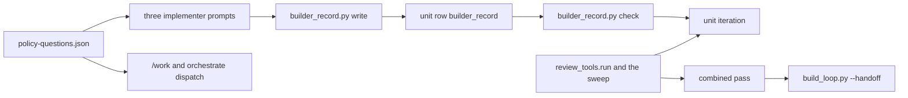

# Builder declarations and the build-loop review checks (issue #162)

## Summary

Builders declare against the published policy questions before a unit can hand off, and the build loop runs the review tools, the registered checks and the Jev sweep (TypeSafe's classifier, saying where to look) on that unit's changes. On the combined branch, a blocking tool finding in a lens the calibration file allows to block, or any secret the secret scanner reports, keeps the revision out of code review.

---

## Problem Frame

Issue #162 is card C11 of the saga review redesign (parent issue #147). The card is requirements-ready. The design rule is "The builder declares which questions apply," and Change 8's "Build loop" section is the behavior this card adds. The context-library quality gates (`docs/testing/quality-gates.md` in infiquetra-context-library, status proposed) ask a plugin change for package and script tests. This card adds no continuous-integration workflow. The issue's verification block is the bar. Card X2 is what extends that standard, and it is not this card.

The pieces this card calls already exist on this branch, and nothing joins them. `plugins/saga/scripts/review_records.py` `record_builder` validates one builder record and stores it on the unit row under the run record's lock. `plugins/saga/scripts/question_banks.py` loads the policy list from `plugins/saga/references/question-banks/policy-questions.json` and the four approved banks. `plugins/saga/scripts/review_tools.py` `run` writes findings for one change, including the pattern checks and the scripted checks registered on its adapter list. `plugins/saga/scripts/sweep_pieces.py` and the bundled `jev_sweep.sweep` produce where-to-look items. `plugins/saga/scripts/review_formula.py` `outcome` computes severity and whether a block is enforced. `plugins/saga/scripts/review_calibration.py` `may_block` answers per lens and language.

What does not exist is the declaration check, the write that keeps a repair's earlier entries, and any call from `plugins/saga/scripts/build_loop.py` to the runner or the sweep. A unit iteration runs the profile baseline and the plan's checks, then records `handed_to_code_review` when those are green. The combined pass runs that baseline, then deploy, test and teardown. `--handoff` admits a revision only after a green combined pass. Neither pass scans the diff.

The three implementer prompts already name the `builder_record` field, and `plugins/agent-launcher/roles/lifecycle-snapshot.json` already defines it. Issue #163 regenerated that snapshot at the lifecycle revision where the field landed. Nothing in those prompts, in `/work`'s dispatch, or in orchestrate's `/saga:work` task points at the policy list.

The card's four planning notes are decided in Key Technical Decisions. Names in the card (`builder_record.py`, `write`, `check`) are the contract.

---

## Requirements

Requirements are grouped by concern. R-IDs run continuously. AC-n is the nth checkbox under the issue's Acceptance criteria.

**The declaration check**

- R1. `python3 plugins/saga/scripts/builder_record.py check --record <file> --revision <sha> --repo <checkout>` exits 1, and names each question id, while any policy question lacks a declaration or any named proving test is absent or failing at that revision. The same command gives that verdict with no run record on disk. Exit 0 means every policy question is declared once and every named test passed. The script answers `--help` with no credential variables set (AC-2).

**Handoff of a unit**

- R2. A unit iteration whose declaration check exits 1 does not write `handed_to_code_review`, exits 4, and the printed iteration names each question id. A passing check, with the rest of the existing criterion green, records `handed_to_code_review` as it does today (AC-2).

**The stored record**

- R3. `builder_record.py write --issue <N> --unit <id> --record <file>` stores one builder record on that unit row. `review_records.validate` accepts it. A file the validator rejects exits 1, prints the problems, and leaves the row unchanged (AC-3).
- R4. A later write for the same unit keeps every earlier declaration and every earlier reason that the new file does not replace. The stored object is the merged record, and it still validates (AC-3).

**What an iteration runs**

- R5. Each unit iteration calls `review_tools.run` and the sweep on that unit's changes and stores the findings, the degraded inputs and the where-to-look items on the iteration. A tool finding does not, by itself, keep the unit from going green. `build_loop.py --dry-run` lists the tools, the checks, the sweep and the declarations an iteration needs, and it runs nothing (AC-1, AC-6).

**The combined-branch gate**

- R6. On the combined pass, a tool finding whose computed severity is `blocks` and whose `enforced` is true fails the pass. A finding from the secret scanner fails the pass in any lens, including a report-only lens. A blocking finding in a report-only lens, with no secret, does not fail the pass. A failed pass makes `build_loop.py --handoff` exit 2. The pass and the handoff start no review command and no reviewer session (AC-4).

**Who sees the questions**

- R7. The implementer prompt and both repair-implementer prompts name the policy-question path, the declaration duty and the `builder_record` field. `/work`'s dispatch text names the path. Orchestrate's rendered `/saga:work` task names the path, including a repair task minted as `/saga:work`. The worker agent type's prompt stays the role file's body (AC-5).

**Suites**

- R8. `python3 -m pytest plugins/saga/tests/test_build_loop.py plugins/saga/tests/test_builder_record.py -q --import-mode=importlib` passes. The iteration and combined-pass key tables in `plugins/saga/references/mechanical-baseline.md` match the keys the loop writes (AC-1).

---

## Key Technical Decisions

Each entry is the decision, then why, including the rejected alternative.

- **KTD1. `builder_record.py` has two subcommands, `write` and `check`, and the check never opens a run record.** `check` takes `--record`, `--revision` and `--repo` (the checkout whose tests run; default the working directory). `write` takes `--issue`, `--unit`, `--record` and optional `--store-root`. Exit codes for `check`: 0 passed; 1 a declaration or a named test failed, one `question <id>: <missing declaration|test absent|test failing>` line per question on standard error; 2 the file is unreadable, the record is not valid, the revision does not resolve, the policy fails to load, or a proving test is not a node id. Exit codes for `write`: 0 stored; 1 the validator rejected the file, or the merged record, and nothing was written; 2 no run record, or the file is unreadable; 5 the row is missing on a record orchestrate drives, the same code `review_records.py record-builder` already uses. Rejected: a third subcommand that only prints the policy. `question_banks.py load --policy` already does that.

- **KTD2. The policy list is read from the saga plugin that contains this script, never from the checkout under test.** `check` and the sweep call `question_banks.load_policy` and `question_banks.load_bank` with the plugin directory `Path(__file__).resolve().parents[1]`. `question_banks._locate` strips the `plugins/saga/` prefix, so that directory works both in this catalog and in an installed copy. A corpus checkout, and a head commit, cannot drop a question by shipping a shorter file. The question id set is whatever `load_policy` returns. The test does not hardcode 30. Rejected: `load_policy()` with no root, which uses the working directory when `plugins/saga` exists there. Rejected: pasting the question text into the three prompts. The text would drift from the approved file, and the brief forbids editing anything under `plugins/saga/references/question-banks/`.

- **KTD3. A proving test is a pytest node id, run as an argument vector in a detached worktree of `--revision`.** The id matches `^[A-Za-z0-9_./:=\[\]-]+$`. Anything else is exit 2 and the test is not run. The command is the interpreter running this script, then `-m`, `pytest`, the node id, `-q`, `--import-mode=importlib`, with `shell=False`. The child environment is a new dictionary: `PATH`, `LANG`, `LC_ALL`, `LC_CTYPE` and `TZ` copied when set, plus `HOME` and `TMPDIR` set to fresh directories. The worktree is `git worktree add --detach` at the resolved SHA, with `core.hooksPath` empty, and it is removed in a `finally`. Exit 0 is pass. Exit 4 or 5, or a run that collected no test, is absent. Any other non-zero exit, including a timeout of 120 seconds, is failing. `applies: false` with a null or omitted `proving_test` runs nothing. A non-null `proving_test` is run even when `applies` is false, because the card checks every named test. Every policy id appears exactly once. An id that is not in the policy is exit 1 and names that id. `check` accepts an injected `run_test(node, revision, repo)` so the suite can report pass, absent or fail without a worktree; one test in `test_builder_record.py` uses the real worktree on a temporary repository. Rejected: running the node id through a shell. The record is written by the builder and is untrusted input to this check.

- **KTD4. `write` validates, merges with the row's current record, then calls `review_records.record_builder`.** `record_builder` still replaces the row's `builder_record` key with one object. The merge is this script's, so a repair file does not have to repeat every earlier entry and the C1 writer does not grow a second store. Declarations merge by `question`: the new file wins for an id it carries, and an id only on the stored record stays. Reasons merge by `(kind, finding_id)`: the new text wins when both carry the pair, and a pair only on the stored record stays. `acceptance_criteria` comes from the new file when that array is non-empty, otherwise from the stored record. `unit` is `--unit`. The new file is validated before the merge. The merged object is validated again, and a problem in either exits 1 with the row unchanged. A stored record that itself fails validation is not merged; `write` exits 1 and stores nothing. There is no earlier record on the first write, so the new file is stored as given. Orchestrate still owns which rows exist: a missing row on a record whose extra keys include `orchestrate` raises `MissingUnitError` and exits 5. Rejected: storing the new file whole. That matches `record_builder` today and drops the earlier declarations the card's test requires. Rejected: a side file the loop reads instead of the row. The card requires the record on the run record, and K2's file path is `check`, which already takes a file.

- **KTD5. The unit loop records the scan and fails closed only on the declaration check and on a scan that did not run.** `run_iteration` adds one key, `review`, on every iteration. It holds `base`, `head`, `status` (`pass`, `fail` or `could-not-execute`), `findings`, `degraded`, `where_to_look` and `declarations`. `declarations` holds `status` and `questions`, the lines from KTD1. The iteration is not green when `declarations.status` is not `pass` or when `review.status` is `could-not-execute`. Findings, including a blocking finding, do not by themselves clear `green`. The builder sees them on the iteration and fixes or explains them; the stop before the large language model is the combined pass (KTD7). `format_iteration` prints each declarations line. `apply_iteration` is unchanged: it writes `handed_to_code_review` only when `green` is true. Rejected: failing the unit on every blocking finding. The card separates that rule onto `--handoff`.

- **KTD6. The scan is `review_tools.run` with `framework=True`, then one sweep over the four approved banks. Tests inject both.** Adapters are `review_tools.default_adapters()` unless the caller passes a list. That list is what the build-loop tests pass, so the suite does not start Semgrep or any other tool. `framework=True` is how this loop starts the relocated test run. `plugins/saga/references/mechanical-baseline.md` currently says the loop does not start it; this card deletes that sentence. The profile path passed in is the checkout's `.saga-profile.json`. The runner already prefers the base commit's blob and records a head-profile change without applying it. The sweep loads each lens in `question_banks.LENSES` with `load_bank`, concatenates `questions`, and calls `sweep_pieces.pieces` then `jev_sweep.sweep` with an injected `ask`. A bank that refuses, a missing rate, or a sweep exception appends one degraded input and continues. The iteration stays eligible for green. Cache and log directories sit under a fresh directory the test can point at, not under the operator's home, except in production where they sit at `~/.saga/review-sweep/<head sha>/`. The sweep does not print an API key. `ask` defaults to the sweep's own client only on the production path. Rejected: `framework=False`, which would leave the relocated run unstarted, the opposite of the sentence this card removes. Rejected: the default bank path `plugins/saga/references/question-bank.json` that `review_command.py` still uses. That file is not the list C7 published.

- **KTD7. The combined pass uses the same scan, and the gate reads `outcome` plus the secret row.** After the baseline, and on a waived repository as well, the pass runs KTD6's scan and writes the same `review` object, with `declarations` set to null. For each finding that does not already carry a computed severity, call `review_formula.outcome` with the builder records on the unit rows and the may-block map from KTD8. A finding whose returned `severity` is `blocks` and whose `enforced` is true fails the gate. Separately, a finding whose `rule.row` is `review_records.SECRET_ROW` (`security.secret-in-diff`), or whose `source.name` is `gitleaks`, fails the gate even when `enforced` is false. The gate's reasons are stored on `review.gate`. `_pass_status` treats a `review` whose `status` is `fail` as a failing result, and `could-not-execute` as that status. A gate that is not `pass` sets `skipped_reason` and does not deploy, the same way a red baseline already skips deploy. `handoff` is not given a second copy of this rule: it already exits 2 when the latest combined pass is not green. The pass and `handoff` do not import `review_command` and do not start a reviewer. The test records every argument vector and asserts none starts with `review_command.py` or a reviewer client. Rejected: treating `enforced` as the secret rule. With the committed calibration file's `corpus_run` of `no-run`, `may_block` returns report-only, `enforced` is false, and a secret would pass. The card says a secret fails in any lens.

- **KTD8. May-block is read from the installed saga, and the profile is the base commit's.** For every lens in `review_formula.LENSES` and every language on a finding, plus `none`, call `review_calibration.may_block` with `root` the plugin directory from KTD2, the plugin's calibration file, and a temporary copy of `.saga-profile.json` from the base commit. The bool is true only when the returned line starts with `yes`. The map passed to `outcome` is `{lens: {language: bool}}`, which is the shape `_may_block` already reads. A `CalibrationError`, or a base profile that is not JSON, sets `review.status` to `could-not-execute` and the pass is not green. Rejected: `root` equal to the checkout. A head commit could then make its own fingerprint look stale. Rejected: reading the checkout's working-tree profile. Issue #188 already forbids that for the scan.

- **KTD9. Base is the merge-base of the revision with its upstream, and an unknown base does not scan.** Head is the iteration's or the pass's full SHA, the value `head_revision` already records. Base is `--base` when the command passes one. Otherwise it is `git merge-base` of that SHA with `@{upstream}`, then with `origin/HEAD`. When none of those resolve, `review.status` is `could-not-execute`, `base` is null, and no adapter runs. The iteration or the pass is not green. Both the unit iteration and the combined pass use this rule, so the combined diff is everything the branch introduces against where it merges. Rejected: scanning with base equal to head. The diff is empty and a secret in the branch is invisible.

- **KTD10. The existing `FakeRunner` tests stay green without a new argument on every call.** `run_iteration` and `run_combined_pass` take keyword-only `scan` and `declare`. When they are omitted and `runner` is `subprocess_runner`, the real scan and the real declaration check run. When they are omitted and `runner` is anything else, `review` is written as a pass with empty findings, empty where-to-look and, on a unit iteration, `declarations.status` of `pass`. The key is still present, so the key-set test matches the updated fence. Every new behavior in this card is a test that passes `scan` or `declare` explicitly. Production `main` uses `subprocess_runner`, so a real run does not take the empty path. Rejected: editing each of the existing `main` calls in `test_build_loop.py` to thread a fake. The default above keeps those calls, and a forgotten call would skip the gate only under a fake runner.

- **KTD11. The questions are carried by path, on every dispatch route, including repairs.** The path is `plugins/saga/references/question-banks/policy-questions.json`. The implementer prompt's "review expectations" input says to read that file and, before the build loop, to write one declaration per question with `builder_record.py write`. Both repair prompts say the same, and they say a later write keeps earlier declarations and reasons. `/work`'s subagent dispatch in `plugins/saga/skills/work/references/execution-strategy.md`, and the matching bullet in `plugins/saga/skills/work/SKILL.md`, include that path and that duty. `normalize_task` in `plugins/orchestrate/skills/orchestrate/scripts/orchestrate.py` appends one sentence with that path when the capability is `work`, after the notes it already appends, so a replacement worker whose task starts with `/saga:work` gets it too. `lifecycle-snapshot.json` is not regenerated and not edited. Issue #163 already regenerated it at the lifecycle revision that added `builder_record`, which is the condition the card set for whichever of C8, C11 and C12 landed first. The prompts already name the field, which is what `test_prompt_names_every_required_contract_field` checks. Rejected: copying the thirty question texts into the prompts and the two dispatch sites.

- **KTD12. No version bump, and the question banks stay byte-for-byte.** The three changelogs gain an Unreleased entry. No `plugin.json` changes. `review_calibration.COMPONENTS` does not gain `builder_record.py` in this card; that fingerprint is a later item. The banks under `plugins/saga/references/question-banks/` are not edited. `DECISIONS.md` records KTD2, KTD4 and KTD7. Rejected: a version bump in the same commit. Bumps in this repository ship in `chore(release)` commits, because they restamp the fleet bundles.

---

## High-Level Technical Design

The builder writes the record. The unit loop checks it and records the scan. The combined pass scans again and is the gate `--handoff` already trusts.



`review` on an iteration, and on a combined pass:

| Field | Holds |
|---|---|
| `base` | full SHA, or null when KTD9 could not resolve one |
| `head` | full SHA the iteration or pass ran at |
| `status` | `pass`, `fail`, or `could-not-execute` |
| `findings` | tool findings as the runner wrote them, with no computed severity |
| `degraded` | degraded inputs from the runner and the sweep |
| `where_to_look` | sweep items, unanswered |
| `declarations` | on a unit iteration, `{status, questions}`; on a combined pass, null |
| `gate` | on a combined pass, the lines that failed KTD7; otherwise an empty list |

Exit codes of `build_loop.py` do not change. Exit 4 is still "not green yet," and a failed declaration is one more way to get it. Exit 2 from `--handoff` is still "the latest combined pass is not green."

---

## Risks & Dependencies

The committed calibration file has `corpus_run` set to `no-run`, so `may_block` answers report-only for every lens until a calibration run is recorded. On a real repository today, only a secret fails the new gate. That is C2's rule. The tests inject the may-block map, so AC-4 does not depend on that file changing.

A real unit iteration now runs the tool runner and the relocated test, and it stays at exit 4 until a builder record covers every policy question. A run that never writes the record does not hand off. The dry run lists that requirement before the first iteration.

This card depends on the landed C1 writer, C2 `may_block`, C4a's runner, and C7's loader. It does not wait on a card that is still open.

---

## Implementation Units

Five units, in order. U2 and U3 both edit `plugins/saga/scripts/build_loop.py` and `plugins/saga/tests/test_build_loop.py`. Later units extend those files. They do not rename them.

### U1. The builder-record script

`write` stores a validated record on the unit row, and `check` judges a file with no run record.

**Goal:** A missing question, or a named test that is absent or failing, fails `check` and names the question. A repair write keeps earlier entries. A record the validator rejects is not stored.

**Requirements:** R1, R3, R4.

**Dependencies:** none.

**Files:** `plugins/saga/scripts/builder_record.py` (new); `plugins/saga/tests/test_builder_record.py` (new); `plugins/saga/references/run-record.md` (modify).

**Approach:** Implement KTD1, KTD2, KTD3 and KTD4. `run-record.md` keeps the sentence that `record-builder` replaces the key, and adds that `builder_record.py write` merges first so the object it replaces with still carries the earlier entries. Do not edit `review_records.py` except to call `record_builder`, `validate` and `builder_record_for`. Do not edit the schema.

**Patterns to follow:** `record_builder` and `main` in `plugins/saga/scripts/review_records.py`. Temporary git repositories in `plugins/saga/tests/test_review_tools.py` (`_init`, `_commit`). The policy loader in `plugins/saga/scripts/question_banks.py`.

**Test scenarios:**

- Happy path: `test_declaration_check_passes_a_complete_record_with_no_run_record`. A temporary repository with one commit adds `test_ok.py` and a test named `test_ok`. The record declares every id from `load_policy`, one of them `applies: true` with proving test `test_ok.py::test_ok`, the rest `applies: false` with `proving_test` null, and one reason the schema accepts. `check` exits 0. The process never creates a `runs/issue-*.json` file. `-k declaration_check` selects it.
- Edge: `test_declaration_check_names_a_missing_question`. Drop one id. Exit 1. Standard error contains `question <that id>: missing declaration`.
- Error: `test_declaration_check_names_an_absent_test` and `test_declaration_check_names_a_failing_test`. The same repository, with the node renamed, exits 1 and says `test absent`. A test that asserts false exits 1 and says `test failing`. Both lines carry the question id.
- Error: `test_write_refuses_a_record_the_validator_rejects`. A record missing `reasons` exits 1. The unit row's `builder_record` is absent, or is the earlier valid record when one was stored first.
- Integration: `test_a_repair_write_keeps_earlier_declarations_and_reasons`. Write a valid record with two declarations and one reason. Write a second valid record that changes the first declaration, omits the second, and adds a different reason. The stored record has both declarations, the first one updated, and both reasons. `review_records.validate` returns `[]`.
- The new script mentions argparse. `python3 -m pytest plugins/saga/tests/test_entrypoints.py -q --import-mode=importlib -k builder_record` passes, which is the existing `--help` check with credential prefixes stripped. No edit to that test file unless the node id does not contain `builder_record`.

**Verification:** `check` on a file matches the verdict the temporary repository produces, and a rejected write leaves the row unchanged.

**Functional checks:**

```functional-checks
- name: declaration-check-and-store
  command: python3 -m pytest plugins/saga/tests/test_builder_record.py plugins/saga/tests/test_entrypoints.py -q --import-mode=importlib -k "declaration_check or repair_write or builder_record"
  proves: [AC-2, AC-3]
  runs: local
```

### U2. The unit iteration

The iteration runs the scan, runs the declaration check, and lists both in the dry run.

**Goal:** An undeclared question keeps the unit off `handed_to_code_review`. A passing check records it. The dry run names the tools, the checks, the sweep and the declarations.

**Requirements:** R2, R5, R8.

**Dependencies:** U1.

**Files:** `plugins/saga/scripts/build_loop.py` (modify); `plugins/saga/tests/test_build_loop.py` (modify); `plugins/saga/references/mechanical-baseline.md` (modify); `plugins/saga/skills/work/SKILL.md` (modify).

**Approach:** Implement KTD5, KTD6, KTD9 and KTD10 for the unit iteration only. Add `review` to the `ITERATION KEYS` fence. Keep `functional_checks_reason` and `scenario_smoke_reason` conditional, as the key-set test already allows. Append the dry-run block at the end of `format_dry_run`, after the branch-preview lines, so the existing split on `Review tools this baseline does not name:` through `Child-scoped functional checks` stays intact. The new block's four headings are `Tools:`, `Checks:`, `Sweep:` and `Declarations:`. `Tools:` lists adapter ids from `default_adapters()` whose `tool` is non-empty. `Checks:` says those adapters include the pattern checks and the scripted checks. `Sweep:` names the four bank paths under `plugins/saga/references/question-banks/`. `Declarations:` names `builder_record.py check` and the policy path. Do not put a line `  coverage ` or the token `relocated-test` inside the uncovered-tools section. In `SKILL.md` Phase 3.1, state that exit 4 also means the declaration check named a question, and keep the existing sentences `4 — not green yet` and `loop iteration, not a refusal`. Delete the mechanical-baseline sentence that says this loop does not start the relocated test, and say the unit iteration starts it through `review_tools.run`.

**Patterns to follow:** `run_iteration` and `format_dry_run` in `plugins/saga/scripts/build_loop.py`. `FakeRunner` in `plugins/saga/tests/test_build_loop.py`. The sweep call in `plugins/saga/scripts/review_command.py` `_sweep`, with this card's bank source from KTD6 instead of `question-bank.json`.

**Test scenarios:**

- Happy path: `test_a_passing_declaration_check_records_handed_to_code_review`. `declare` returns pass. `scan` returns one finding and one where-to-look item. The iteration's `review.findings` and `review.where_to_look` hold them, `green` is true, and `handed_to_code_review.revision` is the iteration revision.
- Edge: `test_an_undeclared_question_is_not_handed_off`. `declare` returns exit 1 and the line `question correctness-01: missing declaration`. Exit code of `main` is 4. The block has no `handed_to_code_review`. The printed iteration contains `correctness-01`.
- Error: `test_a_scan_that_does_not_run_is_not_green`. `scan` reports `could-not-execute` with detail `no-base`. Exit 4. No adapter argv was recorded.
- Integration: `test_the_dry_run_lists_review_work`. The dry-run text contains the four headings `Tools:`, `Checks:`, `Sweep:` and `Declarations:`, and it contains `policy-questions.json`. `FakeRunner.calls` gains no tool command from the dry run.
- The existing key-set test `test_the_iteration_key_set_matches_the_reference_document` passes with `review` on the fence. Existing `main` calls that pass only `FakeRunner` still exit 0.

**Verification:** A unit row with a failing declaration check has iterations and no `handed_to_code_review`. The dry run prints the four headings and writes nothing.

**Functional checks:**

```functional-checks
- name: unit-loop-suites
  command: python3 -m pytest plugins/saga/tests/test_build_loop.py plugins/saga/tests/test_builder_record.py -q --import-mode=importlib
  proves: [AC-1, AC-2]
  runs: local
- name: dry-run-lists-review-work
  command: python3 -m pytest plugins/saga/tests/test_build_loop.py -q --import-mode=importlib -k dry_run_lists_review_work
  proves: [AC-6]
  runs: local
```

### U3. The combined-pass gate

A blocking enforced finding, or a secret, keeps `--handoff` from admitting the revision.

**Goal:** `--handoff` refuses when the combined pass saw an enforced block or a secret, and it admits the revision when the only blocking finding is report-only.

**Requirements:** R6.

**Dependencies:** U2.

**Files:** `plugins/saga/scripts/build_loop.py` (modify); `plugins/saga/tests/test_build_loop.py` (modify); `plugins/saga/references/mechanical-baseline.md` (modify); `plugins/saga/skills/work/SKILL.md` (modify).

**Approach:** Implement KTD7 and KTD8 on `run_combined_pass`. Add `review` to the `COMBINED PASS KEYS` fence. Keep `waiver`, `skipped_reason` and `interrupted` conditional, as that key-set test already allows. `_pass_status` includes `review` when it is a mapping with a `status`. In `SKILL.md` Phase 3.3, say the pass reruns the tools and that a failed gate is exit 4, after which Phase 5.1's `--handoff` refuses and `/code-review` is not called. Do not add a review-command call anywhere in this file.

**Patterns to follow:** `outcome` and `_may_block` in `plugins/saga/scripts/review_formula.py`. `may_block` in `plugins/saga/scripts/review_calibration.py`. The may-block map built in `plugins/saga/scripts/review_command.py`.

**Test scenarios:**

- Happy path: `test_combined_gate_handoff_admits_a_report_only_block`. `scan` returns one finding with `rule.row` `security.scanner-high`, `lens` `security`, `language` `python`, and no computed severity fields. The injected may-block map has `security.python` false. The pass is green. `--handoff` exits 0. The recorded argv contains no `review_command.py` and no reviewer client name (`claude`, `codex`, `grok`).
- Error: `test_combined_gate_handoff_refuses_an_enforced_block`. The same finding with `security.python` true. The pass status is `fail`, `skipped_reason` is set, deploy was not called, and `--handoff` exits 2.
- Error: `test_combined_gate_handoff_refuses_a_secret_in_any_lens`. A finding with `rule.row` `security.secret-in-diff` and `source.name` `gitleaks`, with every may-block bool false. The pass is not green and `--handoff` exits 2.
- Edge: `test_combined_gate_key_set_includes_review`. `test_the_combined_pass_key_set_matches_the_reference_document` passes after the fence gains `review`.
- A finding that already carries `severity` is not passed to `outcome`. The pass records `could-not-execute` and names that finding.

**Verification:** `--handoff` exits 2 after an enforced block or a secret, and exits 0 after a report-only block, with no review command in the argument vectors.

**Functional checks:**

```functional-checks
- name: combined-gate-handoff
  command: python3 -m pytest plugins/saga/tests/test_build_loop.py -q --import-mode=importlib -k combined_gate_handoff
  proves: [AC-4]
  runs: local
```

### U4. Carry the questions to every builder

The three role prompts, `/work`'s dispatch and orchestrate's `/saga:work` task all name the policy file.

**Goal:** A builder on any of those routes can open the policy list, and the three prompts still name `builder_record`. The worker prompt remains the role file's body.

**Requirements:** R7.

**Dependencies:** U1.

**Files:** `plugins/agent-launcher/roles/implementer.md` (modify); `plugins/agent-launcher/roles/standard-repair-implementer.md` (modify); `plugins/agent-launcher/roles/expert-repair-implementer.md` (modify); `plugins/saga/skills/work/SKILL.md` (modify); `plugins/saga/skills/work/references/execution-strategy.md` (modify); `plugins/orchestrate/skills/orchestrate/scripts/orchestrate.py` (modify); `plugins/agent-launcher/tests/test_roles_library.py` (modify); `plugins/orchestrate/tests/test_orchestrate_task_dispatch.py` (modify); `plugins/saga/tests/test_role_agent_types.py` (modify).

**Approach:** Implement KTD11. Do not edit `lifecycle-snapshot.json`, `index.json`, or `plugins/agent-launcher/roles/README.md`. The new role text sits in the review-expectations input, not only in the output-contract section, and the output-contract section keeps the `builder_record` lines that are already there. The orchestrate sentence is a constant next to `UNATTENDED_NOTE`, appended from `normalize_task` only when the capability is `work`.

**Patterns to follow:** The review-expectations paragraph in `plugins/agent-launcher/roles/implementer.md`. `normalize_task` and `UNATTENDED_NOTE` in `plugins/orchestrate/skills/orchestrate/scripts/orchestrate.py`. `test_the_prompt_is_the_library_file_body_behind_the_hosting_preamble` in `plugins/saga/tests/test_role_agent_types.py`.

**Test scenarios:**

- Happy path: `test_policy_questions_are_named_in_each_implementer_prompt` in `test_roles_library.py`. Each of the three role files contains `plugins/saga/references/question-banks/policy-questions.json`, the word `applies`, and `builder_record`. The snapshot file's bytes are unchanged.
- Happy path: `test_policy_questions_are_on_the_saga_work_task` in `test_orchestrate_task_dispatch.py`. `normalize_task("claude", "/saga:work docs/plans/x.md")` contains the policy path. The same assertion on a task that `normalize_task` builds for a replacement worker, the `/saga:work` string `_replacement_worker` assigns.
- Integration: extend `test_the_prompt_is_the_library_file_body_behind_the_hosting_preamble` so the worker prompt equals the hosting preamble plus the role body, and the prompt contains the policy path. Do not assemble the prompt from anywhere else.
- Edge: `normalize_task` on `/saga:plan` does not gain the policy sentence.

**Verification:** The three prompts, the work dispatch paragraph and a normalized `/saga:work` task each contain the policy path, and the worker prompt test still compares equal to the role file body.

**Functional checks:**

```functional-checks
- name: questions-reach-builders
  command: python3 -m pytest plugins/agent-launcher/tests/test_roles_library.py plugins/orchestrate/tests/test_orchestrate_task_dispatch.py plugins/saga/tests/test_role_agent_types.py -q --import-mode=importlib -k "policy_questions or library_file_body"
  proves: [AC-5]
  runs: local
```

### U5. Changelog and journal

The three changelogs and the engineering journal record the card. No package version changes.

**Goal:** A reader of each plugin changelog can see what issue #162 added, and the journal holds the three decisions that a later card will trip over.

**Requirements:** R8.

**Dependencies:** U1, U2, U3, U4.

**Files:** `plugins/saga/CHANGELOG.md` (modify); `plugins/agent-launcher/CHANGELOG.md` (modify); `plugins/orchestrate/CHANGELOG.md` (modify); `docs/engineering-journal/DECISIONS.md` (modify).

**Approach:** Under each changelog's `## [Unreleased]` `### Added` section, add one bullet for issue #162. Saga's bullet names `builder_record.py` and the build-loop gate. The agent-launcher bullet names the three prompts and the policy path. The orchestrate bullet names the `/saga:work` sentence. Create the Unreleased heading only if that file lacks one. Do not edit any `plugin.json`. `DECISIONS.md` records KTD2 (policy loaded from the plugin directory), KTD4 (merge, then replace), and KTD7 (secret row fails even when the lens is report-only), each with the rejected alternative and a revisit condition. Revisit KTD7 when the calibration file records a run and `may_block` returns `yes` for the security lens. No `LEARNINGS.md` entry in this unit: the mechanism is the decision itself, and there is no separate surprise to record until the implementation finds one.

**Patterns to follow:** The Unreleased entry for issue #157 at the top of `plugins/saga/CHANGELOG.md`. The decision entries at the top of `docs/engineering-journal/DECISIONS.md`.

**Test scenarios:**

Test expectation: none -- changelog bullets and a journal entry. The suites that guard the loop's keys already run in U2 and U3.

**Verification:** Each changelog mentions issue #162 under Unreleased, and `git diff` shows no `plugin.json` and no file under `plugins/saga/references/question-banks/`.

---

## Scope Boundaries

**In scope**

The declaration check, the merging write, the unit iteration's scan and sweep, the combined pass's gate, the three prompts, `/work`'s dispatch text, orchestrate's `/saga:work` sentence, the reference and changelog updates above, and the journal decisions.

**Out of scope**

- The tool runner and its adapters, the pattern checks, the scripted checks, the sweep implementation, the question banks, the builder-record schema, and the lifecycle contract field. This card calls them and does not change their rules.
- `review_command.py` reading the unit row. It still takes a builder-record file.
- Corpus cases calling `check` (card K2), and the review screens (cards C13 and C14).
- Editing `plugins/saga/references/question-banks/`, regenerating `lifecycle-snapshot.json`, or bumping a plugin version.
- A sandbox around the proving-test pytest beyond the node-id charset, the argument vector, the detached worktree and the environment allow-list. The review command's reproduction sandbox is a different run.

**Deferred to follow-up work**

- Add `plugins/saga/scripts/builder_record.py` to `review_calibration.COMPONENTS`, and to the component fence, when a card is ready to extend that fingerprint. This card's tests do not require it.
- Holding a unit at exit 4 until every where-to-look item has a `where-to-look-explanation` reason. The design says the reviewer checks those reasons and cannot block on them. This card records the items and does not gate on the explanations.
- Teaching `review_command.py prepare` to load the four C7 banks instead of `question-bank.json`. That default is C10a's, and this card does not change it.

---

## Scenario Smoke

```scenario-smoke
- name: affected-suites
  command: python3 -m pytest plugins/saga/tests/test_build_loop.py plugins/saga/tests/test_builder_record.py plugins/saga/tests/test_role_agent_types.py plugins/agent-launcher/tests/test_roles_library.py plugins/orchestrate/tests/test_orchestrate_task_dispatch.py -q --import-mode=importlib
  proves: [AC-1, AC-5]
  runs: environment
```

---

## Sources

- `docs/brainstorms/2026-10-05-saga-review-redesign/cards/C11-build-loop-declarations.md`, the card.
- `docs/brainstorms/2026-10-05-saga-review-redesign/plan.md`, the design rule "The builder declares which questions apply" and Change 8, "Build loop."
- `plugins/saga/references/mechanical-baseline.md`, the iteration keys, the combined-pass keys, and the review gate.
- `plugins/saga/references/run-record.md`, the `builder_record` row key.
- `plugins/saga/references/review-records.md` and `plugins/saga/references/review-records.schema.json`, the builder-record fields and `SECRET_ROW`.
- `plugins/agent-launcher/roles/README.md`, the snapshot is regenerated, never edited. Issue #163 already did that regeneration.
- `plugins/agent-launcher/roles/implementer.md`, the unfilled "review expectations" input, and the `builder_record` lines already in the output contract.
- infiquetra-context-library `docs/testing/quality-gates.md`, the proposed plugin gate. This card's verification block is the check, and no workflow is added.
