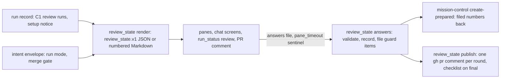

# Review state for every harness and fix-later choices (issue #164)

## Summary

One new script renders a review's state and pending choices as a versioned document (JSON for panes, Markdown with numbered questions for every other harness), records every answer through `--answers -`, files fix-later items through mission-control, and publishes one pull-request comment per round with the fix-later checklist on the final one. `run_status.py review` becomes a reader of that document.

---

## Problem Frame

This is card C13 of the saga review redesign (parent issue #147): Change 10 except the mods, plus "Block, fix later and note".

Today, under `plugins/saga/`, no one document holds a review's state: `/review-view` reads `run_status.py review` (`scripts/run_status.py:477-522`), the band reads its summary, and the pull-request comment has no checklist (`scripts/review_result.py:1036-1115`). Merge confirmation is prose: `/work` asks a question (`skills/work/SKILL.md:93-95`) while the merge stays explicitly confirmed (`:1074-1080`, pinned by `tests/test_work_gate_integrity.py`). No fix-later choice exists; open findings become defect issues only at the cycle cap through `residual_issue_payloads` (`review_result.py:992-1029`), and filing is mission-control's lane. The intent envelope already records attended versus unattended and the merge gate at run start, and saga asks no second run-start question (`scripts/intent_envelope.py`, the single-asker rule). Admission sets the pattern this card copies: one document rendered as JSON and as fixed Markdown from one row set (`scripts/admission.py:1460-1466`), answers returned through `--answers -`, a Claude Code pane that waits at most 30 minutes.

C1 (issue #148) and C10a (issue #160) have landed in this tree: `review_records.py` with the `review_records.v1` schema and `merge_outcome` field, and `review_command.py` storing one `review_run` per round in `review_cycles`. This card reads those records and never recomputes grades. C14 draws the document in panes, C10b switches `/code-review` to it and carries out the merge, C16 files boxes ticked later, C15 posts outcomes to Langfuse.

---

## Requirements

Requirements are grouped by concern; R-IDs run continuously.

**Document and render**

- R1. `review_state.py render` builds the `review_state.v1` document on demand from the stored C1 review runs: each lens's grade with blocking and fix-later counts; the where-to-look list with each item's state; tools that ran or were missing with C3's notice text as stored at `admission.setup_notice`; degraded inputs; the round and the cost so far; per-round deltas by finding identity; disputed "doesn't apply" and "unaffected" declarations; consequence disagreements; "unconfirmed" consequences; the pending choices; and the merge-wait display from the envelope's merge setting and the round rules (AC-2, AC-6).
- R2. `--render markdown` prints the same lenses, items and choices as Markdown with numbered questions (`Q1.`, `Q2.`, each ending in `(answer: <choice-key>)`), using bold titles and never Markdown headings, so any harness prints it verbatim and maps answers back by number (AC-2).
- R3. `run_status.py review` prints from the review-state document and keeps its name as the code-review skill's fallback view (AC-1).
- R4. `review_state.py --help` exits 0 with no credentials set, covered by the `test_entrypoints.py` argparse glob (AC-1).

**Answers**

- R5. Every answer is recorded only through `--answers -`, which validates before writing: an unknown item or choice, or a merge over blocking items with no reason, is refused unrecorded with exit 2 and a message naming what is wrong (AC-3).
- R6. Each fix-later answer lands on its finding's C1 `merge_outcome` by setting the outcome on the finding in the stored run under `run_record.update` and passing the whole run through `review_records.validate`; `record_run` is never called for an update, because it validates findings in input form and refuses any finding that already carries `severity`. Outcomes are `fixed-now`, `filed` with the issue number, or `left` (AC-4).
- R7. Each blocking-merge answer is recorded as a `review_cycles` entry with `loop: "merge_confirmation"`: `merge-with-reason` carrying the reason and the blocking identities it covers, or `stop-card`. C10b reads it to carry out or hold the merge (AC-3).

**Filing and unattended**

- R8. `file-as-issue` files at once through mission-control in three steps, all run with a fresh temporary directory as the working directory: `issue prepare` with a complete defect body (type `defect`, team `asgard`, project `operations`, status `Discovering`, risk from the finding's consequence group); a `stage: Shaping` fill-in on the generated draft, the documented R3b recovery for a prepare with no `--stage` flag; then `issue create-prepared <draft> --yes --skip-approval` with the global `--format json`. The created number is taken from the success JSON, or — on any other exit — re-read from the sidecar's `created_issue_number`; a call that already created an issue is recorded `filed` with that number and never retried. Anything else refuses the answer unrecorded with mission-control's message. The new script contains no issue-creating command, and the two edited skills mention it only inside a negation (AC-4).
- R9. The security guard files a harm the security lens's LLM traced but could not reproduce, attended or not, unless the operator chose fix-now for that item (AC-6).
- R10. Unattended — the envelope's run mode, or a pane timeout — files nothing apart from the security guard. `auto` needs no answer once every lens is at C or better, `gate` waits, and blocking items at the round limit or an early stop wait under either setting; fix-later choices never hold a merge. When `pane_timeout` is true the answers map must be empty; a non-empty map is refused unrecorded (AC-6).
- R11. The profile key `fix_later_unattended_default` takes `leave` or `file`; a profile without it stays valid and means `leave`. One rule for the bundle: an unattended run never files it, and an attended merge confirmation with the `file` default prepares one follow-up issue listing every fix-later item still unanswered or `left` (AC-7).

**Comments**

- R12. Publishing posts one `gh pr comment` per round and never `gh pr review` in any form; only the final round's comment carries a checkbox per fix-later item, and only it carries the `<!-- saga:fix-later-checklist -->` marker C16's job matches (AC-5).

**Suite**

- R13. `python3 -m pytest plugins/saga/tests/test_review_state.py -q --import-mode=importlib` passes with no network; `test_run_status.py` covers the new reader; `test_work_gate_integrity.py` passes unchanged (AC-8).

---

## Key Technical Decisions

Each entry is the decision, then why, naming what was rejected. KTD1, KTD4, KTD5 and KTD7 settle the card's four "for the planning step" notes.

- **KTD1. The document is rendered on demand from the run record, as admission does; no file is kept.** One row set feeds both the JSON and the fixed Markdown (`admission.py:1460-1466`), so the two cannot drift. A stored copy would need invalidation against every later review round, answer and filing, and every stale copy would present as the review's state. The printed document carries the checked version token `review_state.v1`. Answers write through C1's writer and `run_record.update` under the record lock, carrying every other key forward. Rejected: keeping a `review_state` file beside the record (a second source of truth with no invalidation story).
- **KTD2. Fix-later outcomes ride C1's `merge_outcome` field, stamped in place and re-validated; the blocking-merge decision is a `review_cycles` entry with `loop: "merge_confirmation"`.** The field already enumerates `fixed-now`, `filed` (needs `issue`) and `left`. The update never calls `record_run`: that writer validates findings in input form and refuses any finding that already carries `severity`, which every stored finding does. Instead the script sets `merge_outcome` on the finding in the stored run under `run_record.update` and passes the whole run through `review_records.validate` — sound because `merge_outcome` is not one of `COMPUTED_FINDING_KEYS`, so validation re-checks the recomputed fields and accepts the outcome change while still refusing anything else malformed. The merge decision has no C1 home — the formula's `merge` block is the computed answer, not the operator's — so it follows C12's `plan_review` precedent: a new entry shape in `review_cycles`, never a thirteenth top-level key and never a mutation of C1's schema. It carries `decision`, `reason` (required for `merge-with-reason`, absent for `stop-card`), the `blocking` identities it covers, and `answered_at`. Every current reader of that array skips it the way it skips C1's `review_run` entries. Rejected: extending the `review_run` schema with a decision block (mutates C1's contract for a consumer C1 never named).
- **KTD3. Filing is mission-control's prepare, then create, through injected runners — and a created issue is never retried.** `review_state.py` files in three steps, each a subprocess of `sdlc_manager.py` resolved by the mission-control markers, all run with a fresh temporary directory as the working directory so no draft lands in the repo: (1) `sdlc_manager.py --format json issue prepare --repo <reviewed> --type defect --team asgard --project operations --title <...> --status Discovering --risk <tier> --source-file <body>`, where the body is a complete defect card (every required H3 section, an executable acceptance criterion, a tier-plus-justification Risk) and `--format json` is the global flag before the subcommand; (2) a `stage: Shaping` line added to the draft front matter, the documented R3b fill-in for a prepare that has no `--stage` flag; (3) `sdlc_manager.py --format json issue create-prepared <draft> --yes --skip-approval`. `--skip-approval` bypasses the U11 gate for this invocation only, and the basis is the operator's own file-as-issue choice when attended, the card's security-guard and `file`-default policy when not; the sidecar keeps its `needs_operator_approval` stamp so the durable record shows the gate was owed. The routing constants are the ones this program's own cards carry (team asgard, project operations, Shaping/Discovering); a later card makes them per-repo when saga reviews outside this program. After every create invocation the script re-reads the sidecar: a `created_issue_number` means the issue exists and is recorded `filed` with that number even when post-create steps failed — `issue_create_prepared` raises after creating when board-add, stage or status fails — and is never retried. Anything else refuses the answer unrecorded with mission-control's message. Tests inject the runner; one offline test runs the real prepare plus the stage fill-in and asserts readiness passes with no network. Rejected: hand-rendering a draft and sidecar (mirrors mission-control's evolving format and, as first written, missed the sidecar entirely); in-process import of mission-control (couples saga to its internals); a saga-side issue-creating command (crosses the ownership lane `review_result.py:1023-1028` already observes).
- **KTD4. A pane timeout arrives as the `pane_timeout` sentinel on the answers file, and the script decides what that means.** The answers JSON may carry `"pane_timeout": true` beside possibly empty `answers`; the script then applies the unattended rules itself — files only security-guard items, records nothing else — rather than trusting the mod to have filed correctly. A timeout the mod silently swallowed would otherwise present as answered. The answers come from the harness, which this card treats as untrusted, so when the flag is true the answers map must be empty: a non-empty map is refused unrecorded, and only the unattended rules apply. Rejected: a separate `--timed-out` flag (two answer paths to keep in sync), and letting the mod file before reporting (the filing decision would live in the mod, untestable without the harness).
- **KTD5. The final comment opens with `<!-- saga:fix-later-checklist -->` on its own line, final round only.** An HTML comment is invisible on every screen that renders the comment, greppable by C16's job, and impossible to collide with finding text. Earlier rounds carry no marker, so a job that matches the token can only find the final checklist. Rejected: matching on the checkbox list itself (a repair round's prose could mimic it) and a marker on every round's comment (C16 would need round tracking to pick the latest).
- **KTD6. The envelope arrives by file in tests and from the issue body in real runs; no new run-start question is asked.** `render` and `answers` take `--record` plus `--envelope` (a validated intent-envelope JSON) or `--issue` plus `--repo`, mirroring `plan_review.py`'s `--record`/`--body-file` split; with `--issue`, the script reads the issue body's fenced envelope block via `gh` and validates it through the canonical module. Run mode and the merge gate come from that envelope only, preserving the single-asker rule. All tests use `--envelope` with fixture envelopes, so nothing needs the network. Rejected: storing the envelope on the run record (a new top-level key for data the issue already carries), and re-asking attended versus unattended at merge confirmation (re-asks an answered question, which the drift guard forbids).
- **KTD7. The profile key is the top-level `fix_later_unattended_default`, `leave` or `file`, absent valid meaning `leave`.** `repository-profile.md` reserves `review` for the shared-update-path rule and sends later review settings to their own top-level keys. `leave` is the default because unattended filing is the exception: only the security guard files without an operator. `file` prepares one follow-up issue per pull request listing every fix-later item, filed through the same KTD3 seam at merge confirmation. Rejected: nesting under `review` (against the profile's own rule), and defaulting to `file` (files issues for runs whose operator never asked).

---

## High-Level Technical Design

One script, three verbs, one document every screen reads. The session and the panes carry answers to the script; the script owns validation, recording, filing and publication.



`render` reads the stored review runs newest-first, recomputes nothing it did not compute (grades, severities and the merge answer come from C1's stored values), and derives only presentation: per-round deltas by finding identity, pending choices keyed for the numbered questions, and the merge-wait display. `answers` validates the whole file before writing anything, records fix-later outcomes through C1's writer, appends the `merge_confirmation` entry for the blocking question, and runs the security guard and the `file`-default filing through the KTD3 seam. `publish` renders the comment for a round and posts it through an injected `gh` runner. `run_status.py review` keeps its flags and becomes a thin reader of `render --render json`.

---

## Implementation Units

Five units: the document and its first consumer, answers and recording, filing with the unattended rules, publication, then the skills and changelog.

### U1. The document, its Markdown, and `run_status` as a reader

The script's render half, the reference doc, and the fallback view switched to it.

**Goal:** `render` prints the versioned document as JSON and as numbered Markdown from fixture records, and `run_status.py review` prints from that document.

**Requirements:** R1, R2, R3, R4.

**Dependencies:** none.

**Files:** `plugins/saga/scripts/review_state.py` (create: `render`, the document builder, the Markdown renderer); `plugins/saga/references/review-state.md` (create: the `review_state.v1` shape, the Markdown shape with numbered questions, the choice keys, the `pane_timeout` sentinel, the final-comment marker); `plugins/saga/scripts/run_status.py` (modify: `review_view` and `render_review` read the document); `plugins/saga/tests/test_review_state.py` (create); `plugins/saga/tests/fixtures/review_state/` (create: `record.json` — a minimal valid run record whose only review entries are three C1 review runs across three rounds, with blocking items left at the limit and fix-later items including a guard item, a dispute, a consequence disagreement and an unconfirmed consequence; `envelope.json` attended with `merge: gate`; `profile.json` without the new key; `unattended.json` with `merge: auto`); `plugins/saga/tests/test_run_status.py` (modify).

**Approach:** Standard library only: the record, envelope and profile are JSON, and a module-level third-party import would let `test_entrypoints.py` skip the script instead of proving `--help` exits 0. Module scope imports nothing `--help` does not need. `render --record P --envelope E [--render json|markdown]` (and `--issue N --repo R` for real runs, reading the record store and the issue body's fenced envelope) prints the document: lens grades with blocking and fix-later counts from the newest stored run; where-to-look items with `answered` (finding identity) or `cleared` (reason) states; tool versions from the run plus the `admission.setup_notice` text verbatim when present; degraded inputs; round, tokens, cost and seconds summed across stored runs; per-round deltas (new blocking identities, cleared identities) by comparing finding identities across rounds; disputes (`<lens>.dispute` rows), `consequence-disagreement` flags and `unconfirmed` flags with both picks shown; pending choices keyed `merge-blocking`, `fix-later:<finding-id>`; and the merge display (`waiting`, `reason`) from the envelope's merge gate and the round rules. Exit 2 with a named cause when the record, envelope or profile cannot be read or fails validation. The JSON pins `schema`, `lenses` (each `{lens, grade, blocking, fix_later}`), `findings` (the newest run's, each with `id`), `pending_choices` (choice-key strings), `disputes`, `consequence_disagreements` and `unconfirmed` (finding identities), and `merge` (`{waiting, reason}`). The Markdown uses bold titles, never headings (the skill quotes the block, and a heading inside a skill splits its gate-record sections — the `admission.py:1471-1472` rule): one `**Lenses**` table whose first column is the lens name, one `**Items**` bullet per finding each starting with the finding identity and trailing its dispute, consequence-disagreement or unconfirmed marks, the merge display, and `Q1.`, `Q2.` questions each ending in `(answer: <choice-key>)`. `run_status.py review` keeps every flag and reads the same builder in-process; its "no review recorded" line stays for a record with no review runs. Its JSON view carries the source document's schema token in a `state_schema` field, and its text table prints the pending questions; both are fields today's `review_result.v2` reader cannot produce. The fixture review runs carry valid C1 identities computed once with the real `finding_identity` function, and the fixture record carries no `review_result.v2` entry, so today's reader prints the no-review line for it.

**Patterns to follow:** `plugins/saga/scripts/admission.py:1460-1517` (one row set, fixed Markdown, argparse with `--render` choices); `plugins/saga/scripts/plan_review.py` (`--record` versus `--issue` flags, exit 2 refusals naming the cause); `plugins/saga/scripts/review_records.py` (reading stored runs, identity recomputation).

**Test scenarios:**

- Happy path: render JSON from the fixture record carries every R1 block behind `"schema": "review_state.v1"`; render Markdown numbers every pending question and lists the same lenses, items and choices.
- Parity: disputes, one consequence disagreement and one unconfirmed consequence appear in both renders with both picks; the Markdown's `Q<n>` keys each name a JSON pending-choice key.
- Merge display: attended `gate` envelope shows waiting with the reason; the same record under the unattended `auto` fixture shows not waiting once every lens is at C or better.
- Round rules: `record.json`'s third round still carries blocking items and shows waiting under `auto` too; per-round deltas name the round-2 finding the round-1 run did not have.
- Degraded: a run with degraded inputs and a missing `setup_notice` still renders, naming the degraded inputs and no notice text.
- Missing data: no review runs renders the empty document (schema plus empty lists), and `run_status.py review` prints its no-review line; an unknown schema token or malformed envelope is refused naming the file.
- `run_status.py review` on the fixture record — whose only review entries are review runs — prints the document's pending questions and merge display, and its `--json` carries `"state_schema": "review_state.v1"`; today's reader prints the no-review line for the same record. A recorded `merge_outcome` shows through `run_status`.
- No network: every test in this file runs with `socket.socket` replaced by one that raises.

**Verification:** the parity command below passes; `--help` exits 0 with credentials stripped; `run_status` tests cover the new reader.

**Functional checks:**

```functional-checks
- name: review-state-help-no-credentials
  command: python3 -m pytest plugins/saga/tests/test_entrypoints.py -q --import-mode=importlib -k review_state
  proves: [AC-1]
  runs: local
- name: run-status-reads-the-document
  command: python3 -m pytest plugins/saga/tests/test_run_status.py -q --import-mode=importlib
  proves: [AC-1]
  runs: local
- name: render-json-markdown-parity
  command: >-
    sh -c 'set -e; python3 plugins/saga/scripts/review_state.py render --record plugins/saga/tests/fixtures/review_state/record.json --envelope plugins/saga/tests/fixtures/review_state/envelope.json --render json > /tmp/rs.json; python3 plugins/saga/scripts/review_state.py render --record plugins/saga/tests/fixtures/review_state/record.json --envelope plugins/saga/tests/fixtures/review_state/envelope.json --render markdown > /tmp/rs.md; python3 -c "import json,re; d=json.load(open(\"/tmp/rs.json\")); m=open(\"/tmp/rs.md\").read(); assert d[\"schema\"]==\"review_state.v1\", d; jl=sorted(x[\"lens\"] for x in d[\"lenses\"]); ml=sorted(re.findall(r\"^\| ([a-z-]+) \|\", m, re.M)); assert jl==ml, (jl,ml); jf=sorted(x[\"id\"] for x in d[\"findings\"]); mf=sorted(set(re.findall(r\"rf:[0-9a-f]{32}\", m))); assert jf==mf, (jf,mf); qs=[l for l in m.splitlines() if re.match(r\"^Q\d+\.\", l)]; assert len(qs)==len(d[\"pending_choices\"]), (len(qs), len(d[\"pending_choices\"])); assert all((\"(answer: \"+c+\")\") in m for c in d[\"pending_choices\"]); assert d[\"disputes\"] and d[\"consequence_disagreements\"] and d[\"unconfirmed\"], d; assert \"dispute\" in m and \"disagreement\" in m and \"unconfirmed\" in m"; grep -q "^Q1\." /tmp/rs.md'
  proves: [AC-2]
  runs: local
- name: run-status-prints-review-state-field
  command: sh -c 'set -e; d=$(mktemp -d); cp plugins/saga/tests/fixtures/review_state/record.json "$d/issue-164.json"; python3 plugins/saga/scripts/run_status.py --store-root "$d" review --issue 164 --json | grep -q "review_state.v1"; python3 plugins/saga/scripts/run_status.py --store-root "$d" review --issue 164 | grep -q "^Q1\."'
  proves: [AC-1]
  runs: local
```

### U2. Answers recorded only through `--answers -`

Validation first, then recording through C1's writer and the merge-confirmation entry.

**Goal:** Valid answers land on findings and in the merge-confirmation entry; anything malformed is refused unrecorded with a message naming what is wrong.

**Requirements:** R5, R6, R7.

**Dependencies:** U1.

**Files:** `plugins/saga/scripts/review_state.py` (modify: `answers` verb, validators, recorders); `plugins/saga/references/run-record.md` (modify: a "Merge confirmation entries (issue 164)" subsection beside C1's review-run storage — outside the card's file list, named with the reason in the commit); `plugins/saga/scripts/saga_spore.py` (modify: skip `loop == "merge_confirmation"` entries in the cycle-count sum beside the `review_run` and `plan_review` skips — outside the card's file list, named with the reason in the commit); `plugins/saga/tests/test_review_state.py` (modify: `test_answers_*`); `plugins/saga/tests/fixtures/review_state/fake-sdlc-manager.py` (create: answers always runs the guard, so the CLI check files through this fake — it writes a canned draft and sidecar on prepare, marks the sidecar created with number 412 on create-prepared, and prints mission-control's JSON shapes).

**Approach:** `answers --record P --envelope E --answers -` reads one JSON object from standard input: `{"answers": {<choice-key>: <choice>}, "pane_timeout": false}`. Fix-later choices are `fix-now`, `file-as-issue` or `leave`; the blocking-merge answer is `{"decision": "merge-with-reason", "reason": "..."}` or `{"decision": "stop-card"}`. `answers` reads the unattended default from `--profile` (default `./.saga-profile.json`; a missing file or key means `leave`). Validation runs over the whole file before anything writes: unknown choice key, unknown choice value, a fix-later answer for a finding that is not fix-later, a merge over blocking items with a blank or missing reason, a non-empty answers map beside `pane_timeout: true`, and a second answer contradicting an already recorded outcome are each refused with exit 2 and one line naming the key and what is wrong; nothing is recorded. Recording lands through `run_record.update` under the record lock: each fix-later outcome is set on its finding in the stored newest run, the whole run is passed through `review_records.validate`, and only then is it written — `record_run` is never called for an update; the blocking decision is appended as `{loop: "merge_confirmation", decision, reason, blocking, answered_at}`. `pane_timeout: true` with an empty `answers` map is valid and records nothing by itself; U3 gives it meaning. A concurrent usage write between load and save survives (the C1 lock test shape).

**Patterns to follow:** `plugins/saga/scripts/admission.py:1047-1076` (`apply_answers` validates both answers before recording anything); `plugins/saga/scripts/review_records.py` (`record-run` store handling, whole-run re-validation); `plugins/saga/scripts/plan_review.py` (`answer` refusal table, exit codes 0/1/2).

**Test scenarios:**

- Happy path: answering two fix-later items (`fix-now`, `leave`) and the blocking question (`merge-with-reason` with a reason) records all three; the finding records carry `fixed-now` and `left`, and `review_cycles` gains one `merge_confirmation` entry.
- Refusals, each unrecorded with the key named and the record bytes unchanged: unknown choice key; unknown choice value; a fix-later answer for a blocking finding; merge over blocking items with no reason and with a blank reason; a non-empty answers map beside `pane_timeout: true`; malformed JSON; answers that are not an object.
- `stop-card` records without a reason; a second `answers` call contradicting a recorded outcome is refused; repeating the identical file is accepted idempotently.
- Reader isolation: `review_result`, `run_status`, `cost_report` and `release_step` return the same results with a `merge_confirmation` entry present, and `saga_spore`'s cycle count is unchanged with the entry present.
- Exit codes: every refusal above exits 2; success exits 0.
- No network: every test in this file runs with `socket.socket` replaced by one that raises.

**Verification:** the record-then-refuse command below passes; no refusal writes anything to the record.

**Functional checks:**

```functional-checks
- name: answers-record-and-refuse
  command: >-
    sh -c 'set -e; d=$(mktemp -d); F=plugins/saga/tests/fixtures/review_state; S=plugins/saga/scripts/review_state.py; cp $F/record.json "$d/record.json"; python3 $S render --record "$d/record.json" --envelope $F/envelope.json --render json > "$d/doc.json"; K=$(python3 -c "import json; d=json.load(open(\"$d/doc.json\")); g={f[\"id\"]: f.get(\"guard\") for f in d[\"findings\"]}; print([c for c in d[\"pending_choices\"] if c.startswith(\"fix-later:\") and not g.get(c.split(\":\",1)[1])][0])"); printf "{\"answers\": {\"$K\": \"leave\"}}" | python3 $S answers --record "$d/record.json" --envelope $F/envelope.json --profile $F/profile.json --mission-control $F/fake-sdlc-manager.py --answers -; python3 -c "import json,sys; r=json.load(open(sys.argv[1])); f=[x for run in r[\"review_cycles\"] if isinstance(run, dict) for x in (run.get(\"findings\") or []) if \"fix-later:\"+x.get(\"id\",\"\")==sys.argv[2]][-1]; assert f.get(\"merge_outcome\",{}).get(\"outcome\")==\"left\", f" "$d/record.json" "$K"; H=$(python3 -c "import hashlib,sys; print(hashlib.sha256(open(sys.argv[1],\"rb\").read()).hexdigest())" "$d/record.json"); if printf "{\"answers\": {\"no-such-item\": \"leave\"}}" | python3 $S answers --record "$d/record.json" --envelope $F/envelope.json --profile $F/profile.json --mission-control $F/fake-sdlc-manager.py --answers - 2> "$d/err.txt"; then echo "unknown item accepted"; exit 1; fi; grep -q "no-such-item" "$d/err.txt"; python3 -c "import hashlib,sys; assert hashlib.sha256(open(sys.argv[1],\"rb\").read()).hexdigest()==sys.argv[2], \"record changed by refused answer\"" "$d/record.json" "$H"; if printf "{\"answers\": {\"merge-blocking\": {\"decision\": \"merge-with-reason\", \"reason\": \"\"}}}" | python3 $S answers --record "$d/record.json" --envelope $F/envelope.json --profile $F/profile.json --mission-control $F/fake-sdlc-manager.py --answers - 2> "$d/err2.txt"; then echo "reasonless merge accepted"; exit 1; fi; grep -qi "reason" "$d/err2.txt"; python3 -c "import hashlib,sys; assert hashlib.sha256(open(sys.argv[1],\"rb\").read()).hexdigest()==sys.argv[2], \"record changed by refused answer\"" "$d/record.json" "$H"'
  proves: [AC-3]
  runs: local
```

### U3. Filing, the security guard, unattended rules and the profile key

The mission-control seam, what files when nobody is watching, and the unattended default.

**Goal:** `file-as-issue` files at once through mission-control with the number recorded; unattended runs file only security-guard items; the profile key documents and defaults the unattended choice.

**Requirements:** R8, R9, R10, R11.

**Dependencies:** U2.

**Files:** `plugins/saga/scripts/review_state.py` (modify: the mission-control filer, the security guard, unattended handling, profile-key reader); `plugins/saga/references/repository-profile.md` (modify: the `fix_later_unattended_default` key); `plugins/saga/tests/test_review_state.py` (modify: `test_filing_*`, `test_guard_*`, `test_unattended_*`, `test_profile_*`, `test_ownership_*`); `plugins/saga/tests/fixtures/review_state/record-clear.json` (create: one C1 review run, every lens at C or better, fix-later items, no blocking items).

**Approach:** One `filer` object owns the three filing steps with an injected `runner` (default `subprocess.run`, always with a fresh temporary directory as the working directory) and a `--mission-control PATH` flag overriding the marker-resolved `sdlc_manager.py`: (1) prepare argv `[sys.executable, mc, "--format", "json", "issue", "prepare", "--repo", <reviewed>, "--type", "defect", "--team", "asgard", "--project", "operations", "--title", <...>, "--status", "Discovering", "--risk", <tier>, "--source-file", <body>]`, where the body is a complete defect card (Objective, Intent, Out-of-scope, Inputs inventory, Files expected to change, Tests to add or update, Failure modes, Stop conditions, executable Acceptance criteria, Verification, tier-plus-justification Risk, Context library links) and the tier maps the finding's consequence group (harm to high, visible to medium, upkeep to low); the draft path comes from prepare's JSON. (2) A `stage: Shaping` line appended to the draft front matter. (3) Create argv `[sys.executable, mc, "--format", "json", "issue", "create-prepared", <draft>, "--yes", "--skip-approval"]`. After every create invocation the filer re-reads the sidecar: a `created_issue_number` is recorded `filed` with that number even when the invocation failed, and is never retried; else the success JSON's `number` when `created` is true; else the answer is refused unrecorded with mission-control's message. The security guard runs on every `answers` call, attended or not: each finding that is a security-lens LLM harm with evidence `traced` and no reproduction is filed unless its recorded outcome is `fixed-now`. Unattended — envelope `run_mode: unattended`, or `"pane_timeout": true` with an empty answers map — skips every other filing: `file-as-issue` answers are recorded as `left` with the reason `unattended` (never filed, never lost), and the `file`-default bundle is never filed unattended. With `file`, an attended merge confirmation files one follow-up issue listing every fix-later item still unanswered or `left` through the same seam. The profile reader accepts `fix_later_unattended_default` of `leave` or `file`, refuses any other value naming the key, and treats a missing key as `leave`. The reference update documents the key, both values and the absent-means-`leave` rule, and never writes the literal issue-creating command (it says "the issue-creating command", the `review_result.py:1023-1028` convention).

**Patterns to follow:** `plugins/saga/scripts/board_progression.py:792-797` (the one argv builder with an injected runner); `plugins/saga/scripts/review_result.py:992-1029` (prepared payloads, filing owned elsewhere); `plugins/saga/scripts/review_calibration.py` (profile-block validation refusing unknown values by name).

**Test scenarios:**

- Happy path: `file-as-issue` runs prepare then create with the KTD3 argvs (global `--format json` before the subcommand, `--skip-approval` on create), and records `filed` with the returned number; `fix-now` and `leave` record without calling the filer.
- Real prepare, offline: one test runs the real `sdlc_manager.py issue prepare` with the generated body in a temporary working directory, applies the stage fill-in, and asserts mission-control's own readiness passes — with `socket.socket` replaced by one that raises, so drift in mission-control's draft contract fails here, not at merge confirmation.
- Partial creation: a create invocation that exits non-zero after writing `created_issue_number` to the sidecar records `filed` with that number, and a repeated identical `answers` call invokes the filer zero further times.
- Filing failures: a prepare refusal, unparsable output, a readiness refusal and a create with no sidecar number each refuse the answer unrecorded with mission-control's message; the finding keeps no outcome.
- Ownership lane (`test_ownership_*`, the `test_saga_plugin.py` negation-window rule): `review_state.py` contains no issue-creating command at all; each of the two edited skills mentions it only inside a negation window; a seeded bare command in a copied corpus fails the check.
- Security guard: a traced security harm files attended and under an unattended envelope; the same harm with `fixed-now` recorded files nothing; a reproduced harm (blocking, not fix-later) is untouched by the guard.
- Unattended (`test_unattended_*`): an unattended envelope files nothing but guard items; `"pane_timeout": true` with empty answers files only guard items and records nothing else; `file-as-issue` answers under either are recorded `left` with reason `unattended`; the `file`-default bundle is never filed unattended.
- Merge display (`test_unattended_merge_wait_*`): `auto` with every lens at C or better shows not waiting and needs no blocking answer; `gate` shows waiting; blocking items at round 3 or an early stop (same blocking identities two rounds running) show waiting under both settings.
- Profile: `leave`, `file` and a missing key each validate (attended `file` files one issue listing every fix-later item still unanswered or `left`); any other value is refused naming the key.
- No network: every test in this file runs with `socket.socket` replaced by one that raises.

**Verification:** the filing tests pass against the recording fake; the tree-wide command check passes; the unattended and profile selections pass.

**Functional checks:**

```functional-checks
- name: filing-and-guard-tests
  command: python3 -m pytest plugins/saga/tests/test_review_state.py -q --import-mode=importlib -k "filing or guard"
  proves: [AC-4]
  runs: local
- name: ownership-boundary-tests
  command: python3 -m pytest plugins/saga/tests/test_review_state.py -q --import-mode=importlib -k ownership
  proves: [AC-4]
  runs: local
- name: unattended-rules-tests
  command: python3 -m pytest plugins/saga/tests/test_review_state.py -q --import-mode=importlib -k unattended
  proves: [AC-6]
  runs: local
- name: merge-wait-display
  command: >-
    sh -c 'set -e; F=plugins/saga/tests/fixtures/review_state; S=plugins/saga/scripts/review_state.py; python3 $S render --record $F/record.json --envelope $F/envelope.json --render json > /tmp/mw-gate.json; python3 -c "import json; assert json.load(open(\"/tmp/mw-gate.json\"))[\"merge\"][\"waiting\"] is True"; python3 $S render --record $F/record-clear.json --envelope $F/unattended.json --render json > /tmp/mw-auto.json; python3 -c "import json; assert json.load(open(\"/tmp/mw-auto.json\"))[\"merge\"][\"waiting\"] is False"; python3 $S render --record $F/record.json --envelope $F/unattended.json --render json > /tmp/mw-limit.json; python3 -c "import json; assert json.load(open(\"/tmp/mw-limit.json\"))[\"merge\"][\"waiting\"] is True"'
  proves: [AC-6]
  runs: local
- name: profile-default-tests
  command: python3 -m pytest plugins/saga/tests/test_review_state.py -q --import-mode=importlib -k profile
  proves: [AC-7]
  runs: local
- name: profile-reference-documents-key
  command: sh -c 'grep -q "fix_later_unattended_default" plugins/saga/references/repository-profile.md && grep -q "\`leave\`" plugins/saga/references/repository-profile.md && grep -q "\`file\`" plugins/saga/references/repository-profile.md'
  proves: [AC-7]
  runs: local
```

### U4. One comment per round, the checklist on the final one

Publication that phones cannot miss and C16's job can find.

**Goal:** Each round publishes exactly one pull-request comment; only the final one carries the fix-later checklist and the marker.

**Requirements:** R12.

**Dependencies:** U1.

**Files:** `plugins/saga/scripts/review_state.py` (modify: `publish` verb, comment renderer); `plugins/saga/tests/test_review_state.py` (modify: `test_publish_*`); `plugins/saga/tests/fixtures/review_state/fake-gh.py` (create: records each invocation's argv as one JSON array per line in `$FAKE_GH_LOG`, writes the `--body` value to `$FAKE_GH_DIR/body-<seq>.md`, prints a fake comment URL).

**Approach:** `publish --record P --pr N --repo R [--round N]` renders the round's comment — grades, blocking and fix-later counts, the round, the cost so far, the reviewed revision as a full forty-character commit identifier — and posts it through the injected `gh` runner as exactly one `gh pr comment` argv, never `gh pr review` in any form. The final round (every lens at C or better, the round limit, or an early stop) appends one `- [ ] <finding-id> <statement>` checkbox per fix-later item and opens the body with the `<!-- saga:fix-later-checklist -->` marker line; earlier rounds carry neither. A failed post exits non-zero having recorded nothing, so a retry posts once. The fake `gh` stands in on `PATH` for the CLI check: the body is read back from the recorded argv's `--body` value, never from the script's stdout (which carries only the comment URL).

**Patterns to follow:** `plugins/saga/scripts/review_result.py:1088-1116` (`publish`: one `gh pr comment`, never a review, nothing committed or pushed so freshness checks stay valid); `plugins/saga/scripts/review_command.py:157-178` (`run_confined` runner seam).

**Test scenarios:**

- Happy path: publishing round 1 posts one `pr comment` whose body has grades and no checkbox and no marker; publishing the final round posts one `pr comment` whose body opens with the marker and carries one checkbox per fix-later item.
- Exactly one invocation per publish; its argv is `gh pr comment ...` with the body on `--body`; any argv containing `review` fails; the final body carries one checkbox per fix-later identity and earlier rounds carry none.
- Round detection: the final round is recognised at all-clear, at round 3 with blocking items left, and at an early stop; a mid-loop round never carries the checklist.
- Failure: a non-zero `gh` exit raises with `gh`'s stderr capped, posts nothing further, and records nothing.
- No network: every test in this file runs with `socket.socket` replaced by one that raises; the `gh` runner is always the fake.

**Verification:** the publish command below posts twice with the right bodies; the whole new test file passes.

**Functional checks:**

```functional-checks
- name: publish-one-comment-per-round
  command: >-
    sh -c 'set -e; d=$(mktemp -d); F=plugins/saga/tests/fixtures/review_state; S=plugins/saga/scripts/review_state.py; mkdir "$d/b1" "$d/b3" "$d/bin"; cp $F/fake-gh.py "$d/bin/gh"; chmod +x "$d/bin/gh"; cp $F/record.json "$d/record.json"; FAKE_GH_LOG="$d/a1.log" FAKE_GH_DIR="$d/b1" PATH="$d/bin:$PATH" python3 $S publish --record "$d/record.json" --pr 7 --repo o/r --round 1 > /dev/null; FAKE_GH_LOG="$d/a3.log" FAKE_GH_DIR="$d/b3" PATH="$d/bin:$PATH" python3 $S publish --record "$d/record.json" --pr 7 --repo o/r --round 3 > /dev/null; python3 -c "import json; a1=[json.loads(l) for l in open(\"$d/a1.log\")]; a3=[json.loads(l) for l in open(\"$d/a3.log\")]; assert len(a1)==1 and len(a3)==1, (a1,a3); assert a1[0][1:3]==[\"pr\",\"comment\"], a1; assert a3[0][1:3]==[\"pr\",\"comment\"], a3; assert all(\"review\" not in a for a in (a1[0],a3[0]))"; if grep -q "saga:fix-later-checklist\|^- \[ \]" "$d/b1/body-1.md"; then echo "round 1 carries the checklist"; exit 1; fi; head -n 1 "$d/b3/body-1.md" | grep -q "saga:fix-later-checklist"; python3 -c "import json,sys; r=json.load(open(sys.argv[1])); runs=[e for e in r[\"review_cycles\"] if isinstance(e, dict) and e.get(\"kind\")==\"review_run\"]; ids=sorted(x[\"id\"] for x in runs[-1][\"findings\"] if x.get(\"severity\")==\"fix-later\"); body=open(sys.argv[2]).read(); boxes=sorted(l[6:41] for l in body.splitlines() if l.startswith(\"- [ ] rf:\")); assert boxes==ids, (boxes,ids)" "$d/record.json" "$d/b3/body-1.md"'
  proves: [AC-5]
  runs: local
- name: review-state-script-tests
  command: python3 -m pytest plugins/saga/tests/test_review_state.py -q --import-mode=importlib
  proves: [AC-8]
  runs: local
```

### U5. Skills, changelog and the unmoved gate

The operator-facing prose follows the script, and the merge gate stays explicitly confirmed.

**Goal:** Both skills describe the document, the choices and the checklist; the changelog names the card; the work-gate suite passes unchanged.

**Requirements:** R3, R6, R12.

**Dependencies:** U1, U2, U4.

**Files:** `plugins/saga/skills/code-review/SKILL.md` (modify: the fallback-view paragraph keeps `run_status.py review` by name; the one-comment section gains the final-round checklist and marker); `plugins/saga/skills/work/SKILL.md` (modify: merge confirmation offers fix-now, file-as-issue or leave per fix-later item through the script, and the merge stays explicitly confirmed); `plugins/saga/CHANGELOG.md` (modify: Unreleased, Added — names issue #164).

**Approach:** In the code-review skill, keep the `:349-351` fallback paragraph's `run_status.py review` name and reword its mechanism to the review-state document; extend §5.2 with the final-round checklist (one checkbox per fix-later item) and the marker line C16 matches, keeping "one comment, never a review" verbatim. In the work skill, extend the merge-confirmation passage (`:93-95` and the merge-confirmed section) so each fix-later item is offered its three choices answered through `review_state.py answers`, the security guard and unattended filing rules are stated in one sentence each, and no sentence weakens the explicitly-confirmed merge. Neither skill carries the runnable issue-creating command outside a negation window — in practice neither names it at all — and the `test_ownership_*` test pins the rule. The changelog entry names the script, the document, the choices, the checklist and the profile key.

**Patterns to follow:** the current §5.2 one-comment wording (kept verbatim where it still holds); the work skill's hard-boundary list (the merge sentence stays a prohibition on silent mutation).

**Test scenarios:**

- The fallback-view sentence still names `run_status.py review`; the one-comment section names the final-round checklist and the marker.
- The work skill names all three fix-later choices and the script that records them; no sentence offers a silent merge or an unrecorded override.
- `test_work_gate_integrity.py` passes unchanged: merge confirmation still present, the four outcomes intact, programmatic paths still writing nothing.
- Preservation: a skill that dropped the "never a review" sentence or the explicitly-confirmed merge fails the pins below.

**Verification:** the prose pins below pass; the work-gate suite is green without modification.

**Functional checks:**

```functional-checks
- name: skill-prose-pins
  command: sh -c 'grep -q "run_status.py review" plugins/saga/skills/code-review/SKILL.md && grep -q "saga:fix-later-checklist" plugins/saga/skills/code-review/SKILL.md && grep -q "fix-now" plugins/saga/skills/work/SKILL.md && grep -q "file-as-issue" plugins/saga/skills/work/SKILL.md && ! grep -q "gh issue create" plugins/saga/skills/code-review/SKILL.md plugins/saga/skills/work/SKILL.md'
  proves: [AC-1, AC-4, AC-5]
  runs: local
- name: work-gate-integrity-unchanged
  command: python3 -m pytest plugins/saga/tests/test_work_gate_integrity.py -q --import-mode=importlib
  proves: [AC-6]
  runs: local
```

---

## Scope Boundaries

What this card does not do, and what is left to named later work.

Non-goals, from the card: the Claude Code panes, the band and the status line (C14); the fix-now repair round, carrying out or holding the merge, and deleting `run_status.py`'s old-shape reader (C10b); filing boxes ticked later (C16); each finding's fixed or dismissed fate and posting outcomes to Langfuse (C15); grades, outcomes and which lenses may block (C1, C2); the missing-tools notice itself (C3 — this card only prints its stored text).

Later (noted here, never a unit of this plan):

- The fix-now repair round outside the 3-round limit and the C10b merge wiring that reads the `merge_confirmation` entry.
- C16's outcome job matching `<!-- saga:fix-later-checklist -->` and editing filed checkboxes to link issues.
- C14's live review pane, merge-confirmation pane, band and status-line entries over the `review_state.v1` document.
- C15's outcome posting for each finding's fate.
- A repository that wants more unattended defaults than `leave` and `file` reopens the profile key; this card ships the two values only.

---

## Risks & Dependencies

| Risk | Mitigation |
|---|---|
| The mission-control seam refuses a generated draft, or creates the issue and then fails a post-create step. | Refusals are first-class: the answer is refused unrecorded with mission-control's message, loudly retryable, never half-recorded. A sidecar carrying `created_issue_number` is recorded `filed` with that number and never retried, so a post-create failure cannot file twice. |
| A current `review_cycles` reader miscounts on the `merge_confirmation` entry. | U2 tests all five readers with the entry present and extends the counting filter where needed, as C1 and C12 did. |
| The pane-timeout sentinel is never sent (an older mod), so a timed-out pane presents as unanswered rather than unattended. | The sentinel defaults to false and C14 owns sending it; until then an unanswered question simply waits, which is the safe direction — nothing files. |
| Round-limit and early-stop detection misreads the stored runs and shows the wrong merge-wait state. | Detection is pure comparison over stored runs (round numbers, blocking identities); U1 and U3 pin all-clear, round-3-with-blocking and same-blocking-twice cases. |
| Mission-control's draft contract drifts (a new required section, a new gate), so the generated body fails readiness. | U3's offline test runs the real `issue prepare` plus the stage fill-in and asserts mission-control's own readiness passes — drift fails loudly in the suite, not at merge confirmation. |

Depends on C1 (landed: records, validator, identity, `merge_outcome`) and C10a (landed: `review_command.py` storing one `review_run` per round). Hands the document to C14, the `merge_confirmation` entry and `fixed-now` outcomes to C10b, the final-comment marker to C16, and finding fates to C15.

---

## Scenario Smoke

The card's verification suite on the combined branch.

```scenario-smoke
- name: saga-suite-green
  command: python3 -m pytest plugins/saga/tests -q --import-mode=importlib
  proves: [AC-8]
  runs: environment
- name: repo-hygiene-green
  command: sh -c 'python3 scripts/check_repo.py && python3 -m unittest discover -s tests && git diff --check'
  proves: [AC-8]
  runs: environment
```

---

## Sources / Research

- Design: `docs/brainstorms/2026-10-05-saga-review-redesign/plan.md`, Change 10 ("What the operator sees and chooses") and "Block, fix later and note"; the C13 card's Intent and Notes sections.
- Records: `plugins/saga/references/review-records.md` (finding fields, `merge_outcome`, identity, judged rows, flags), `plugins/saga/references/review-records.schema.json` (the `merge` answer block); writers in `plugins/saga/scripts/review_records.py:844-869`; storage in `plugins/saga/references/run-record.md` ("Review runs and builder records", `admission.setup_notice`); the run-record lock in `plugins/saga/scripts/run_record.py`.
- Admission pattern: `plugins/saga/scripts/admission.py:1460-1476` (one row set, fixed Markdown, bold titles never headings), `:1913-1959` (`render_tables`), `:2035-2102` (`--render` CLI), `:1047-1076` (validate-before-record `apply_answers`).
- Publication and filing today: `plugins/saga/scripts/review_result.py:992-1029` (prepared residuals, filing owned elsewhere), `:1036-1116` (one `gh pr comment`, never a review); `plugins/mission-control/scripts/sdlc_manager.py:5531` (sidecar required), `:6381-6386` (prepare writes `ready_to_create` plus the approval stamp), `:6654` (the `gh` file path), `:6799-6900` (`issue create-prepared` gates; the F-1 repaired-blocked promotion), `:6900-7018` (post-create steps can raise after creating; success JSON carries `number`), `:7820-7895` (prepare and create-prepared flags; prepare has no `--stage`); `plugins/saga/scripts/board_progression.py:792-797` (the one-argv-builder precedent); `plugins/saga/scripts/review_formula.py:212` (`COMPUTED_FINDING_KEYS` excludes `merge_outcome`).
- Envelope: `plugins/saga/references/intent-envelope.md` (run mode, merge gate, the single-asker rule), `plugins/saga/scripts/intent_envelope.py` (canonical re-export, no second question).
- Profile: `plugins/saga/references/repository-profile.md` (top-level keys for later review settings, the `review` block's scope).
- Skills today: `plugins/saga/skills/code-review/SKILL.md:349-351` (fallback view), `:353-367` (one comment, programmatic mode writes nothing), `:415-419` (hard boundary, filing lane); `plugins/saga/skills/work/SKILL.md:93-95` (merge confirmation question), `:1074-1080` (explicitly confirmed merge).
- Suite contracts: `plugins/saga/tests/test_entrypoints.py` (argparse glob, no credentials); `plugins/saga/tests/test_work_gate_integrity.py` (merge confirmation still present); `plugins/saga/scripts/review_command.py:525-616` (round storage via `record_run`).
