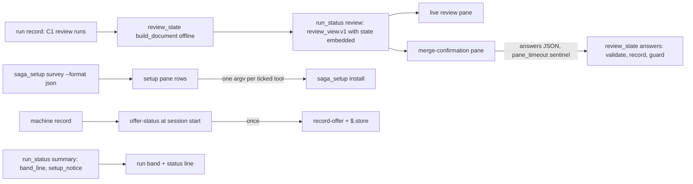

# Saga mods: review pane, merge confirmation, run band and setup pane (issue #165)

## Summary

Four Claude Code screens over C13's review-state document and C3's setup script: `/review-view` becomes a live review pane, a new merge-confirmation pane sits behind a tool the skills call, the band's review part shows the round and grades while the status line names missing tools, and a setup pane with a first-session offer wraps the survey and installs. Scripts keep owning every grade, block and outcome; the panes draw the document and hand answers back through the scripts.

---

## Problem Frame

This is card C14 of the saga review redesign (parent issue #147): Change 10 "Claude Code" plus Change 2 "Screens" and "When it runs".

Today, under `plugins/saga/`, mods display state and collect answers while scripts own state and policy (`com.infiquetra.claude/mods/index.ts:1-6`). `/review-view` shows the latest `review_result.v2` result lens by lens through `run_status.py review`, polling the record's modification time every five seconds (`mods/review-pane.tsx:1-22`, `:127-174`). Merge confirmation is a chat question (`skills/work/SKILL.md:93-95`); the band's review part reads "review cycle N/3 (escalated)" and "lenses met" (`scripts/run_status.py:718-746`); the status line shows only the issue and phase, and the band is its only saga writer (`mods/run-band.tsx:19-20`, `:44-49`). There is no setup pane, and no saga mod uses `$.store`. The admission pane is the pattern this card copies: a registered tool draws from the script's document, hands answers to the script on standard input, waits at most 30 minutes one second at a time through the engine, and returns submitted, dismissed or timed-out (`mods/admission-review.tsx:1-21`, `:272-340`).

C3 (issue #150) and C13 (issue #164) have landed in this tree: `saga_setup.py` with its `setup_survey.v1` survey, `install --tools`, the `<home>/.saga/machine.json` record and the admission notice; and `review_state.py` with the `review_state.v1` document, `--answers -` recording, the `pane_timeout` sentinel and the numbered-questions Markdown. This card draws those in panes, and C10b later carries out the merge and deletes the old-shape reader.

---

## Requirements

Requirements are grouped by concern; R-IDs run continuously.

**Document, readers and types**

- R1. `run_status.py review --json` embeds the full `review_state.v1` document for records with C1 review runs, built offline with no envelope; `review_view.v1` keeps its name, and the old-shape path stays for older records until C10b deletes it (AC-2).
- R2. `run-record.ts` gains guarded readers for the state review and the setup survey and offer verbs, keyed on `review_state.v1`, `setup_survey.v1` and `machine_record.v1`: a wrong version, cut-off output and a failed exit each come back as a named reason, never a guess (AC-2).
- R3. `test_mod_run_record_contract.py` pins the new version tokens and exit codes against the real scripts, as it does for `run_record.py show` (AC-1).
- R4. `types/index.d.ts` declares the document, survey, notice and outcome shapes the panes draw, and the plugin state gains the new panes' session state (AC-2).

**Live review pane**

- R5. `/review-view`, and the band's Review button, open the live pane: each lens's grade with blocking and fix-later counts, the where-to-look list with each item's state, tools ran or missing, the round and cost so far, and a round-by-round view of what each round added; an unknown document version is reported, not guessed; old-shape records keep today's lens list (AC-2).

**Merge confirmation**

- R6. The merge tool draws the grades, blocking items with a reason box and stop-the-card choice, disputed declarations, consequence disagreements and unconfirmed marks, the fix-later three-choice list, degraded inputs and the cost from the document alone. Submit records through `review_state.py answers` and shows a refusal verbatim; closing returns dismissed; the 30-minute timeout submits `{"answers": {}, "pane_timeout": true}` to the script and returns timed-out; the pane files and merges nothing itself (AC-2, AC-3).

**Band and status line**

- R7. The band's review part shows the round and grades from the document for records with C1 runs, and today's line for older records. After the change the band still shows the active saga (#147) with its plan (AC-4).
- R8. The status line appends C3's missing-tools notice text, naming the tools and `/saga:setup`; the band stays the only saga writer of the status line (AC-4).

**Setup**

- R9. The setup pane lists each surveyed tool with its status, lens and checkbox; Install passes only the ticked tools to `install`, one tool per call in order, showing per-row progress; the survey verb never runs for the offer check (AC-5).
- R10. The first-session offer appears only when the machine record shows setup never ran and neither store remembers the offer; showing it records `offered` through C3's script and in `$.store`, so no later session repeats it (AC-5).

**Skills and suite**

- R11. The work skill calls the merge tool on Claude Code and falls back to C13's numbered questions on anything but submitted; the code-review skill describes the live pane; the setup skill calls the setup tool with the survey-table fallback (AC-3).
- R12. `claude plugin validate --strict plugins/saga` and `claude plugin test plugins/saga` pass on CI's builds, as do the contract test, the saga suite and the repo hygiene commands; the changelog names issue #165 (AC-1).

---

## Key Technical Decisions

Each entry is the decision, then why, naming what was rejected. KTD1, KTD3 and KTD4 settle the card's three "for the planning step" notes.

- **KTD1. The merge tool is `review_merge` and the setup tool is `setup`.** The model calls them as `mcp__saga__review_merge` and `mcp__saga__setup`. `review_merge` sits beside admission's `review_admission` in the review family; `setup` mirrors the `/saga:setup` command it serves. Rejected: `merge_confirmation` (longer, and the pane confirms more than the merge — every fix-later choice too).
- **KTD2. The state review view embeds the whole document under `state`.** The card says the panes read C13's document only, through `run_status.py review` — but today's state view carries just lenses, pending choices and the merge display, not the where-to-look list, tools, cost, rounds or findings the panes draw. One embedded document keeps one reader, still offline with no envelope, and the text table stays the other harnesses' fallback. Rejected: panes running `review_state.py render` directly (a second reader beside `run_status review`, against the card).
- **KTD3. On timeout the mod submits `{"answers": {}, "pane_timeout": true}` to `review_state.py answers` itself, then returns timed-out.** A timeout means nobody is watching, so nobody runs the skill afterwards; only the mod can deliver the sentinel, and the script then applies the unattended rules itself — files only security-guard items, records nothing else. This differs from admission on purpose: admission's skill re-asks on timeout, while a merge timeout must never re-ask. Rejected: returning timed-out unrecorded (the unattended rules would never run).
- **KTD4. The offer check and record go through two new `saga_setup.py` verbs; the `$.store` key is `setup_offered`.** `offer-status` prints `{schema, ran, offered}` and writes nothing; `record-offer` stamps `offered` and keeps `ran` and the survey. The survey verb cannot check: it persists the machine record with `ran` set, so checking with it would mark setup run. Both go through the script because scripts own state; the store is the fast second memory and the machine record the durable one, and the mod records the machine first so a store failure still leaves the durable mark. The store's exact call shape comes from the engine's `claude-code` declarations at implementation time. `saga_setup.py` is outside the card's file list; the commit names it with this reason. Rejected: the mod reading `machine.json` itself (a second copy of the never-ran rule with no home-directory path in the mod) and a single check-and-record verb (it would stamp the offer before the operator sees it).
- **KTD5. Install runs one argv per ticked tool, in pane order, stopping at the first failure.** `$.process.run` has no streaming form, so one call per tool is what makes progress live: each row moves through queued, installing, done or failed with its tool's streamed lines. Stopping at the first failure matches `install_named`'s own semantics and exit 1. Rejected: one comma-separated call (no progress until everything finishes).
- **KTD6. The band's review part reads `review round {n}` plus one `{lens} {grade}` pair per lens in document order, comma-joined.** The card asks for the round and grades; this avoids O1's post-C10b `round k of 3` wording so the two never collide. O1 lands second and rebases: it adds `of 3`, the step, spend, time and update age to the same line, and spend to the status line. Rejected: reusing the cycle-allowance words (the redesign counts rounds, not cycles with escalation).
- **KTD7. Old-shape records keep today's review pane and band line until C10b.** C13 kept both readers and named C10b as the deleter; a half-switched tree must still show runs recorded before the redesign. The merge and setup panes serve state reviews only and say so on older records. Rejected: deleting the old pane path here (C10b's named work, and this card must not strand old runs).
- **KTD8. The status line appends `setup_notice.text` verbatim when it is non-empty.** C3 owns those words — "Missing a, b. Run /saga:setup." — so the mod appends them after the issue and phase, never recomposing the list; every harness then shows identical text, and the only-writer rule is untouched. Rejected: rebuilding the notice from `missing_tools` in TypeScript (a second copy of C3's sentence).

---

## High-Level Technical Design

Two scripts feed four screens; answers flow back through the same scripts.



`run_status.py` stays the band's only renderer and `review`'s only reader: the review verb embeds the document, the summary row already carries `setup_notice`, and the band part gains the state branch. The panes never open a record file and never parse prose.

---

## Implementation Units

Six units: the embedded document with its readers and contract, the two review panes, the band and status line, setup with its offer, then the skills and changelog.

### U1. The embedded document, its readers, types and contract

The script half every pane reads, and the pins that keep the readers honest.

**Goal:** `run_status.py review --json` embeds the full document for state records; the mod readers parse it guarded; the contract test pins the new tokens and exits.

**Requirements:** R1, R2, R3, R4.

**Dependencies:** none.

**Files:** `plugins/saga/scripts/run_status.py` (modify: `state_review_view` embeds the document under `state`); `plugins/saga/com.infiquetra.claude/mods/run-record.ts` (modify: the state-review reader beside the record, summary and review readers); `plugins/saga/com.infiquetra.claude/types/index.d.ts` (modify: the state review shapes beside `SagaReviewView`); `plugins/saga/tests/test_mod_run_record_contract.py` (modify: the review-state pins); `plugins/saga/tests/test_run_status.py` (modify: the embed tests); `plugins/saga/tests/fixtures/review_state/record.json` (read: the C13 fixture with three C1 runs, reused for the embed and band checks).

**Approach:** `state_review_view` gains one key, `"state"`, holding the `build_document` output unchanged — the offline call it already makes, envelope `None`. The existing summary keys (`state_schema`, `round`, `lenses`, `pending_choices`, `merge`) stay where they are, so the text table and every current reader keep working. The old-shape branch is untouched (KTD7). The TypeScript reader parses `run_status review` output, requires `state_schema` to equal the new `KNOWN_REVIEW_STATE_SCHEMA` (`review_state.v1`) when `state` is present, and returns the existing `unknown-version`, `unreadable` and `error` reasons on a wrong token, cut-off output or failed exit — never a guess. The contract test pins `review_state.v1` against `review_state.SCHEMA`, `review_view.v1` against `REVIEW_SCHEMA`, the null review for a record with no runs, and exits 3 and 2 for an unknown record version and a corrupt record, reusing the throwaway-store shape it already has.

**Patterns to follow:** `plugins/saga/scripts/run_status.py:543-562` (`state_review_view`, the offline document call); `plugins/saga/com.infiquetra.claude/mods/run-record.ts:245-303` (the review reader this one sits beside); `plugins/saga/tests/test_mod_run_record_contract.py:37-55` (literal pinning through the real script).

**Test scenarios:**

- Happy path: the C13 fixture's review view embeds `state` with every document block behind `"schema": "review_state.v1"`; the text table is unchanged.
- Old shape: a record with only `review_result.v2` entries keeps today's view with no `state` key.
- Missing data: a record with no review runs prints a null review; the reader reports no review rather than failing.
- Wrong version: a `state_schema` the reader does not know comes back `unknown-version` with the token named; exit 3 on an unknown record version, exit 2 on a corrupt record.
- Cut output: truncated stdout and non-object JSON each come back `unreadable`; a run that never started comes back `error`.
- No network: every new Python test runs with `socket.socket` replaced by one that raises.

**Verification:** the embed command below shows every block; the contract and `run_status` selections pass.

**Functional checks:**

```functional-checks
- name: contract-review-tokens
  command: python3 -m pytest plugins/saga/tests/test_mod_run_record_contract.py -q --import-mode=importlib
  proves: [AC-1]
  runs: local
- name: review-embeds-document
  command: >-
    sh -c 'set -e; d=$(mktemp -d); cp plugins/saga/tests/fixtures/review_state/record.json "$d/issue-164.json"; python3 plugins/saga/scripts/run_status.py --store-root "$d" review --issue 164 --json > "$d/view.json"; python3 -c "import json; v=json.load(open(\"$d/view.json\")); r=v[\"review\"]; assert v[\"schema\"]==\"review_view.v1\", v[\"schema\"]; assert r[\"state_schema\"]==\"review_state.v1\", r; s=r[\"state\"]; assert s[\"schema\"]==\"review_state.v1\", s[\"schema\"]; assert s[\"lenses\"] and s[\"where_to_look\"] and s[\"rounds\"] and s[\"cost\"], sorted(s); assert \"tools\" in s and \"pending_choices\" in s and \"merge\" in s"; python3 plugins/saga/scripts/run_status.py --store-root "$d" review --issue 164 | grep -q "^Q1\."'
  proves: [AC-2]
  runs: local
- name: run-status-review-tests
  command: python3 -m pytest plugins/saga/tests/test_run_status.py -q --import-mode=importlib
  proves: [AC-2]
  runs: local
```

### U2. The live review pane

`/review-view` redrawn over the embedded document, with the old lens list kept for old records.

**Goal:** The pane shows grades, where-to-look states, tools, round, cost and per-round deltas from the document alone, and opens from the command and the band button.

**Requirements:** R5.

**Dependencies:** U1.

**Files:** `plugins/saga/com.infiquetra.claude/mods/review-pane.tsx` (modify: the live sections, the shape branch); `plugins/saga/com.infiquetra.claude/mods/review-findings.ts` (modify: the label functions for grades, states, tools, deltas); `plugins/saga/com.infiquetra.claude/mods/review-pane.test.tsx` (modify: the fixture-document tests).

**Approach:** `openReviewView` keeps its argument shape (nothing or `#N`) and reads through the U1 reader. The render branches on the review shape: a view with `state` draws the live sections — a grades table (lens, grade, blocking, fix-later), the where-to-look list with `answered` and `cleared` states, tools ran with versions plus the missing-notice text verbatim, the round with tokens, dollars and seconds, and one round block per entry of `rounds` naming only that round's `new_blocking` and `cleared_blocking` identities; a view without it draws today's lens list unchanged (KTD7). The five-second modification-time poll, the band Review press and Quote-to-prompt stay; the Bash fast-path regex gains the review-command writer beside `review_result.py`. An unknown `state_schema` fails the read, and the pane shows the reader's detail rather than drawing. Every word comes from the view: no grade, count or state is computed in TypeScript.

**Patterns to follow:** `plugins/saga/com.infiquetra.claude/mods/review-pane.tsx:101-175` (open, poll, press, fast-path reload); `plugins/saga/com.infiquetra.claude/mods/review-findings.ts:33-77` (pure label functions, tested without an engine); `plugins/saga/com.infiquetra.claude/mods/admission-review.tsx:310-325` (showing the script's words, never recomputing them).

**Test scenarios:**

- Happy path: from a fixture document the pane draws every grade with its counts, every where-to-look state, the ran tools with versions, the missing notice verbatim, the round and the cost.
- Round view: each round block lists only what that round added or cleared against the round before; a round with neither says so.
- Unknown version: a document with a newer `state_schema` is reported with the token named, and nothing is drawn from it.
- Openings: `/review-view`, `/review-view #N` and a press on `band-review-N` each open the pane; a bad argument and a checkout with no run each say so without opening.
- Legacy: an old-shape view draws today's lens list with states and finding counts.
- Live: a record modification between polls reloads the open pane and keeps the reader's lens when it is still there; a mid-write read keeps the last good review on screen.

**Verification:** the mod suite below passes with the new pane tests in it.

**Functional checks:**

```functional-checks
- name: review-pane-tests
  command: claude plugin test plugins/saga
  proves: [AC-2]
  runs: local
```

### U3. The merge-confirmation pane

A new tool, working like admission's, that records the merge answers through C13's script.

**Goal:** The operator confirms the merge in a pane; Submit records through the script, closing falls back to numbered questions, and a timeout applies the unattended rules.

**Requirements:** R6.

**Dependencies:** U1.

**Files:** `plugins/saga/com.infiquetra.claude/mods/merge-confirmation.tsx` (create: the tool, the wait, the pane); `plugins/saga/com.infiquetra.claude/mods/merge-confirmation.test.tsx` (create: the submit, dismiss and timeout tests); `plugins/saga/com.infiquetra.claude/mods/index.ts` (modify: register the new mod).

**Approach:** Mirror admission exactly. `TOOL` is `review_merge`, registered on session start with an `{issue, repo?}` input; the `tool.call` hook reads the document through the U1 reader, returns `nothing-to-review` when `pending_choices` is empty and an error naming the missing document on an old-shape record (KTD7). The pane draws the grades; blocking identities with a reason box plus merge and stop-the-card buttons; disputes, consequence disagreements with both picks, and unconfirmed marks; each fix-later item with exactly the three choices; degraded inputs; and the cost. Submit sends only the answered keys — `fix-later:<id>` to `fix-now`, `file-as-issue` or `leave`, `merge-blocking` to `{decision, reason?}` — as JSON on standard input to `review_state.py answers --issue N [--repo R] --answers -`; an exit-2 refusal is shown verbatim and the form is left as it was. The hook waits 1,800 one-second `$` sleeps (the LEARNINGS rule); closing the pane returns `dismissed` for the skill's numbered-questions fallback, and the wait expiring submits `{"answers": {}, "pane_timeout": true}` through the same argv (KTD3) before returning `timed-out`. The pane itself files and merges nothing: every durable effect is the script's.

**Patterns to follow:** `plugins/saga/com.infiquetra.claude/mods/admission-review.tsx:249-340` (registration, the guarded read, the sleep loop, close handling); `:381-412` (stdin submit, verbatim refusal, dismiss); `plugins/saga/references/review-state.md:75-100` (the answers shape and the timeout sentinel).

**Test scenarios:**

- Happy path: Submit pipes the answered keys to the script's argv with `--answers -` (a stubbed process runner checks the call and the stdin bytes) and returns submitted; unanswered choices are left out of the map.
- Refusal: an exit-2 refusal is shown as printed and the pane keeps every pick.
- Closing: closing the pane returns dismissed and runs the script zero times.
- Timeout: the 30-minute wait returns timed-out, submits exactly `{"answers": {}, "pane_timeout": true}` to the same argv, and the pane files and merges nothing; a failed timeout submit returns an error naming the failure.
- Choices: fix-later items offer only the three choices; the blocking question offers only a merge with a reason or stopping the card, and a blank reason never submits.
- Budget: a test waits past ten real seconds on the sleep loop, proving the wait holds the dispatch open.
- Old shape: a record with no state review returns an error naming the missing document.

**Verification:** the mod suite below passes with the new pane tests in it; the timeout bytes below run green against the real script.

**Functional checks:**

```functional-checks
- name: merge-pane-tests
  command: claude plugin test plugins/saga
  proves: [AC-2, AC-3]
  runs: local
- name: timeout-bytes-end-to-end
  command: >-
    sh -c 'set -e; d=$(mktemp -d); F=plugins/saga/tests/fixtures/review_state; S=plugins/saga/scripts/review_state.py; cp $F/record.json "$d/record.json"; printf "{\"answers\": {}, \"pane_timeout\": true}" | python3 $S answers --record "$d/record.json" --envelope $F/unattended.json --profile $F/profile.json --mission-control $F/fake-sdlc-manager.py --answers -; python3 -c "import json; r=json.load(open(\"$d/record.json\")); assert not [e for e in r[\"review_cycles\"] if isinstance(e, dict) and e.get(\"loop\")==\"merge_confirmation\"], \"timeout recorded a merge decision\""'
  proves: [AC-3]
  runs: local
```

### U4. The band's review part and the missing-tools status line

The band learns the round and grades; the status line learns the missing tools.

**Goal:** State records show `review round {n}` with per-lens grades on the band; the status line names missing tools and `/saga:setup`; the band still shows the saga with its plan, and stays its only writer.

**Requirements:** R7, R8.

**Dependencies:** U1.

**Files:** `plugins/saga/scripts/run_status.py` (modify: the state branch of `review_progress` and `_review_part`); `plugins/saga/com.infiquetra.claude/mods/run-band.tsx` (modify: the notice in `statusText`); `plugins/saga/com.infiquetra.claude/types/index.d.ts` (modify: the state fields of `SagaRunReviewProgress`); `plugins/saga/com.infiquetra.claude/mods/run-band.test.tsx` (modify: the notice, writer and still-shows-the-saga tests); `plugins/saga/tests/test_run_status.py` (modify: the band-part tests).

**Approach:** `review_progress` gains a state branch: when the record holds C1 review runs it builds the document offline (the `state_review_view` call, envelope `None`) and returns the round plus the `{lens, grade}` pairs in document order; otherwise it keeps today's cycle-and-lenses math untouched (KTD7). `_review_part` renders the state branch as `review round {n}` plus one comma-joined `{lens} {grade}` part (KTD6). `statusText` appends ` · {setup_notice.text}` when the row's notice text is non-empty (KTD8); the band's refresh triggers, buttons and record pane are untouched. The summary row already carries `setup_notice`, so no new script-to-mod channel is needed.

**Patterns to follow:** `plugins/saga/scripts/run_status.py:718-777` (the progress view and part builders this branch sits beside); `plugins/saga/com.infiquetra.claude/mods/run-band.tsx:44-49` (`statusText`, the only status-line writer per `:19-20`).

**Test scenarios:**

- Happy path: a state record's band line reads `review round {n}` with every lens grade in document order; a legacy record keeps today's cycle-and-lenses line.
- Still shows the saga: a run shaped like the active saga — phase and plan set, no review runs, no notice — still renders its band line with the Plan button opening the plan viewer. This is the brief's band rule, and `.program/acceptance.md` says how it is proven.
- Notice: a row with notice text appends it verbatim after the issue and phase, naming the tools and `/saga:setup`; a row with none, or empty text, keeps today's line.
- Only writer: no saga mod file besides `run-band.tsx` calls `$.ui.status`.
- Failed read: a refresh that cannot read keeps what the band showed, notice included.

**Verification:** the band words below print from the real script; the mod suite below passes with the new band tests in it.

**Functional checks:**

```functional-checks
- name: band-status-tests
  command: claude plugin test plugins/saga
  proves: [AC-4]
  runs: local
- name: band-review-words
  command: sh -c 'set -e; d=$(mktemp -d); cp plugins/saga/tests/fixtures/review_state/record.json "$d/issue-164.json"; python3 plugins/saga/scripts/run_status.py --store-root "$d" summary --issue 164 --band | grep -q "review round 3"; python3 plugins/saga/scripts/run_status.py --store-root "$d" summary --issue 164 --band | grep -q "testing A"'
  proves: [AC-4]
  runs: local
- name: status-line-only-writer
  command: sh -c '[ "$(grep -l "ui\.status(" plugins/saga/com.infiquetra.claude/mods/*.tsx | grep -v test)" = "plugins/saga/com.infiquetra.claude/mods/run-band.tsx" ]'
  proves: [AC-4]
  runs: local
- name: status-notice-words
  command: >-
    sh -c 'set -e; d=$(mktemp -d); cp plugins/saga/tests/fixtures/review_state/record.json "$d/issue-164.json"; python3 -c "import json; p=\"$d/issue-164.json\"; r=json.load(open(p)); r[\"admission\"][\"setup_notice\"]={\"text\": \"Missing ruff, mypy. Run /saga:setup.\", \"missing_tools\": [\"ruff\", \"mypy\"], \"sandbox_unavailable\": False}; json.dump(r, open(p, \"w\"))"; python3 plugins/saga/scripts/run_status.py --store-root "$d" summary --issue 164 --json | grep -q "Missing ruff, mypy. Run /saga:setup."'
  proves: [AC-4]
  runs: local
```

### U5. The setup pane and the first-session offer

Survey rows with checkboxes and a live Install, plus the offer that appears exactly once.

**Goal:** The operator ticks tools and watches them install; a fresh machine is offered `/saga:setup` once, remembered in both stores.

**Requirements:** R9, R10.

**Dependencies:** U1.

**Files:** `plugins/saga/scripts/saga_setup.py` (modify: the `offer-status` and `record-offer` verbs — outside the card's file list, for the KTD4 reason, named with it in the commit); `plugins/saga/com.infiquetra.claude/mods/setup-pane.tsx` (create: the tool, the rows, Install, the offer); `plugins/saga/com.infiquetra.claude/mods/setup-pane.test.tsx` (create: the rows, Install and offer tests); `plugins/saga/com.infiquetra.claude/mods/run-record.ts` (modify: the survey and offer readers); `plugins/saga/com.infiquetra.claude/types/index.d.ts` (modify: the survey, offer and setup-outcome shapes); `plugins/saga/com.infiquetra.claude/mods/index.ts` (modify: register the new mod); `plugins/saga/tests/test_saga_setup.py` (modify: the verb tests); `plugins/saga/tests/test_mod_run_record_contract.py` (modify: the setup-token pins beside U1's review pins).

**Approach:** `offer-status [--home H]` prints `{schema: machine_record.v1, ran, offered}` and writes nothing; a missing file reads `ran` false, `offered` false. `record-offer [--home H]` calls `record_offer` and prints the record path; both exit 2 on a `SetupError` like every other verb. `TOOL` is `setup`, called with an optional `repo` defaulting to the session directory; the hook runs `survey --format json` (persisting `ran` is correct here — setup is running) and opens the pane on its `setup_survey.v1` tools. Each row shows the id, status, lens and pinned version with a checkbox, pre-ticked when the status is not installed; a row with no install command has its box disabled with the script's install sentence. Install runs one `install --tools <id> --repo <cwd>` argv per ticked tool in order (KTD5), moving each row through queued, installing, done or failed with the tool's streamed lines, and stops at the first failure showing its stderr. On session start the mod checks `$.store` under `setup_offered`, then `offer-status`; when setup never ran and neither remembers the offer, it toasts `Run /saga:setup to check this machine's tools.`, then calls `record-offer` and sets the store key, machine first. The store's call shape comes from the engine's declarations at implementation time.

**Patterns to follow:** `plugins/saga/scripts/saga_setup.py:778-799` (`notice_for`, the one notice — the pane never recomposes it); `:1087-1114` (the verb parsers the two new verbs sit beside); `plugins/saga/com.infiquetra.claude/mods/admission-review.tsx:249-272` (session-start registration); `plugins/saga/skills/setup/SKILL.md:27-35` (install only named ids; a row with no install command stops with the sentence).

**Test scenarios:**

- Happy path: rows come from the survey JSON with id, status, lens, version and pin; non-installed rows open ticked, installed rows open unticked; a row with no install command opens disabled with the sentence.
- Install: Install passes only the ticked tools, one argv per tool in order; each row shows progress and its streamed lines; the first failed tool stops the run with its stderr shown and later rows left queued.
- Refusals: an unknown survey schema and a failed survey exit each show the reader's detail; nothing installs.
- Offer matrix: never-ran and unoffered shows the toast once and calls `record-offer` then sets the store; ran, offered-in-record and offered-in-store each show nothing; with the store set the script is never called; a failed `record-offer` toasts the error and leaves the store unset so the offer retries next session.
- Survey never checks: the offer path runs only `offer-status` and `record-offer`, never `survey` (its run would mark setup run).

**Verification:** the offer verbs below round-trip on a throwaway home; the mod suite below passes with the new setup tests in it.

**Functional checks:**

```functional-checks
- name: setup-pane-tests
  command: claude plugin test plugins/saga
  proves: [AC-5]
  runs: local
- name: offer-verbs-round-trip
  command: >-
    sh -c 'set -e; H=$(mktemp -d); S=plugins/saga/scripts/saga_setup.py; python3 $S offer-status --home $H | grep -q "\"ran\": false"; python3 $S offer-status --home $H | grep -q "\"offered\": false"; python3 $S record-offer --home $H; python3 $S offer-status --home $H | grep -q "\"offered\": true"; python3 $S offer-status --home $H | grep -q "\"ran\": false"; python3 -c "import json; r=json.load(open(\"$H/.saga/machine.json\")); assert r[\"offered\"] is True and r[\"ran\"] is False and \"survey\" not in r, r"'
  proves: [AC-5]
  runs: local
- name: setup-verb-tests
  command: python3 -m pytest plugins/saga/tests/test_saga_setup.py -q --import-mode=importlib -k offer
  proves: [AC-5]
  runs: local
```

### U6. Skills and changelog

The operator-facing prose follows the panes, and the merge gate stays explicitly confirmed.

**Goal:** Each skill calls its pane on Claude Code and falls back exactly as if the tool were absent; the changelog names the card.

**Requirements:** R11, R12.

**Dependencies:** U2, U3, U5.

**Files:** `plugins/saga/skills/work/SKILL.md` (modify: the merge-tool branch in the merge-confirmation passage); `plugins/saga/skills/code-review/SKILL.md` (modify: the live-pane paragraph); `plugins/saga/skills/setup/SKILL.md` (modify: the setup-tool branch — outside the card's file list, named with the reason: the setup pane needs its caller, mirroring the plan skill's admission branch); `plugins/saga/CHANGELOG.md` (modify: Unreleased, Added — names issue #165).

**Approach:** Mirror the plan skill's admission branch (`skills/plan/SKILL.md:117-128`): "when the tool `mcp__saga__review_merge` is listed, call it with `{"issue": N}` before the message instead of printing the numbered questions; read the `status` it returns". Submitted means recorded — never retype or re-record. Dismissed, not-placed, unavailable, nothing-to-review or error means nothing was recorded: fall back to C13's numbered questions exactly as if the tool were absent. Timed-out means the unattended rules already ran: do not re-ask; the merge follows the envelope's merge setting and C10b carries it out. No sentence weakens the explicitly-confirmed merge (`test_work_gate_integrity.py` pins it). The code-review skill's `run_status.py review` paragraph gains the live pane's contents (grades, where-to-look, tools, round, cost, round view) with `/review-view` kept by name. The setup skill gains the same branch shape for `mcp__saga__setup` with the survey-table fallback. The changelog entry names the panes, the band and status words, the offer, and the two new setup verbs.

**Patterns to follow:** `plugins/saga/skills/plan/SKILL.md:117-128` (the tool-call branch with its status table and verbatim fallback); the work skill's hard-boundary list (the merge sentence stays a prohibition on silent mutation).

**Test scenarios:**

- The work skill names the merge tool, every non-submitted status, the numbered-questions fallback and the never-re-record rule; timed-out is never re-asked.
- The code-review skill still names `run_status.py review` and `/review-view`, and lists what the live pane shows.
- The setup skill names the setup tool with the survey-table fallback, and keeps "installs only named ids".
- `test_work_gate_integrity.py` passes unchanged: merge confirmation still present, the four outcomes intact, programmatic paths still writing nothing.
- Preservation: a skill that dropped the explicitly-confirmed merge or the fallback sentence fails the pins below.

**Verification:** the prose pins below pass; validation passes; the CI matrix below still names both pinned builds.

**Functional checks:**

```functional-checks
- name: skill-prose-pins
  command: sh -c 'grep -q "mcp__saga__review_merge" plugins/saga/skills/work/SKILL.md && grep -q "numbered questions" plugins/saga/skills/work/SKILL.md && grep -q "do not re-ask" plugins/saga/skills/work/SKILL.md && grep -q "review-view" plugins/saga/skills/code-review/SKILL.md && grep -q "mcp__saga__setup" plugins/saga/skills/setup/SKILL.md && grep -q "Issue 165" plugins/saga/CHANGELOG.md'
  proves: [AC-3]
  runs: local
- name: work-gate-integrity-unchanged
  command: python3 -m pytest plugins/saga/tests/test_work_gate_integrity.py -q --import-mode=importlib
  proves: [AC-3]
  runs: local
- name: claude-validate-strict
  command: claude plugin validate --strict plugins/saga
  proves: [AC-1]
  runs: local
- name: ci-pins-both-builds
  command: sh -c 'grep -q "2.1.286" .github/workflows/ci.yml && grep -q "2.1.289" .github/workflows/ci.yml'
  proves: [AC-1]
  runs: local
```

---

## Scope Boundaries

What this card does not do, and what is left to named later work.

Non-goals, from the card: the document, its Markdown, answer checks, issue filing and rebuilding `run_status.py review` (C13); the fix-now round and carrying out the merge (C10b); setup's checks, installs and machine record, and the one-line suggestion on other harnesses (C3 — this card only draws them and adds the two offer verbs); the band's second version (O1): step, spend against budget, time in step, age of the last GitHub update, and spend in the status line.

Later (noted here, never a unit of this plan):

- O1 rebases onto this card's band words: `of 3` on the round, the step, spend, time in step and update age on the line, and spend merged into the same status line.
- C10b deletes `run_status.py`'s old-shape reader with this card's old pane path and old band words, and reads the `merge_confirmation` entries this card's pane records.
- Profile questions in the setup pane: the pane covers the survey rows and Install, and the skill keeps asking the setup questions in chat.
- A richer first-session offer surface: the offer is a toast naming `/saga:setup`, never a pane, and never repeated.

---

## Risks & Dependencies

| Risk | Mitigation |
|---|---|
| The `$.store` call shape is unknown until implementation reads the engine's declarations — no saga mod uses it yet. | KTD4 pins the key and the order (machine first, store second), so a store failure still leaves the durable record; the offer matrix test stubs the engine either way. |
| The local CLI (2.1.292) is newer than CI's pinned builds (2.1.286, 2.1.289). | Local `validate` and `test` runs catch regressions early; CI's `claude-mods` job is the AC-1 proof, and U6 pins its matrix. |
| O1 edits the same band line and status writer concurrently. | KTD6 splits the wordings so they never collide; whichever of C14 and O1 lands second rebases onto the other, per the card's note. |
| Old-shape records during the transition show a review the new panes cannot draw. | KTD7 keeps the old pane path and band words; the merge and setup tools return a named error on old records instead of guessing. |
| A timeout submit that itself fails leaves the merge question neither answered nor unattended. | U3 returns an error naming the failure rather than timed-out, so the skill falls back to the numbered questions instead of assuming the unattended rules ran. |

Depends on C3 (landed: survey, install, machine record, notice) and C13 (landed: document, answers, sentinel, numbered questions). Hands the `merge_confirmation` entries to C10b, the band line to O1's rebase, and the offer verbs to any later harness that wants the same once-only offer.

---

## Scenario Smoke

The card's verification suite on the combined branch. CI's `claude-mods` job is the AC-1 proof on the pinned builds; these runs are the same commands on the combined branch.

```scenario-smoke
- name: mod-validate-green
  command: claude plugin validate --strict plugins/saga
  proves: [AC-1]
  runs: environment
- name: mod-suite-green
  command: claude plugin test plugins/saga
  proves: [AC-1]
  runs: environment
- name: saga-suite-green
  command: python3 -m pytest plugins/saga/tests -q --import-mode=importlib
  proves: [AC-1]
  runs: environment
- name: repo-hygiene-green
  command: sh -c 'python3 scripts/check_repo.py && python3 -m unittest discover -s tests && git diff --check'
  proves: [AC-1]
  runs: environment
```

---

## Sources / Research

- Design: `docs/brainstorms/2026-10-05-saga-review-redesign/plan.md`, Change 10 ("What the operator sees and chooses") and Change 2 ("When it runs", "Screens"); the C14 card's Intent and Notes sections; O1's round wording and shared-writer note (`cards/O1-status-band-v2.md:55-61`).
- C13 contract: `plugins/saga/references/review-state.md` (the `review_state.v1` shape, the answers file, the `pane_timeout` sentinel, exit codes 0/2/3); `plugins/saga/scripts/review_state.py:1580-1653` (the `--issue`/`--store-root`/`--answers -` flags); `plugins/saga/scripts/run_status.py:62-65` (the `run_status.v1` and `review_view.v1` tokens), `:543-562` (the state view), `:718-777` (the band's review math), `:900-905` (exits 3 and 2).
- C3 contract: `plugins/saga/references/machine-record.md` (the `machine_record.v1` shape, `record_offer` for C14's offer); `plugins/saga/scripts/saga_setup.py:38` (`setup_survey.v1`), `:245-259` (`record_offer`), `:778-799` (`notice_for`), `:1087-1114` (the survey, write and install verbs), `:1154-1172` (survey persists `ran`); `plugins/saga/skills/setup/SKILL.md:27-35` (install only named ids).
- Mods today: `plugins/saga/com.infiquetra.claude/mods/index.ts:1-6` (scripts own state); `mods/run-record.ts:42-137` (the guarded readers and their reasons); `mods/review-pane.tsx:101-175` (open, poll, press, fast-path); `mods/review-findings.ts:33-77` (pure labels); `mods/run-band.tsx:19-20` (the only status-line writer), `:44-49` (`statusText`); `mods/admission-review.tsx:38-48` (the tool name and 1,800-second cap), `:249-340` (registration, read, sleep loop, close), `:381-412` (stdin submit, verbatim refusal); `types/index.d.ts:102-121` (`SagaSetupNotice`, `SagaRunStatus`).
- Skill pattern: `plugins/saga/skills/plan/SKILL.md:117-128` (the tool-call branch with its status table and verbatim fallback); the work skill's merge-confirmation passage (`skills/work/SKILL.md:1060-1062`); the code-review skill's fallback paragraph (`skills/code-review/SKILL.md:349-351`).
- Journal: `docs/engineering-journal/DECISIONS.md:524-550` (`run_status.py` renders the band's words), `:871-874` (the `claude-mods` CI job on 2.1.286 and 2.1.289), `:928-944` (no TypeScript check in CI; the contract test stands in); `docs/engineering-journal/LEARNINGS.md:597-616` (a waiting mod loops on `$` calls); `.github/workflows/ci.yml:85` (the pinned-build matrix).
