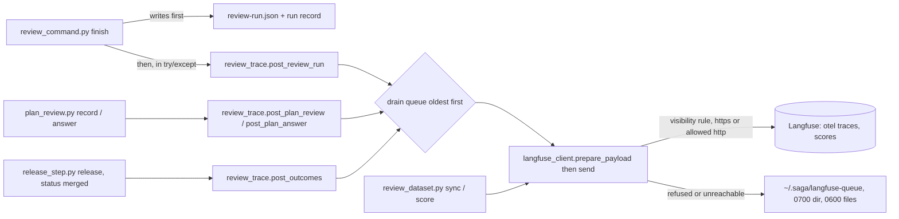

# Langfuse review traces and outcomes at merge (issue #166)

## Summary

Add a standard-library Langfuse client to fleet-core and bundle it into saga. Saga then posts every review run and plan review as one trace in the "Saga Reviews" project, attaches each finding's merge outcome as a score, and keeps the corpus as a dataset with code evaluators. A post that cannot go waits in an owner-only queue under the user's home; it never fails a review.

---

## Problem Frame

Issue #166 is card C15 of the saga review redesign (parent issue #147). The design's Change 9 makes Langfuse the measurement system for review: one trace per review run, outcomes attached to findings later, the corpus as a dataset. Change 8's "Watched" item needs a Langfuse view of how often round 2 or 3 finds anything new. Today nothing in saga or fleet-core talks to Langfuse, so none of that exists.

The dependencies have landed. C1 (issue #148, the five review records and the A–F formula) gives `plugins/saga/scripts/review_records.py`. C10a (issue #160, merged as #203) gives `plugins/saga/scripts/review_command.py`. C3 (issue #150) records a repository's `visibility` in `.saga-profile.json`. C4a's raw-output store is `review_tools.store_raw` under `<home>/.saga/review-output/`. C12 (issue #163, plan review in one pass) landed first and left the plan-review trace call to whichever of C12 and C15 lands second (its plan's KTD7), so this card adds it. X3 (Langfuse over HTTPS) is closed.

Facts checked on 7 October 2026 that shape the plan:

- The operator's Langfuse server answers its health endpoint with version 4.35.0, and `SAGA_LANGFUSE_HOST` already uses `https`. `SAGA_LANGFUSE_PUBLIC_KEY` and `SAGA_LANGFUSE_SECRET_KEY` are not yet stored in keychain-env.
- Langfuse's published API marks the batch ingestion endpoint (`POST /api/public/ingestion`) deprecated: Langfuse Cloud stops accepting anything but scores there on 16 November 2026, and a self-hosted server does the same once it runs in version-4-only write mode. The current write path for traces is the OpenTelemetry endpoint `POST /api/public/otel/v1/traces`, which accepts JSON and needs the header `x-langfuse-ingestion-version: 4`. Scores go to `POST /api/public/scores`; datasets to `POST /api/public/v2/datasets` and `POST /api/public/dataset-items`. None of those three is deprecated.
- C1's review run record has no run ID (`review_records.RUN_FIELDS`), and its `repo` field holds the local path `finish` was given, not an `owner/name` slug.
- This repository's own `.saga-profile.json` records no `visibility`, so under this card's rule it counts as private.

---

## Requirements

**The client**

- R1. A new `plugins/fleet-core/scripts/fleet_commons/langfuse_client.py` imports only the standard library and its fleet-core sibling `typesafe_client` (for redaction). Saga declares it in `plugins/saga/fleet-bundle.json`, and `python3 scripts/bundle_fleet_module.py --check` passes.
- R2. The client reads only `SAGA_LANGFUSE_PUBLIC_KEY`, `SAGA_LANGFUSE_SECRET_KEY` and `SAGA_LANGFUSE_HOST`, through an injected environment reader. With only the standard `LANGFUSE_*` names set, nothing is sent.
- R3. The key pair goes only into the basic-auth header, resolved at request time. No result, log line, exception message, queued file or payload carries a key or the host address.
- R4. Every payload passes through one preparation function that removes Langfuse key shapes (`sk-lf-` and `pk-lf-`), redacts it with fleet-core's TypeSafe redaction, and stamps it. The transport refuses an unstamped payload.
- R5. A private repository, or one whose visibility is not recorded, posts only when the host uses `https`; the refusal names X3. A public repository posts over `https` always, and over plain `http` only when every address the host resolves to is loopback or private; otherwise the refusal is `plain-http-public-address`, and a failed address lookup is the refusal `address-lookup-failed`. Requests over `https` use the default certificate check against the default trust store.
- R6. The client can only read (`GET`) and create (`POST`) at a fixed list of endpoints. It has no way to delete or overwrite-by-path anything in Langfuse.

**The trace**

- R7. Each review run posts one trace whose ID derives from the run itself (repository, base and head commits, card, round), so later posts need no lookup. The trace carries the repository slug, base and head commits, card, round, saga version and tool versions.
- R8. Under the trace: one entry per tool run, one for the Jev sweep holding each where-to-look item's resolved model version, one per LLM step holding its reviewer's vendor, model, configuration fingerprint, tokens, cost and time, one for the formula, and one per finding.
- R9. Sent: the five records and each finding's code excerpt at the reviewed head. Raw tool output leaves only as its SHA-256. A secret-scanner finding sends its location and never an excerpt, and no other finding's excerpt includes a line a secret-scanner finding covers.
- R10. Round 2 and round 3 runs post whether they found anything new, as scores a Langfuse view reads.

**Never failing a review**

- R11. When Langfuse is unreachable, or a post is refused (missing keys or host, or a private repository on plain HTTP), the review finishes with the same records and exit status. The post waits in an owner-only queue under the user's home with its reason, is sent oldest first once the reason clears, and is never dropped. `/saga:setup`'s survey shows how many posts wait.

**Outcomes and plan reviews**

- R12. After a merge, the release step posts each finding's recorded merge outcome as a score on that finding's entry, with the reason (dismissed) or issue number (filed). It posts only for a merged release, and posting twice produces one score.
- R13. A plan review posts a trace when it is recorded, and each answer (fixed or rejected) posts as a score on that finding's entry.

**Dataset, evaluators and setup**

- R14. The corpus is one dataset, posted as private. Each item carries its split in metadata; held-out items carry their case ID only.
- R15. Code evaluators compute per-lens hits and false blocks, per-question precision, grade stability, and cost, and post them as scores. Held-out results post as totals only.
- R16. The operator creates the "Saga Reviews" project and its key pair; keychain-env holds the keys. No key is in the tree. A probe command confirms the project answers without printing a key.
- R17. A Langfuse dashboard shows how often round 2 or 3 found anything new, and nothing in this change deletes Langfuse data automatically. The operator adds the dashboard's two widgets by hand, and the engineering journal records that both exist before this requirement counts as met.

---

## Key Technical Decisions

- **KTD1. Traces go through the OpenTelemetry endpoint as JSON; scores and datasets through their own endpoints:** the server is Langfuse 4.35.0 and the batch ingestion endpoint is deprecated, refusing traces in version-4-only write mode. OpenTelemetry's JSON encoding needs nothing outside the standard library. Rejected: the batch endpoint (deprecated, so it breaks when the server's write mode changes); the Langfuse Python SDK (not standard library, and fleet-core is standard-library only); the OpenTelemetry protobuf encoding (needs a protobuf library).

- **KTD2. The client is a transport with a closed endpoint list, not a general HTTP helper:** callers name one of `otel-traces`, `scores`, `datasets`, `dataset-items` (each `POST`), `projects` and `metrics` (each `GET`); the client maps each to its fixed path. There is no `DELETE`, `PUT` or `PATCH`, and no caller-supplied path. This makes R6 a property of the code, which a test checks, rather than a promise.

- **KTD3. Key handling mirrors `typesafe_client.py:552-561`:** `_resolve_keys(getenv)` reads the two key names when the request is built and returns them only to the line that writes `Authorization: Basic <base64(public:secret)>`. Messages this module composes name the variable, never its value, and never the host URL (the host is a private name). A server's error body is redacted and cut to 200 characters before it becomes a reason. Rejected: reading keys at construction and holding them on an object (a `repr` or a debugger dump could show them).

- **KTD4. The client follows no redirect:** a redirect becomes the reason `redirect`. TypeSafe's handler drops the header on a cross-host redirect, but it would still follow an `https` to `http` downgrade on the same host, which would put the key pair on the wire in clear. The host is operator-set, so a redirect means a misconfiguration worth seeing.

- **KTD5. Redaction is TypeSafe's, loaded as a sibling:** `langfuse_client` loads `typesafe_client` with the same `_load_sibling` helper and calls its `redact`. TypeSafe's patterns do not match Langfuse keys (its `sk-` pattern needs twenty letters or digits straight after `sk-`, and nothing matches `pk-`; checked on 7 October 2026), so `prepare_payload` first replaces every `sk-lf-` or `pk-lf-` run followed by at least eight key characters with `[REDACTED]`. `prepare_payload(kind, body)` is the only function that stamps a `PreparedPayload` with a private token; `send` refuses anything else, as `typesafe_client._require_prepared` does. Rejected: copying the patterns (two lists that drift); moving redaction into a new shared module (edits `typesafe_client.py` and its bundled copies for no behaviour change). The saga bundle already carries `typesafe_client`, so the sibling resolves in `_bundled/`.

- **KTD6. The visibility rule is enforced in the client, at send time:** `send(prepared, visibility=...)` takes `public`, `private` or `None`, and `None` counts as private. `https` always sends. `http` sends only for `public`, and only when every address the host resolves to is loopback or private (an injected resolver), so a key pair never crosses the public internet in clear. A public address gives `plain-http-public-address`; a resolver that raises or returns nothing gives `address-lookup-failed`; neither calls the opener. Any other scheme is refused. The private refusal's reason is `plain-http-private` and its message names X3 ("a private or unrecorded repository posts only over https; see X3, Langfuse over HTTPS"). Rejected: checking visibility only in saga (a second caller of the client would skip it).

- **KTD7. Visibility comes from the repository profile at the base commit:** `review_trace.visibility(repo, base)` reads `git show <base>:.saga-profile.json` and returns its `visibility` only if it is `public` or `private`; anything else, an unreadable file, or a missing key gives `None`. The head commit and the working tree are never read for it, because the change under review is untrusted (issues #190 and #191): a change could otherwise mark its own repository public. The corpus dataset always posts as private. A plan review has no base commit, so it reads the profile at the merge base of `HEAD` and the default branch (`git symbolic-ref refs/remotes/origin/HEAD`, falling back to `main`), under the same rule; a commit on the plan's branch therefore cannot mark the repository public.

- **KTD8. Trace and entry IDs are derived, not stored:** C1's review run has no run ID, and adding one would change C1's schema (out of scope). The trace ID is the first 32 hex characters of SHA-256 over the canonical JSON of `{"subject": "code", "repo": <slug>, "base", "head", "card", "round"}`; a plan review uses `{"subject": "plan", "repo", "card", "plan_sha256"}`. Each entry's span ID is the first 16 hex characters of SHA-256 over `<trace id>:<entry key>`, where the key is `tool:<name>`, `sweep`, `llm:<index>:<role>`, `formula`, or `finding:<finding identity>`. The release step recomputes both from the stored review run, and because C1's finding identity ignores line numbers, an outcome attaches to the right entry after lines move. Re-posting the same run writes the same IDs, which Langfuse treats as the same objects, so a resend is safe. Rejected: random IDs plus a lookup (Langfuse's read APIs other than metrics can lag by minutes, per its API description).

- **KTD9. The trace names the repository by slug, never by local path:** C1's `repo` field is the path `finish` was given, which carries the operator's home directory. The trace builder uses the run record's `repo` (`owner/name`) when a store exists, else `owner/name` parsed from the repository's `origin` remote URL, else `unknown`, and replaces the field in the review run it sends.

- **KTD10. What a trace carries:** a root span `review-run` with trace metadata (slug, base, head, card, round, saga version, tool versions, visibility) and the lens grades and merge decision as output. Children:
  - one `tool` entry per tool in `tool_versions`, carrying its version, its findings' identities, its degraded reasons, and its raw outputs as SHA-256 values only;
  - one `sweep` entry holding the where-to-look items, each with its questions, probabilities, classifier name and `classifier.model` (the resolved model version);
  - one `generation` entry per reviewer result, carrying vendor, `langfuse.observation.model.name`, role, configuration fingerprint, prompt SHA-256, `usage_details` (input, output, cache read, cache write), `cost_details` and a start time `seconds` before the end;
  - one `formula` entry with measurements, lens grades, may-block and degraded inputs;
  - one entry per finding with the finding record and its excerpt.

  The finding records are sent whole (they are the records the card says to send), after redaction. A stored `raw_outputs` entry is an object with `tool`, `path` (under the user's home) and `sha256`; the trace keeps only `tool` and `sha256`, and an entry without a valid `sha256` is dropped and counted in the trace metadata as `raw_outputs_withheld`. `finish` stores `raw_outputs` empty today, so each tool entry also takes its fingerprints from its findings' `proof.raw_output`.

- **KTD11. Excerpts: the finding's lines plus 5 on each side, at most 60 lines, from the head commit:** `git show <head>:<file>` read in the repository, redacted. A finding on row `security.secret-in-diff` gets no excerpt at all. Every other excerpt replaces any line inside a secret finding's range in the same file with `[secret line withheld]` before redaction runs, so a scanner's match cannot ride along on a neighbouring finding. A whole-project or plan finding has no excerpt.

- **KTD12. The queue lives at `<home>/.saga/langfuse-queue/`, beside C4a's `review-output/`:** the directory is created mode 0700 through `review_tools._saga`. Each post is one file, written mode 0600 with `O_EXCL` and `fchmod` as `fleet_commons/audit_store.py:89-99` writes. Its name is `<time_ns>-<first 16 hex of the payload's SHA-256>.json`, so a name sort is oldest first. It holds the prepared (already redacted) payload, the endpoint kind, the visibility, the reason, the attempt count and the first-queued time, and never a key or the host. Every `post` drains the queue oldest first before its own payload, stops at the first `unreachable` or `timeout`, re-checks every refusal against the current environment, and deletes a file only after Langfuse accepted it. A drain claims a file by renaming it to `.claimed.<pid>` and renames it back on failure; a claim older than 10 minutes is taken back. A rejection by the server, any HTTP 4xx including 401 and 403, stays queued with its `http-<status>` reason rather than being dropped; the next drain re-sends it with the keys and host current then.

- **KTD13. Posting is bounded and cannot raise into the review:** each request times out after 10 seconds, one `post` spends at most 30 seconds in all, and the caller wraps the call in `except Exception`, printing one line to standard error (`langfuse: queued (<reason>)` or `langfuse: sent`). The review run file and the run record are written before the post starts, so nothing the post does can change them, and the exit status is computed without it.

- **KTD14. Round scores:** on every code review run, `round` (NUMERIC). On round 2 or 3, a BOOLEAN score named `round-2-found-new` or `round-3-found-new` is 1 when the run holds a finding identity that no earlier stored run for the same card had, plus NUMERIC `round-new-blocking`, `round-new-findings` and `round-cleared`. Earlier runs come from the run record's `review_cycles` entries with `loop: "review_run"`, the same card and a lower round. With no store, the round scores other than `round` are left out and the trace metadata says `rounds: "no-store"`. The view is the average of each BOOLEAN score, which Langfuse's metrics API (version 2, `scores-boolean` view) returns without a custom dimension, so a dashboard widget and `review_trace.py rounds` read the same number.

- **KTD15. Merge outcomes post as one CATEGORICAL score per finding:** name `merge-outcome`, value one of C1's `MERGE_OUTCOMES` (`fixed`, `dismissed`, `fixed-now`, `filed`, `left`), on the finding's entry in the latest stored review run that holds that identity. The comment carries the dismissal reason (redacted) or `issue #<n>`, and the metadata carries `issue` for a filed finding. The score ID derives from the trace ID, the finding identity and `merge-outcome`, so a second post replaces the same score. A finding whose `merge_outcome` is `null` posts nothing and is counted on standard error. C13 (issue #164) writes those outcomes and has not landed; until it does, real runs carry `null` and post no outcome.

- **KTD16. The dataset and evaluator shapes are fixed here, for K1 and K3 to use:**
  - The dataset is named `saga-review-corpus`.
  - Each item's ID derives from its case ID. Its metadata holds `split` (`tuning` or `held-out`).
  - A held-out item's input is `{"case_id": <id>}` and nothing else.
  - A tuning item's input is the case's `case.json` record, redacted. Patches and code are never read.
  - The evaluators read one harness result file whose shape this card defines in `references/langfuse.md`: per case `case_id`, `split`, `lens`, `language`, `expected` (`defect` or `clean`), `blocked`, `grades` and, for repeated cases, `repeat_blocked`, plus `question_hits` (each with `question` and `correct`), `cost_usd` and `seconds`.
  - Scores are NUMERIC, named `<split>.<lens>.hit-rate`, `<split>.<lens>.false-block-rate`, `<split>.question.<id>.precision`, `<split>.grade-stability`, `<split>.cost-usd-per-review` and `<split>.seconds-per-review`, on one trace per harness run whose ID derives from the run ID.
  - Nothing is posted per case, so held-out results are totals.

  Rejected: dataset run items (deprecated in Langfuse version 4 and replaced by experiments, which K3 owns).

---

## High-Level Technical Design



---

## Implementation Units

### U1. The fleet-core Langfuse client

A standard-library client that prepares, redacts, gates and sends, and cannot delete.

**Goal:** `langfuse_client.py` exists with `prepare_payload`, `send`, the closed endpoint list and the closed outcome list, documented in `references/langfuse.md`.

**Requirements:** R1, R2, R3, R4, R5, R6.

**Dependencies:** none.

**Files:** `plugins/fleet-core/scripts/fleet_commons/langfuse_client.py` (new); `plugins/fleet-core/references/langfuse.md` (new); `plugins/fleet-core/README.md`; `plugins/fleet-core/CHANGELOG.md`; `plugins/fleet-core/tests/test_langfuse_client.py` (new).

**Approach:**

- Constants: `PUBLIC_KEY_ENV`, `SECRET_KEY_ENV` and `HOST_ENV` hold the three saga names; `ENDPOINTS` maps each kind to a method and path (KTD2).
- The closed outcomes are `sent`, `refused`, `unreachable`, `timeout` and `rejected`, and a `SendResult` carries only the outcome, a reason code, an HTTP status and a redacted detail.
- The reason codes are `missing-keys`, `missing-host`, `plain-http-private`, `plain-http-public-address`, `address-lookup-failed`, `bad-scheme`, `unprepared`, `redirect`, `unreachable`, `timeout`, `http-<status>` and `malformed-response`.
- `send(prepared, *, visibility, getenv=os.environ.get, urlopen=None, resolve=socket.getaddrinfo, timeout=10.0)` follows KTD3, KTD4 and KTD6. It adds `x-langfuse-ingestion-version: 4` to `otel-traces` requests.
- The default opener is `urllib.request.build_opener(HTTPSHandler(context=ssl.create_default_context()), <a redirect handler that refuses>)`.
- `get(kind, *, query, ...)` is the read path for `projects` and `metrics`; it also passes the visibility rule.
- `plugins/fleet-core/README.md` gains a row for `langfuse_client.py` in its module table and a row for `references/langfuse.md` in its references table.
- `references/langfuse.md` covers the key names and why they are not the standard ones, the data rule (what goes in, what stays out), the visibility rule, the endpoints, the outcome and reason codes, the queue (a pointer to saga's section), and "nothing deletes".

**Patterns to follow:** `plugins/fleet-core/scripts/fleet_commons/typesafe_client.py` (`_load_sibling`, `_prepared` and `_require_prepared`, `_resolve_key`, `_base_url`, `_urllib_call`). `plugins/fleet-core/tests/test_typesafe_client.py` (`test_redaction_is_on_the_only_path_to_a_transport`, around line 545). `plugins/fleet-core/tests/test_jev_sweep.py::test_the_module_imports_the_standard_library_only`. `plugins/fleet-core/references/typesafe.md` for the document's shape.

**Test scenarios:**

- Happy path: `test_https_post_sends_basic_auth_header`. Fake keys `pk-lf-SENTINEL-public` and `sk-lf-SENTINEL-secret` (deliberately not the `(sk|pk)-lf-<8 hex>` shape), host `https://langfuse.example.test`. An injected opener records the request. Expect `sent`, a `POST` to `https://langfuse.example.test/api/public/otel/v1/traces`, an `Authorization` header equal to `Basic ` plus the base64 of `public:secret`, and the ingestion-version header.
- Happy path: `test_https_uses_default_certificate_check`. Build the default opener, find its `HTTPSHandler`, and assert the context has `verify_mode == ssl.CERT_REQUIRED` and `check_hostname is True`.
- Edge: `test_env_names_standard_langfuse_alone_sends_nothing`. Only `LANGFUSE_PUBLIC_KEY`, `LANGFUSE_SECRET_KEY` and `LANGFUSE_HOST` are set. Expect `refused` with `missing-keys`, and an opener that was never called.
- Edge: `test_env_names_only_saga_variables_are_read`. The injected `getenv` logs every name asked for. After a send, the log is a subset of the three saga names.
- Error: `test_visibility_private_on_http_refused_naming_x3`. Host `http://langfuse.example.test` with visibility `private`, then with `None`. Both give `refused` with `plain-http-private`, a detail containing `X3`, and an opener that was never called.
- Happy path: `test_visibility_public_on_http_sends`. Host `http://`, visibility `public`, and a resolver returning a private-range address. Expect `sent`.
- Error: `test_visibility_public_on_http_to_public_address_refused`. Same, but the resolver returns a public (global) address. Expect `plain-http-public-address` and no call.
- Error: `test_visibility_public_on_http_lookup_failure_refused`. Same, but the resolver raises `OSError`, then returns an empty list. Both give `address-lookup-failed` and no call.
- Happy path: `test_visibility_private_and_unrecorded_on_https_send`. Host `https://`, visibility `private`, then `None`. Both give `sent`, and the opener is called once each time.
- Error: `test_sentinel_key_never_shows`. Run every outcome in turn: sent; 401 with a body echoing both sentinels; 500; `URLError`; timeout; malformed JSON; redirect. Each time, assert neither sentinel nor the host string appears in `repr(result)`, in `str` of any raised exception, in captured log records, or in captured stdout and stderr.
- Error: `test_unprepared_payload_refused`. A hand-built `PreparedPayload` without the token, and a plain dict. Both give `unprepared`, and the opener is never called.
- Happy path: `test_secret_shapes_become_redacted`. A body holding a bearer token, `password=hunter2hunter2`, an `AKIA...` key and a PEM block. The bytes the opener receives contain `[REDACTED]` and none of the originals.
- Happy path: `test_langfuse_key_shapes_become_redacted`. A body holding `sk-lf-` and `pk-lf-` keys of 32 hex characters and an `sk-lf-` key of 8 digits, each built at run time by joining the prefix to the rest, so `git grep` finds no key in the tree. The bytes the opener receives hold none of them.
- Error: `test_redirect_is_not_followed`. The opener raises `HTTPError` 302. Expect `redirect` and one call.
- Edge: `test_no_delete_method`. Every entry in `ENDPOINTS` has method `GET` or `POST`, and `send` with an unknown kind raises `ValueError` before any call.
- Edge: `test_stdlib_only`. Parse the module's imports. They are a subset of `sys.stdlib_module_names`, plus the sibling `typesafe_client` loaded through `_load_sibling`.

**Verification:** every scenario passes with the network blocked; `langfuse.md` names each reason code `send` can return.

**Functional checks:**

```functional-checks
- name: client-stdlib-only
  command: python3 -m pytest plugins/fleet-core/tests/test_langfuse_client.py -q --import-mode=importlib -k stdlib_only
  proves: [AC-1]
  runs: local
- name: client-reads-only-saga-names
  command: python3 -m pytest plugins/fleet-core/tests/test_langfuse_client.py -q --import-mode=importlib -k env_names
  proves: [AC-2]
  runs: local
- name: client-visibility-rule
  command: python3 -m pytest plugins/fleet-core/tests/test_langfuse_client.py -q --import-mode=importlib -k "visibility or certificate"
  proves: [AC-3]
  runs: local
- name: client-cannot-delete
  command: python3 -m pytest plugins/fleet-core/tests/test_langfuse_client.py -q --import-mode=importlib -k no_delete
  proves: [AC-9]
  runs: local
```

### U2. Bundle the client into saga

Saga gets the client as a generated bundle, and the entrypoint test knows about it.

**Goal:** `plugins/saga/scripts/_bundled/langfuse_client.py` is generated and current, and saga's entrypoint test treats it as internal and strips the Langfuse names.

**Requirements:** R1.

**Dependencies:** U1.

**Files:** `plugins/saga/fleet-bundle.json`; `plugins/saga/scripts/_bundled/langfuse_client.py` (new, generated by `scripts/bundle_fleet_module.py`); `plugins/saga/tests/test_entrypoints.py`.

**Approach:** Add a `langfuse_client` module entry with destination `scripts/_bundled/langfuse_client.py`, then run `python3 scripts/bundle_fleet_module.py`. In `test_entrypoints.py`, add `"langfuse_client"` to `INTERNAL` and `"LANGFUSE_"` to `CREDENTIAL_PREFIXES` (`SAGA_LANGFUSE_` is already there). Add a test that loads the client through `bundled_fleet.load("langfuse_client")` and checks that its redaction comes from the bundled `typesafe_client`.

**Patterns to follow:** the `typesafe_client` entry in `plugins/saga/fleet-bundle.json`; `plugins/saga/scripts/bundled_fleet.py`.

**Test scenarios:**

- Integration: `test_bundled_langfuse_client_loads`. `bundled_fleet.load("langfuse_client")` returns a module whose `__file__` is under `plugins/saga/scripts/_bundled/`, and whose `redact` is `bundled_fleet.load("typesafe_client").redact`.
- Edge: the existing `--help` sweep runs with every variable starting `LANGFUSE_` or `SAGA_LANGFUSE_` removed from the environment.

**Verification:** `python3 scripts/bundle_fleet_module.py --check` exits 0, and `python3 scripts/check_repo.py` passes.

**Functional checks:**

```functional-checks
- name: bundle-current
  command: python3 scripts/bundle_fleet_module.py --check
  proves: [AC-1]
  runs: local
- name: bundled-client-internal
  command: python3 -m pytest plugins/saga/tests/test_entrypoints.py -q --import-mode=importlib
  proves: [AC-1, AC-2]
  runs: local
```

### U3. The trace layout, visibility and the local queue

`review_trace.py` turns a review run into one trace, decides visibility, and owns the queue.

**Goal:** `review_trace.py` builds the trace from a review run and the reviewer results, posts it through the client, queues what cannot go, and reports the queue and the rounds share.

**Requirements:** R5, R7, R8, R9, R10, R11, R17.

**Dependencies:** U2.

**Files:** `plugins/saga/scripts/review_trace.py` (new); `plugins/saga/tests/test_review_trace.py` (new).

**Approach:**

- Pure functions:
  - `trace_id(...)` and `span_id(...)` (KTD8);
  - `repository_slug(...)` (KTD9);
  - `visibility(repo, base, runner)` (KTD7);
  - `excerpt(repo, head, finding, secret_ranges, runner)` (KTD11);
  - `build_review_trace(run, results, *, slug, visibility, earlier_runs, clock)`, which returns an OpenTelemetry JSON body (`resourceSpans`, then `scopeSpans` with scope `saga-review`, then `spans` with hex IDs and nanosecond times) and a list of score bodies (KTD10, KTD14). It splits into several bodies of whole spans when one would exceed 2 MB.
- Effectful functions:
  - `post(items, *, home, getenv, urlopen, resolve, clock)`: drain first, then send, then queue whatever did not go (KTD12, KTD13);
  - `post_review_run(...)`: build, then `post`;
  - `queue_status(home)`, which returns the count and the count per reason.
- Subcommands:
  - `post --run <review-run.json> [--result <r.json>]... --repo <path> [--record <path>] [--home <dir>]`;
  - `drain [--home]`;
  - `status [--home]`;
  - `probe`, which gets `projects` and prints only the project name and `ok`, exiting 1 when the name is not `Saga Reviews`;
  - `rounds`, which queries the metrics API (version 2, `scores-boolean` view) for the averages of `round-2-found-new` and `round-3-found-new` and prints them as shares with their counts.
- `post` and `drain` always exit 0, and print `langfuse: sent`, `langfuse: queued (<reason>)` or `langfuse: <n> waiting`.

**Patterns to follow:** `review_tools.store_raw` and `review_tools._saga` for the owner-only directory; `fleet_commons/audit_store.py:89-99` (`_write_temp_0600`) for the file write; `review_command._read_json` and `_write_json`; temporary repositories as in `plugins/saga/tests/test_review_tools.py` (`_init`, `_commit`).

**Test scenarios:**

- Happy path: `test_trace_layout_fixture_run`. A fixture review run with two tools (`ruff`, `gitleaks`), three where-to-look items, two reviewer results (vendors `anthropic` and `openai`, with usage), two measurements, and three findings (one `ruff`, one `security.secret-in-diff`, one LLM correctness finding).
  - The trace has exactly one root span and one entry each for `tool:ruff`, `tool:gitleaks`, `sweep`, `llm:0:<role>`, `llm:1:<role>`, `formula`, and the three findings.
  - The root metadata holds the slug, base, head, card, round, saga version and tool versions.
  - The `sweep` entry lists each item's `classifier.model`.
  - Each `generation` holds its vendor, model, configuration fingerprint, `usage_details`, `cost_details` and a span lasting its `seconds`.
- Edge: `test_trace_ids_are_stable`. The same run built twice gives byte-identical IDs, and a different round gives a different trace ID.
- Error: `test_raw_output_leaves_as_fingerprint`. The review run's `raw_outputs` holds the stored shape, `{"tool": "ruff", "path": "<home>/.saga/review-output/<sha>", "sha256": <sha>}`, plus one entry whose `sha256` is `RAW-TOOL-OUTPUT-SENTINEL`. The SHA-256 appears in the bodies; the path, the home directory and the sentinel do not; `raw_outputs_withheld` is 1. With `raw_outputs` empty, the `tool:ruff` entry still carries the fingerprint from its finding's `proof.raw_output`.
- Error: `test_scanner_finding_sends_location_only`. The head file has `token = "ghp_` followed by a 36-character fake token on line 3. The secret finding's entry has its file and line range and no `excerpt`. The LLM finding on lines 2-4 has an excerpt in which line 3 reads `[secret line withheld]`, and the token text is absent from every body.
- Happy path: `test_visibility_from_base_profile`. The base commit's `.saga-profile.json` says `public` and the head's says `private`: the answer is `public`. The base says `private` and the head says `public`: the answer is `private`. No profile, or `"visibility": "internal"`: the answer is `None`.
- Error: `test_visibility_unrecorded_on_http_queues_naming_x3`. Visibility `None` with an `http://` host. Nothing reaches the opener; one queued file has reason `plain-http-private`, and `status` names X3.
- Error: `test_unreachable_queues_owner_only`. The opener raises `URLError`, and `home` is a temporary directory. One file appears under `<home>/.saga/langfuse-queue/`. The directory mode is 0700, the file mode is 0600, the file holds the reason `unreachable`, and neither sentinel key nor the host string is in it.
- Happy path: `test_queue_drains_oldest_first_when_reason_clears`. Three posts are queued while unreachable, then the opener recovers. The next `post` sends the three in name order before the new one, and the directory is empty afterwards.
- Edge: `test_refusal_clears_when_keys_arrive`. A post is queued with `missing-keys`; the keys are then set; the next `drain` sends it.
- Edge: `test_rejected_post_is_kept`. The opener returns 400, then 401, then 403. Each file stays with reason `http-400`, `http-401` or `http-403`, `status` counts all three, and the next drain re-sends them once the opener returns 200.
- Edge: `test_stale_claim_is_retaken`. A `.claimed.<pid>` file 11 minutes old is renamed back and sent; one 1 minute old is left alone.
- Happy path: `test_rounds_scores`. Round 1 has findings {a, b}, and round 2 holds {b, c} with c blocking. Round 2's scores: `round-2-found-new` = 1, `round-new-findings` = 1, `round-new-blocking` = 1, `round-cleared` = 1. A round 2 holding only {b} gives `round-2-found-new` = 0.
- Happy path: `test_rounds_view_reads_metrics`. A stub metrics response with averages 0.25 and 0.0 over 8 and 2 runs. `rounds` prints `round 2 found something new in 25% of 8 runs` and `round 3 ... 0% of 2 runs`, and the request is a `GET` to the metrics path with the `scores-boolean` view.
- Edge: `test_no_delete_path`. Static check: `review_trace.py` and `review_dataset.py` contain no `DELETE` method, and the queue removes a file only after a `sent` outcome.
- No network: a module fixture replaces `socket.create_connection` and `urllib.request.urlopen` with a function that raises, and the tests pass an injected opener.

**Verification:** every scenario passes under a temporary home with the network blocked.

**Functional checks:**

```functional-checks
- name: trace-visibility-from-base
  command: python3 -m pytest plugins/saga/tests/test_review_trace.py -q --import-mode=importlib -k visibility
  proves: [AC-3]
  runs: local
- name: trace-queue
  command: python3 -m pytest plugins/saga/tests/test_review_trace.py -q --import-mode=importlib -k "queue or unreachable or refusal or rejected or claim"
  proves: [AC-4]
  runs: local
- name: trace-layout
  command: python3 -m pytest plugins/saga/tests/test_review_trace.py -q --import-mode=importlib -k "layout or trace_ids or fingerprint or scanner"
  proves: [AC-5]
  runs: local
- name: trace-rounds-view
  command: python3 -m pytest plugins/saga/tests/test_review_trace.py -q --import-mode=importlib -k "rounds or no_delete"
  proves: [AC-9]
  runs: local
```

### U4. The posting step in the review command, and the queue count in setup

`finish` posts after it writes, and `/saga:setup` shows what waits.

**Goal:** `review_command.py finish` posts the run's trace after writing `review-run.json` and the run record, without any effect on either or on the exit status; `saga_setup.py`'s survey reports the queue.

**Requirements:** R7, R8, R11.

**Dependencies:** U3.

**Files:** `plugins/saga/scripts/review_command.py`; `plugins/saga/references/review-command.md`; `plugins/saga/scripts/saga_setup.py`; `plugins/saga/tests/test_review_command.py`; `plugins/saga/tests/test_saga_setup.py`.

**Approach:**

- At the end of `_finish`, after `_write_json(packet / "review-run.json", run)`, call `_post_trace(run, results, repo, store, home, args)` inside `try: ... except Exception`.
- That function passes the run record's `repo` slug and the earlier review runs, read under the run record's lock (read-only), into `review_trace.post_review_run`. The visibility comes from `review_trace.visibility(repo, base)`.
- `main` gains one keyword seam, `trace_opener`, passed through as `urlopen`; the CLI does not expose it.
- `saga_setup.py`: the survey document gains `langfuse_queue: {waiting, reasons}` from `review_trace.queue_status(home)`. A non-zero `waiting` adds the summary line `Langfuse posts waiting: <n> (<reasons>)` and counts as a degraded item, the way a missing credential does today.
- `review-command.md` gains a "Posting to Langfuse" section: when it runs, what is sent, the queue, and that it never changes the exit status.
- In `test_review_command.py`, an autouse fixture sets `HOME` to `tmp_path` so no test writes the operator's queue.

**Patterns to follow:** `_store_run` and the `main` seams (`adapters`, `runner`, `ask`, `confine`) in `review_command.py`; `_credentials` in `saga_setup.py` for a survey row.

**Test scenarios:**

- Error: `test_finish_langfuse_failure_changes_nothing`. Run `finish` on the existing fixture packet three times:
  - with `trace_opener` raising `URLError`;
  - with an opener returning 500;
  - with `review_trace.post_review_run` monkeypatched to raise `RuntimeError`.

  Each time the exit status equals a run whose opener returns 200, `review-run.json` is byte-identical, the stored run record is identical, and standard error has one `langfuse:` line. The first two leave one queued file under the temporary home.
- Happy path: `test_finish_posts_one_trace`. With fake saga keys, an `https` host, a public base profile, and an opener that records requests: exactly one request to `otel-traces` whose root span carries the run's head commit, plus one `scores` request per round score.
- Edge: `test_finish_without_store_posts_round_only`. No `--issue`. The trace metadata says `rounds: "no-store"`.
- Happy path (setup): `test_survey_reports_langfuse_queue`. Two queued files under a temporary home, with reasons `unreachable` and `missing-keys`. The survey holds `waiting: 2`, the summary line names both reasons, and no key value appears.

**Verification:** the existing `test_review_command.py` scenarios still pass unchanged, and the new ones pass with the network blocked.

**Functional checks:**

```functional-checks
- name: finish-langfuse-failure
  command: python3 -m pytest plugins/saga/tests/test_review_command.py -q --import-mode=importlib -k langfuse_failure
  proves: [AC-4]
  runs: local
- name: finish-posts-trace
  command: python3 -m pytest plugins/saga/tests/test_review_command.py -q --import-mode=importlib -k "posts_one_trace or round_only"
  proves: [AC-5]
  runs: local
- name: setup-shows-queue
  command: python3 -m pytest plugins/saga/tests/test_saga_setup.py -q --import-mode=importlib -k langfuse_queue
  proves: [AC-4]
  runs: local
```

### U5. Outcomes at merge

Once the release step sees the merge, each finding's recorded outcome attaches to its entry.

**Goal:** `release_step.py release` posts merge outcomes after a `merged` status, and `review_trace.post_outcomes` attaches them by finding identity.

**Requirements:** R12.

**Dependencies:** U3.

**Files:** `plugins/saga/scripts/review_trace.py`; `plugins/saga/scripts/release_step.py`; `plugins/saga/tests/test_review_trace.py`; `plugins/saga/tests/test_release_step.py`.

**Approach:**

- `review_trace.post_outcomes(record, *, repo_path, home, ...)` reads the run record's `review_cycles` entries with `loop: "review_run"`.
- For each finding identity, it takes the latest run (highest round) that holds it and builds a `merge-outcome` score (KTD15) on `span_id(trace_id(run), "finding:<id>")`. It then calls `post`.
- In `release_step.main`, after `release(...)` returns `status: "merged"`, call it inside `try/except Exception`, with one standard-error line. The printed release state and the exit status are unchanged.
- Visibility comes from the stored run's base commit, read in the repository at `--repo-path`, defaulting to the current directory.
- `release()` itself is not changed; C16 also edits it. `main` gains a keyword `runner` seam, passed to `release(...)`, so a test drives a fake `gh` and nothing in the test file reaches GitHub.
- An autouse fixture in `test_release_step.py` sets `HOME` to `tmp_path`.

**Patterns to follow:** the runner seam in `release_step.release`; `review_records.runs_on` for reading stored runs.

**Test scenarios:**

- Happy path: `test_outcomes_attach_after_line_shift`. Round 1 holds finding X at lines 10-12, and round 2 holds the same identity at lines 14-16 with `merge_outcome: {"outcome": "dismissed", "reason": "false positive"}`. A finding Y has `{"outcome": "filed", "issue": 812}`, and a finding Z has `null`.
  - One `merge-outcome` score for X, on round 2's trace and on X's entry span ID, with value `dismissed` and comment `false positive`.
  - One for Y, with value `filed`, comment `issue #812` and metadata `issue: 812`.
  - None for Z, and standard error counts 1 unrecorded.
- Edge: `test_outcome_score_ids_repeat`. Posting twice gives the same score IDs.
- Happy path: `test_release_merged_posts_outcomes_once`. A fake `gh` runner reports a clean, merged pull request; `main(["--record", ..., "release", "--pull-request", "5"], runner=fake)` makes exactly one `post_outcomes` call, and every command the fake saw begins with `gh` and came through the fake.
- Error: `test_release_waiting_or_refused_posts_nothing`. Merge state `BLOCKED`, then a refused merge. No call either time.
- Error: `test_release_outcome_failure_keeps_output`. `post_outcomes` raises. The printed JSON and the exit status are the same as when it succeeds.
- Edge: `test_release_dry_run_posts_nothing`.

**Verification:** a merged release produces one outcome post; every other path produces none, and the release output never changes.

**Functional checks:**

```functional-checks
- name: outcomes-by-identity
  command: python3 -m pytest plugins/saga/tests/test_review_trace.py -q --import-mode=importlib -k outcome
  proves: [AC-6]
  runs: local
- name: release-posts-outcomes
  command: python3 -m pytest plugins/saga/tests/test_release_step.py -q --import-mode=importlib -k "posts_outcomes or posts_nothing or outcome_failure"
  proves: [AC-6]
  runs: local
```

### U6. Plan reviews post the same way

The call C12 left for this card: a plan review's findings and answers go to Langfuse.

**Goal:** `plan_review.py record` posts a plan-review trace, and `answer` posts the answer as a score, neither able to change the record or the exit code.

**Requirements:** R13, R11.

**Dependencies:** U3.

**Files:** `plugins/saga/scripts/plan_review.py`; `plugins/saga/scripts/review_trace.py`; `plugins/saga/tests/test_plan_review.py`.

**Approach:**

- `review_trace.post_plan_review(entry, *, slug, ...)` builds a trace with a root span `plan-review`. Its trace ID derives from the subject, slug, card and plan SHA-256 (KTD8). It has one entry per finding, with section locations and no excerpt.
- `post_plan_answer` posts a CATEGORICAL `plan-answer` score (`fixed` or `rejected`) with the section or the redacted reason as its comment.
- Visibility is read at the merge base of `HEAD` and the default branch (KTD7), never at `HEAD`, so a commit on the plan's branch cannot mark the repository public. A missing profile or a failed merge-base still counts as private.
- Both calls come after the run record is written, inside `try/except Exception`.
- An autouse fixture sets `HOME` to `tmp_path`.

**Patterns to follow:** `do_record` and `do_answer` in `plan_review.py`; the house testability pattern its docstring describes.

**Test scenarios:**

- Happy path: `test_plan_record_posts_trace`. Two plan findings. One trace with two finding entries whose span IDs derive from the findings' identities.
- Happy path: `test_plan_answer_posts_score`. Rejecting one finding with the reason `out of scope` posts `plan-answer` = `rejected` on that finding's entry.
- Error: `test_plan_review_visibility_from_merge_base`. The default branch's profile has no `visibility`, and the plan branch's commit sets it to `public`. With an `http://` host the trace is not sent, and one file is queued with `plain-http-private`. With the default branch saying `public`, it is sent.
- Error: `test_plan_review_langfuse_failure_keeps_record`. The opener raises. The exit code and the stored `review_cycles` entry equal those of a successful post, and one file is queued.

**Verification:** the existing `test_plan_review.py` scenarios still pass, and the four new ones pass with the network blocked.

**Functional checks:**

```functional-checks
- name: plan-review-posts
  command: python3 -m pytest plugins/saga/tests/test_plan_review.py -q --import-mode=importlib -k "posts_trace or posts_score or langfuse_failure or merge_base"
  proves: [AC-4]
  runs: local
```

### U7. The corpus dataset and the code evaluators

`review_dataset.py` posts the corpus as one private dataset and the evaluator numbers as scores.

**Goal:** `review_dataset.py sync` and `score` work against a fixture corpus and a fixture harness result.

**Requirements:** R14, R15.

**Dependencies:** U2, U3 (for `post` and the queue).

**Files:** `plugins/saga/scripts/review_dataset.py` (new); `plugins/saga/tests/test_review_dataset.py` (new).

**Approach:**

- `sync --corpus <dir> [--home]` reads each `<case>/case.json`. It requires `case_id` and a `split` of `tuning` or `held-out`; a case without them is refused by name and nothing is sent.
- It posts the dataset `saga-review-corpus` once, then one item per case (KTD16), all with visibility `private`.
- `score --results <harness.json> --run-id <id> [--dry-run] [--home]` computes the evaluators as pure functions:
  - `lens_hits`;
  - `lens_false_blocks`;
  - `question_precision`;
  - `grade_stability` (the share of repeated cases whose `repeat_blocked` equals `blocked`);
  - `cost` (USD and seconds per review).
- It posts one trace per harness run with the totals as NUMERIC scores. `--dry-run` prints the computed scores as JSON and sends nothing.
- The result-file shape and score names go into `plugins/fleet-core/references/langfuse.md`'s dataset section. The file's owner is fleet-core's Langfuse document, so the shape has one home.

**Patterns to follow:** `review_trace.post`; `review_formula` for pure computation over records.

**Test scenarios:**

- Happy path: `test_dataset_items_carry_split`. A fixture corpus with two tuning cases and two held-out cases. Four dataset items, each with `metadata.split`. Each held-out item's `input` is exactly `{"case_id": ...}`, and a held-out case's `case.json` text (for example its `location` and `defect_kind`) appears in no request body.
- Error: `test_case_without_split_refused`. Nothing is sent, and the case is named.
- Happy path: `test_evaluators_match_hand_worked_fixture`. Held-out security: 4 defect cases, 3 blocked; 2 clean cases, 1 blocked. Question `security.q1` has 3 hits, 2 correct. 4 repeated cases, 3 with the same decision. Total cost $3.00 and 120 seconds over 6 reviews. Expect:
  - `held-out.security.hit-rate` = 0.75;
  - `held-out.security.false-block-rate` = 0.5;
  - `held-out.question.security.q1.precision` = 0.6667 (rounded to 4 places);
  - `held-out.grade-stability` = 0.75;
  - `held-out.cost-usd-per-review` = 0.5;
  - `held-out.seconds-per-review` = 20.0.
- Edge: `test_held_out_results_post_as_totals`. Every score body's name starts with a split and a lens, `question`, `grade-stability` or `cost`, and none carries a case ID in its name, comment or metadata.
- Edge: `test_dataset_posts_private`. With an `http://` host, `sync` sends nothing and queues with `plain-http-private`, even when the corpus folder has a profile saying `public`.

**Verification:** the evaluators equal the hand-worked numbers, and no held-out case content leaves.

**Functional checks:**

```functional-checks
- name: dataset-and-evaluators
  command: python3 -m pytest plugins/saga/tests/test_review_dataset.py -q --import-mode=importlib
  proves: [AC-8]
  runs: local
```

### U8. The operator's project, the dashboard, and the record

The operator's one-time Langfuse setup, the key scan, and the changelogs and journal.

**Goal:** the project and key pair exist and answer the probe; the rounds dashboard is defined; no key is in the tree; the changelogs and engineering journal record the change.

**Requirements:** R16, R17.

**Dependencies:** U3, U4, U5, U7.

**Files:** `plugins/fleet-core/references/langfuse.md` (the operator section and the dashboard definition); `plugins/saga/CHANGELOG.md`; `plugins/fleet-core/CHANGELOG.md`; `docs/engineering-journal/DECISIONS.md`; `docs/engineering-journal/LEARNINGS.md`; `plugins/saga/tests/test_review_trace.py` (the key scan).

**Approach:**

- Operator prerequisite, which needs the operator in person: create the project "Saga Reviews" and its key pair in the Langfuse web interface, then store them with `keychain-env set SAGA_LANGFUSE_PUBLIC_KEY` and `keychain-env set SAGA_LANGFUSE_SECRET_KEY`. `SAGA_LANGFUSE_HOST` is already managed and already `https`.
- `langfuse.md` gives the dashboard "Review rounds": two widgets over the `scores-boolean` view, average value of `round-2-found-new` and of `round-3-found-new`. Because the card's preference is a Langfuse view, the operator adds it in the web interface; `review_trace.py rounds` reads the same number from the command line.
- A test runs `git grep -nE '(sk|pk)-lf-[0-9a-f]{8}'` from the repository root and asserts exit status 1 (no match). Fixtures use `pk-lf-SENTINEL-...` shapes, which the pattern cannot match.
- `DECISIONS.md`:
  - why traces use the OpenTelemetry endpoint (the deprecation, with its date);
  - why trace IDs are derived;
  - why visibility is read at the base commit;
  - that the operator added both "Review rounds" widgets, with the date. AC-9's dashboard half counts as met only once this entry exists; until then it is reported as not run yet.
- `LEARNINGS.md`: C1's `repo` field holds a local path, so anything that leaves the machine must use the slug.

**Patterns to follow:** earlier `[Unreleased]` entries in both changelogs (the version numbers stay); the journal's dated entry shape (Evidence, Mechanism, Generalizable rule).

**Test scenarios:**

- Edge: `test_no_langfuse_key_in_tree`. The `git grep` above exits 1.
- Integration (environment, not a unit test): `review_trace.py probe` with the operator's environment prints `Saga Reviews ok` and no key, and exits 0.

**Verification:** the probe answers, the scan finds nothing, and `python3 scripts/check_repo.py` passes.

**Functional checks:**

```functional-checks
- name: no-key-in-tree
  command: python3 -m pytest plugins/saga/tests/test_review_trace.py -q --import-mode=importlib -k no_langfuse_key_in_tree
  proves: [AC-7]
  runs: local
- name: project-answers
  command: python3 plugins/saga/scripts/review_trace.py probe
  proves: [AC-7]
  runs: environment
- name: rounds-view-live
  command: python3 plugins/saga/scripts/review_trace.py rounds
  proves: [AC-9]
  runs: environment
```

---

## Scope Boundaries

Non-goals, from the card:

- HTTPS on the server (X3, closed);
- the records and finding identity (C1);
- re-running reproducing tests (C10a);
- recording merge outcomes (C13): this card posts what C13 records;
- the raw-output store (C4a);
- recording visibility (C3);
- the corpus and harness (K1 to K3), which use this dataset and its evaluators;
- `/qa` misses and the scheduled outcome job (C16);
- LLM-based evaluators.

Deferred to follow-up work (later items, not units):

- Creating the rounds dashboard through Langfuse's dashboard API. It is marked unstable today, so the operator adds the two widgets by hand from `langfuse.md`.
- A switch for a machine with no Langfuse at all. Today its queue grows (never dropped, by the card's rule) and setup shows the count; an explicit "this machine does not post" setting would stop the growth.
- Posting `/qa` misses and later defects as review misses (C16), which use `post` and the finding entry IDs defined here.

---

## Risks & Dependencies

| Risk | Mitigation |
|---|---|
| C13 has not landed, so real review runs carry `merge_outcome: null` and post no outcomes yet. | U5 posts whatever the record holds at merge, and counts the unrecorded ones on standard error. Once C13 lands, outcomes post with no change here. |
| The server enables version-4-only write mode, or a later version changes the OpenTelemetry attribute names. | Traces already use the version-4 endpoint and header. A refused post stays queued with its `http-<status>` reason and is resent after a fix. `langfuse.md` names the attributes in one table for that fix. |
| A redaction miss sends a secret in a finding statement or an excerpt. | TypeSafe's redaction is on the only path out (U1). Secret-scanner lines are withheld before redaction (KTD11). The tests plant a token on a neighbouring line. |
| The queue fills on a machine without keys. | It is owner-only and holds redacted payloads only. Setup shows the count, and a switch for that case is a later item. |
| Two sessions drain at once and send a payload twice. | Files are claimed by rename (KTD12), and every ID is derived (KTD8, KTD15), so a duplicate replaces rather than adds. |

Depends on C1 (landed), C10a (landed), C3 (landed) and X3 (closed). C12 landed first, so this card adds its trace call (U6). The operator's prerequisite in U8 (project and key pair) is the one step that needs the operator in person; until it is done, every post queues with `missing-keys`, which is the designed behaviour.

---

## Sources

- `docs/brainstorms/2026-10-05-saga-review-redesign/plan.md`: Change 1, Change 8 ("Watched"), Change 9.
- `docs/brainstorms/2026-10-05-saga-review-redesign/cards/C15-langfuse-review-traces.md`.
- `plugins/fleet-core/scripts/fleet_commons/typesafe_client.py:420-474` (redaction on the only path), `:552-561` (key resolution), `:564-601` (scheme check and redirect handler).
- `plugins/fleet-core/references/typesafe.md` (the data rule this client mirrors).
- `plugins/fleet-core/scripts/fleet_commons/audit_store.py:89-99` (owner-only write).
- `plugins/saga/scripts/review_tools.py:491-508` (`store_raw`) and `:1221-1228` (`_saga`).
- `plugins/saga/scripts/review_command.py:525-613` (`_finish`) and `:921-986` (`_reviewers_and_usage`).
- `plugins/saga/scripts/review_records.py:116-137` (`RUN_FIELDS`, no run ID), `:156` (`SECRET_ROW`), `:184-200` (`finding_identity`).
- `plugins/saga/scripts/release_step.py:167-245` (`release`) and `:651-680` (`main`).
- `plugins/saga/scripts/saga_setup.py:52-57` (`CREDENTIAL_NAMES`) and `:430-455` (`_visibility`).
- `docs/plans/2026-10-06-issue-163-plan.md` KTD7 (the plan-review call left to the second card to land).
- Langfuse's published OpenAPI description, read 7 October 2026: the deprecation of `POST /api/public/ingestion` and `POST /api/public/dataset-run-items`, the OpenTelemetry endpoint's JSON support and ingestion-version header, the scores and dataset-items request fields, and the metrics API's `scores-boolean` view.
- Langfuse's OpenTelemetry attribute mapping (`langfuse.observation.type`, `langfuse.observation.model.name`, `langfuse.observation.usage_details`, `langfuse.observation.cost_details`, `langfuse.trace.metadata.*`).

---

## Scenario Smoke

The repository's functional-test command runs every plugin suite, including the five new and changed saga test files and the client's tests, with the network blocked in each new module.

```scenario-smoke
- name: plugin-suites
  command: python3 -m pytest plugins/fleet-core/tests plugins/saga/tests -q --import-mode=importlib
  proves: [AC-1, AC-2, AC-3, AC-4, AC-5, AC-6, AC-8, AC-9]
  runs: environment
- name: langfuse-project-probe
  command: python3 plugins/saga/scripts/review_trace.py probe
  proves: [AC-7]
  runs: environment
```
