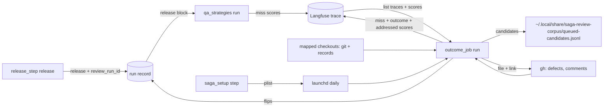

# Tie /qa and later defects back to the review that passed the code (issue #167)

## Summary

The release step records its merged state so `/qa` can name the review run it tests. `/qa` posts each failure as that run's miss. A daily launchd job links later defects and reverts to the runs that passed them, queues them where the corpus screening reads, files fix-later boxes ticked after review, and posts each completed run's addressed rate.

---

## Problem Frame

Issue #167 is card C16 of the saga review redesign (parent issue #147): the design's Change 8 ("After merge"), Change 9 ("Who records outcomes, and when") and Change 10 ("Fix-later items"). A review's misses become visible after the merge instead of vanishing with it.

Today, under `plugins/saga/`, `release_step.py release` merges and prints the release state but writes nothing, so `deploy` and `close` read a `release` block that never exists. `/qa` writes its `qa_run.v1` block through the record lock naming no review run, and its tested revision falls back to empty. Nothing links a defect or revert found after merge to the review that passed the code, and nothing in saga runs on a schedule.

Every dependency has landed. C1 (issue #148) gives the review runs, finding identity and `merge_outcome`. C3 (issue #150) gives `saga_setup.py`, the machine record and the extensions registry. C13 (issue #164) gives `review_state.py` with the filer, the stamp and the final comment carrying `<!-- saga:fix-later-checklist -->`. C15 (issue #166) gives the Langfuse client, the trace layout, outcome scores and the local queue. K1 (saga-review-corpus issue #1) gives the queued-candidate format and the tracing method this job follows.

Facts checked on 8 October 2026 that shape the plan:

- `release_step.py` names its record by `--record` path, so its write goes through `run_record.file_lock`, not `update`. `release` is not a top-level key: it lands in `extra`, which `show` prints.
- The release print shape is pinned exactly by existing tests, so the print keeps its keys and the record carries the state plus the review link.
- C15's trace metadata carries repository slug, base, head, card and round, but no pull request number. The job matches defects to traces by repository and reviewed head, reading the head from the final comment's `Reviewed revision` line.
- C15's client has no trace read. Its closed endpoint list maps each kind to a fixed path, so the job's reads arrive as two new read-only `GET` kinds, never a per-identifier path.
- K1's queue is owner-only JSONL at `~/.local/share/saga-review-corpus/queued-candidates.jsonl`. Each record names a source (`/qa`, `defect issue` or `revert`), the repository, the review run, and the fixing pull request or commit. A record without a fix, or any malformed line, aborts the whole screening read, so the job validates every line before appending.
- K1 traces a fix by blaming its removed lines on the fix's parent commit, resolving each blamed commit to a pull request by subject or through `gh`. Purely additive fixes and fixes spanning pull requests are this card's scope cut (the card leaves both to corpus screening), so the job implements the removed-line single-pull-request path only. Saga carries its own code for that method and imports nothing from the corpus repository.
- `gh` exposes a closed issue's closing pull requests (`closedByPullRequestsReferences`), and issue comments carry a numeric `id` with their `body`, which a `PATCH` edits. Both verified against the live API on 8 October 2026.
- `keychain-env` has no exec mode; `emit` prints shell exports. The launchd item therefore evaluates `keychain-env emit` at run time and never holds a key.

---

## Requirements

**Release records the merge**

- R1. Every non-dry-run `release_step.py release` writes its state into the run record under the record's lock, landing only the `release` key on a fresh re-read. Only a merged release carries `landed_commit`. `references/run-record.md` lists the release step as a writer. (AC-1)
- R2. The written block carries `review_run_id`: the Langfuse trace identifier of the latest stored review run whose head is the release's reviewed head, or null with a reason when no run matches, the slug is unknown, or the trace module cannot load. The printed release state keeps its keys. (AC-1, AC-2)

**`/qa` names its review run**

- R3. The `qa_run.v1` block carries `review_run_id` and a reason that is null when the run was found. `/qa` prefers the identifier the release step recorded and otherwise recomputes it by head match. The envelope schema is unchanged. (AC-2)
- R4. Each failed strategy posts one miss to that run's trace after the block is written. Blocked strategies, `select` and `verdict` post nothing. An unreachable Langfuse, or no review run found, leaves the verdict, the exit code and the report unchanged. `/qa` still files no issue. (AC-2)

**Langfuse plumbing for misses and reads**

- R5. The fleet-core client gains two read-only `GET` kinds, the trace list and the score list, on fixed paths. The method set stays `GET` and `POST` only, the saga bundle is regenerated, and no key or host appears in output. (AC-3, AC-4)
- R6. `review_trace.py` gains public builders for the `review-miss` and `addressed-rate` scores with derived, repost-safe identifiers. (AC-2, AC-3, AC-5, AC-6)
- R7. `review_trace.py` gains trace-listing and score-reading helpers with pagination, defensive parsing and the strictest visibility. (AC-3, AC-4)

**The outcome job**

- R8. `outcome_job.py` runs the daily pass, registers repository checkouts and reports status from owner-only state under the user's home. It changes to its state directory before working, reads keys only from the environment, answers `--help` with no credentials, and keeps module scope standard-library only. (AC-3, AC-4, AC-5, AC-6, AC-8)
- R9. A closed `defect` issue whose closing pull request merged, whose fix traces to one introducing pull request across the non-merge commits it brought in, and whose reviewed head matches a listed trace is posted to that trace as found after merge. The head comes from the stored review run and is cross-checked against the marker comment. Anything else is skipped with a named reason and never queued. (AC-3)
- R10. A revert on a mapped default branch is traced and posted the same way as reverted. (AC-3)
- R11. Each linked later defect is appended once to the candidate queue in the format K1's screening reads. A `/qa` miss waits in job state until the run's record shows the repair landed, then queues with that fix. Listing windows overlap by a day and state sets dedupe. The window advances only when every listing and fetch stage completed; anything less leaves it where it was for the next pass. (AC-4)
- R12. Each box ticked in a final checklist whose finding outcome is still `left` and which has no issue is filed through C13's filer, journalled, flipped to `filed` with the issue number in the run record and in Langfuse, and linked from the comment. A second pass changes nothing, and a refused filing records nothing. (AC-5)
- R13. Each round's trace whose findings all carry outcomes gets one addressed-rate score, reposted when a filing changes it. A run with a missing outcome or no findings gets none. `fixed-now` counts as fixed, and no grade, pass mark or calibration reader references the score, pinned by a static test. (AC-6)

**Schedule and record**

- R14. `/saga:setup` offers the daily schedule only where launchd exists and installs it only when the operator names the step: an idempotent launchd agent that runs the job with keys from `keychain-env` at run time and holds no key itself. Each repository registers its checkout, and the survey persists the step in the machine record. (AC-7)
- R15. The new outcome-job suite and the release-step, `/qa` and setup suites pass in the full saga suite. (AC-8)

---

## Key Technical Decisions

Each entry is the decision, then why, naming what was rejected.

- **KTD1. `review_run_id` is the derived Langfuse trace identifier, computed by the release step.** `review_trace.review_trace_id` over the matched stored run and the slug both names the run and addresses its trace, with no lookup and no schema change. `/qa` reads the recorded identifier first and recomputes by head match as fallback. Rejected: the head sha (not the trace address), the round number (needs the rest of the identity anyway), and a random identifier with a lookup store (a new store for what derivation already gives).

- **KTD2. One CATEGORICAL `review-miss` score carries every miss, on the trace.** Values are `found-by-qa`, `found-after-merge` and `reverted`. The comment carries identifiers only, and `metadata.source` is exactly the queue source (`/qa`, `defect issue`, `revert`), so the score forges the queue link mechanically. Rejected: three score names (triples every listing), observation-level scores (a miss has no finding to attach to), and human phrases as machine keys.

- **KTD3. The latest round wins.** A miss attaches to the highest-round trace matching the repository and reviewed head, because that run passed the code to merge. Rejected: posting to every round (one miss becomes many) and to the first round (not what shipped).

- **KTD4. The job keeps an accumulated trace index and overlaps every listing window by a day.** Defects arrive long after their reviews, and Langfuse reads can lag the write; the index matches old reviews and the overlap absorbs skew. Processed sets dedupe, so there are no watchlists. Rejected: relisting everything each pass (unbounded cost) and exact windows (a lagging trace misses its defect forever).

- **KTD5. The job links only unambiguous single-pull-request traces and queues only linked defects.** A merge-commit fix resolves to the non-merge commits its pull request brought in, and links only when at least one traces and every traced commit agrees on one introducing pull request; any add-only commit vetoes the fix, because the card leaves additive tracing to K1. Spanning fixes, unknown introducers and in-PR repairs skip with named reasons in K1's edge-case vocabulary, and K1's own discovery still cases them; the queue's added value is the certain link. A merge fix queues with the closing pull request number only, which K1's finder warns on and skips without aborting. Rejected: skipping every merge commit (the release step defaults to merges, so that would unlink the common case), context blame and multi-introducer linking (K1's lane, explicitly out of scope), and queueing unlinked defects (duplicates discovery while the record cannot name the run).

- **KTD6. A `/qa` miss queues only once its repair has landed.** K1's reader requires a fixing pull request or commit and aborts the whole read on a record without one, and a miss has no fix at post time. The job holds misses as pending in state and queues each with the fix from the run record's later release. Rejected: queueing immediately without a fix (breaks K1's monthly run) and naming the tested revision as the fix (traces the defect as its own repair).

- **KTD7. Every queued line is validated against K1's read rules before it is appended.** The check mirrors the landed reader exactly — source in the closed set, non-empty string repository, integer-or-absent fixing pull request, string-or-absent fixing commit, at least one fix present — and stays stricter in two places the writer controls: the review run is always a non-empty string (landed passes it through unvalidated), and a boolean pull-request number is rejected. One fixture line pins the reader's accepted shape. An invalid record never touches the file, because one bad line aborts screening. Rejected: validating the file after writing (leaves the bad line for K1 to trip on), and looser types (a string pull-request number aborts the whole monthly read).

- **KTD8. Every side effect journals immediately after, and each side effect is safe on its own.** State persists atomically after each queue append and each filing, not only at the end of the run. A queue append first checks the file for an identical line, so a crash anywhere re-derives to the same content and skips. A filing journals `claimed` before calling mission-control and `done` right after; a pass start reconciles stale `claimed` entries (a live pass holds the state lock, so all are stale) by exact-title issue search, adopting the hit whose body carries the finding identifier and refiling only on a clean miss, while a failed search skips the finding for the pass. The flip reuses C13's stamp plus whole-run validation under `run_record.update`, and the Langfuse post reuses C15's outcome scores filtered to the flipped finding. Rejected: journal-before-side-effect (a crash between the two skips the item forever), record-first (a crash refiles), comment-first (a link without an issue), and reimplementing the filer or the stamp (two shapes that drift).

- **KTD9. The job reads git history and run records from registered checkouts, fetched each pass, and works from its state directory.** Run records live only in checkouts, so owned clones cannot replace the map; `install-schedule` registers the checkout it runs from and `register` adds the rest. Every `git` and `gh` call runs with a scrubbed environment through explicit paths, and credentials come only from the process environment and the Mac's stored sign-in. Rejected: scanning the workspace for checkouts (magic paths), owned mirror clones (no records, a second source of history), and running from a checkout under review (the job's ground rule: it never runs from, or reads credentials from, a repository under review).

- **KTD10. `fixed-now` counts as fixed in the addressed rate.** A finding fixed before merge is the most addressed outcome there is; excluding it would shrink the denominator for the best-handled findings, and counting it as unaddressed would punish fixing. The rate is fixed plus fixed-now plus filed over all findings, rounded to four places. Rejected: dropping `fixed-now` from the arithmetic and counting it against the run.

- **KTD11. Machine steps run from the saga checkout.** C3's step vectors are fixed argument lists with no substitution and run with the working directory the skill passes, so the schedule step's relative saga paths resolve only from the saga checkout. The setup skill says so in one sentence, and other repositories register through a direct `register` command, which needs no mechanism. Rejected: absolute paths in the committed registry (private and unportable), editing `saga_setup.py` for substitution (C3 forbids it: later cards never edit that flow), and shell discovery one-liners (fragile addressing for a daily job).

- **KTD12. The plist carries no keys and the skill gates the offer.** The agent runs `sh -c` evaluating `keychain-env emit` before executing the job, with the interpreter, script and home paths baked in at install. The survey lists the step wherever the registry is read, so the setup skill offers it only on macOS where `launchctl` exists, and the installer refuses without it. Rejected: keys or `EnvironmentVariables` in the plist (keys reach the job only through `keychain-env` at run time), and platform gating in the survey (the mechanism has no such gate; the offer is the skill's).

- **KTD13. Langfuse reads are two new `GET` kinds, verified against the server before parsers are coded.** The trace list and the score list both live on fixed paths with filter parameters, which keeps C15's fixed-path property; a per-trace detail path would break it. Read APIs evolve, so the implementer confirms paths, parameters and response shapes against the server's published interface plus one read-only probe, and the parsers skip unknown shapes with reasons instead of raising. Rejected: raw HTTPS in the job (duplicates key handling, redaction and the visibility rule) and coding to unverified API sketches.

- **KTD14. The release print keeps its keys.** Existing tests pin the printed shapes exactly, and the identifier is a record-level link, not release output. The record carries the state plus `review_run_id` and its reason. Rejected: printing the identifier (churns pinned output for no consumer).

- **KTD15. Finding outcomes come from run records, not from Langfuse scores.** Only the record shows a missing outcome: an unanswered finding posts no score, so its null is invisible in Langfuse. Records are also complete in one read, where scores would need per-finding joins across pages. Rejected: a Langfuse-only job (cannot see nulls, so cannot decide the addressed rate).

- **KTD16. The reviewed head comes from the stored review run and is cross-checked against the marker comment.** Exactly one run record whose release names the introducing pull request gives the head; when a marker comment exists its Reviewed revision line must agree, and disagreement skips as a mismatch. With no record the comment head still links, because pruned checkouts are common and forging a head needs write access plus intent; with neither, or with two records naming one pull request, the defect skips. Rejected: comment-only matching (anyone who can edit the comment can repoint the miss) and record-only matching (a pruned checkout would unlink every later defect).

---

## High-Level Technical Design

The release step links the record to the trace, `/qa` posts misses to it, and the job closes the loop on everything later. The job's passes share one state file and one checkout map.



`run` executes seven stages in order: fetch checkouts, refresh the trace index, link defects, link reverts, resolve `/qa` misses, file ticked boxes, post addressed rates. State persists atomically after each side effect and once more at the end with the window, the index and the failures, and the run prints a summary of counts and skip reasons. Listing and fetch failures never abort the pass: every other stage runs on best-available data. The window advances only when every listing and fetch stage completed, including an uncapped trace listing with at least one parsed trace or a genuinely empty result; anything less leaves the window where it was, and the overlap plus the processed sets make the retry safe.

---

## Implementation Units

Six units: the release record, `/qa`, the Langfuse reads, the job's linking and queueing, its filing and addressed rate, then the schedule and the documents.

### U1. The release step records its state

`release` writes what it merged, plus the review link, under the record's lock.

**Goal:** Every non-dry-run release lands its state in the run record with `review_run_id`, keeping every other key, and the writers table names the release step.

**Requirements:** R1, R2.

**Dependencies:** none.

**Files:** `plugins/saga/scripts/release_step.py`; `plugins/saga/references/run-record.md`; `plugins/saga/tests/test_release_step.py`.

**Approach:**

- In `main`, after `release()` returns on a non-dry-run path, store the state: open `run_record.file_lock` on the `--record` path, re-read the file, replace only the top-level `release` key with the state plus `review_run_id` and `review_run_reason`, and write through the atomic replace. The writer is a function named `save_record_file` calling `run_record.write_json_atomic`, invoked only under the lock, which is the shape the issue-117 guard test allows.
- The merge itself runs unlocked, as it does today; only the landing takes the lock, so a concurrent `usage add` between the merge and the write survives on the fresh re-read.
- `review_run_id` is `review_trace.review_trace_id` over the latest stored run whose head equals `reviewed_head` (highest round wins), with the slug from the record's `repo` falling back to the repository's origin remote. The import is lazy, beside C15's, so a broken bundle cannot stop a release. No head match, an unresolvable slug, or an unloadable module records null with a reason; a wrong identifier is worse than none, so `unknown` is never computed with.
- Waiting and refused states write without `landed_commit`. Dry runs write nothing. The printed state keeps its keys (KTD14). `deploy` and `close` are unchanged: they already read the block.
- `run-record.md` gains one writers-table row: `release_step.py release` lands the `release` block through `file_lock` on the `--record` path.

**Patterns to follow:** `build_loop.py` (`save_record_file` under `file_lock`); `review_trace.stored_runs`, `repository_slug` and `review_trace_id`; C15's lazy `review_trace` import in `_post_outcomes`.

**Test scenarios:**

- Happy path: a merged release writes `reviewed_head`, `landed_commit`, `pull_request` and `merge_method` to the record, and the printed state plus the two link keys equals the stored block.
- Happy path: the recorded `review_run_id` equals the trace identifier C15's function computes over the head-matching run and the slug.
- Edge case: waiting, then refused, each write a block with no `landed_commit` key at all.
- Edge case: a dry run leaves the record bytes unchanged.
- Edge case: a concurrent usage write between the merge and the landing survives in the stored record.
- Edge case: no stored run matches the reviewed head, and an unresolvable slug, each record null with a reason naming which.
- Error path: `review_trace` unimportable still merges with exit 0 and records null with reason `review-trace-unavailable`.
- Integration: `deploy` and `close` read the written block back from the same file.
- Preservation: every existing `test_release_step.py` scenario passes unchanged.

**Verification:** a merged release is visible through `run_record.py show`; every other release path writes the documented shape; the writers table names the step.

**Functional checks:**

```functional-checks
- name: release-step-suite
  command: python3 -m pytest plugins/saga/tests/test_release_step.py -q --import-mode=importlib
  proves: [AC-1]
  runs: local
- name: release-block-visible-in-show
  command: >-
    sh -c 'set -e; d=$(mktemp -d); printf "%s" "{\"schema\": \"run_record.v1\", \"issue\": 167, \"repo\": \"o/r\", \"review_cycles\": []}" > "$d/record.json";
    HOME="$d" python3 - "$d/record.json" <<'"'"'EOF'"'"'
    import json, sys
    from types import SimpleNamespace
    sys.path.insert(0, "plugins/saga/scripts")
    import release_step
    path = sys.argv[1]
    head = "a" * 40
    merged = {"mergeStateStatus": "CLEAN", "statusCheckRollup": [], "headRefOid": head, "url": "https://example.test/o/r/pull/5"}
    landed = {"mergeCommit": {"oid": "b" * 40}, "url": "https://example.test/o/r/pull/5"}
    def fake(argv, **kw):
        if argv[:3] == ["gh", "pr", "merge"]:
            return SimpleNamespace(returncode=0, stdout="", stderr="")
        if argv[1:3] == ["pr", "view"] and "mergeCommit,url" in argv:
            return SimpleNamespace(returncode=0, stdout=json.dumps(landed), stderr="")
        return SimpleNamespace(returncode=0, stdout=json.dumps(merged), stderr="")
    assert release_step.main(["--record", path, "release", "--pull-request", "5"], runner=fake, trace_opener=None) == 0
    raw = json.loads(open(path).read())
    assert raw["release"]["landed_commit"] == "b" * 40, raw["release"]
    assert "review_run_id" in raw["release"] and "review_run_reason" in raw["release"]
    EOF
    grep -q landed_commit "$d/record.json"'
  proves: [AC-1]
  runs: local
- name: writers-table-names-release
  command: sh -c 'grep -q "release_step.py.*release" plugins/saga/references/run-record.md && grep -q "file_lock" plugins/saga/references/run-record.md'
  proves: [AC-1]
  runs: local
```

### U2. `/qa` names the review run and posts its misses

The tested code points at the run that passed it, and each failure becomes that run's miss.

**Goal:** The `qa_run.v1` block carries `review_run_id`; each failed strategy posts one `review-miss` score; verdict, exit code and report are unchanged.

**Requirements:** R3, R4, R6.

**Dependencies:** U1.

**Files:** `plugins/saga/scripts/review_trace.py` (the two public score builders); `plugins/saga/scripts/qa_strategies.py`; `plugins/saga/skills/qa/SKILL.md`; `plugins/saga/skills/qa/references/qa-evidence-and-verdict.md`; `plugins/saga/tests/test_qa_strategies.py`; `plugins/saga/tests/test_review_trace.py`.

**Approach:**

- `review_trace.py` gains `miss_score(trace_id, key, value, comment, metadata)` and `addressed_rate_score(trace_id, value, counts)`, thin public builders over the existing score shape with derived identifiers. U5 reuses the addressed builder; nothing else in C15's module changes.
- `execute()` resolves `review_run_id` from the record it already holds: the release block's recorded identifier when present, else the derived identifier of the latest stored run whose head is the release's reviewed head, else null. `review_run_reason` is null when found and names why when not: `no-release-block`, `no-matching-run`, `slug-unknown` or `review-trace-unavailable`. The trace module loads lazily, as in the release step.
- After `write_block`, for each envelope with result `failed`, post one `miss_score` with key `miss:qa:<strategy>:<tested-revision>`, value `found-by-qa`, an identifiers-only comment, and metadata naming source `/qa`, the strategy and the tested revision. The post goes through `review_trace.post` inside `try/except Exception` with one stderr line, after the verdict is final, so posting can neither change the verdict nor raise into the run. Blocked strategies post nothing; `select` and `verdict` never reach the posting path.
- `execute()` gains a `trace_transport` seam (the `getenv`/`urlopen`/`resolve` mapping `post` takes), defaulting to production; tests inject fakes. Visibility comes from the matched run's base commit through `review_trace.visibility`, defaulting to the strictest when unknown.
- The skill's procedure gains the recording and posting step beside the write step, keeping every NOT in the never-repairs list verbatim. The evidence reference's "Where it is written" section gains the two block keys and one paragraph on miss posting. The envelope schema and the report renderer are untouched.

**Patterns to follow:** C15's `finish` posting (`trace_opener` seam, write-before-post, one stderr line); `review_trace.post` and `summary_line`; `outcome_scores` for score shape.

**Test scenarios:**

- Happy path: after a recorded release, the block carries the release's recorded identifier, and each failed strategy posts exactly one `found-by-qa` score on that trace through an injected transport.
- Happy path: with no recorded identifier, `/qa` recomputes the same identifier by head match.
- Edge case: with no review run found, nothing is posted and the block's reason names why.
- Edge case: blocked strategies, a `select` run and a `verdict` recomputation post nothing.
- Error path: an opener raising `URLError` leaves the verdict, the exit code and the stored block identical to a successful post, and one file waits in the owner-only queue.
- Error path: the posting helper raising still routes by the computed verdict.
- Preservation: `/qa` files no issue — the full run invokes no `gh issue` or mission-control argv — and the skill still carries the never-files sentence.
- Happy path `test_miss_score_shape`: the builder returns the `review-miss` CATEGORICAL body with the derived identifier, no observation, the comment and the metadata it was given.
- Happy path `test_addressed_rate_score_shape`: the builder returns the NUMERIC `addressed-rate` body with the value rounded to four places and the counts in metadata; building twice gives the same identifier.

**Verification:** the block names its run, failures appear on that run's trace, and every silence (blocked, refused, unreachable, read-only) is pinned.

**Functional checks:**

```functional-checks
- name: qa-suite
  command: python3 -m pytest plugins/saga/tests/test_qa_strategies.py -q --import-mode=importlib
  proves: [AC-2]
  runs: local
- name: miss-score-builders
  command: python3 -m pytest plugins/saga/tests/test_review_trace.py -q --import-mode=importlib -k "miss_score or addressed_rate_score"
  proves: [AC-2]
  runs: local
- name: qa-skill-names-the-run
  command: sh -c 'grep -q "review_run_id" plugins/saga/skills/qa/SKILL.md && grep -q "review_run_id" plugins/saga/skills/qa/references/qa-evidence-and-verdict.md && grep -q "does \*\*NOT\*\* file SDLC issues" plugins/saga/skills/qa/SKILL.md'
  proves: [AC-2]
  runs: local
```

### U3. The job's Langfuse reads

Two read-only list endpoints plus the helpers that page them defensively.

**Goal:** The client lists traces and scores over `GET` only, `review_trace.py` pages both with the strictest visibility, and the saga bundle is current.

**Requirements:** R5, R7.

**Dependencies:** none.

**Files:** `plugins/fleet-core/scripts/fleet_commons/langfuse_client.py`; `plugins/fleet-core/tests/test_langfuse_client.py`; `plugins/fleet-core/references/langfuse.md`; `plugins/fleet-core/CHANGELOG.md`; `plugins/saga/scripts/_bundled/langfuse_client.py` (regenerated, never hand-edited); `plugins/saga/scripts/review_trace.py` (list helpers only); `plugins/saga/tests/test_review_trace.py`.

**Approach:**

- This unit touches files outside the card's list because C15's closed endpoint list has no trace read and the job cannot list reviews without one. The change preserves every C15 property: fixed paths, `GET` and `POST` only, keys at request time, redaction on the only path, visibility at send time.
- `ENDPOINTS` gains exactly two entries: the trace list and the score list, both `GET` on fixed paths with filter parameters carried as the query. No per-identifier path, no new method. Before coding the parsers, the implementer confirms both paths, their parameters and their response shapes against the server's published interface plus one read-only probe, because read APIs evolve; the confirmed shapes go into `langfuse.md` beside the existing endpoint table.
- `review_trace.py` gains `list_traces(since, ...)` yielding trace identifiers with their repository, base, head, card, round and timestamp, and `trace_scores(trace_id, name, value, ...)` yielding that trace's matching scores. Both take the standard transport seams, pass the strictest visibility, page until empty or a hundred pages (then stop with a `trace-pages-capped` reason the job surfaces), and skip unknown shapes with reasons instead of raising.
- Regenerate the bundle with `python3 scripts/bundle_fleet_module.py` per the repository build step; `--check` passes. Both changelogs gain one entry each under Unreleased.

**Patterns to follow:** C15's U1 (endpoint kinds, `get`, the `no_delete` test) and U2 (bundle regeneration, `bundled_fleet.load`); the `rounds` metrics read for a `GET` with a query.

**Test scenarios:**

- Happy path: the trace list and the score list each send one `GET` to their fixed path with the expected query, through an injected opener, with keys only in the auth header.
- Happy path `test_list_traces_pages_in_order`: three pages yield every trace once, in order, and stop at the empty page.
- Edge case: every `ENDPOINTS` method is still `GET` or `POST`, an unknown kind still raises before any call, and the stdlib-only test still passes.
- Happy path `test_trace_scores_filter_by_name_and_value`: the helper sends the name and value filters and yields only the matching scores.
- Edge case `test_list_traces_skips_unknown_shapes`: a trace without repository metadata and a score with an unknown shape are skipped with reasons and never raise.
- Edge case `test_list_traces_pages_capped`: a hundred full pages stop the listing with the capped reason.
- Error path: the visibility rule applies to reads: an `http` host with strict visibility refuses before any call.
- Error path: sentinel keys and the host string appear in no result, log line, exception or queued file across every read outcome.
- Integration: the bundled client loads through `bundled_fleet`, and `bundle_fleet_module.py --check` exits 0.

**Verification:** reads flow through the same redaction, key handling and visibility rule as posts, and the bundle the job imports is the generated one.

**Functional checks:**

```functional-checks
- name: langfuse-client-reads
  command: python3 -m pytest plugins/fleet-core/tests/test_langfuse_client.py -q --import-mode=importlib
  proves: [AC-3, AC-4]
  runs: local
- name: trace-list-helpers
  command: python3 -m pytest plugins/saga/tests/test_review_trace.py -q --import-mode=importlib -k "list_traces or trace_scores or pages_capped"
  proves: [AC-3, AC-4]
  runs: local
- name: fleet-bundle-current
  command: python3 scripts/bundle_fleet_module.py --check
  proves: [AC-3]
  runs: local
```

### U4. The job links defects and reverts and queues them

The daily pass finds what the reviews missed and where the corpus reads it.

**Goal:** `outcome_job.py run` refreshes the trace index, links defects and reverts to their review runs, posts the misses and appends each linked defect once to the candidate queue.

**Requirements:** R8, R9, R10, R11.

**Dependencies:** U1, U2, U3.

**Files:** `plugins/saga/scripts/outcome_job.py` (new: `run`, tracing, queueing); `plugins/saga/tests/test_outcome_job.py` (new).

**Approach:**

- The command line is `run [--home DIR] [--queue PATH]`, `register --repo-root PATH [--home DIR]`, `install-schedule [--home DIR]` and `status [--home DIR]`; this unit ships `run` and the shared state, tracing and queue helpers, and U6 adds the other three verbs. `main` takes keyword seams the CLI does not expose: `gh_runner`, `git_runner`, `mc_runner`, `mc_path`, `getenv`, `urlopen`, `resolve` and `clock`. Module scope is standard-library only with the sibling `sys.path` shim; `review_trace`, `review_state` and `run_record` load lazily inside the verbs. A `--help` run touches none of them.
- `run` changes to `<home>/.saga/outcome-job/` first, takes an advisory lock on its state lock file (a second concurrent run exits 2 with a reason), and loads `state.json` (`outcome_job_state.v1`) and `repos.json` (`outcome_job_repos.v1`), both owner-only with atomic-replace writes. State holds the last pass time, the accumulated trace index, the processed defect, revert and queue sets, pending `/qa` misses, claimed and filed boxes, posted addressed rates and per-key failures. Every state write persists the full in-memory state atomically, after each side effect as well as at the end.
- Fetch each mapped checkout's default branch with a 180-second timeout; a fetch failure skips that repository's git-dependent stages with a reason and blocks the window. Every `git` invocation carries `-c core.hooksPath=/dev/null` so no checkout hook can run in the unattended pass. Every other `git` and `gh` call carries a 60-second timeout and runs with a scrubbed environment in the C15 shape and explicit paths, never from a checkout under review.
- Refresh the index with `list_traces` since the last pass minus a day of overlap, merging trace identifier to repository, base, head, card, round and timestamp. The first pass lists everything, paged. A failed, capped, or fully-skipped listing (every returned trace an unknown shape) is a listing failure: the pass continues on the accumulated index, but the window does not advance. A genuinely empty listing advances normally.
- Defects, per mapped repository: list closed `defect` issues updated in the overlap window; a failed list blocks the window. Read each issue's closing pull requests and keep merged ones; take the merge commit as the fix. A merge-commit fix resolves to the non-merge commits its pull request brought in (`rev-list` from first parent to second parent, merges excluded).
- Trace each fix commit with the job's own implementation of K1's removed-line method: blame the fix's removed lines on the fix's parent, resolve each blamed commit to a pull request by `(#N)` subject or `gh pr list --search <sha> --state merged`. A fix links only when at least one commit traces and every traced commit agrees on one introducing pull request that is not the closing pull request; any add-only commit vetoes the fix, and spanning fixes, unknown pull requests and in-PR repairs skip with named reasons. Binary and empty diffs are skipped per file, as K1 skips them. No corpus code is imported; the removed-line single-pull-request path is pinned by tests on hand-worked fixture histories, and the add-only and spanning skips are this card's scope cut, not parity targets.
- Resolve the introducing pull request's reviewed head from the mapped checkout's run records first: exactly one record whose release names the pull request gives the head, found through `run_record.resolve_store_root` rather than a hand-built path. When a marker comment exists its Reviewed revision line must agree, or the defect skips as a mismatch; with no record the comment head still links, and with neither head, or two records naming one pull request, the defect skips. The comment body is matched by `review_state.CHECKLIST_MARKER` and rendered in tests by the real `review_state.render_comment`, so a C13 format change fails loudly here. The head matches the index by repository, and the highest round wins.
- Each link posts one `review-miss` score (`found-after-merge` with key `miss:defect:<issue>`, `reverted` with key `miss:revert:<sha>`) and appends one queue record: source, repository slug, review run, fixing pull request as an integer, plus the fixing commit when the fix is a single non-merge commit. The record is validated against the mirrored reader rules before writing, the file is checked for an identical line first (a re-derived append after a crash skips instead of duplicating), and state journals the entry immediately after. The default queue path is K1's `~/.local/share/saga-review-corpus/queued-candidates.jsonl`, created owner-only; `--queue` overrides it for tests.
- Reverts come from `git log --no-merges` on each mapped default branch over the overlap window, matching K1's revert subject rule case-insensitively, then follow the defect path from tracing on.
- `/qa` misses come from `trace_scores` filtered to value `found-by-qa` in the overlap window. Each is held pending in state until the mapped checkout's record for its card shows a merged release newer than the tested revision and descended from it, then queues with that release's pull request and landed commit and leaves pending. The tested revision stays in the `qa` block even after the release block moves on, so the match survives repairs.
- Persist state at the end with the window, the index and the failures, and print counts with skip reasons. The window advances only when every listing and fetch stage completed; anything less leaves it where it was. Exit 1 when the window did not advance or a filing was refused, after completing all other work; reason-skips are routine outcomes reported in the summary, not failures. State records every failure for the next pass.

**Patterns to follow:** `review_state.resolve_mission_control`, `CHECKLIST_MARKER` and `render_comment`; `review_trace.post`, `summary_line` and the U2/U3 builders and listers; `review_tools` fixture repositories (`_init`, `_commit`); C13's fake-`gh` PATH fixtures; C4a's owner-only directory and the audit-store file write.

**Test scenarios:**

- Happy path `test_defect_links_posts_and_queues`: a `defect` issue whose closing pull request merged and whose fix changed lines a reviewed pull request introduced is linked to that review run as found after merge, posted once and queued once, on a fixture git history with injected `gh`, mission-control and Langfuse fakes.
- Happy path `test_revert_links_posts_and_queues`: a revert commit is linked as reverted and queued with its sha.
- Happy path `test_qa_miss_pending_until_repair_then_queued`: a `/qa` miss score waits pending, then queues with the repair's pull request and commit once the record shows it landed.
- Edge case `test_queueing_second_pass_appends_nothing`: a second pass over the same Langfuse and GitHub fakes appends nothing and posts nothing new.
- Edge case `test_overlap_window_dedupes_relisted_defect`: the overlap window relists yesterday's defect but the processed set dedupes it.
- Edge case `test_unlinked_defect_reasons`, each with no post and no queue line: no closing pull request, unmerged closing pull request, add-only fix, spanning fix, unknown introducing pull request, in-PR repair, no reviewed head, head mismatch, ambiguous release, no matching trace.
- Happy path `test_defect_merge_fix_links_when_commits_agree`: a merge-commit closing pull request whose two branch commits both trace to one introducing pull request links and queues with the closing number only.
- Edge case `test_defect_merge_fix_skips_on_veto`: disagreeing branch commits skip as spanning, and one add-only branch commit vetoes the fix.
- Happy path `test_linking_prefers_record_head_and_cross_checks_comment`: record and comment agreeing links; disagreeing skips as a mismatch; record-only links without a comment; comment-only links without a record.
- Edge case `test_queue_line_matches_reader_shape`: the canonical fixture line validates; a string pull-request number, a missing fix, a bad source, an empty repository and a missing review run are each rejected before any write.
- Edge case `test_queueing_skips_identical_line`: a re-derived record whose line is already in the file appends nothing and still journals.
- Edge case `test_git_argv_disables_hooks`: every `git` argv the run issues carries `-c core.hooksPath=/dev/null`.
- Error path `test_linking_blocks_window_on_listing_failure`: a failed, capped, or fully-skipped trace listing still runs the other stages but leaves the window where it was with exit 1; a genuinely empty listing advances.
- Error path `test_linking_blocks_window_on_fetch_failure`: a failed fetch skips that repository with a reason while other repositories complete, blocks the window, and exits 1.
- Error path `test_linking_completes_when_post_queues`: a refused Langfuse post queues locally through C15's queue and the run still completes; the queue line is still appended.
- Edge case `test_run_refused_while_state_locked`: a second `run` while the state lock is held exits 2 and touches nothing.
- No network: every test runs with the socket module replaced by one that raises; `gh`, mission-control and Langfuse are always fakes.

**Verification:** links post to the right traces, the queue holds exactly the linked defects in K1's format, and every skip names its reason in the summary.

**Functional checks:**

```functional-checks
- name: outcome-linking-queueing
  command: python3 -m pytest plugins/saga/tests/test_outcome_job.py -q --import-mode=importlib -k "defect or revert or queue or pending or linking or overlap or unlinked or locked or hooks"
  proves: [AC-3, AC-4]
  runs: local
- name: outcome-job-help
  command: python3 plugins/saga/scripts/outcome_job.py --help
  proves: [AC-8]
  runs: local
```

### U5. The job files ticked boxes and posts the addressed rate

Fix-later choices made after review become issues, and completed runs report their precision signal.

**Goal:** Ticked unfiled boxes are filed, linked and flipped exactly once; each fully-outcomed run carries one addressed-rate score that no grade reads.

**Requirements:** R12, R13, R6.

**Dependencies:** U4, U2.

**Files:** `plugins/saga/scripts/outcome_job.py` (filing and addressed-rate stages); `plugins/saga/tests/test_outcome_job.py`.

**Approach:**

- For each indexed trace whose repository is mapped and whose run record exists, read the newest stored run's fix-later findings with outcome `left` and the release block's pull request. List the pull request's comments through `gh api`, take the last body opening with `review_state.CHECKLIST_MARKER`, and parse ticked boxes `- [x] <finding-id>` case-insensitively on the `x`.
- File each finding that is ticked, still `left`, absent from the filed journal and not already linked in the comment: title and body from `review_state.defect_body` for that single finding, risk from its consequence group, filed through `review_state.file_issue` with mission-control resolved at run time or `--mission-control`. Both produce exactly C13's file-as-issue shape.
- Follow the crash order in KTD8: journal `claimed`, file, journal `done` with the issue number immediately, then flip the finding to `filed` with the number through C13's stamp plus whole-run validation under `run_record.update`, then post the finding's `merge-outcome` score from C15's `outcome_scores` filtered to the flip, then edit the comment appending ` → #<n>` to the box line. A refused filing records nothing and continues with the next finding; the run exits 1 at the end with the refusal in the summary.
- Reconcile stale `claimed` entries at pass start by exact-title issue search: adopt the hit whose body carries the finding identifier and continue with the flip, refile on a clean miss, and skip the finding for the pass when the search itself fails. Resume without refiling otherwise: a journalled finding whose record is still `left` flips, posts and links; a box already carrying a link flips and posts without filing; a record already `filed` is skipped silently.
- Addressed rate, per round-trace with an available record: when every finding of that round's run carries a non-null outcome, post one NUMERIC `addressed-rate` score with `fixed-now` counted as fixed and counts in metadata, and journal the trace as posted. Runs with a missing outcome or no findings get none. A filing on the newest run reposts that run's score through the same derived identifier, replacing it; older rounds never change after posting.
- The plan-review and non-review traces the listing returns are skipped by metadata shape, and only code-review traces ever receive these scores.

**Patterns to follow:** `review_state.file_issue`, `defect_body`, `stamp_fix_later` and `CHECKLIST_MARKER`; `review_trace.outcome_scores` and the U2 `addressed_rate_score` builder; `run_record.update`; C13's fake mission-control fixtures; the C15 no-key-in-tree test for the static pin below.

**Test scenarios:**

- Happy path `test_filing_files_links_and_flips_ticked_box`: a ticked box with no issue is filed through the mission-control fake, the final round's comment gains the link, and the finding flips from `left` to `filed` with the issue number in the record and on its Langfuse entry.
- Happy path `test_filing_matches_c13_issue_shape`: the filed issue's title and body equal what C13's filer produces for the same finding.
- Edge case `test_filing_leaves_others_alone`: an unticked box, an already-linked box and an already-`filed` finding are each left alone, and `test_filing_second_pass_changes_nothing` pins the repeat pass.
- Edge case `test_filing_resumes_journalled_finding`: a crash between filing and flipping (journalled, record still `left`) resumes without refiling.
- Edge case `test_filing_reconciles_stale_claim`: a stale `claimed` entry adopts the searched issue whose body carries the finding identifier; a clean miss refiles; a failed search skips the finding for the pass.
- Error path `test_filing_refusal_records_nothing`: a mission-control refusal records nothing for that finding, files the next box, and exits 1 with the reason in the summary.
- Happy path `test_addressed_rate_posted_once`: a run whose findings all carry outcomes gets one addressed-rate score with `fixed-now` counted beside `fixed`; a run with an outcome still missing and a run with no findings get none.
- Edge case `test_addressed_rate_reposted_after_filing`: a filing after the rate posted reposts the same score identifier with the new value.
- Preservation `test_addressed_rate_read_by_no_grade`: `addressed-rate` appears in no saga script outside `outcome_job.py` and `review_trace.py`, and in no grading, formula or calibration module at all.

**Verification:** each ticked box becomes exactly one issue linked from the comment and the record, each completed run carries exactly one rate, and the rate feeds nothing.

**Functional checks:**

```functional-checks
- name: outcome-filing-addressed
  command: python3 -m pytest plugins/saga/tests/test_outcome_job.py -q --import-mode=importlib -k "filing or addressed or no_grade"
  proves: [AC-5, AC-6]
  runs: local
```

### U6. The daily schedule, the reference and the record

The operator is offered the job once, approves it once, and the documents say the rest.

**Goal:** The extensions registry offers the schedule step, the installer is idempotent and keyless, repositories register, and the reference and changelog record the card.

**Requirements:** R14, R15.

**Dependencies:** U4.

**Files:** `plugins/saga/references/setup-extensions.yaml`; `plugins/saga/scripts/outcome_job.py` (`install-schedule`, `register`, `status`); `plugins/saga/skills/setup/SKILL.md` (three sentences outside the card's file list, with the reason: the mechanism cannot gate the offer by platform or resolve saga-relative vectors, so the skill owns both); `plugins/saga/references/outcome-job.md` (new); `plugins/saga/CHANGELOG.md`; `plugins/saga/tests/test_saga_setup.py`; `plugins/saga/tests/test_outcome_job.py`.

**Approach:**

- Append the registry row: name `outcome-schedule`, a one-line summary, `done` as `launchctl list` of label `com.infiquetra.saga.outcome-job`, and `run` as `python3 plugins/saga/scripts/outcome_job.py install-schedule`. The survey lists it, tracks its done state and persists it in the machine record with no `saga_setup.py` change.
- `install-schedule [--home DIR]` refuses without `launchctl` or `keychain-env` on `PATH`, naming which. It writes `<home>/Library/LaunchAgents/com.infiquetra.saga.outcome-job.plist` firing daily at 06:17: program arguments of `/bin/sh -c` with a fixed body that reads the keychain helper, interpreter, script and home from positional parameters carried as separate arguments, so no path is interpolated into shell text. The working directory is the state directory, with launchd log paths beside it. Every path is absolute and resolved at install; the file holds no key. It then runs `launchctl bootout gui/<uid>/<label>` ignoring failure and `launchctl bootstrap gui/<uid> <plist>` (both argument vectors verified against the stock tool), all through an injected runner, and registers the working directory's repository when it is a git checkout with an origin. Reinstalling replaces in place.
- `register --repo-root PATH [--home DIR]` validates the checkout and its origin slug and upserts the checkout map, so a moved repository re-registers cleanly; `register --remove --repo-root PATH` drops a mapping whose remote is permanently dead so it stops pinning the window. Unknown slugs and non-repositories exit 2 with a reason. `status [--home DIR]` prints repositories, last pass, index size, pending misses, filed boxes and posted rates from state.
- The setup skill gains three sentences: offer the schedule step only on macOS where `launchctl` exists; run it from the saga checkout without `--repo`, because step vectors resolve against the working directory; after setting up a repository, register it with `outcome_job.py register --repo-root`. The named-only rule already covers approval.
- `references/outcome-job.md` documents the job contract: the state and map shapes, the seven stages and their order, the overlap and idempotency rules, the tracing method and its skip reasons, the queue format and path, the filing crash order, the addressed-rate rule, the schedule and key handling, and how to read `status` and the launchd log.
- The changelog gains one Unreleased Added entry naming issue #167 with the release record, `/qa` link, job, queue, filing, addressed rate and schedule.

**Patterns to follow:** C3's registry rows and `run_named_step`; the survey's step persistence in `record_survey`; `review_trace.repository_slug`; PATH-based fakes for `launchctl` and `keychain-env` in tests; C15's sentinel tests for the keyless plist.

**Test scenarios:**

- Happy path `test_schedule_step_quiet_without_approval` (setup suite, real registry): the survey lists the step as not done and the runner log holds no install argv.
- Happy path `test_schedule_step_installs_with_approval` (setup suite, fixture registry vectoring the real installer): `step --name` writes the plist under a temporary home with the label, the daily interval, the `keychain-env` invocation and absolute paths, then unloads and bootstraps through PATH fakes.
- Edge case `test_schedule_registry_row_shape`: the committed row matches the expected name, summary and both vectors exactly.
- Edge case `test_schedule_survey_persists_step_in_machine_record`: the survey stores the step's done state in the machine record.
- Happy path `test_install_schedule_writes_keyless_plist`: the plist holds the label, `StartCalendarInterval`, the fixed shell body with positional parameters, absolute paths and the state working directory, and with sentinel secrets set in the environment it contains neither sentinel.
- Edge case `test_install_schedule_argv_survives_spaces`: the equivalent argv executed against a stub with space-containing paths reaches the job with every path intact.
- Edge case `test_install_schedule_is_idempotent`: installing twice replaces the plist and reloads the label with no duplicate.
- Edge case `test_install_schedule_registers_checkout`: installing from a git checkout registers its repository; from a plain directory it installs and notes the skipped registration.
- Error path `test_install_schedule_refuses_without_prerequisites`: without `launchctl`, then without `keychain-env`, the installer refuses naming which and writes nothing.
- Happy path `test_register_maps_and_updates_checkout`: `register` maps a fixture checkout to its slug and updates the mapping when the checkout moves; `test_register_refuses_non_repository` exits 2; `test_register_removes_mapping` drops a dead mapping.
- Happy path `test_job_status_prints_counts`: `status` prints the counts from a fixture state without touching the network.

**Verification:** the step installs only when named, the installed agent holds no key, and `launchctl list` shows the label once the operator has run the step on that machine.

**Functional checks:**

```functional-checks
- name: setup-schedule-tests
  command: python3 -m pytest plugins/saga/tests/test_saga_setup.py -q --import-mode=importlib -k schedule
  proves: [AC-7]
  runs: local
- name: schedule-verbs-tests
  command: python3 -m pytest plugins/saga/tests/test_outcome_job.py -q --import-mode=importlib -k "install_schedule or register or job_status"
  proves: [AC-7, AC-8]
  runs: local
- name: schedule-label-live
  command: launchctl list com.infiquetra.saga.outcome-job
  proves: [AC-7]
  runs: environment
```

---

## Scope Boundaries

Non-goals, from the card: the Langfuse client core, the trace layout, the local queue and outcomes at merge (C15, extended here only with the two read kinds the job needs); the comment, its checklist, merge-confirmation choices and the security guard's filing (C13, reused but unchanged); `/qa`'s selection, drivers and verdict; the setup script and its machine-step mechanism (C3, used but unchanged); screening candidates into cases (K1); re-running full reviews on past changes; the `deploy` block, which `/qa` still reads first and falls back past.

Later (noted here, never a unit of this plan):

- Context-blame linking for add-only fixes and multi-introducer linking for spanning fixes, if K1's casing shows they attribute cleanly.
- A machine with no Langfuse at all: the job's listing fails daily and the local queue grows, by the same rule as C15's later item.
- Rotation for the launchd log beside the job state, once the truncation behaviour on the operator's macOS is confirmed.
- A `RunAtLoad` first pass at install time; the first scheduled fire is the job's first run.
- Migrating the job's reads to the v4 generation (observations v2, scores v3) when the self-hosted server upgrades past v3.

---

## Risks & Dependencies

| Risk | Mitigation |
|---|---|
| The trace list omits OTel-ingested metadata, so the index cannot match reviews. | U3 confirms shapes against the published interface plus one read-only probe before coding parsers; helpers skip unknown shapes with reasons, and the failure is loud in the summary, never a crash. |
| The score-list path or filters differ on the operator's server version. | Same verify-first rule; the two `GET` kinds keep fixed paths whatever the parameter names are. |
| A reviewed repository leaves the checkout map, so its records are unreadable. | Every record-dependent stage skips with a reason naming the missing mapping; `register` re-adds it and the next pass resumes. Filing and addressed rates wait rather than guess. |
| The job files an issue the operator did not want. | It files only boxes the operator ticked, only through the mission-control lane, only once per finding, and the journal plus the comment link make every filing auditable from `status`. |
| Two job runs overlap and file or queue twice. | The state lock refuses the second run; derived score identifiers replace rather than add; processed sets and the journal dedupe the queue and the filings. |
| C13's comment format drifts and the head or box parsing breaks. | Tests render bodies with the real `render_comment` and match with the real marker constant, so drift fails in this suite. Unknown lines are skipped, never misparsed. |
| The login keychain is unavailable to the scheduled run. | Reads fail, the run aborts before any write with exit 1, and launchd's log plus the next pass make the outage visible; nothing is recorded half-done. |

Depends on C1, C3, C13 and C15 (all landed in this tree) and K1 (landed in the corpus repository) for the queue format and the tracing method. Hands the queued candidates to K1's monthly screening, the addressed rate to ReviewBench reporting, and the schedule to the operator's one approval.

---

## System-Wide Impact

The job is saga's first scheduled writer. It posts scores under C15's rules, files issues through mission-control's lane, edits pull-request comments it did not author, and appends to a queue another repository's screening reads. Each crossing has one seam: `review_trace.post` and the new listers for Langfuse, `review_state.file_issue` for mission-control, `gh api` for comments, and the validated append for the queue. Keys travel only from the process environment into the auth header; the plist, the state and the summaries never hold one. The launchd agent is per-machine state installed once, tracked in the machine record like any other setup step.

---

## Sources / Research

- Design: `docs/brainstorms/2026-10-05-saga-review-redesign/plan.md`, Change 8 ("After merge"), Change 9 ("Who records outcomes, and when", the addressed-rate definition) and Change 10 ("Fix-later items"); the C16 card's Intent, Notes and acceptance criteria.
- Records and lock: `plugins/saga/references/run-record.md` (the writers table, `update` versus `file_lock`, the issue-117 guard); `plugins/saga/scripts/run_record.py` (`TOP_LEVEL_KEYS`, `extra`, `show`, `file_lock`); `plugins/saga/scripts/build_loop.py` (`save_record_file` under the lock).
- Traces and outcomes: `plugins/saga/scripts/review_trace.py` (`review_trace_id`, `span_id`, `score_id`, `repository_slug`, `visibility`, `post`, `outcome_scores`, `stored_runs`); `plugins/fleet-core/scripts/fleet_commons/langfuse_client.py` (`ENDPOINTS`, `get`, `send`, the visibility rule); `docs/plans/2026-10-06-issue-166-plan.md` (KTD2, KTD6-KTD10, KTD12, KTD15).
- Review state and filing: `plugins/saga/scripts/review_state.py` (`CHECKLIST_MARKER`, `render_comment`, `defect_body`, `file_issue`, `stamp_fix_later`, `resolve_mission_control`); `docs/plans/2026-10-06-issue-164-plan.md` (KTD2, KTD3, KTD5); `plugins/saga/scripts/review_formula.py` (`MERGE_OUTCOMES`).
- Setup: `plugins/saga/references/setup-extensions.yaml` (the empty steps list); `plugins/saga/scripts/saga_setup.py` (`load_extensions`, `collect`, `record_survey`, `run_named_step`); `docs/plans/2026-10-06-issue-150-plan.md` (KTD1, KTD9); `plugins/saga/skills/setup/SKILL.md` (named-only steps).
- Release and `/qa`: `plugins/saga/scripts/release_step.py` (`release`, `deploy`, `closeout_comment`, `main`); `plugins/saga/scripts/qa_strategies.py` (`environment_identity`, `write_block`, `execute`); `plugins/saga/skills/qa/SKILL.md` and `plugins/saga/skills/qa/references/qa-evidence-and-verdict.md`.
- Queue and tracing: the corpus repository's screening module and candidate finder on its main branch (the `QueuedRecord` shape, the `~/.local/share/saga-review-corpus/queued-candidates.jsonl` path, the blame-on-parent method and its edge reasons); the K1 plan's KTD3 and KTD13. Behaviour reimplemented here, never imported.
- GitHub: `gh issue view --json closedByPullRequestsReferences`, `gh issue list --label defect --state closed`, and the issue-comments REST shape (`id`, `body`), all verified against the live API on 8 October 2026.
- Langfuse reads: public API examples for `GET /api/public/traces` (`limit`, `page`, `fromTimestamp`) and score listing with name and trace filters, confirmed 8 October 2026 against the self-hosted server (a read-only probe: both v3 lists answer 200 with `data`/`meta`, and the `BaseScore` schema carries `comment` and `metadata`) before U3's parsers were coded. The v2 score list has no trace or string-value filter, so both filter client-side.
- Suite contracts: `plugins/saga/tests/test_entrypoints.py` (the `--help` glob); `plugins/saga/tests/test_run_record.py` (the lock guard); `plugins/saga/tests/test_saga_setup.py` (fixture registries).

---

## Scenario Smoke

The card's verification suite on the combined branch, with the network faked inside every new module.

```scenario-smoke
- name: saga-suite-green
  command: python3 -m pytest plugins/saga/tests plugins/fleet-core/tests -q --import-mode=importlib
  proves: [AC-1, AC-2, AC-3, AC-4, AC-5, AC-6, AC-8]
  runs: environment
- name: repo-hygiene-green
  command: sh -c 'python3 scripts/check_repo.py && python3 -m unittest discover -s tests && python3 plugins/saga/scripts/outcome_job.py --help && git diff --check'
  proves: [AC-7, AC-8]
  runs: environment
```
