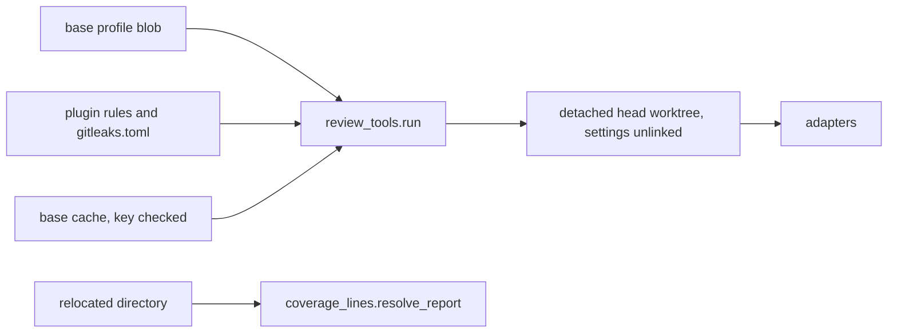

# The review-tools runner treats the change under review as untrusted (issue #188)

## Summary

Make `plugins/saga/scripts/review_tools.py` scan a detached worktree of the head commit, and take pins, rules, and the test command from the base commit and from the plugin. A file or comment in the change can be recorded for the reviewer. It cannot turn a scan off, narrow it, forge coverage, or reuse a stale base cache.

---

## Problem Frame

Issue #188 is the follow-up to issue #151 (card C4a of the saga review redesign, parent issue #147). The runner shipped in #186, commit `85bf82e`, and nothing calls it yet. C4b (#152), C4c (#153), and C5 (#154) will add adapters on top of it, so each of the holes below would be copied.

The design rule this card adds is already in the program plan: the commit under review is untrusted. Settings come from the base commit and the plugin. A settings file the change adds or edits is recorded, and it is not applied.

What the code does today:

- Line-mode adapters scan the caller's checkout. `ScanContext(repo, repo, ...)` is built at `plugins/saga/scripts/review_tools.py:390`. The diff comes from the two commits (`plugins/saga/scripts/review_diff.py:49-54`). Deleting a flagged line in the working tree, without committing, makes the scanners see a clean file. The changed-line filter then keeps nothing.
- Coverage is read from the checkout. `_report_paths` (`review_tools.py:1004-1020`) accepts a committed `coverage.json`, and it accepts a `coverage_report` that is absolute or contains `..`.
- Pins, rules, and the relocated test command come from the profile object the caller passed (`review_tools.py:668-681`, `:893-904`, `:953-969`). A caller that passes the checkout's `.saga-profile.json` lets the change replace the Semgrep pack and the test command. The command runs with the operator's environment. Only `HOME` is replaced (`review_tools.py:918-919`).
- A relative Semgrep rule path is joined onto the checkout (`review_tools.py:699-702`). In this repository that path is `plugins/saga/references/semgrep-rules`, so the change can replace the rules that review it.
- Semgrep is started without `--disable-nosem` (`plugins/saga/scripts/review_adapters_all_languages.py:47-52`). gitleaks is started without `--config` (`:108-111`). jscpd, lizard, and osv-scanner read `.jscpd.json`, `whitelizard.txt`, and `osv-scanner.toml` from the tree they scan. Semgrep's `errors` array is discarded (`:67-97`).
- The base cache directory uses `base` as the caller typed it (`review_tools.py:1269-1271`). The file is trusted when it parses (`:1288-1307`). A hit still listed for an old base is dropped as already present (`:504-505`).
- Empty standard output with exit 0 is a clean run (`review_tools.py:556-563`). jscpd writes its JSON report to a file, so an empty standard output never becomes findings.

`plugins/saga/scripts/saga_setup.py` is not in this tree. Setup (issue #150, card C3) does not call the runner. Reading the profile from the base commit does not break that flow. This plan does not fall back to the head profile.

No scanner version changes, and no scanner is given a network fetch. If the gitleaks config below makes the installed binary fetch, or the binary rejects the file, stop and report. Do not install a tool and do not bump a pin.

---

## Requirements

Requirements are grouped by concern. R-IDs run continuously. AC-n is the nth checkbox under the issue's Acceptance criteria.

**The scan root**

- R1. Every adapter scans a detached worktree whose `HEAD` is the resolved head commit. An uncommitted edit in the checkout changes no finding. The diff reader is unchanged (AC-1).

**Where configuration comes from**

- R2. Pins, rule pins, the relocated test command, and `coverage_report` are read from `.saga-profile.json` at the resolved base commit. A head change to those fields does not apply and is one degraded input, reason `head-profile-change`. When the base commit has no such file, a `--profile` path outside the repository is still the caller profile. A path inside the repository is not read, and the run uses the absent-block defaults. There is no fallback to the head file (AC-2).
- R3. The rule path `plugins/saga/references/semgrep-rules` resolves next to this plugin, from `review_tools.__file__`, never under the repository being reviewed (AC-6).
- R4. A coverage report is read only from the relocated run's own directory. `coverage_lines.resolve_report` refuses an absolute path, a path with a `..` part, and a resolved path outside that directory. The refusal is exit 2. A committed report in the checkout is ignored (AC-3).
- R5. The relocated command's environment is a new dictionary. It receives the fresh `HOME` and a fresh temp directory, plus only the allow-listed names in KTD5. A variable that is not on that list is absent (AC-4).

**Scanner settings, the cache, and silence**

- R6. Each of `.semgrepignore`, `.gitleaks.toml`, `.gitleaksignore`, `.jscpd.json`, `whitelizard.txt`, and `osv-scanner.toml` found in the head worktree is removed there and recorded as a degraded input whose `input` is the repo-relative path and whose reason is `scanner-settings`. Semgrep's argument vector includes `--disable-nosem`. gitleaks' argument vector includes `--config` of the plugin's `plugins/saga/references/gitleaks.toml` and `--ignore-gitleaks-allow`. A changed line that contains `gitleaks:allow` is a degraded input, reason `gitleaks-allow` (AC-5).
- R7. The base cache path is the resolved base SHA, the adapter id, the pinned version, and a settings digest. The file stores that key. A file for an older SHA, or a file whose stored key differs, is ignored, and the base is scanned again (AC-7).
- R8. Standard output that is empty or whitespace, with exit 0, is a degraded input, reason `empty-output`, not a clean run. jscpd's JSON report file is the text that gets parsed when standard output is empty. Each Semgrep `errors` entry is a degraded input, reason `semgrep-error`, and parsed `results` are kept (AC-8).

**Documents and the suite**

- R9. `plugins/saga/references/review-tools.md` states that the commit under review is untrusted, and `docs/engineering-journal/DECISIONS.md` records the same decision. `plugins/saga/references/repository-profile.md` states the base-commit read, the coverage-path refusal, and the environment allow-list. The changelog and `docs/engineering-journal/LEARNINGS.md` record the mechanism. `python3 -m pytest plugins/saga/tests -q --import-mode=importlib` passes (AC-9).

---

## Key Technical Decisions

Each entry is the decision, then why, including the rejected alternative.

- **KTD1. Line-mode adapters use the same detached worktree base-against-head already uses.** `_worktree` (`review_tools.py:1217-1228`) checks out the resolved SHA with `git worktree add --detach`. `_once` scans that directory instead of `repo`. `gap_path` is tested in that worktree, except the saga rules path in KTD3. Version probes run with a fresh empty working directory, so a tool that reads a config file during `--version` does not read the checkout. The dependency symlink in `_link_env` stays as #151 defined it: it links the checkout's environment directories into the base worktree only when the lockfile blobs match. Rejected: scanning the checkout whenever `git status` is clean. The bug is an uncommitted edit, and a clean status check is one more read of the untrusted tree.
- **KTD2. The base blob wins when it exists. An external profile remains the caller profile when it does not.** Resolve base with `git rev-parse` and read `git show <base SHA>:.saga-profile.json`. Those bytes supply pins, rules, language test commands, `functional_test_environment.test_command`, and `coverage_report`. Compare those fields with the same blob at the head SHA. One difference produces one degraded input: lens `security`, language `none`, input `head-profile`, tool `review-tools`, reason `head-profile-change`. The working tree file is not read. Existing tests pass `tmp_path / "profile.json"`, outside the temporary repository, and the temporary repository has no profile blob. That path keeps working, which is the #151 caller contract. A `--profile` path inside the repository is ignored when the base blob is absent, and the absent-block defaults from #151 apply (empty pins, no languages block, no functional command). A malformed base blob is still exit 2. Rejected: always preferring `--profile`. That is the path the checkout's `.saga-profile.json` arrives on. Rejected: falling back to the head blob when base has none. The card's stop condition forbids that fallback, and C3 does not call this runner.
- **KTD3. Saga's rules are a plugin path, not a repository path.** `plugin_root()` is `Path(__file__).resolve().parents[1]` in `review_tools.py` (the `plugins/saga` directory that contains `scripts/`). The relative path `plugins/saga/references/semgrep-rules`, whether it comes from `review-tools.yaml` or from a profile rule, resolves to `plugin_root() / "references" / "semgrep-rules"`. Any other relative rule path from the base profile is resolved inside a detached worktree of the base commit. The directory is still a known gap when it is missing or empty, which it is today. Rejected: joining that relative path onto `repo`. In this catalog the checkout and the plugin are the same tree, so a review of this repository would scan the change's copy of the rules.
- **KTD4. Coverage names a file inside the relocated directory, and nowhere else.** `coverage_lines.resolve_report(name, directory)` rejects an absolute path and any `..` part before joining, then rejects a resolved path that is not `directory` or a child of it. The runner calls it only with the relocated work directory for that language. `_report_paths` no longer searches the checkout. A missing file stays reason `no-report`. Two relocated reports that disagree on the uncovered set stay exit 2. Rejected: keeping a relative name resolved against the repository, with a separate check for `..`. A relative `coverage.json` in the checkout is the forged report the card describes.
- **KTD5. The relocated environment is built from an empty dictionary.** Copied when set in the parent: `PATH`, `LANG`, `LC_ALL`, `LC_CTYPE`, `TZ`. On `win32` only, also `SYSTEMROOT`, `WINDIR`, `COMSPEC`, `PATHEXT`. Set by the runner, never copied: `HOME` is a fresh empty directory, and `TMPDIR`, `TMP`, and `TEMP` are one other fresh empty directory. Both are removed after the command. Nothing else is passed, including `PYTHONPATH`, `PYTHONHOME`, and any token or key variable. The command string still comes from the base profile, and `_rewrite_command` still rewrites repository-relative tokens to absolute paths in the checkout. Network and filesystem confinement of that process is the card that wires the runner in, not this one. Rejected: starting from `os.environ` and deleting names that look like secrets. The next name would leak. Rejected: dropping `PATH`. The command could not find its interpreter, and the card stops at the allow-list.
- **KTD6. Head settings files are removed from the head worktree only. Base keeps the base commit's files.** Before the first head scan, walk the head worktree without following symlinks, skip `.git`, and unlink each file whose name is in R6. A symlink with one of those names is unlinked and not followed. Each repo-relative path is recorded once per run, not once per adapter: lens `security`, language `none`, input the path, tool `review-tools`, reason `scanner-settings`. The base worktree is not stripped. The first real run can report findings the base ignore file hid. That flood is the card's stated result. The degraded inputs name each head file so a later change can put a needed setting in the base profile. This card does not add a profile schema for allow-lists. Semgrep's vector gains `--disable-nosem` after `--metrics=off`. gitleaks' vector gains `--config <plugin toml>` and `--ignore-gitleaks-allow`. The toml is only `[extend]` with `useDefault = true`, no allow-list, and no `url` or `path`, so the binary uses its built-in rules and does not fetch. A changed line in the head worktree, as the diff reader listed it, that contains the substring `gitleaks:allow` adds one degraded input per file: tool `gitleaks`, lens `security`, language from `language_for`, input the path, reason `gitleaks-allow`. Rejected: stripping the base worktree as well. Settings are supposed to come from the base commit, and stripping both would hide the flood the card accepts. Rejected: vendoring the upstream gitleaks rule file. The binary already contains it.
- **KTD7. The cache key is inside the file, and the path uses the resolved SHA.** The path is `~/.saga/review-cache/<adapter id>/<version>/<base SHA>/<settings digest>.json`, mode `0600`, under `--home` when tests pass one. The settings digest is the SHA-256 of a canonical JSON object with sorted keys: adapter id, rules digest, the flag list for that tool (`--disable-nosem` for Semgrep, `--ignore-gitleaks-allow` plus the SHA-256 of `gitleaks.toml` for gitleaks, otherwise empty), the sorted R6 filenames, and that tool's threshold numbers from `review-tools.yaml` when the row has any. The file body is `{"key": {"base", "adapter", "version", "settings"}, "hits": [...]}`. On read, a missing file, a JSON list in the old shape, or any key field that differs returns a miss. The caller then scans base and writes a new file. A miss does not delete the old file. Rejected: a signature over the hits. The card's guard is to rescan when the key does not match. A process running as the same user can still write a file whose key matches. That stays a later item.
- **KTD8. Empty bytes are a degraded input. A parseable document with no hits is still clean.** `_parsed` returns reason `empty-output` when the text is empty or whitespace and the exit code is 0. A document such as `{}` or `{"results":[]}` still parses to no hits and is not degraded. jscpd's argument vector adds `--reporters json` and `--output <head worktree>/.saga-jscpd`. When jscpd's standard output is empty, the runner reads `<that directory>/jscpd-report.json` and parses that text. A missing or whitespace report is `empty-output`. For a base scan, `empty-output` does not take the early return that other base failures take: head is still scanned, and base contributes no identities. `base-deps-missing` and the other base failures keep today's early return. Semgrep's parser appends one string per `errors` entry onto a new `ParseResult.problems` field (default empty). The runner records each as reason `semgrep-error`, with `input` the error's path when it has one, otherwise the error's message as one line. `results` are still emitted. The relocated command does not go through `_parsed`. Its success stays "exit code 0". Rejected: treating every empty base as `base-deps-missing` and skipping head. That would drop head findings whenever a tool prints nothing, which is the hole jscpd is in now.

---

## High-Level Technical Design

One run has four trusted sources. The checkout is not one of them.

| Input | Trusted source |
|---|---|
| Pins, rules, test command, coverage name | `.saga-profile.json` blob at the base SHA, or an external `--profile` only when that blob is absent |
| Saga Semgrep rules, gitleaks config | The plugin directory next to `review_tools.py` |
| Files the scanners read | Detached worktree at the head SHA, after the R6 names are unlinked |
| Coverage bytes | The relocated process's directory only |
| Base findings | A cache file whose stored key matches, otherwise a fresh base worktree |



Degraded inputs keep the existing object, `{lens, language, input, tool, reason}`. No new field. `review_records.py` already accepts any non-empty reason string.

`plugins/saga/references/gitleaks.toml` is the one new file the issue's file list does not name. AC-5 requires a pinned `--config`, and the toml is that config. The implementation commit names it. `FINGERPRINT_COMPONENTS` is not extended. The cache digest covers the toml bytes, so a config edit does not reuse a base scan.

---

## Implementation Units

Six units. U1 lands first. U2 and U3 depend on U1. U4 depends on U1. U5 depends on U1 and U4. U6 is last.

### U1. Scan the head commit

Every adapter reads a detached worktree of the head SHA, so an uncommitted edit cannot hide a finding.

**Goal:** Line-mode scans and `gap_path` checks use the head worktree. An uncommitted deletion of a flagged line leaves the finding in place.

**Requirements:** R1.

**Dependencies:** none.

**Files:** `plugins/saga/scripts/review_tools.py` (modify); `plugins/saga/tests/test_review_tools.py` (modify).

**Approach:** In `_run_adapter`, resolve head once and open `_worktree(repo, head_sha)` for a line-mode adapter, then pass `replace(context, root=head_root)`. Base-against-head already opens that worktree inside `_base_and_head`. `_read_version` uses a temporary directory as its working directory. `gap_path` is joined onto the head worktree rather than `repo`, except where U2 replaces the saga rules path. Do not strip settings files in this unit. U4 does that.

**Patterns to follow:** `_worktree` and `_rev` in `plugins/saga/scripts/review_tools.py`. The tests build a repository with `_init` and `_commit` in `plugins/saga/tests/test_review_tools.py`.

**Test scenarios:**

- Happy path: `test_head_worktree_uncommitted_edit_keeps_the_finding`, parameterized over the six scanning adapter ids (`semgrep-security`, `semgrep-saga`, `gitleaks`, `osv-scanner`, `jscpd`, `lizard`). Each uses a stub with that id and that adapter's `comparison`. Base commit has `src/app.py` without the token. Head commit adds a line `FLAGGED`. The working tree then deletes that line and does not commit. The fake runner emits a hit only when the file in `cwd` contains `FLAGGED`. The finding is present, and `cwd` is not the checkout. `-k head_worktree` selects it.
- Edge: the same deletion on a base-against-head stub still keeps the finding, because base has no `FLAGGED` line and the head worktree does.
- Error: a `gap_path` directory that exists only as an uncommitted directory in the checkout still records `known-gap`. The head commit does not contain it.
- Integration: existing line-mode tests keep passing. They identify the scan by `git rev-parse HEAD` inside `cwd`, which the worktree answers with the commit SHA.
- No network: the socket guard already on this file stays.

**Verification:** The parameterized test fails if any of the six ids scans the checkout. The saga tests for this module pass.

**Functional checks:**

```functional-checks
- name: head-worktree
  command: python3 -m pytest plugins/saga/tests/test_review_tools.py -q --import-mode=importlib -k head_worktree
  proves: [AC-1]
  runs: local
```

### U2. Read the profile from the base commit and the rules from the plugin

The change can edit `.saga-profile.json` and the saga rule directory. Neither edit configures the run.

**Goal:** Pins and the test command come from the base blob. The saga rules path is the plugin copy.

**Requirements:** R2, R3.

**Dependencies:** U1.

**Files:** `plugins/saga/scripts/review_tools.py` (modify); `plugins/saga/tests/test_review_tools.py` (modify).

**Approach:** Add the base-blob read from KTD2 at the start of `_run`, before adapters and before `_relocated`. Add `plugin_root()` and use it inside `_rule_config` for the saga rules path, from KTD3. Other relative rule paths open a base worktree for that resolution only. Do not change the external-profile tests' fixtures. Their profile path stays outside the repository, and their repository still has no profile blob.

**Patterns to follow:** `_git` and `_load_profile` in `review_tools.py`. Profile fixtures are `_profile` and `_bare_profile` in the test file.

**Test scenarios:**

- Happy path: `test_head_profile_pins_and_command_come_from_base`. Commit `.saga-profile.json` at base with a Semgrep rule pack the test's cache matches, and a relocated command that prints a marker. Commit a head profile whose `pins.semgrep.rules` is a different pack and whose test command is `true`. Pass `--profile` as the checkout's `.saga-profile.json`. The scan uses the base pack, the process runner sees the base command, and `degraded.json` has one `head-profile-change`. `-k head_profile` selects it.
- Edge: the same head file edited again in the working tree, without a commit, still does not change the command. A second test with no profile blob at base, and `--profile` inside the repository pointing at a command of `true`, records the known gap for a missing command and does not run `true`.
- Error: a base blob that is not JSON exits 2 and runs no tool. An external `--profile` with a version pin, and no blob at base, still overrides the yaml default, which is today's `test_a_profile_version_overrides_the_yaml_default`.
- Integration: `test_saga_rules_source_is_the_plugin_copy`. A temporary repository contains `plugins/saga/references/semgrep-rules/evil.yml`. The run's `--config` values do not include that directory. The resolver returns `plugin_root() / "references" / "semgrep-rules"`. `-k saga_rules_source` selects it.
- No network: the socket guard stays. The test does not create the real plugin's `semgrep-rules` directory.

**Verification:** The head profile's command is not the command that runs. The temporary repository's rule directory is not a `--config` path.

**Functional checks:**

```functional-checks
- name: head-profile
  command: python3 -m pytest plugins/saga/tests/test_review_tools.py -q --import-mode=importlib -k head_profile
  proves: [AC-2]
  runs: local
- name: saga-rules-source
  command: python3 -m pytest plugins/saga/tests/test_review_tools.py -q --import-mode=importlib -k saga_rules_source
  proves: [AC-6]
  runs: local
```

### U3. Coverage and the relocated environment

The relocated run is the only coverage source, and its process sees the allow-listed environment.

**Goal:** A committed `coverage.json` is ignored, an escaping coverage path is exit 2, and the relocated command does not see a sentinel variable.

**Requirements:** R4, R5.

**Dependencies:** U1, U2.

**Files:** `plugins/saga/scripts/coverage_lines.py` (modify); `plugins/saga/scripts/review_tools.py` (modify); `plugins/saga/tests/test_review_tools.py` (modify); `plugins/saga/tests/test_review_adapters_all_languages.py` (modify).

**Approach:** Add `resolve_report` as KTD4 describes. `_report_paths` calls it for each relocated directory and drops the checkout search. `_one_relocated` builds the environment as KTD5 describes. Update the three existing coverage tests that plant a report in the checkout, or they will start returning `no-report`. `test_two_coverage_reports_that_disagree_exit_2` in `test_review_tools.py` writes `coverage.json` and `lcov.info` into the repository. Give it two language commands, and have the fake runner write one report into each command's `cwd`. `test_coverage_fixtures_become_findings_and_a_measurement` and `test_line_fallback_coverage_is_degraded_and_cannot_block` in `test_review_adapters_all_languages.py` write `coverage.json` into the checkout. The fake runner, or a real `python3 -c` command for the line-fallback test, writes that report into the relocated `cwd` instead. The external profile may still name `coverage_report: coverage.json`, because that name is now resolved inside the relocated directory.

**Patterns to follow:** `parse_report` in `coverage_lines.py` for the path helper's neighbors. `_one_relocated` for the environment. The coverage tests named above for the fixture move.

**Test scenarios:**

- Happy path: `test_coverage_source_ignores_a_committed_report`. The head commit contains a `coverage.json` of full coverage. The relocated command writes a report with one uncovered changed branch into its `cwd`. The finding is the uncovered branch, not an empty finding list. `-k coverage_source` selects it.
- Edge: the same name with no file written by the command is reason `no-report`, even though the checkout contains `coverage.json`.
- Error: `test_coverage_source_refuses_a_path_outside_the_repository`. A base profile, or an external profile when base has no blob, sets `coverage_report` to an absolute path and, in a second case, to `../coverage.json`. Both exit 2 and write none of the four output files. A symlink inside the relocated directory that points outside the directory is the same refusal.
- Integration: `test_relocated_environment_is_allow_listed`. The parent environment contains `PATH`, `LANG`, and `SAGA_REVIEW_SENTINEL`. The recorded environment has `PATH` and `LANG`, has `HOME` and `TMPDIR` pointing at fresh directories, and does not have the sentinel. `-k relocated_environment` selects it.
- No network: the socket guard stays. The line-fallback update runs local Python only.

**Verification:** The committed full-coverage file produces no measurement of 1.0. The sentinel is absent from the recorded environment. The two existing coverage tests still show the same finding and the same disagreement exit.

**Functional checks:**

```functional-checks
- name: coverage-source
  command: python3 -m pytest plugins/saga/tests/test_review_tools.py -q --import-mode=importlib -k coverage_source
  proves: [AC-3]
  runs: local
- name: relocated-environment
  command: python3 -m pytest plugins/saga/tests/test_review_tools.py -q --import-mode=importlib -k relocated_environment
  proves: [AC-4]
  runs: local
```

### U4. Ignore scanner settings in the head tree

Settings files, nosem comments, and gitleaks allow comments in the change are visible to the reviewer and do not configure the scan.

**Goal:** The six settings names are degraded inputs, Semgrep is started with `--disable-nosem`, and gitleaks is started with the plugin config.

**Requirements:** R6.

**Dependencies:** U1.

**Files:** `plugins/saga/scripts/review_adapters_all_languages.py` (modify); `plugins/saga/scripts/review_tools.py` (modify); `plugins/saga/references/gitleaks.toml` (create); `plugins/saga/tests/test_review_adapters_all_languages.py` (modify).

**Approach:** Create the toml from KTD6. Point gitleaks `--config` at `plugin_root() / "references" / "gitleaks.toml"`, the helper U2 adds. If U4 lands before U2 in a branch that does not contain `plugin_root` yet, add that helper here. The strip walk and the `gitleaks:allow` line scan run once per run, on the head worktree, before invoke. Do not run the gitleaks binary in the tests. Assert the argument vector.

**Patterns to follow:** `_semgrep_argv` and `_invoke_gitleaks` in `review_adapters_all_languages.py`. The existing Semgrep test asserts `--metrics=off` is present and that no token starts with `http`. Extend that style. Do not require an exact equality of the whole vector, so `--disable-nosem` does not fight the older assertion.

**Test scenarios:**

- Happy path: `test_scanner_settings_are_stripped_and_flags_are_pinned`. The head commit contains each of the six filenames, one at the root and one `.semgrepignore` nested in `src/`. The fake runner's `cwd` does not contain them. `degraded.json` lists each repo-relative path once with reason `scanner-settings`. The Semgrep vector contains `--disable-nosem`. The gitleaks vector contains `--config` equal to the plugin toml and contains `--ignore-gitleaks-allow`. The toml text has `useDefault = true` and has no `url`. `-k scanner_settings` selects it.
- Edge: a symlink named `.gitleaks.toml` inside the worktree is unlinked, and the symlink target is not deleted. A settings file that exists only at base is not in the degraded list.
- Error: a changed line `token = "EXAMPLE_NOT_A_SECRET"  # gitleaks:allow` records reason `gitleaks-allow` with that file as `input`. The same token on an unchanged line does not.
- Integration: `test_semgrep_security_maps_levels_and_stays_on_the_local_cache` still sees `--metrics=off`, the local cache path, and no `http` token.
- No network: the socket guard stays. The test reads the toml from disk and does not execute gitleaks.

**Verification:** Each of the six names is a degraded input, the two flags are on the vectors, and the worktree the fake runner saw does not contain the files.

**Functional checks:**

```functional-checks
- name: scanner-settings
  command: python3 -m pytest plugins/saga/tests/test_review_adapters_all_languages.py -q --import-mode=importlib -k scanner_settings
  proves: [AC-5]
  runs: local
```

### U5. A stale cache and a silent scanner are not a clean review

The base cache has to name the commit it scanned, and a tool that prints nothing has not passed.

**Goal:** An older base SHA and a mismatched cache key both rescan. Empty output and Semgrep errors are degraded inputs.

**Requirements:** R7, R8.

**Dependencies:** U1, U4.

**Files:** `plugins/saga/scripts/review_tools.py` (modify); `plugins/saga/scripts/review_adapters_all_languages.py` (modify); `plugins/saga/tests/test_review_tools.py` (modify); `plugins/saga/tests/test_review_adapters_all_languages.py` (modify).

**Approach:** Replace `_cache_path`, `_write_base_cache`, and `_read_base_cache` with KTD7. Add the jscpd `--output` and the report-file read from KTD8, and the `ParseResult.problems` field. Update `_Calls` in `test_review_adapters_all_languages.py` so the base branch returns `{}` rather than `""`. Update `test_a_type_error_in_an_untouched_file_blocks` the same way. Those two are clean baselines. `""` is reserved for the new degraded case. A base `empty-output` still scans head.

**Patterns to follow:** `_write_base_cache` for the `0600` mode. `_parse_semgrep` for the `errors` walk. The fixture `plugins/saga/tests/fixtures/review_tools/semgrep-security.json` for a Semgrep document shape. Add an `errors` entry in the test's payload rather than editing the shared fixture, so the level-map test stays a clean parse.

**Test scenarios:**

- Happy path: `test_base_cache_misses_an_older_sha_and_a_bad_key`. A base-against-head stub reports one hit at base and the same hit at head, so a cached base hit would drop the head finding. First, write the cache file under an older SHA that still contains the hit. The stub is invoked for base, and the head finding remains. Second, write the file at the current SHA with a stored key whose settings digest differs. The stub is invoked for base again. `-k base_cache` selects it.
- Edge: a file at the right path whose stored key matches is not a rescan. The stub is not invoked for base, and the head finding is dropped because the cached identity matches.
- Error: `test_empty_or_errored_stdout_is_degraded`. A stub returns exit 0 and `""`. `degraded.json` contains `empty-output`, and `findings.json` has no hit from that stub. The same stub returning `{}` with a parser that yields no hits writes no `empty-output`. A jscpd adapter whose standard output is empty and whose `.saga-jscpd/jscpd-report.json` holds one duplicate produces that finding. A missing report file is `empty-output`. `-k empty_or_errored` selects it.
- Integration: `test_empty_or_errored_semgrep_errors_are_degraded` in the adapters test. The payload has one result and one `errors` entry whose path is `big.py`. The result is a finding, and the error is a degraded input with `input` `big.py` and reason `semgrep-error`. The same `-k` selects it across both files.
- No network: the socket guard stays. Cache files are written under the test's `--home`.

**Verification:** The older SHA does not suppress the head finding. Empty standard output does not look like a pass. A Semgrep error does not disappear beside a successful result.

**Functional checks:**

```functional-checks
- name: base-cache
  command: python3 -m pytest plugins/saga/tests/test_review_tools.py -q --import-mode=importlib -k base_cache
  proves: [AC-7]
  runs: local
- name: empty-or-errored
  command: python3 -m pytest plugins/saga/tests/test_review_tools.py plugins/saga/tests/test_review_adapters_all_languages.py -q --import-mode=importlib -k empty_or_errored
  proves: [AC-8]
  runs: local
```

### U6. Write down the untrusted-head rule

The reviewer can see the rule in the tool guide and in the decision record, and the suite still passes.

**Goal:** `review-tools.md` and `DECISIONS.md` both state the rule, and the saga test suite passes.

**Requirements:** R9.

**Dependencies:** U1, U2, U3, U4, U5.

**Files:** `plugins/saga/references/review-tools.md` (modify); `plugins/saga/references/repository-profile.md` (modify); `plugins/saga/CHANGELOG.md` (modify); `docs/engineering-journal/DECISIONS.md` (modify); `docs/engineering-journal/LEARNINGS.md` (modify); `plugins/saga/tests/test_review_tools.py` (modify).

**Approach:** Add a short section to `review-tools.md` that states the sentence "The commit under review is untrusted." and then the trusted sources from the design table: the base profile blob, the plugin, the head worktree, the relocated directory, and the keyed cache. Name `--disable-nosem`, the gitleaks config path, the six settings filenames, the environment allow-list, and reason `empty-output`. In `repository-profile.md`, under the `review_tools` section, state that the runner reads this file from the base commit, that a head change to pins, rules, the test command, or `coverage_report` is recorded and not applied, that `coverage_report` is a name inside the relocated directory, and the allow-list from KTD5. Add a `### Fixed` entry under `[Unreleased]` in the changelog, prefixed `Issue 188:`. Add a `DECISIONS.md` entry at the top of `## 2026-10-06` with Decision, Rationale, Rejected alternatives, and Revisit when. The decision's first sentence includes "The commit under review is untrusted." Add a `LEARNINGS.md` entry at the top of `## 2026-10-06` with Evidence, Mechanism, and Generalizable rule. The evidence names issue #188 and `review_tools.py`. The rule is that a review reads the commit it was given, not the checkout the commit was checked out into. `test_untrusted_head_rule_is_documented` asserts the sentence is in both `review-tools.md` and `DECISIONS.md`, and that `repository-profile.md` contains `head-profile-change`.

**Patterns to follow:** The `## 2026-10-06` entries already at the top of both journal files. The changelog's `Issue 151:` item. `test_docs_cover_the_framework` for reading the references directory.

**Test scenarios:**

- Happy path: the new test finds the sentence in both documents and finds `head-profile-change` in the profile reference.
- Edge: `test_docs_cover_the_framework` still finds the level-map fence and the tool ids. The new section does not break the fence split.
- Error: none. A missing sentence fails the new test.
- Integration: the full saga suite passes, including the adapter tests updated in U3, U4, and U5.
- No network: the documentation test only reads files.

**Verification:** Both documents contain the sentence. The suite command exits 0.

**Functional checks:**

```functional-checks
- name: untrusted-head-documented
  command: python3 -m pytest plugins/saga/tests -q --import-mode=importlib
  proves: [AC-9]
  runs: local
```

---

## Scope Boundaries

What this card does not do.

Non-goals, from the issue. No new adapters or languages (C4b #152, C4c #153). No pattern checks (C5 #154). No wiring of the runner into the build loop or the review command (C11, then the single review command). No change to which tools run, to their pinned versions, or to the outcome table's severities. No network or filesystem confinement of the relocated command. That confinement belongs to the card that wires the runner in.

Later, not a unit of this plan:

- A profile schema for the scanner settings a repository legitimately needs. The degraded inputs name the files. They do not yet carry an allow-list the base profile can turn back on.
- Signing the base cache. A same-user process that can write a file with the matching key can still plant base hits.
- `package.json`'s `jscpd` key, and a Semgrep ignore file in the operator's home directory. This card removes the named files from the head worktree and does not scrub the operator's home.
- Extending `FINGERPRINT_COMPONENTS` with `gitleaks.toml`. The cache digest already covers those bytes.
- Running the relocated command from the head commit's tree instead of from paths rewritten into the checkout. #151 kept the command in the checkout on purpose.

---

## Risks & Dependencies

| Risk | Mitigation |
|---|---|
| Stripping head settings while base keeps them floods the first real run with old findings | The card calls that flood the intended result. Each head file is a `scanner-settings` degraded input. This plan adds no allow-list schema |
| A gitleaks `useDefault` config fetches rules, or the installed binary rejects the file | The toml has no `url` and no `path`. Tests assert the argv and do not run the binary. If a live binary fetches or rejects the file, stop and report. Do not bump the pin and do not install |
| Empty standard output on a base scan skips head and hides new findings | KTD8 keeps the head scan for `empty-output` and gives base no identities. Other base failures keep today's early return |
| Existing tests treat `""` as a clean base, or plant `coverage.json` in the checkout | U3 moves the three coverage fixtures into the relocated directory. U5 changes the two clean-base stubs to return `{}` |
| The relocated command still executes checkout files named by the base command, with `PATH` | Accepted. The card defers network and filesystem confinement. KTD5 only replaces the environment |
| C3 later writes a profile and expects the runner to read the working tree | C3 is not in this tree and does not call the runner. A profile applies once it is the base commit. There is no head fallback |

Depends on #186, which is the parent of this branch. Does not depend on #150, #152, #153, or #154.

---

## Scenario Smoke

The issue's two suite commands, on the combined branch, against this repository's declared functional-test environment.

```scenario-smoke
- name: review-tool-suites
  command: python3 -m pytest plugins/saga/tests/test_review_tools.py plugins/saga/tests/test_review_adapters_all_languages.py -q --import-mode=importlib
  proves: [AC-1, AC-2, AC-3, AC-4, AC-5, AC-6, AC-7, AC-8]
  runs: environment
- name: saga-suite
  command: python3 -m pytest plugins/saga/tests -q --import-mode=importlib
  proves: [AC-9]
  runs: environment
```

---

## Sources / Research

- Issue #188, and the card text in that issue body. The card path `docs/brainstorms/2026-10-05-saga-review-redesign/cards/C4a-follow-up-untrusted-head.md` is not in this branch. The issue body is the copy that was read.
- Program rule: `docs/brainstorms/2026-10-05-saga-review-redesign/plan.md`, "The change under review is untrusted." The card's context link points at Change 4. The runner this card hardens is Change 3's tool framework, shipped as #151.
- Parent card and plan: `docs/brainstorms/2026-10-05-saga-review-redesign/cards/C4a-tool-framework.md` and `docs/plans/2026-10-06-issue-151-plan.md`. KTD5, KTD14, and KTD15 there are the relocated run, the base worktree, and the absent profile block this plan keeps.
- C3 does not call the runner: `docs/brainstorms/2026-10-05-saga-review-redesign/cards/C3-saga-setup.md`. `plugins/saga/scripts/saga_setup.py` is absent. The profile reference is `plugins/saga/references/repository-profile.md` under `review_tools`.
- Scan root, profile, coverage, cache, empty output: `plugins/saga/scripts/review_tools.py:390`, `:556-563`, `:668-702`, `:907-919`, `:1004-1020`, `:1217-1228`, `:1269-1307`.
- Semgrep and gitleaks vectors, and the discarded `errors` array: `plugins/saga/scripts/review_adapters_all_languages.py:47-52`, `:67-97`, `:108-111`. jscpd's vector is `:254-262`.
- Coverage tests that plant a checkout report: `plugins/saga/tests/test_review_tools.py` `test_two_coverage_reports_that_disagree_exit_2`, and `plugins/saga/tests/test_review_adapters_all_languages.py` `test_coverage_fixtures_become_findings_and_a_measurement` and `test_line_fallback_coverage_is_degraded_and_cannot_block`.
- Semgrep `--disable-nosem` disables the nosem comment that is on by default: https://semgrep.dev/docs/cli-reference
- gitleaks `--ignore-gitleaks-allow` and `--config`: the project README. `useDefault = true` extends the binary's built-in rules and is not a URL.
- jscpd's JSON reporter writes `<output>/jscpd-report.json`. The default output directory is `report`. https://www.npmjs.com/package/jscpd
